

  

<h2 style="text-align: center;"> Universidad Peruana de Ciencias Aplicadas </h2>

<h4 style="text-align: center"> Ingeniería de Software </h4>

<h4 style="text-align: center"> Periodo: 202610 </h4>

<h4 style="text-align: center"> 1ASI0572 | Desarrollo de Soluciones IOT </h4>

<h4 style="text-align: center"> NRC: 17755  </h4>

<h4 style="text-align: center"> Docente: Marco Antonio León Baca </h4>

<h3 style="text-align: center;"> Informe del Trabajo Final </h3>

<h4 style="text-align: center"> Startup: KinIoT </h4>

<h4 style="text-align: center"> Producto: uFlex </h4>

<h4 style="text-align: center">Integrantes:</h4>

   <table style="margin-left: auto; margin-right: auto;">
      <tr>
         <th>Código</th>
         <th>Apellidos y Nombres</th>
      </tr>
      <tr>
         <td>U20221G120</td>
         <td>Crispín Ramos, Daniel Franco</td>
      </tr>
      <tr>
         <td>U20201E843</td>
         <td>Ramirez Mestanza, Salim Ignacio</td>
      </tr>
      <tr>
         <td>U202312222</td>
         <td>Rivera Sosa, Eduardo Gael</td>
      </tr>
      <tr>
         <td>U20221C486</td>
         <td>Sulca Gonzales, Paúl Fernando</td>
      </tr>
      <tr>
         <td>U202312222</td>
         <td>Varela Bustinza, Marcelo Alessandro</td>
      </tr>
   </table>

 

<h5 style="text-align: center; font-style: italic;"> Abril 2026 </h5>

# Registro de Versiones del Informe

| Version | Fecha | Autor | Descripción de modificación |
|---------|-------|-------|-----------------------------|

# Project Report Collaboration Insights

En esta sección se presenta un resumen de las actividades de colaboración realizadas para la elaboración del informe del proyecto.

Se utilizó **GitHub** como plataforma de control de versiones y colaboración en equipo. Se incluye enlace para acceder al repositorio para el reporte del proyecto. [Ver en Github](https://github.com/kiniot/uflex-project-report)

Los integrantes del equipo y sus nombres de usuario en GitHub son los siguientes:

| Integrantes                         | Nombre en GitHub |
|-------------------------------------|------------------|
| Crispin Ramos, Daniel Franco        | `danielcr04`     |
| Ramirez Mestanza, Salim Ignacio     | `salimramirez`   |
| Sulca Gonzales, Paúl Fernando       | `Kyrubi`         |
| Rivera Sosa, Eduardo Gael           | `gael-rs`        |
| Varela Bustinza, Marcelo Alessandro | `VarBus`         |

Se usó el flujo de trabajo **GitFlow**, que incluye las siguientes ramas principales:

- **main:** Rama principal que contiene la versión estable y consolidada del documento.
- **develop:** Rama de integración utilizada para fusionar los cambios realizados en las ramas de características.
- **feature/feature-name:** Ramas de características utilizadas para desarrollar secciones específicas del informe, como "feature/introduccion", "feature-requirements", etc.
- **release/vX.X.X:** Rama creada para preparar versiones candidatas al reporte final, siguiendo *Semantic Versioning 2.0.0*. En esta rama se realizan ajustes finales como correcciones menores y revisiones antes de integrarla a `main`.
- **hotfix/fix-name:** Rama utilizada para aplicar correcciones críticas directamente sobre `main`, asegurando la estabilidad de la versión publicada.

## TB1

**Tareas**

Para el desarrollo del TB1, cada participante del equipo realizó las siguientes tareas:

| Integrantes                      | Tarea asignada                                                                                                                                                                                                                                                                 |
|----------------------------------|--------------------------------------------------------------------------------------------------------------------------------------------------------------------------------------------------------------------------------------------------------------------------------|

**GitHub Collaboration Insights**

En GitHub se presenta un timeline de las principales ramas creadas por cada integrante del equipo, así como los procesos de merge realizados.  
Todas las ramas fueron gestionadas siguiendo el flujo de trabajo **GitFlow**, adaptado para una organización que utiliza un sistema de control de versiones.

Gráfico de red (*network graph*) de ramas en el repositorio de GitHub.

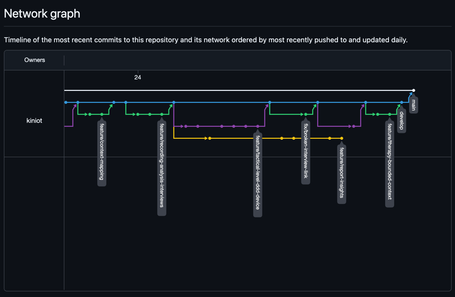

A continuación, se presentan los gráficos que muestran el análisis de los commits en el repositorio correspondiente al informe.  
Estos gráficos detallan la cantidad de líneas de código añadidas por cada miembro del equipo y la actividad de commits registrada.

Análisis de líneas de código añadidas por contribuyente.

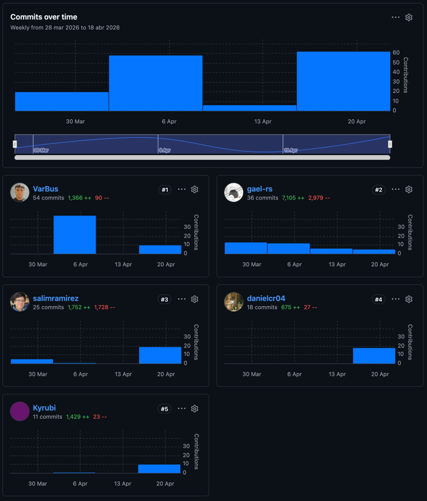

El siguiente gráfico muestra la cantidad de commits realizados en la semana con mayor actividad en el proyecto.

Análisis de cantidad de commits realizados por semana.

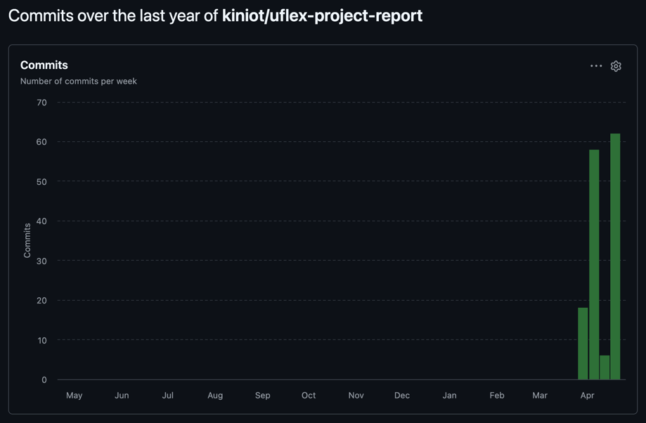

# Contenido

- [Capítulo I: Introducción](#capítulo-i-introducción)
   - [1.1. Startup Profile](#11-startup-profile)
      - [1.1.1. Descripción de la Startup](#111-descripción-de-la-startup)
      - [1.1.2. Perfiles de los integrantes del equipo](#112-perfiles-de-los-integrantes-del-equipo)
   - [1.2. Solution Profile](#12-solution-profile)
      - [1.2.1. Antecedentes y problemática](#121-antecedentes-y-problemática)
      - [1.2.2. Lean UX Process](#122-lean-ux-process)
         - [1.2.2.1. Lean UX Problem Statements](#1221-lean-ux-problem-statements)
         - [1.2.2.2. Lean UX Assumptions](#1222-lean-ux-assumptions)
         - [1.2.2.3. Lean UX Hypothesis](#1223-lean-ux-hypothesis-statements)
         - [1.2.2.4. Lean UX Canvas](#1224-lean-ux-canvas)
   - [1.3. Segmentos objetivo](#13-segmentos-objetivo)

- [Capítulo II: Requirements Elicitation & Analysis](#capítulo-ii-requirements-elicitation--analysis)
   - [2.1. Competidores](#21-competidores)
      - [2.1.1. Análisis competitivo](#211-análisis-competitivo)
      - [2.1.2. Estrategias y tácticas frente a competidores](#212-estrategias-y-tácticas-frente-a-competidores)
   - [2.2. Entrevistas](#22-entrevistas)
      - [2.2.1. Diseño de entrevistas](#221-diseño-de-entrevistas)
      - [2.2.2. Registro de entrevistas](#222-registro-de-entrevistas)
      - [2.2.3. Análisis de entrevistas](#223-análisis-de-entrevistas)
   - [2.3. Needfinding](#23-needfinding)
      - [2.3.1. User Personas](#231-user-personas)
      - [2.3.2. User Task Matrix](#232-user-task-matrix)
      - [2.3.3. User Journey Mapping](#233-user-journey-mapping)
      - [2.3.4. Empathy Mapping](#234-empathy-mapping)
   - [2.4. Big Picture EventStorming](#24-big-picture-eventstorming)
   - [2.5. Ubiquitous Language](#25-ubiquitous-language)

- [Capítulo III: Requirements Specification](#capítulo-iii-requirements-specification)
   - [3.1. User Stories](#31-user-stories)
   - [3.2. Impact Mapping](#32-impact-mapping)
   - [3.3. Product Backlog](#33-product-backlog)

- [Capítulo IV: Solution Software Design](#capítulo-iv-solution-software-design)
   - [4.1. Strategic-Level Domain-Driven Design](#41-strategic-level-domain-driven-design)
      - [4.1.1. Design-Level EventStorming](#411-design-level-eventstorming)
         - [4.1.1.1. Candidate Context Discovery](#4111-candidate-context-discovery)
         - [4.1.1.2. Domain Message Flows Modeling](#4112-domain-message-flows-modeling)
         - [4.1.1.3. Bounded Context Canvases](#4113-bounded-context-canvases)
      - [4.1.2. Context Mapping](#412-context-mapping)
      - [4.1.3. Software Architecture](#413-software-architecture)
         - [4,1.3.1. Software Architecture System Landscape Diagram](#4131-software-architecture-system-landscape-diagram)
         - [4,1.3.2. Software Architecture Context Level Diagrams](#4132-software-architecture-context-level-diagrams)
         - [4.1.3.3. Software Architecture Container Level Diagrams](#4133-software-architecture-container-level-diagrams)
         - [4.1.3.4. Software Architecture Deployment Diagrams](#4134-software-architecture-deployment-diagrams)
   - [4.2. Tactical-Level Domain-Driven Design](#42-tactical-level-domain-driven-design)
      - [4.2.X. Bounded Context: <Bounded Context Name>](#42X-bounded-context-bounded-context-name)
         - [4.2.X.1. Domain Layer](#4211-domain-layer)
         - [4.2.X.2. Interface Layer](#4212-interface-layer)
         - [4.2.X.3. Application Layer](#4213-application-layer)
         - [4.2.X.4. Infrastructure Layer](#4214-infrastructure-layer)
         - [4.2.X.5. Bounded Context Software Architecture Component Level Diagrams](#4215-bounded-context-software-architecture-component-level-diagrams)
         - [4.2.X.6. Bounded Context Software Architecture Code Level Diagrams](#4216-bounded-context-software-architecture-code-level-diagrams)
            - [4.2.X.6.1. Bounded Context Domain Layer Class Diagrams](#42161-bounded-context-domain-layer-class-diagrams)
            - [4.2.X.6.2. Bounded Context Database Design Diagram](#42162-bounded-context-database-design-diagram)

- [Conclusiones](#conclusiones)
   - [Conclusiones y recomendaciones](#conclusiones-y-recomendaciones)
- [Bibliografía](#bibliografía)

# Student Outcome

En el siguiente cuadro se describe las acciones realizadas y enunciados de conclusiones por parte del grupo, que permiten sustentar el haber alcanzado el logro del ABET – EAC - Student Outcome 5

<table>
  <thead>
    <tr>
      <th>Criterio específico</th>
      <th>Acciones realizadas</th>
      <th>Conclusiones</th>
    </tr>
  </thead>
  <tbody>
    <tr>
      <td rowspan="5"><strong>Trabaja en equipo para proporcionar liderazgo en forma conjunta</strong></td>
      <td><strong>Crispin Ramos, Daniel Franco</strong> <b>AV1:</b></td>
      <td rowspan="5"><b>AV1:</b> Durante el desarrollo del AV1, que abarcó desde el perfil de la startup hasta el diseño de la solución de software, hemos aprendido que el liderazgo no recae en una sola persona sino que se ejerce de forma conjunta. Cada integrante tomó la conducción de las secciones en las que tenía mayor dominio y al mismo tiempo apoyó activamente al resto, lo que nos permitió avanzar de manera paralela sin perder coherencia. Actividades transversales como el EventStorming evidenciaron que compartir el liderazgo fortalece la calidad de las decisiones y nos ayuda a alinear el rumbo del proyecto como equipo.</td>
    </tr>
    <tr>
      <td><strong>Ramirez Mestanza, Salim Ignacio</strong> <b>AV1:</b> Lideré la elaboración de las User Stories del proyecto, estructurando los requerimientos funcionales y sus criterios de aceptación para mantener coherencia entre los módulos. Además, apoyé activamente en el Design-Level EventStorming para alinear decisiones de dominio con el equipo y desarrollé el Domain Message Flows Modeling, integrando los eventos y mensajes clave entre bounded contexts.</td>
    </tr>
    <tr>
      <td><strong>Rivera Sosa, Eduardo Gael</strong> <b>AV1:</b> Lideré el diseño de la arquitectura de software de uFlex elaborando los diagramas Landscape, Context, Container y Deployment. Facilité junto al equipo el Design-Level EventStorming, guiando las decisiones sobre eventos y bounded contexts. También dirigí el análisis competitivo y las estrategias frente a competidores, consolidando los aportes del equipo en un entregable coherente.</td>
    </tr>
    <tr>
      <td><strong>Sulca Gonzales, Paúl Fernando</strong> <b>AV1:</b></td>
    </tr>
    <tr>
      <td><strong>Varela Bustinza, Marcelo Alessandro</strong> <b>AV1:</b></td>
    </tr>
    <tr>
      <td rowspan="5"><strong>Crea un entorno colaborativo e inclusivo, establece metas, planifica tareas y cumple objetivos</strong></td>
      <td><strong>Crispin Ramos, Daniel Franco</strong> <b>AV1:</b></td>
      <td rowspan="5"><b>AV1:</b> A lo largo del AV1 hemos logrado cubrir todo el alcance planificado, desde la definición de la startup y el análisis del problema hasta el diseño completo de la solución de software. Para conseguirlo establecimos metas claras por capítulo, distribuimos las tareas según las fortalezas de cada integrante y realizamos revisiones constantes para mantener el avance alineado. Creemos que el entorno colaborativo e inclusivo que construimos fue clave: cada propuesta fue discutida en conjunto y los entregables finales reflejan aportes de todo el equipo, cumpliendo los objetivos acordados en los plazos previstos.</td>
    </tr>
    <tr>
      <td><strong>Ramirez Mestanza, Salim Ignacio</strong> <b>AV1:</b> Planifiqué y entregué en los plazos acordados las secciones a mi cargo, especialmente la definición de User Stories y el Domain Message Flows Modeling. Participé de forma activa en el Design-Level EventStorming como espacio colaborativo, incorporando los aportes del equipo para mantener metas comunes, una coordinación inclusiva y el cumplimiento de los objetivos del AV1.</td>
    </tr>
    <tr>
      <td><strong>Rivera Sosa, Eduardo Gael</strong> <b>AV1:</b> Planifiqué y entregué en los plazos acordados las secciones a mi cargo: segmentos objetivo, análisis competitivo, estrategias frente a competidores, user personas y la arquitectura de software con sus diagramas. Participé activamente en el Design-Level EventStorming como actividad colaborativa, asegurando que los aportes de todos los integrantes se reflejaran en el diseño final.</td>
    </tr>
    <tr>
      <td><strong>Sulca Gonzales, Paúl Fernando</strong> <b>AV1:</b></td>
    </tr>
    <tr>
      <td><strong>Varela Bustinza, Marcelo Alessandro</strong> <b>AV1:</b></td>
    </tr>
  </tbody>
</table>

# Capítulo I: Introducción

## 1.1. Startup Profile

### 1.1.1. Descripción de la Startup

KinIoT es una startup peruana conformada por estudiantes de Ingeniería de Software de la Universidad Peruana de Ciencias Aplicadas (UPC). Nuestra organización nace con el propósito de cerrar la brecha tecnológica en el sector salud, específicamente en el área de la medicina física y rehabilitación. Nos especializamos en el desarrollo de ecosistemas de Internet de las Cosas (IoT) y soluciones SaaS (Software as a Service) que transforman procesos terapéuticos convencionales en experiencias digitales precisas, seguras y monitoreadas.

Nuestro producto principal, uFlex, es una solución integral diseñada para la telerehabilitación de lesiones en el complejo articular de miembro superior. Mediante el uso de sensores vestibles de alta precisión y una plataforma cloud multitenant, permitimos que las clínicas y centros de salud extiendan su capacidad de atención al hogar del paciente, garantizando que cada movimiento sea auditado por especialistas y ejecutado correctamente por el usuario.

### Misión

Empoderar a pacientes y especialistas en rehabilitación mediante soluciones IoT innovadoras que garanticen la precisión clínica en el hogar, reduciendo los tiempos de recuperación y eliminando la incertidumbre en las terapias remotas.

### Visión

Ser reconocidos en el 2030 como la startup líder en telemonitoreo biomecánico en Latinoamérica, destacando por la integración de hardware de bajo costo y software de alta fidelidad para la salud articular.

### Valores

* Integridad de datos: Nos comprometemos a que la información capturada por nuestros sensores sea un reflejo fiel del progreso del paciente.
* Accesibilidad: Diseñamos tecnología compleja que sea fácil de usar para cualquier paciente, sin importar su experiencia técnica.
* Enfoque en el paciente: Cada línea de código y cada componente de hardware tiene como fin último una recuperación sin secuelas.
* Innovación constante: Buscamos optimizar continuamente nuestros algoritmos de procesamiento para ofrecer métricas cada vez más exactas.

### 1.1.2. Perfiles de los integrantes del equipo

<table>
  <thead>
    <tr>
      <th>Perfil</th>
      <th>Foto</th>
    </tr>
  </thead>
  <tbody>
    <tr>
      <td><strong>Crispín Ramos, Daniel Franco</strong>  [COMPLETAR: descripción]</td>
      <td></td>
    </tr>
    <tr>
      <td><strong>Ramirez Mestanza, Salim Ignacio</strong>  Soy Salim, estudiante de Ingenieria de Software, con entusiasmo por el desarrollo backend, la arquitectura de software y el cloud. Me enfoco en tomar decisiones tecnicas complejas que generen impacto directo en los resultados del proyecto y aporten a los atributos de calidad esperados del software. Me considero perseverante, no me rindo ante los retos y siempre busco la colaboracion del equipo para avanzar. Tambien asumo un rol de liderazgo, porque creo firmemente que cada integrante es una parte indispensable para el exito del proyecto.</td>
      <td></td>
    </tr>
    <tr>
      <td><strong>Rivera Sosa, Eduardo Gael</strong>  Soy Gael, desarrollador Full Stack con enfoque en IA. Me gusta construir productos que realmente funcionen y aprender rápido lo que sea necesario para lograrlo. Soy proactivo, me adapto bien al trabajo en equipo y disfruto resolver problemas desde la raíz. Cuando algo se puede hacer mejor, lo digo.</td>
      <td></td>
    </tr>
    <tr>
      <td><strong>Sulca Gonzales, Paúl Fernando</strong>  [COMPLETAR: descripción]</td>
      <td></td>
    </tr>
    <tr>
      <td><strong>Varela Bustinza, Marcelo Alessandro</strong>  Mi nombre es Marcelo Varela. Soy un estudiante de la carrera de Ingeniería De Software, tengo 21 años y actualmente me encuentro cursando el octavo ciclo de la carrera. Me caracterizo por ser una persona responsable, resiliente y proactiva, al cual le gusta aprender sobre tecnología y el desarrollo de software. Mi compromiso como miembro de este equipo es brindar mi apoyo y participación para enfrentar lo desafíos así como dar lo mejor de mí para el éxito de este proyecto.</td>
      <td></td>
    </tr>
  </tbody>
</table>

## 1.2. Solution Profile

### 1.2.1 Antecedentes y problemática

#### WHAT (Qué)

El principal problema es la falta de seguimiento preciso y continuo de la rehabilitación de fracturas de miembro superior en el domicilio del paciente, lo que genera riesgo de mala ejecución de ejercicios, recaídas, secuelas funcionales y prolongación de los tiempos de recuperación (Carbajal Galarza et al., 2021).
Muchos centros de rehabilitación en el Perú aún dependen de controles presenciales periódicos, dejando grandes lapsos de tiempo sin supervisión clínica efectiva entre sesiones, lo que limita la optimización del proceso terapéutico (MINSA, 2025b).

#### WHEN (Cuándo)

El problema se presenta principalmente durante la fase post‑operatoria o post‑inmovilización, cuando el paciente inicia una rutina de ejercicios diarios de forma autónoma en el domicilio, muchas veces sin supervisión directa del fisioterapeuta (Carbajal Galarza et al., 2021).
Es más evidente en pacientes que requieren terapias prolongadas (semanas o meses) y que, por limitaciones de movilidad, trabajo o distancia, acuden con menor frecuencia a los centros de rehabilitación, incrementando la probabilidad de técnicas incorrectas o de abandono parcial de la rutina (Andina, 2023).
El Instituto Nacional de Rehabilitación indica que el seguimiento del dolor, la inflamación y la progresión de los arcos de movilidad es crítico durante los primeros meses posteriores a la lesión, casi en forma continua, pero se pierde el control cuando el paciente no está en la clínica (INR, 2025).

#### WHERE (Dónde)

La problemática surge sobre todo en los hogares de los pacientes, especialmente en entornos urbanos como Lima Metropolitana, donde las barreras arquitectónicas y los tiempos de traslado dificultan la asistencia presencial frecuente a centros de rehabilitación (MVCS, 2022).
El problema también se origina en la brecha entre el instrumental clínico (goniómetros, plataformas de evaluación funcional) y el entorno domiciliario, donde la medición del movimiento se vuelve subjetiva o inexistente (León, 2023).
Además, la creciente demanda de telerehabilitación en el país muestra que más de 3 000 sesiones de terapia física se han realizado de forma remota en 2023 mediante el Centro Nacional de Telemedicina, evidenciando que la atención a distancia ya es un canal relevante pero aún sin sistemas de monitoreo biomecánico en tiempo real (Fernandez Agurto et al., 2025).

#### WHO (Quién)

El problema afecta principalmente a pacientes con lesiones de miembro superior que requieren rehabilitación prolongada, así como a fisioterapeutas que deben tomar decisiones clínicas sin datos objetivos entre sesiones presenciales. Según el MINSA (2019), en el Perú existen alrededor de 900 000 personas que presentan limitaciones de movilidad para usar brazos o piernas, lo que evidencia un grupo poblacional significativo que se vería beneficiado por sistemas de monitoreo remoto y estructurado.
Además, según Arias Tolentino (2022), las fracturas de extremidades son muy frecuentes en el Perú y representan más de la mitad de los pacientes con trauma, lo que implica que una alta proporción de rehabilitados requiere manejo cuidadoso de la función del miembro superior.

#### WHY (Por qué)

El problema se origina en la limitada adopción de tecnologías IoT y soluciones de telerehabilitación en el sistema de salud peruano, tanto público como privado, para el seguimiento continuo de la rehabilitación. Además, la falta de metodologías híbridas que integren de forma robusta la atención presencial con el monitoreo remoto hace que muchos programas dependan de reportes verbales o autoinformes del paciente, lo que reduce la precisión y la posibilidad de ajustar de forma oportuna la terapia (Carbajal Galarza et al., 2021).

#### HOW (Cómo)

El problema se diferencia del estado óptimo porque, en la práctica, la información sobre la rehabilitación domiciliaria se basa en la subjetividad del paciente, sin medición objetiva de rangos de movimiento, velocidad, repetición o patrones compensatorios (Carbajal Galarza et al., 2021).
Según explica Castro Villanueva (2023), el uso de sensores de carga y movimiento mejora de forma significativa la adherencia y la ejecución correcta de los ejercicios, lo que contrasta con la tendencia actual de sobrecargar el hombro o compensar movimientos de codo.
La tendencia no es aleatoria: se repite de forma sistemática en cada paciente que inicia una fase de rehabilitación domiciliaria prolongada sin herramientas de retroalimentación en tiempo real ni supervisión clínica continua (INR, 2025)

#### HOW MUCH (Cuánto)

El MINSA (2019) estima que más de 900 mil peruanos presentan limitaciones permanentes para mover brazos o piernas, lo que implica que una proporción importante de la población podría requerir rehabilitación de miembro superior y, por ende, seguimiento domiciliario.
A nivel macro, el sector de rehabilitación en Perú atiende cientos de miles de terapias al año, con un 68% de las atenciones cubiertas por el Seguro Integral de Salud, lo que refleja un volumen alto de pacientes que podrían beneficiarse de un sistema de seguimiento continuo (MINSA, 2025b).
En el caso de fracturas de extremidades, el INR (2020) señala que la rehabilitación debe ser continua y supervisada durante semanas o meses, lo que, a nivel de semanas por paciente, se traduce en cientos de miles de sesiones de ejercicio en casa que hoy se realizan sin medición objetiva ni registro centralizado.
Económicamente, una sesión de terapia individual cuesta entre S/ 100 y S/ 200 (Fisiofix, 2025). El incumplimiento de la terapia por falta de supervisión puede duplicar el tiempo de recuperación, incrementando los costos familiares en miles de soles anuales por complicaciones médicas mayores.

### 1.2.2 Lean UX Process

El Lean UX Process es una metodología ágil que prioriza el aprendizaje validado y la colaboración multidisciplinaria sobre la documentación exhaustiva. En el desarrollo de uFlex, aplicamos este enfoque para iterar rápidamente sobre la integración de hardware IoT y software, centrando el diseño en la reducción de la incertidumbre clínica y operativa mediante ciclos continuos de retroalimentación entre el paciente y el especialista.

#### 1.2.2.1. Lean UX Problem Statements

Nuestro servicio tiene como objetivo ofrecer un ecosistema de gestión y acompañamiento para la rehabilitación física traumatológica, permitiendo que las clínicas especializadas y sus pacientes mantengan una continuidad terapéutica eficiente fuera del entorno hospitalario. A través de nuestra plataforma, buscamos que los especialistas puedan supervisar el progreso biomecánico de sus pacientes de forma remota, asegurando que se cumplan los protocolos de recuperación establecidos para el miembro superior.
Hemos observado que un factor crítico que afecta el éxito de la rehabilitación y la eficiencia operativa de los centros de salud es la falta de datos objetivos y supervisión técnica durante los ejercicios realizados en el domicilio. Actualmente, existe una alta tasa de abandono de la terapia y una incidencia significativa de recuperaciones incompletas o erróneas, debido a que la información sobre el progreso del paciente se basa exclusivamente en reportes subjetivos y evaluaciones presenciales esporádicas. Esto impide que el tratamiento sea dinámico y preciso, generando incertidumbre tanto en el personal médico como en el usuario final.
¿Cómo podríamos mejorar la trazabilidad y la eficacia de las terapias remotas de miembro superior, logrando que los centros de salud y los pacientes cumplan sus objetivos de recuperación de manera informada y satisfactoria?

##### Domain:
La telerehabilitación y el monitoreo biomecánico remoto en el sector de medicina física y traumatología en el Perú.

##### Customer Segments:
- Administradores de Centros de Salud: Buscan optimizar la gestión de pacientes y la rentabilidad del servicio de terapia física.

- Fisioterapeutas: Requieren herramientas de seguimiento para validar y ajustar los protocolos de ejercicio basados en la evolución real.

- Pacientes en Rehabilitación: Personas con lesiones de codo o muñeca que necesitan guía y validación constante en sus hogares.

##### Pain Points:

- Incertidumbre Clínica: Desconocimiento de los rangos de movimiento reales alcanzados por el paciente en casa.

- Baja Adherencia: Desmotivación del paciente al no percibir un progreso medible o supervisado.

- Ineficiencia Operativa: Pérdida de tiempo en citas presenciales destinadas solo a verificar si el paciente realizó sus ejercicios básicos.

- Riesgo de Secuelas: Ejecución de movimientos compensatorios lesivos que no son detectados a tiempo.

##### Gap:

Existe una desconexión entre la prescripción médica en el consultorio y la ejecución física en el hogar, debido a la carencia de un sistema que capture e integre métricas articulares precisas en una plataforma de gestión centralizada.

##### Vision/Strategy:

Desarrollar una solución integral de monitoreo que combine tecnología de captura de movimiento con una plataforma de gestión multitenant. El enfoque estratégico es transformar la rehabilitación pasiva en un proceso basado en datos, donde la clínica mantenga el control operativo y el paciente reciba retroalimentación constante sobre su desempeño biomecánico.

##### Initial Segment:

Centros de rehabilitación física y clínicas traumatológicas privadas en Lima Metropolitana que ofrecen servicios de terapia ambulatoria para lesiones de miembro superior.

#### 1.2.2.2. Lean UX Assumptions

##### Business Assumptions

- Creo que mis clientes necesitan una forma de garantizar que la rehabilitación remota sea tan efectiva como la presencial, basándose en datos reales y no en suposiciones.

- Estas necesidades se pueden resolver con un ecosistema IoT reconfigurable de sensores sincronizado con una plataforma SaaS de gestión clínica.

- Mis clientes iniciales serán clínicas de fisioterapia y traumatología privadas en Lima que atienden a pacientes de los niveles socioeconómicos A y B.

- El valor #1 que un cliente quiere de mi servicio es la seguridad de una recuperación exitosa en menor tiempo gracias a la trazabilidad del movimiento.

- El cliente también puede obtener estos beneficios adicionales como reducción de costos de traslado, mayor disponibilidad de horarios para citas y una base de datos histórica de su evolución.

- Voy a adquirir la mayoría de mis clientes a través de venta directa B2B a directores de clínicas y marketing digital segmentado para centros de salud especializados.

- Haré dinero a través de un modelo híbrido de pago por kit de hardware (One-time fee) y una suscripción mensual por el uso del software SaaS (Fee por paciente activo).

- Mi competencia principal en el mercado serán centros de terapia física que usan métodos tradicionales (papel/video) y aplicaciones genéricas de fitness sin hardware especializado.

- Los venceremos debido a la precisión biomecánica de nuestros sensores vestibles y la capacidad de la clínica de autogestionar su propio ecosistema de datos.

- Mi mayor riesgo de producto es la resistencia al cambio por parte de fisioterapeutas tradicionales y la posible dificultad de algunos pacientes para configurar el hardware IoT.

- Resolveremos esto a través de un diseño Plug-and-Play simplificado, videos tutoriales integrados en la app y un soporte técnico especializado para la clínica.

##### User Assumptions

- ¿Quién es el usuario? Pacientes de 18 a 65 años con lesiones de miembro superior, fisioterapeutas (especialista clínico) y administradores de clínicas.

- ¿Dónde encaja nuestro producto en su trabajo o vida? En el caso del paciente, encaja en su rutina diaria de ejercicios en el hogar. Para el fisioterapeuta, en su flujo de supervisión y toma de decisiones clínicas asíncronas. Para el administrador, en el control de activos y rentabilidad del centro.

- ¿Qué problemas resuelve nuestro producto? Resuelve la falta de precisión en la medición de ángulos articulares fuera del consultorio, el miedo del paciente a realizar ejercicios incorrectos y la pérdida de ingresos de las clínicas por deserción de pacientes en tratamiento remoto.

- ¿Cuándo y cómo es usado nuestro producto? El hardware se usa durante las sesiones de ejercicio (20-40 min diarios). La aplicación móvil se usa para dar feedback en tiempo real y la aplicación web es consultada por el médico periódicamente para auditar el progreso.

- ¿Qué características son importantes? La precisión de los sensores (tolerancia de error < 5%), la facilidad de emparejamiento Bluetooth y la visualización de gráficos comparativos.

- ¿Cómo debe verse nuestro producto y cómo comportarse? La aplicación móvil debe ser intuitiva, con elementos visuales claros (gamificación) para guiar el movimiento. La aplicación debe ser profesional, de alta densidad de datos pero fácil de navegar.

#### 1.2.2.3. Lean UX Hypothesis Statements

##### Business Hypothesis Statement

- Hypothesis 01:
Creemos que el desarrollo de una plataforma SaaS multitenant con hardware IoT reconfigurable para clínicas de traumatología logrará que los centros de salud reduzcan su tasa de deserción de pacientes en un 25% y optimicen el tiempo de consulta de sus especialistas.
Sabremos que hemos tenido éxito cuando veamos que al menos 5 clínicas locales solicitan una demostración del sistema y recibamos reportes mensuales de un incremento en la retención de pacientes que iniciaron su terapia remota con uFlex.

##### Features Hypothesis Statement

- Hypothesis 02:
Creemos que proporcionar una aplicación web con dashboard y gráficos de ángulos articulares (ROM) capturados por sensores inerciales permitirá que los fisioterapeutas realicen ajustes precisos en los protocolos de ejercicio sin necesidad de una cita presencial semanal.
Sabremos que esto es cierto cuando veamos que el 80% de los especialistas encuestados afirman tener mayor confianza en la toma de decisiones clínicas y se registre una reducción del 30% en el tiempo promedio de evaluación manual con goniómetro en el consultorio.

- Hypothesis 03:
Creemos que la implementación de feedback visual en tiempo real y elementos de gamificación en la aplicación móvil logrará que los pacientes con fracturas de codo o muñeca realicen sus rutinas de ejercicio de manera autónoma y correcta.
Sabremos que esto es cierto cuando veamos que los logs del sistema muestran que el 90% de los pacientes completan sus repeticiones diarias dentro de los rangos de movimiento permitidos, reduciendo la percepción de dolor reportada en la aplicación en un 15% tras las primeras dos semanas.

- Hypothesis 04:
Creemos que el sistema de aprovisionamiento automático de dispositivos (ID de kit vinculado a la clínica) facilitará la escalabilidad del negocio de la startup y la gestión de inventario para el administrador de la clínica.
Sabremos que esto es cierto cuando veamos que el tiempo de configuración inicial (onboarding) de un nuevo kit IoT por parte del administrador es menor a 5 minutos y no se reportan incidencias de vinculación manual entre el sensor y la cuenta del paciente.

#### 1.2.2.4. Lean UX Canvas

A continuación, se presenta el Lean UX Canvas elaborado en la herramienta Miro:

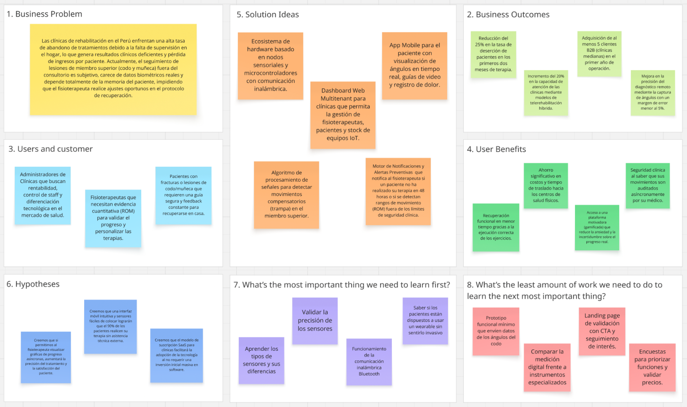

Enlace al Lean UX Canvas:
https://miro.com/app/board/uXjVGuekPgY=/?share_link_id=263966947817 

## 1.3. Segmentos objetivo

En el análisis de los segmentos objetivo de KinIoT, hemos identificado tres grupos clave que conforman el ecosistema de uFlex: pacientes en rehabilitación, especialistas en fisioterapia y administradores de centros de salud.

### Pacientes en rehabilitación de miembro superior

Este segmento integra a personas que han sufrido lesiones traumáticas como fracturas de codo o muñeca y requieren recuperar la funcionalidad del miembro superior, constituyendo el usuario final que interactúa con el hardware IoT y la aplicación móvil.

La mayoría se encuentra en el rango de adultos económicamente activos con acceso frecuente a Internet y smartphones, lo que valida la viabilidad de una solución basada en app móvil y conectividad Bluetooth para el hogar (INEI, 2025; OSIPTEL, 2024).

- **Edad:** Adultos de 18 a 65 años, con énfasis en población activa y adultos mayores con riesgo de caídas y fracturas (INEI, 2022).
- **Necesidad clave:** Guía técnica precisa y retroalimentación inmediata para realizar ejercicios correctamente en casa, reduciendo el miedo al movimiento (kinesiofobia) y evitando compensaciones biomecánicas.
- **Nivel educativo:** Grado de instrucción variado, capaz de seguir instrucciones visuales y auditivas sin requerir altos niveles de formación técnica.
- **Uso de tecnología:** Usuarios habituales de smartphones, con alto uso de dispositivos móviles en el hogar, que prefieren interfaces simplificadas y tecnologías de conexión plug‑and‑play (INEI, 2025; OSIPTEL, 2024).

### Fisioterapeutas y especialistas en rehabilitación

Los fisioterapeutas y especialistas en rehabilitación son los usuarios operativos que toman decisiones clínicas basadas en los datos capturados por el sistema, ajustando protocolos de tratamiento entre sesiones presenciales (Rosales et al., 2023). La creciente demanda de atención y la expansión de la telemedicina en el Perú refuerzan la necesidad de herramientas de telemonitorización que permitan supervisar el progreso del paciente de forma objetiva (MINSA, 2025).

- **Edad:** Profesionales de 24 a 55 años, con formación en Tecnología Médica, Terapia Física y Rehabilitación (Rosales et al., 2023).
- **Necesidad clave:** Obtener métricas objetivas (ángulos de ROM, simetría de movimientos, número de repeticiones correctas) para ajustar protocolos y reducir complicaciones.
- **Nivel educativo:** Formación universitaria en salud y rehabilitación, con alta familiaridad con el manejo de información clínica.
- **Uso de tecnología:** Manejo intermedio de plataformas digitales de gestión clínica, con preferencia por dashboards intuitivos y reportes exportables, ya que según estudios en Lima Metropolitana, alrededor de la mitad no adoptó la práctica digital durante la pandemia sin suficiente apoyo institucional (Rosales et al., 2023).

### Administradores de clínicas y centros de salud

Este segmento agrupa a los tomadores de decisiones B2B que gestionan la operación y la rentabilidad de clínicas y centros de salud privados, encargados de la adopción de soluciones tecnológicas como sistemas IoT y SaaS (MINSA, 2025a). La consolidación de la telemedicina y la alta penetración de dispositivos móviles en el hogar peruano respaldan la viabilidad económica de sistemas de monitoreo remoto para mejorar la retención de pacientes y la eficiencia operativa (INEI, 2025; OSIPTEL, 2024).

- **Edad:** Profesionales de 30 a 60 años, con formación en Administración de Salud, Gestión Empresarial o Medicina.
- **Necesidad clave:** Reducir la tasa de abandono de tratamientos, aumentar la productividad del personal clínico y gestionar eficientemente el inventario de equipos tecnológicos.
- **Nivel educativo:** Formación superior en administración, gestión o área clínica, con experiencia en toma de decisiones estratégicas.
- **Uso de tecnología:** Interés en soluciones SaaS multi‑tenant que permitan controlar múltiples sedes y cuentas de usuario desde una sola consola, alineándose con la tendencia de digitalización del sistema de salud peruano (MINSA, 2025a; INEI, 2025).

# Capítulo II: Requirements Elicitation & Analysis

## 2.1. Competidores

### 2.1.1. Análisis competitivo

<table>
  <tr>
    <th colspan="6">Competitive Analysis landscape</th>
  </tr>
  <tr>
    <td colspan="2" align="center"><b>¿Por qué llevar a cabo este análisis?</b></td>
    <td colspan="4">¿De qué manera puede KinIoT diferenciarse de las soluciones de rehabilitación digital actuales mediante el uso de tecnología IoT para capturar datos cuantitativos precisos, superando las barreras de alto costo y falta de biofeedback en tiempo real que presentan los competidores en el mercado peruano?</td>
  </tr>
  <tr>
    <th colspan="2">Nombre</th>
    <th>KinIoT</th>
    <th>Sword Health</th>
    <th>Hinge Health</th>
    <th>Physitrack</th>
  </tr>
  <tr>
    <td colspan="2" align="center"><b>Logo</b></td>
    <td align="center">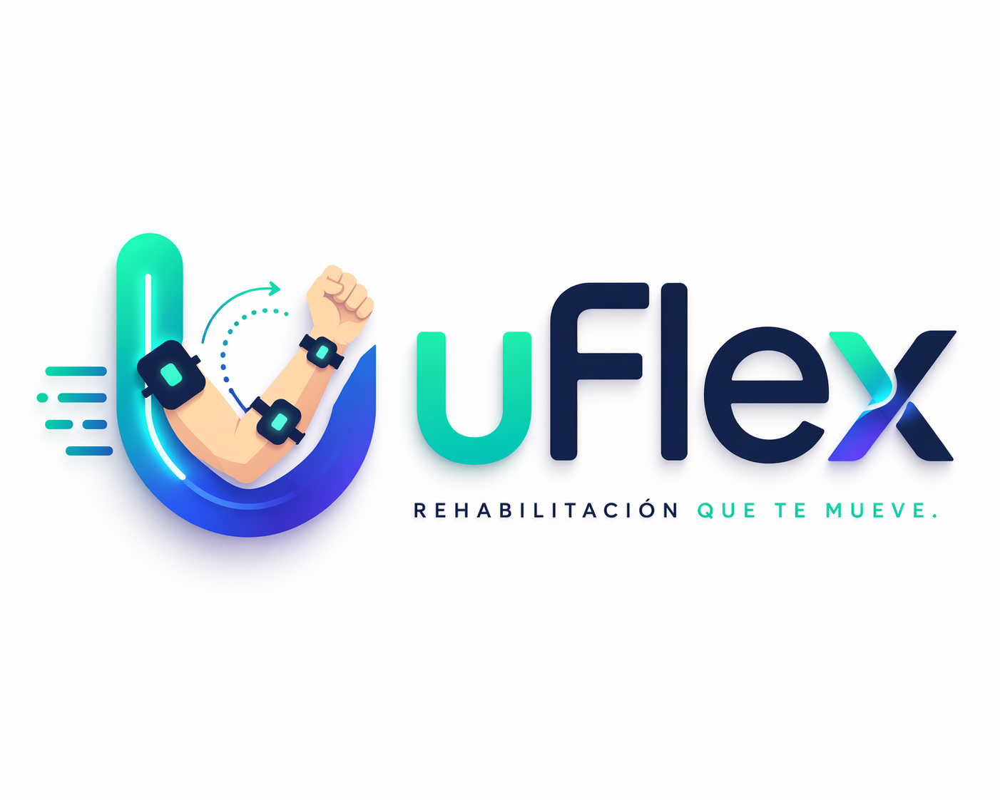</td>
    <td align="center"></td>
    <td align="center"></td>
    <td align="center">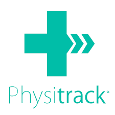</td>
  </tr>
  <tr>
    <td rowspan="2"><b>Perfil</b></td>
    <td><b>Overview</b></td>
    <td>Ecosistema IoT y SaaS para telerehabilitación con monitoreo biomecánico en tiempo real</td>
    <td>Líder global en terapia física digital con sensores de grado clínico y supervisión médica</td>
    <td>Clínica digital integral que usa sensores y visión computarizada para el cuidado articular</td>
    <td>Plataforma SaaS global para prescripción de ejercicios y seguimiento de resultados mediante video</td>
  </tr>
  <tr>
    <td><b>Ventaja competitiva ¿Qué valor ofrece a los clientes?</b></td>
    <td>Monitoreo cuantitativo preciso mediante sensores físicos a un costo accesible para el mercado local</td>
    <td>IA avanzada y sensores de alta fidelidad con validación clínica masiva en mercados premium</td>
    <td>Ecosistema híbrido que combina sensores físicos con visión artificial "TrueMotion"</td>
    <td>Marca establecida con una de las bibliotecas de ejercicios clínicos más grandes del mundo</td>
  </tr>
  <tr>
    <td rowspan="2"><b>Perfil de Marketing</b></td>
    <td><b>Mercado objetivo</b></td>
    <td>Centros de salud, Fisioterapeutas y pacientes con lesiones de miembro superior.</td>
    <td>Grandes corporaciones y planes de salud empresariales en EE. UU. y Europa</td>
    <td>Empleadores y planes de salud que buscan reducir costos por cirugías innecesarias</td>
    <td>Fisioterapeutas independientes y clínicas de tamaño medio a nivel global</td>
  </tr>
  <tr>
    <td><b>Estrategias de Marketing</b></td>
    <td>B2B enfocado en reducir la deserción y optimizar el tiempo de evaluación manual.</td>
    <td>Enfoque en el ahorro de costos para empleadores al evitar cirugías innecesarias</td>
    <td>Marketing basado en la reducción del dolor crónico y programas preventivos corporativos</td>
    <td>Marketing digital masivo y alianzas con asociaciones profesionales de fisioterapia</td>
  </tr>
  <tr>
    <td rowspan="3"><b>Perfil de Producto</b></td>
    <td><b>Productos &amp; Servicios</b></td>
    <td>Kinetic Track: Nodos vestibles (IoT) + App móvil con gamificación + Dashboard Web.</td>
    <td>Plataforma de "Terapeuta Digital", sensores propios y programas especializados como Bloom</td>
    <td>Sensores de movimiento, programas de coaching de salud y visión computarizada</td>
    <td>Aplicación para prescripción de ejercicios, telemedicina y seguimiento de adherencia</td>
  </tr>
  <tr>
    <td><b>Precios y Costos</b></td>
    <td>Pago por kit de hardware + Suscripción mensual por paciente activo (SaaS)</td>
    <td>Modelo de precios premium orientado a contratos corporativos de alto volumen</td>
    <td>Modelo de suscripción B2B de alto nivel para grandes beneficios corporativos</td>
    <td>Suscripción de bajo costo por profesional de la salud.</td>
  </tr>
  <tr>
    <td><b>Canales de distribución</b></td>
    <td>Web para especialistas y Administradores; App Móvil para pacientes.</td>
    <td>Ecosistema cerrado de Hardware, Tablet y Aplicaciones Móviles</td>
    <td>Aplicaciones móviles integradas con hardware y cámara</td>
    <td>Aplicaciones Web y Móviles multiplataforma</td>
  </tr>
  <tr>
    <td rowspan="4"><b>Análisis SWOT</b></td>
    <td><b>Fortalezas</b></td>
    <td>Captura de datos biomecánicos precisos que elimina la subjetividad clínica y enfoque específico en lesiones de miembro superior, permitiendo algoritmos más exactos</td>
    <td>Capital masivo, algoritmos de IA de vanguardia y validación clínica de nivel superior</td>
    <td>Utiliza una combinación avanzada de sensores vestibles y visión computarizada a través de la cámara del smartphone para corregir la postura en tiempo real</td>
    <td>Gran base de usuarios instalada y reconocimiento de marca global</td>
  </tr>
  <tr>
    <td><b>Oportunidades</b></td>
    <td>Alta penetración de smartphones y demanda de telemedicina en el hogar peruano</td>
    <td>Expansión a Latinoamérica mediante alianzas con aseguradoras globales.</td>
    <td>Aunque domina el mercado estadounidense, tiene una gran oportunidad de crecimiento en regiones como Latinoamérica</td>
    <td>Integrar visión computarizada para actualizar su propuesta tecnológica</td>
  </tr>
  <tr>
    <td><b>Debilidades</b></td>
    <td>Marca nueva en el mercado sin historial extenso de datos clínicos acumulados</td>
    <td>Precio prohibitivo para el mercado de clínicas pequeñas (MYPES) en regiones emergentes como Perú</td>
    <td>Su modelo de negocio está diseñado para grandes corporaciones (B2B), lo que resulta económicamente inviable para clínicas pequeñas o independientes</td>
    <td>Carece de herramientas de biofeedback en tiempo real o sensores de movimiento</td>
  </tr>
  <tr>
    <td><b>Amenazas</b></td>
    <td>Resistencia al cambio por parte de fisioterapeutas con métodos tradicionales analógicos</td>
    <td>Competencia agresiva de Hinge Health en el sector corporativo</td>
    <td>Usuarios que requieran mayor precisión clínica (IoT) para patologías complejas</td>
    <td>El surgimiento de sensores IoT de bajo costo y alta precisión que pueden democratizar el acceso a la tecnología que antes eran exclusivas</td>
  </tr>
</table>

### 2.1.2. Estrategias y tácticas frente a competidores

En esta sección se detallan las estrategias y tácticas que KinIoT aplicará para establecer una ventaja competitiva en el sector de la telerehabilitación biomecánica.

**Estrategias para afrontar las fortalezas de los competidores**

- **Diferenciación por Precisión Articular Específica:** Para enfrentar la fortaleza de Hinge Health y su tecnología de visión artificial, KinIoT aplicará la táctica de "Validación Biomecánica por Sensores Inerciales". Dado que la visión por cámara puede perder precisión ante oclusiones físicas, nuestros sensores físicos garantizan una captura de datos del Rango de Movimiento (ROM) con un margen de error menor al 5%, lo cual es fundamental para la rehabilitación de codo y muñeca.

- **Estrategia de Accesibilidad B2B Local:** Ante el dominio de Sword Health en mercados corporativos de alto nivel, implementaremos una táctica de "Aprovisionamiento de Bajo Costo para MYPES". Nos enfocaremos en clínicas privadas de Lima Metropolitana ofreciendo un modelo de pago por kit de hardware y una suscripción SaaS escalable, permitiendo que centros locales adopten tecnología de punta sin la inversión prohibitiva de los competidores globales.

**Estrategias para aprovechar las debilidades de los competidores**

- **Táctica de Biofeedback Activo en Tiempo Real:** Aprovecharemos la debilidad de Physitrack, que se limita al seguimiento pasivo basado en videos, mediante la implementación de corrección postural inmediata. La aplicación móvil de Kinetic Track proporcionará alertas visuales y gamificadas que guiarán al paciente durante la ejecución del ejercicio, asegurando que se cumplan los protocolos terapéuticos y reduciendo el riesgo de movimientos compensatorios lesivos.

- **Estrategia de Fidelización basada en Datos Objetivos:** Capitalizaremos la falta de métricas cuantitativas en las terapias tradicionales para ofrecer a los fisioterapeutas un dashboard de alta densidad de datos. Esto les permitirá ajustar los planes de tratamiento basados en evidencia clínica real, mejorando la adherencia del paciente y reduciendo la tasa de deserción que afecta la rentabilidad de las clínicas.

**Contexto de Oportunidades y Amenazas**

- **Oportunidades:** Aprovecharemos la alta penetración de smartphones en los hogares peruanos (94.8%) y el crecimiento de las atenciones por telemedicina (más de 3.4 millones recientemente) para posicionar la telerehabilitación como un estándar accesible.

- **Amenazas:** Para mitigar la resistencia al cambio de los especialistas tradicionales, se aplicará una táctica de "Onboarding y Soporte Especializado", demostrando mediante informes automáticos cómo nuestra herramienta reduce en un 30% el tiempo de evaluación manual en el consultorio.

## 2.2. Entrevistas

### 2.2.1. Diseño de entrevistas

**Segmento 1: Administradores de Clínicas y Centros de Salud**

**Preguntas de contexto y perfil (1-3)**

1. ¿Cuál es su nombre, edad y en qué distrito vive actualmente?
   - ¿Con quién vive? ¿Tiene pareja o hijos?
   - ¿Cuál es su formación académica y cuántos años lleva trabajando en administración de salud?

2. ¿Cómo está organizado el centro donde trabaja? ¿Cuántas sedes o especialistas tiene a cargo y cuántos pacientes atienden aproximadamente al mes?
3. ¿Qué herramientas o sistemas utiliza actualmente para gestionar el seguimiento de pacientes y la operación del centro?

**Preguntas sobre la problemática (4-8)**

4. ¿Cuáles son los procesos que más le consumen tiempo o que le resultan más difíciles de controlar en la operación diaria?
5. ¿Han tenido casos de pacientes que abandonan su tratamiento de rehabilitación antes de completarlo?
6. ¿Cómo realizan actualmente el seguimiento de un paciente durante el tiempo que está en casa, entre una sesión presencial y otra?
7. ¿Qué tan fácil o difícil es para usted saber si los fisioterapeutas están siendo productivos y si los pacientes están progresando correctamente?
8. ¿Han implementado alguna tecnología nueva en el centro anteriormente?

**Preguntas de perfil digital y objetivos (9-10)**

9. ¿Qué dispositivos usa más en su trabajo diario y cómo prefiere acceder a información del centro: laptop, tablet o celular?
10. ¿Cuáles son sus principales objetivos para el centro en términos de crecimiento, retención de pacientes o mejora de la calidad del servicio?

**Preguntas de validación de solución (11-12)**

11. Si pudiera monitorear en tiempo real cómo sus pacientes realizan los ejercicios en casa —con datos precisos de movimiento y alertas automáticas para sus especialistas— ¿qué impacto tendría eso en su servicio y en el negocio?
12. ¿Qué factores priorizaría al decidir adoptar una nueva plataforma tecnológica en su centro? (costo, facilidad de uso, soporte técnico, integración con sistemas actuales, tiempo de implementación)

**Segmento 2: Fisioterapeutas y Especialistas en Rehabilitación**

**Preguntas de contexto y perfil (1-3)**

1. ¿Cuál es su nombre, edad y en qué distrito vive actualmente?
   - ¿Con quién vive? ¿Tiene pareja o hijos?
   - ¿Cuál es su especialidad y cuántos años lleva ejerciendo como fisioterapeuta?

2. ¿Cómo es el entorno donde trabaja? ¿Ejerce en una clínica, centro de rehabilitación, de forma independiente o en varios lugares?
3. ¿Qué herramientas o métodos utiliza actualmente para registrar el progreso de sus pacientes y planificar sus sesiones?

**Preguntas sobre la problemática (4-8)**

4. ¿Cuáles son los mayores desafíos que enfrenta al hacer seguimiento del progreso de un paciente entre una sesión presencial y otra?
5. ¿Cómo sabe si un paciente está realizando correctamente los ejercicios en casa? ¿Qué pasa cuando no lo hace bien?
6. ¿Ha tenido pacientes que abandonan el tratamiento antes de completarlo? ¿Qué cree que lo provoca?
7. ¿Qué información le resulta más difícil de obtener para ajustar el protocolo de ejercicios de un paciente?
8. ¿Cómo se comunica habitualmente con sus pacientes fuera de las sesiones presenciales?

**Preguntas de perfil digital y objetivos (9-10)**

9. ¿Qué dispositivos usa más en su práctica diaria: laptop, tablet o celular? ¿Utiliza alguna app o plataforma digital actualmente?
10. ¿Cuál es su mayor objetivo profesional en este momento? ¿Qué le haría sentir que está brindando la mejor atención posible a sus pacientes?

**Preguntas de validación de solución (11-12)**

11. Si tuviera acceso a datos en tiempo real sobre los movimientos de su paciente durante sus ejercicios en casa —ángulos articulares, repeticiones, alertas de mala ejecución— ¿cómo cambiaría su forma de trabajar?
12. ¿Qué tan importante es para usted que una herramienta digital sea fácil de usar y no interrumpa su flujo de trabajo clínico?

**Segmento 3: Pacientes en Rehabilitación de Miembro Superior**

**Preguntas de contexto y perfil (1-3)**

1. ¿Cuál es su nombre, edad y en qué distrito vive actualmente?
   - ¿Con quién vive? ¿Tiene pareja o hijos?
   - ¿A qué se dedica actualmente? ¿Trabaja, estudia o ambas?

2. ¿Podría contarme brevemente sobre su lesión? ¿Qué le ocurrió y cuánto tiempo lleva en proceso de rehabilitación?
3. ¿Cómo está siendo su experiencia de rehabilitación hasta ahora? ¿Va al centro de salud con frecuencia o realiza la mayoría de ejercicios en casa?

**Preguntas sobre la problemática (4-8)**

4. ¿Cómo realiza sus ejercicios de rehabilitación en casa? ¿Alguien le supervisa o los hace solo?
5. ¿Qué tan seguro se siente al hacer los ejercicios en casa? ¿Ha tenido dudas sobre si los está haciendo correctamente?
6. ¿Qué dificultades ha encontrado durante su proceso de rehabilitación, tanto dentro como fuera del centro de salud?
7. ¿Cómo se comunica con su fisioterapeuta fuera de las sesiones cuando tiene dudas o inconvenientes?
8. ¿Ha sentido en algún momento que su progreso se estanca o que no sabe si está mejorando?

**Preguntas de perfil digital y objetivos (9-10)**

9. ¿Qué dispositivos usa con más frecuencia en su día a día: celular, tablet o computadora? ¿Qué aplicaciones utiliza habitualmente?
10. ¿Cuál es su principal motivación para completar su rehabilitación? ¿Qué espera poder hacer cuando se recupere?

**Preguntas de validación de solución (11-12)**

11. Si existiera un dispositivo que midiera con precisión sus movimientos durante los ejercicios en casa y le indicara en tiempo real si los está haciendo bien, ¿lo usaría?
12. ¿Qué tan importante es para usted que una herramienta así sea fácil de colocar y usar sin ayuda de otra persona?

### 2.2.2. Registro de entrevistas

### 2.2.3. Análisis de entrevistas

## 2.3. Needfinding

### 2.3.1. User Personas

Esta sección presenta nuestros usuarios ideales diseñados para el ecosistema de KinIoT. Estos artefactos se han construido a partir del análisis del mercado peruano de salud, el comportamiento de las clínicas privadas y las barreras de accesibilidad en la rehabilitación física.

**User persona del segmento de pacientes en rehabilitación del miembro superior**

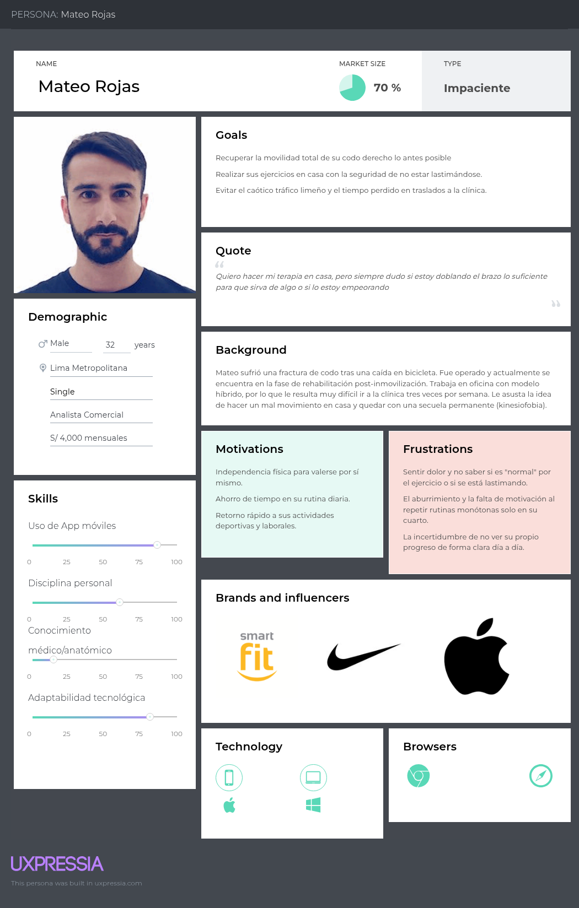

**User persona del segmento de fisioterapeuta**

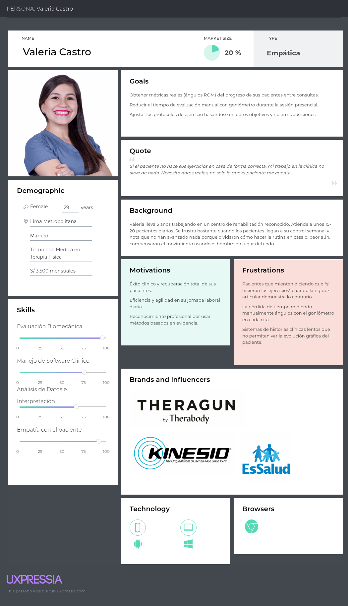

**User persona del segmento de administradores de clínica y centros de salud**

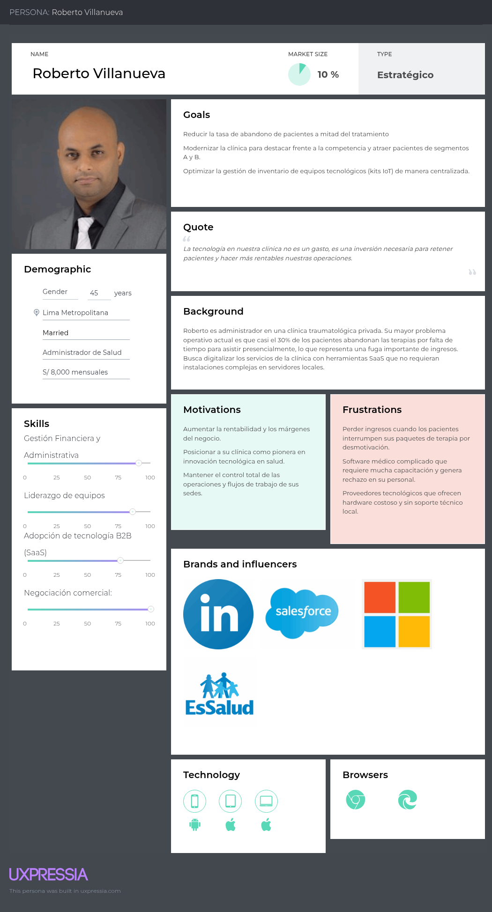

### 2.3.2. User Task Matrix

### 2.3.3. User Journey Mapping

### 2.3.4. Empathy Mapping

## 2.4. Big Picture EventStorming

En esta sección se introduce y resume el proceso realizado por el equipo para el Big Picture Event Storming, que fue realizado por todos los integrantes y plasmado con la ayuda de la herramienta Miro. A continuación, se explica el proceso:

**1. Open**

En esta etapa el equipo se concentró en generar la mayor cantidad de eventos de dominio posibles (cosas que suceden en el negocio) escribiendo en los post-its naranjas.

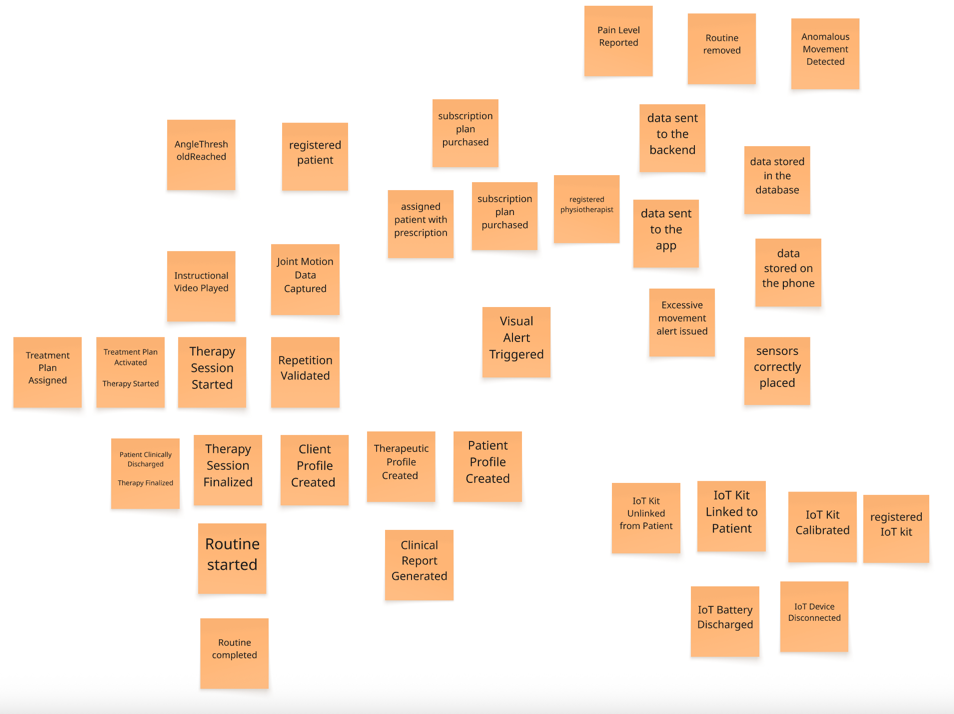

**2. Explore**

Después de la anterior etapa, en esta se concentró en ordenar cronológicamente los eventos, eliminar los eventos repetidos, identificar sus actores y posibles sistemas externos, y finalmente algunos puntos de dolor en post-its morados.

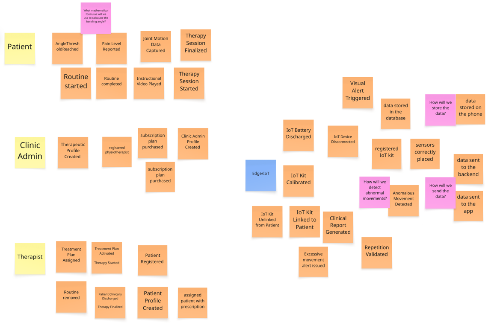

**3. Close**

En esta última etapa, se documentaron en post-its rosados los problemas más relevantes detectados, junto con aspectos que debíamos investigar más a fondo o descartar según el alcance definido.

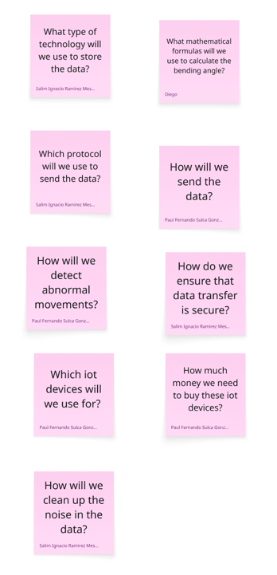

Luego de conversar un poco, el equipo descartó algunos eventos y se ordenaron mejor las líneas de tiempo.

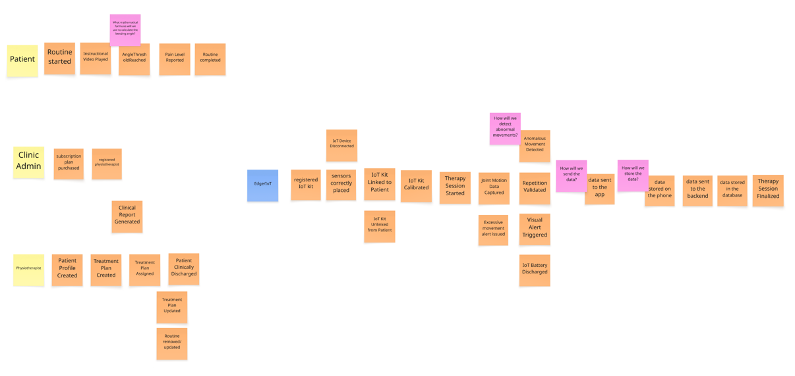

Finalmente, se presenta el Big Picture Event Storming finalizado, con los eventos ordenados, los puntos de dolor identificados y los aspectos a investigar destacados.

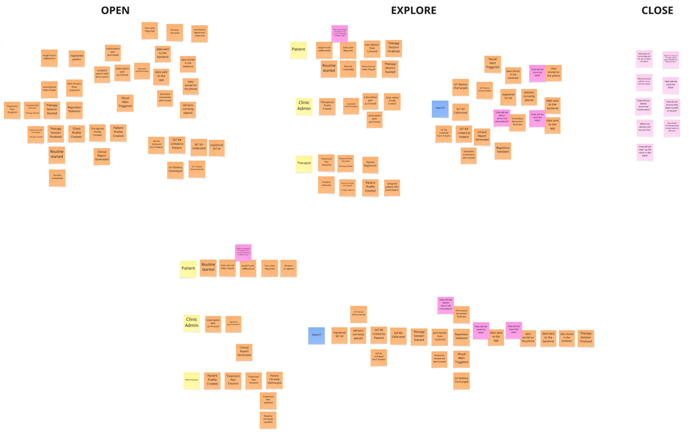

Se puede acceder al Big Picture Event Storming en el siguiente enlace de la herramienta Miro: [Version final del Big Picture Event Storming](https://miro.com/app/board/uXjVGsDiw2M=/?share_link_id=274967609887)

> *Enlace completo:* https://miro.com/app/board/uXjVGsDiw2M=/?share_link_id=274967609887

Este proceso permitió al equipo obtener una visión de alto nivel de los principales eventos del negocio, identificar puntos críticos y definir prioridades para las siguientes etapas del proyecto.

## 2.5. Ubiquitous Language

| Término                    | Equivalente                    | Definición                                                                                                                                                                         |
|----------------------------|--------------------------------|------------------------------------------------------------------------------------------------------------------------------------------------------------------------------------|
| Range of Motion (ROM)      | Rango de Movimiento            | Magnitud de arco, medida en grados, que una articulación puede recorrer en un plano específico. Es el indicador principal para evaluar la recuperación funcional de codo y muñeca. |
| Flexion                    | Flexión                        | Movimiento que reduce el ángulo entre los huesos de una articulación. En el codo, es acercar la mano al hombro; en la muñeca, es mover la palma hacia el antebrazo.                |
| Extension                  | Extensión                      | Movimiento que aumenta el ángulo entre los huesos de una articulación, estirando el miembro. Es lo opuesto a la flexión.                                                           |
| Pronation                  | Pronación                      | Movimiento de rotación del antebrazo que permite girar la palma de la mano hacia abajo (hacia el suelo).                                                                           |
| Supination                 | Supinación                     | Movimiento de rotación del antebrazo que permite girar la palma de la mano hacia arriba (hacia el techo).                                                                          |
| Compensatory Movement      | Movimiento Compensatorio       | Movimiento involuntario o erróneo de una articulación adyacente (ej. el hombro) para sustituir la falta de movilidad de la articulación lesionada (ej. el codo).                   |
| Clinical Session           | Sesión Clínica                 | Conjunto de ejercicios prescritos por el fisioterapeuta que el paciente debe ejecutar en un periodo de tiempo determinado, bajo el monitoreo de los sensores.                      |
| Kinematic Chain            | Cadena Cinemática              | Conjunto de articulaciones y segmentos óseos conectados (hombro-codo-muñeca) que actúan de forma coordinada para realizar un movimiento funcional.                                 |
| Therapeutic Protocol       | Protocolo Terapéutico          | Plan de rehabilitación personalizado que incluye el número de repeticiones, series y los límites de ángulos permitidos para un paciente específico.                                |
| Joint Rigidity (Ankylosis) | Rigidez Articular (Anquilosis) | Limitación o pérdida total de la movilidad en una articulación debido a una lesión o falta de ejercicio post-operatorio.                                                           |
| Wearable Node              | Nodo Vestible                  | Dispositivo físico que contiene los sensores inerciales y se coloca sobre el segmento corporal del paciente para capturar datos biomecánicos.                                      |
| Clinic                     | Clínica                        | Organización que adquiere el servicio SaaS y gestiona a sus propios especialistas y pacientes dentro de la plataforma.                                                             |
| Physiotherapist            | Fisioterapeuta                 | Profesional de la salud encargado de crear los protocolos, monitorear los datos de los sensores y validar el progreso del paciente.                                                |
| Adherence                  | Adherencia                     | Nivel de compromiso y cumplimiento del paciente con respecto al plan de ejercicios prescrito por el especialista.                                                                  |

# Capítulo III: Requirements Specification

## 3.1. User Stories

A partir del análisis de los segmentos objetivo, las entrevistas, las hipótesis Lean UX y los bounded contexts identificados para uFlex, hemos elaborado el siguiente conjunto de Epics y User Stories que describe el alcance funcional de la solución. Las historias cubren la experiencia pública en la Landing Page, la aplicación móvil del paciente integrada con el sensor IoT, la aplicación web para el fisioterapeuta, el panel administrativo para el administrador de la clínica y las Technical Stories que soportan la infraestructura (RESTful API interno, Edge API, integración con proveedor de pagos externo y servicio de notificaciones). Cada User Story incluye criterios de aceptación redactados en formato Gherkin (Given–When–Then), en tercera persona y tiempo presente, describiendo el comportamiento esperado del sistema sin referenciar detalles de interfaz.

<table>
  <thead>
    <tr>
      <th>Epic / Story ID</th>
      <th>Título</th>
      <th>Descripción</th>
      <th>Criterios de Aceptación</th>
      <th>Relacionado con (Epic ID)</th>
    </tr>
  </thead>
  <tbody>
    <tr>
      <td><b>EP01</b></td>
      <td>Landing Page pública de uFlex</td>
      <td>Conjunto de historias orientadas al visitante del sitio web estático, donde se presenta la propuesta de valor, los planes, el contenido segmentado por audiencia y los puntos de acceso a las aplicaciones web y móvil.</td>
      <td>—</td>
      <td>—</td>
    </tr>
    <tr>
      <td>US01</td>
      <td>Exploración de la propuesta de valor</td>
      <td>Como Visitante, quiero explorar la propuesta de valor de uFlex en la página principal para entender qué ofrece la plataforma y decidir si me interesa continuar navegando.</td>
      <td>
        <b>Escenario 1: Carga exitosa de la página principal</b> 
        <b>Given</b> que el Visitante solicita la página principal del sitio, 
        <b>When</b> el sistema responde a la solicitud, 
        <b>Then</b> el sistema entrega el contenido con la propuesta de valor, los beneficios principales y los enlaces hacia las secciones de cada segmento.  
        <b>Escenario 2: Recurso no disponible por caída del servicio</b> 
        <b>Given</b> que el Visitante solicita la página principal, 
        <b>When</b> el servicio estático no puede resolver el recurso, 
        <b>Then</b> el sistema responde con una página de estado que informa la indisponibilidad temporal y preserva la navegabilidad del resto del sitio.
      </td>
      <td>EP01</td>
    </tr>
    <tr>
      <td>US02</td>
      <td>Consulta de contenido para pacientes</td>
      <td>Como Visitante del segmento paciente, quiero consultar la sección "Cómo funciona para pacientes" para comprender el proceso de rehabilitación remota que ofrece uFlex.</td>
      <td>
        <b>Escenario 1: Acceso a la sección de pacientes</b> 
        <b>Given</b> que el Visitante del segmento paciente navega desde la página principal, 
        <b>When</b> el sistema recibe la solicitud de la sección dirigida a pacientes, 
        <b>Then</b> el sistema entrega el contenido que explica el flujo del paciente y los beneficios del acompañamiento remoto.  
        <b>Escenario 2: Contenido segmentado inexistente</b> 
        <b>Given</b> que el Visitante solicita una subsección dentro del contenido para pacientes, 
        <b>When</b> la ruta solicitada no existe en el sitio, 
        <b>Then</b> el sistema responde con un estado 404 y ofrece la navegación a secciones equivalentes del mismo segmento.
      </td>
      <td>EP01</td>
    </tr>
    <tr>
      <td>US03</td>
      <td>Consulta de contenido para especialistas</td>
      <td>Como Visitante del segmento fisioterapeuta, quiero consultar la sección "Cómo funciona para especialistas" para entender cómo uFlex apoya mi práctica clínica.</td>
      <td>
        <b>Escenario 1: Acceso a la sección de especialistas</b> 
        <b>Given</b> que el Visitante del segmento fisioterapeuta navega al contenido dirigido a especialistas, 
        <b>When</b> el sistema procesa la solicitud, 
        <b>Then</b> el sistema entrega la descripción de las capacidades clínicas, métricas ROM y herramientas de supervisión.  
        <b>Escenario 2: Recurso estático ilegible</b> 
        <b>Given</b> que el Visitante solicita un recurso multimedia de la sección, 
        <b>When</b> el recurso está corrupto o inaccesible, 
        <b>Then</b> el sistema continúa entregando el contenido textual y omite el recurso no disponible sin interrumpir la navegación.
      </td>
      <td>EP01</td>
    </tr>
    <tr>
      <td>US04</td>
      <td>Consulta de planes y precios para clínicas</td>
      <td>Como Visitante del segmento clínica, quiero consultar los planes y precios de uFlex para evaluar la viabilidad económica de adoptar la solución.</td>
      <td>
        <b>Escenario 1: Visualización de planes vigentes</b> 
        <b>Given</b> que el Visitante del segmento clínica solicita la sección de planes, 
        <b>When</b> el sistema procesa la solicitud, 
        <b>Then</b> el sistema entrega los planes vigentes con sus características, límites y precios en moneda local.  
        <b>Escenario 2: Planes no configurados</b> 
        <b>Given</b> que el Visitante solicita la sección de planes, 
        <b>When</b> no existen planes publicados en el sistema, 
        <b>Then</b> el sistema entrega un mensaje informativo que indica que la información comercial está siendo actualizada.
      </td>
      <td>EP01</td>
    </tr>
    <tr>
      <td>US05</td>
      <td>Solicitud de demo comercial</td>
      <td>Como Visitante del segmento clínica, quiero solicitar una demostración comercial mediante un formulario para iniciar contacto con el equipo de uFlex.</td>
      <td>
        <b>Escenario 1: Envío exitoso del formulario</b> 
        <b>Given</b> que el Visitante completa el formulario de demo con datos válidos, 
        <b>When</b> el sistema recibe la solicitud, 
        <b>Then</b> el sistema persiste el lead comercial y confirma la recepción al Visitante.  
        <b>Escenario 2: Datos obligatorios ausentes</b> 
        <b>Given</b> que el Visitante envía el formulario sin campos obligatorios, 
        <b>When</b> el sistema valida el payload, 
        <b>Then</b> el sistema rechaza la solicitud sin persistir el lead e informa qué campos son requeridos.
      </td>
      <td>EP01</td>
    </tr>
    <tr>
      <td>US06</td>
      <td>Acceso a la descarga de la app móvil</td>
      <td>Como Visitante, quiero acceder al enlace de descarga de la aplicación móvil de uFlex para instalarla en mi dispositivo.</td>
      <td>
        <b>Escenario 1: Redirección a la tienda correspondiente</b> 
        <b>Given</b> que el Visitante activa el enlace de descarga desde la Landing, 
        <b>When</b> el sistema identifica el sistema operativo del dispositivo, 
        <b>Then</b> el sistema redirige a la tienda oficial correspondiente al sistema operativo detectado.  
        <b>Escenario 2: Sistema operativo no soportado</b> 
        <b>Given</b> que el Visitante accede al enlace desde un dispositivo con sistema operativo no soportado, 
        <b>When</b> el sistema procesa la solicitud, 
        <b>Then</b> el sistema entrega un mensaje informativo indicando las plataformas soportadas y no realiza redirección.
      </td>
      <td>EP01</td>
    </tr>
    <tr>
      <td><b>EP02</b></td>
      <td>Experiencia del Paciente en la app móvil</td>
      <td>Conjunto de historias orientadas al paciente en rehabilitación del miembro superior, desde el onboarding hasta la ejecución de sesiones con el sensor IoT, el reporte de dolor y la consulta de su progreso.</td>
      <td>—</td>
      <td>—</td>
    </tr>
    <tr>
      <td>US07</td>
      <td>Activación de cuenta con código de invitación</td>
      <td>Como Paciente, quiero activar mi cuenta con el código de invitación que me entrega la clínica para ingresar por primera vez a la aplicación móvil.</td>
      <td>
        <b>Escenario 1: Activación con código válido</b> 
        <b>Given</b> que el Paciente envía un código de invitación vigente y sus datos personales, 
        <b>When</b> el sistema valida el código contra la clínica emisora, 
        <b>Then</b> el sistema crea la cuenta del Paciente y la asocia a la clínica y al fisioterapeuta responsable.  
        <b>Escenario 2: Código expirado o inexistente</b> 
        <b>Given</b> que el Paciente envía un código inválido o vencido, 
        <b>When</b> el sistema intenta validar el código, 
        <b>Then</b> el sistema rechaza la activación y no crea ninguna cuenta.
      </td>
      <td>EP02</td>
    </tr>
    <tr>
      <td>US08</td>
      <td>Inicio de sesión del paciente</td>
      <td>Como Paciente, quiero iniciar sesión en la aplicación móvil con mis credenciales para acceder a mi rutina de rehabilitación.</td>
      <td>
        <b>Escenario 1: Autenticación exitosa</b> 
        <b>Given</b> que el Paciente tiene credenciales válidas y una cuenta activa, 
        <b>When</b> el sistema recibe la solicitud de autenticación, 
        <b>Then</b> el sistema emite un token de sesión y habilita el acceso al contexto del Paciente.  
        <b>Escenario 2: Credenciales inválidas</b> 
        <b>Given</b> que el Paciente envía credenciales que no coinciden con un registro activo, 
        <b>When</b> el sistema procesa la solicitud de autenticación, 
        <b>Then</b> el sistema rechaza la solicitud y no emite token de sesión.
      </td>
      <td>EP02</td>
    </tr>
    <tr>
      <td>US09</td>
      <td>Recuperación de contraseña del paciente</td>
      <td>Como Paciente, quiero recuperar mi contraseña cuando la olvido para volver a acceder a la aplicación móvil y continuar con mi rutina.</td>
      <td>
        <b>Escenario 1: Solicitud de recuperación con correo registrado</b> 
        <b>Given</b> que el Paciente envía una solicitud de recuperación con un correo asociado a una cuenta activa, 
        <b>When</b> el sistema procesa la solicitud, 
        <b>Then</b> el sistema genera un token de recuperación de un solo uso y lo envía por correo al Paciente.  
        <b>Escenario 2: Correo no registrado</b> 
        <b>Given</b> que el Paciente envía una solicitud de recuperación con un correo no asociado a ninguna cuenta, 
        <b>When</b> el sistema procesa la solicitud, 
        <b>Then</b> el sistema no emite ningún token y responde sin revelar si el correo existe.
      </td>
      <td>EP02</td>
    </tr>
    <tr>
      <td>US10</td>
      <td>Cierre de sesión del paciente</td>
      <td>Como Paciente, quiero cerrar mi sesión en la aplicación móvil para proteger mi información cuando termino de usar la app.</td>
      <td>
        <b>Escenario 1: Cierre de sesión exitoso</b> 
        <b>Given</b> que el Paciente tiene una sesión activa en la aplicación móvil, 
        <b>When</b> el sistema recibe la solicitud de cierre de sesión, 
        <b>Then</b> el sistema invalida el token de sesión del Paciente y requiere una nueva autenticación para accesos posteriores.  
        <b>Escenario 2: Cierre con token ya expirado</b> 
        <b>Given</b> que el Paciente envía una solicitud de cierre con un token que ya expiró, 
        <b>When</b> el sistema valida el token, 
        <b>Then</b> el sistema considera la sesión cerrada y no realiza ninguna acción adicional.
      </td>
      <td>EP02</td>
    </tr>
    <tr>
      <td>US11</td>
      <td>Consulta de la rutina asignada del día</td>
      <td>Como Paciente, quiero consultar la rutina de rehabilitación asignada del día para saber qué ejercicios me corresponde realizar.</td>
      <td>
        <b>Escenario 1: Rutina vigente disponible</b> 
        <b>Given</b> que el Paciente tiene una rutina vigente asignada por su fisioterapeuta, 
        <b>When</b> el sistema recibe la solicitud de la rutina del día, 
        <b>Then</b> el sistema entrega la lista de ejercicios con sus repeticiones, series y rangos articulares objetivo.  
        <b>Escenario 2: Sin rutina asignada</b> 
        <b>Given</b> que el Paciente no tiene una rutina vigente para la fecha actual, 
        <b>When</b> el sistema consulta la asignación, 
        <b>Then</b> el sistema responde indicando que no existe rutina para el día y sugiere contactar al especialista.
      </td>
      <td>EP02</td>
    </tr>
    <tr>
      <td>US12</td>
      <td>Emparejamiento del sensor IoT</td>
      <td>Como Paciente, quiero emparejar el sensor IoT con la aplicación móvil para que mis movimientos sean capturados durante la sesión.</td>
      <td>
        <b>Escenario 1: Emparejamiento exitoso</b> 
        <b>Given</b> que el Paciente tiene un sensor aprovisionado a su cuenta y encendido, 
        <b>When</b> el sistema descubre el dispositivo por Bluetooth y valida su identificador, 
        <b>Then</b> el sistema establece la conexión y habilita el envío de telemetría al Edge API.  
        <b>Escenario 2: Sensor no aprovisionado</b> 
        <b>Given</b> que el Paciente intenta emparejar un sensor cuyo identificador no está vinculado a su cuenta, 
        <b>When</b> el sistema valida la propiedad del dispositivo, 
        <b>Then</b> el sistema rechaza el emparejamiento y no inicia sesión de captura.
      </td>
      <td>EP02</td>
    </tr>
    <tr>
      <td>US13</td>
      <td>Ejecución de una sesión de ejercicio</td>
      <td>Como Paciente, quiero ejecutar una sesión de ejercicio con captura de datos en tiempo real para cumplir mi protocolo de rehabilitación de manera guiada.</td>
      <td>
        <b>Escenario 1: Sesión completada dentro del rango terapéutico</b> 
        <b>Given</b> que el Paciente tiene una rutina activa y un sensor emparejado, 
        <b>When</b> el sistema recibe la telemetría del sensor durante el ejercicio, 
        <b>Then</b> el sistema registra la sesión con las mediciones de ángulo articular y marca el cumplimiento del protocolo.  
        <b>Escenario 2: Pérdida de conexión con el sensor</b> 
        <b>Given</b> que el Paciente está ejecutando una sesión activa, 
        <b>When</b> el sistema detecta que el sensor deja de enviar telemetría por más del umbral permitido, 
        <b>Then</b> el sistema pausa la sesión, marca el tramo como incompleto y la deja en estado pendiente de sincronización.
      </td>
      <td>EP02</td>
    </tr>
    <tr>
      <td>US14</td>
      <td>Reporte de dolor al finalizar la sesión</td>
      <td>Como Paciente, quiero reportar mi nivel de dolor al finalizar la sesión para que mi fisioterapeuta pueda ajustar el protocolo si es necesario.</td>
      <td>
        <b>Escenario 1: Reporte de dolor registrado</b> 
        <b>Given</b> que el Paciente acaba de finalizar una sesión registrada, 
        <b>When</b> el sistema recibe el valor de dolor reportado dentro del rango permitido, 
        <b>Then</b> el sistema asocia el reporte a la sesión y lo pone a disposición del fisioterapeuta asignado.  
        <b>Escenario 2: Valor de dolor fuera del rango permitido</b> 
        <b>Given</b> que el Paciente envía un valor de dolor fuera del rango establecido, 
        <b>When</b> el sistema valida el reporte, 
        <b>Then</b> el sistema rechaza el registro y conserva la sesión sin reporte asociado.
      </td>
      <td>EP02</td>
    </tr>
    <tr>
      <td>US15</td>
      <td>Consulta del histórico de progreso</td>
      <td>Como Paciente, quiero consultar mi histórico de progreso para ver mi evolución en términos de adherencia y rango articular.</td>
      <td>
        <b>Escenario 1: Histórico con sesiones registradas</b> 
        <b>Given</b> que el Paciente cuenta con sesiones registradas en el sistema, 
        <b>When</b> el sistema recibe la solicitud del histórico, 
        <b>Then</b> el sistema entrega la serie temporal de métricas ROM y el porcentaje de adherencia al protocolo.  
        <b>Escenario 2: Paciente sin sesiones registradas</b> 
        <b>Given</b> que el Paciente aún no cuenta con sesiones registradas, 
        <b>When</b> el sistema consulta el histórico, 
        <b>Then</b> el sistema responde con un histórico vacío e indica que no existen mediciones disponibles.
      </td>
      <td>EP02</td>
    </tr>
    <tr>
      <td>US16</td>
      <td>Recordatorio de sesiones pendientes</td>
      <td>Como Paciente, quiero recibir recordatorios de mis sesiones pendientes para no omitir ejercicios de mi rutina.</td>
      <td>
        <b>Escenario 1: Envío de recordatorio programado</b> 
        <b>Given</b> que el Paciente tiene una sesión pendiente del día y autorizó notificaciones, 
        <b>When</b> el sistema alcanza el horario de recordatorio configurado, 
        <b>Then</b> el sistema emite una notificación push al dispositivo del Paciente.  
        <b>Escenario 2: Paciente con notificaciones deshabilitadas</b> 
        <b>Given</b> que el Paciente ha revocado el permiso de notificaciones, 
        <b>When</b> el sistema intenta emitir el recordatorio, 
        <b>Then</b> el sistema omite el envío y registra el intento como no entregado.
      </td>
      <td>EP02</td>
    </tr>
    <tr>
      <td><b>EP03</b></td>
      <td>Gestión clínica del Fisioterapeuta</td>
      <td>Conjunto de historias orientadas al fisioterapeuta que supervisa remotamente a los pacientes asignados, construye protocolos, revisa métricas ROM y recibe alertas clínicas desde la aplicación web.</td>
      <td>—</td>
      <td>—</td>
    </tr>
    <tr>
      <td>US17</td>
      <td>Inicio de sesión del fisioterapeuta</td>
      <td>Como Fisioterapeuta, quiero iniciar sesión en la aplicación web para acceder al panel de supervisión de mis pacientes.</td>
      <td>
        <b>Escenario 1: Autenticación exitosa</b> 
        <b>Given</b> que el Fisioterapeuta tiene credenciales válidas y su cuenta está activa en la clínica, 
        <b>When</b> el sistema recibe la solicitud de autenticación, 
        <b>Then</b> el sistema emite un token de sesión con el contexto de la clínica correspondiente.  
        <b>Escenario 2: Cuenta suspendida</b> 
        <b>Given</b> que el Fisioterapeuta tiene una cuenta suspendida por el administrador, 
        <b>When</b> el sistema procesa la solicitud de autenticación, 
        <b>Then</b> el sistema rechaza la autenticación y no emite token de sesión.
      </td>
      <td>EP03</td>
    </tr>
    <tr>
      <td>US18</td>
      <td>Recuperación de contraseña del fisioterapeuta</td>
      <td>Como Fisioterapeuta, quiero recuperar mi contraseña cuando la olvido para volver a acceder al panel clínico sin depender del administrador.</td>
      <td>
        <b>Escenario 1: Solicitud de recuperación con correo institucional válido</b> 
        <b>Given</b> que el Fisioterapeuta envía una solicitud de recuperación con un correo asociado a una cuenta activa, 
        <b>When</b> el sistema procesa la solicitud, 
        <b>Then</b> el sistema genera un token de recuperación de un solo uso y lo envía por correo al Fisioterapeuta.  
        <b>Escenario 2: Correo asociado a una cuenta suspendida</b> 
        <b>Given</b> que el Fisioterapeuta envía una solicitud con un correo asociado a una cuenta suspendida por el administrador, 
        <b>When</b> el sistema procesa la solicitud, 
        <b>Then</b> el sistema no emite ningún token y mantiene la cuenta en estado suspendido.
      </td>
      <td>EP03</td>
    </tr>
    <tr>
      <td>US19</td>
      <td>Cierre de sesión del fisioterapeuta</td>
      <td>Como Fisioterapeuta, quiero cerrar mi sesión en la aplicación web para proteger la información clínica de mis pacientes.</td>
      <td>
        <b>Escenario 1: Cierre de sesión exitoso</b> 
        <b>Given</b> que el Fisioterapeuta tiene una sesión activa en la aplicación web, 
        <b>When</b> el sistema recibe la solicitud de cierre de sesión, 
        <b>Then</b> el sistema invalida el token de sesión y requiere una nueva autenticación para accesos posteriores.  
        <b>Escenario 2: Cierre con token ya invalidado</b> 
        <b>Given</b> que el Fisioterapeuta envía una solicitud de cierre con un token ya invalidado, 
        <b>When</b> el sistema valida el token, 
        <b>Then</b> el sistema considera la sesión cerrada y no realiza ninguna acción adicional.
      </td>
      <td>EP03</td>
    </tr>
    <tr>
      <td>US20</td>
      <td>Listado de pacientes asignados</td>
      <td>Como Fisioterapeuta, quiero consultar el listado de pacientes asignados para identificar rápidamente a quiénes debo atender.</td>
      <td>
        <b>Escenario 1: Listado con pacientes asignados</b> 
        <b>Given</b> que el Fisioterapeuta tiene pacientes asignados en su clínica, 
        <b>When</b> el sistema recibe la solicitud del listado, 
        <b>Then</b> el sistema entrega la relación de pacientes con su estado de adherencia y última sesión registrada.  
        <b>Escenario 2: Sin pacientes asignados</b> 
        <b>Given</b> que el Fisioterapeuta aún no tiene pacientes asignados, 
        <b>When</b> el sistema consulta su cartera, 
        <b>Then</b> el sistema responde con un listado vacío.
      </td>
      <td>EP03</td>
    </tr>
    <tr>
      <td>US21</td>
      <td>Creación de protocolo de ejercicios</td>
      <td>Como Fisioterapeuta, quiero crear un protocolo de ejercicios para un paciente para definir su plan terapéutico personalizado.</td>
      <td>
        <b>Escenario 1: Protocolo creado exitosamente</b> 
        <b>Given</b> que el Fisioterapeuta define un protocolo con ejercicios, rangos y frecuencia válidos, 
        <b>When</b> el sistema recibe la solicitud de creación, 
        <b>Then</b> el sistema persiste el protocolo y lo asocia al paciente indicado.  
        <b>Escenario 2: Parámetros terapéuticos inválidos</b> 
        <b>Given</b> que el Fisioterapeuta define rangos articulares fuera de los límites fisiológicos permitidos, 
        <b>When</b> el sistema valida el protocolo, 
        <b>Then</b> el sistema rechaza la creación y no persiste el protocolo.
      </td>
      <td>EP03</td>
    </tr>
    <tr>
      <td>US22</td>
      <td>Ajuste de protocolo vigente</td>
      <td>Como Fisioterapeuta, quiero ajustar un protocolo vigente según el avance del paciente para adaptar la terapia a su evolución.</td>
      <td>
        <b>Escenario 1: Ajuste aplicado al protocolo</b> 
        <b>Given</b> que el Fisioterapeuta modifica los parámetros de un protocolo activo, 
        <b>When</b> el sistema recibe la actualización, 
        <b>Then</b> el sistema versiona el protocolo y aplica los cambios a las próximas sesiones del paciente.  
        <b>Escenario 2: Protocolo archivado</b> 
        <b>Given</b> que el Fisioterapeuta intenta modificar un protocolo que ya fue archivado, 
        <b>When</b> el sistema valida el estado del protocolo, 
        <b>Then</b> el sistema rechaza la actualización y preserva el protocolo archivado intacto.
      </td>
      <td>EP03</td>
    </tr>
    <tr>
      <td>US23</td>
      <td>Revisión del dashboard de métricas ROM</td>
      <td>Como Fisioterapeuta, quiero revisar el dashboard de métricas ROM de un paciente para tomar decisiones clínicas basadas en datos objetivos.</td>
      <td>
        <b>Escenario 1: Dashboard con datos disponibles</b> 
        <b>Given</b> que el paciente seleccionado tiene sesiones registradas, 
        <b>When</b> el sistema recibe la solicitud del dashboard, 
        <b>Then</b> el sistema entrega las series temporales de ángulo articular, adherencia y reportes de dolor agregados.  
        <b>Escenario 2: Paciente sin datos suficientes</b> 
        <b>Given</b> que el paciente seleccionado no tiene sesiones registradas recientemente, 
        <b>When</b> el sistema consulta las métricas, 
        <b>Then</b> el sistema entrega el dashboard vacío indicando que no existen mediciones suficientes para el periodo consultado.
      </td>
      <td>EP03</td>
    </tr>
    <tr>
      <td>US24</td>
      <td>Registro de notas clínicas</td>
      <td>Como Fisioterapeuta, quiero registrar notas clínicas sobre la sesión de un paciente para mantener trazabilidad del seguimiento terapéutico.</td>
      <td>
        <b>Escenario 1: Nota clínica registrada</b> 
        <b>Given</b> que el Fisioterapeuta redacta una nota asociada a una sesión existente del paciente, 
        <b>When</b> el sistema recibe la solicitud de registro, 
        <b>Then</b> el sistema persiste la nota asociada a la sesión con el autor y la marca temporal.  
        <b>Escenario 2: Sesión inexistente</b> 
        <b>Given</b> que el Fisioterapeuta intenta registrar una nota sobre una sesión que no existe, 
        <b>When</b> el sistema valida la referencia de la sesión, 
        <b>Then</b> el sistema rechaza el registro de la nota.
      </td>
      <td>EP03</td>
    </tr>
    <tr>
      <td>US25</td>
      <td>Alertas clínicas por dolor o inasistencia</td>
      <td>Como Fisioterapeuta, quiero recibir alertas cuando un paciente reporta dolor elevado o falta a sus sesiones para actuar a tiempo sobre casos críticos.</td>
      <td>
        <b>Escenario 1: Alerta emitida por dolor elevado</b> 
        <b>Given</b> que un paciente reporta un nivel de dolor por encima del umbral clínico configurado, 
        <b>When</b> el sistema procesa el reporte, 
        <b>Then</b> el sistema genera una alerta priorizada para el fisioterapeuta responsable.  
        <b>Escenario 2: Paciente con inasistencia acumulada</b> 
        <b>Given</b> que un paciente no registra sesiones durante un número de días superior al umbral, 
        <b>When</b> el sistema evalúa la adherencia diaria, 
        <b>Then</b> el sistema genera una alerta de inasistencia para el fisioterapeuta responsable.
      </td>
      <td>EP03</td>
    </tr>
    <tr>
      <td><b>EP04</b></td>
      <td>Operación de la clínica (Administrador)</td>
      <td>Conjunto de historias orientadas al administrador de la clínica para gestionar usuarios, aprovisionar kits IoT, administrar la suscripción con el proveedor de pagos externo y monitorear el uso general de la plataforma.</td>
      <td>—</td>
      <td>—</td>
    </tr>
    <tr>
      <td>US26</td>
      <td>Inicio de sesión del administrador</td>
      <td>Como Administrador, quiero iniciar sesión en el panel administrativo para gestionar la operación de mi clínica en uFlex.</td>
      <td>
        <b>Escenario 1: Autenticación exitosa</b> 
        <b>Given</b> que el Administrador tiene credenciales válidas y la clínica está activa, 
        <b>When</b> el sistema recibe la solicitud de autenticación, 
        <b>Then</b> el sistema emite un token de sesión con el contexto administrativo de la clínica.  
        <b>Escenario 2: Clínica con suscripción vencida</b> 
        <b>Given</b> que la clínica del Administrador tiene la suscripción vencida, 
        <b>When</b> el sistema procesa la solicitud de autenticación, 
        <b>Then</b> el sistema emite un token restringido que solo habilita las acciones de regularización de pago.
      </td>
      <td>EP04</td>
    </tr>
    <tr>
      <td>US27</td>
      <td>Recuperación de contraseña del administrador</td>
      <td>Como Administrador, quiero recuperar mi contraseña cuando la olvido para volver a acceder al panel administrativo de mi clínica.</td>
      <td>
        <b>Escenario 1: Solicitud de recuperación con correo registrado</b> 
        <b>Given</b> que el Administrador envía una solicitud de recuperación con un correo asociado a una cuenta administrativa activa, 
        <b>When</b> el sistema procesa la solicitud, 
        <b>Then</b> el sistema genera un token de recuperación de un solo uso y lo envía por correo al Administrador.  
        <b>Escenario 2: Correo no asociado a una cuenta administrativa</b> 
        <b>Given</b> que el Administrador envía una solicitud con un correo que no corresponde a ninguna cuenta administrativa, 
        <b>When</b> el sistema procesa la solicitud, 
        <b>Then</b> el sistema no emite ningún token y responde sin revelar si el correo existe.
      </td>
      <td>EP04</td>
    </tr>
    <tr>
      <td>US28</td>
      <td>Cierre de sesión del administrador</td>
      <td>Como Administrador, quiero cerrar mi sesión en el panel administrativo para proteger la información operativa de mi clínica.</td>
      <td>
        <b>Escenario 1: Cierre de sesión exitoso</b> 
        <b>Given</b> que el Administrador tiene una sesión activa en el panel administrativo, 
        <b>When</b> el sistema recibe la solicitud de cierre de sesión, 
        <b>Then</b> el sistema invalida el token de sesión y requiere una nueva autenticación para accesos posteriores.  
        <b>Escenario 2: Cierre con token ya invalidado</b> 
        <b>Given</b> que el Administrador envía una solicitud de cierre con un token ya invalidado, 
        <b>When</b> el sistema valida el token, 
        <b>Then</b> el sistema considera la sesión cerrada y no realiza ninguna acción adicional.
      </td>
      <td>EP04</td>
    </tr>
    <tr>
      <td>US29</td>
      <td>Gestión de fisioterapeutas de la clínica</td>
      <td>Como Administrador, quiero registrar o desactivar fisioterapeutas de la clínica para mantener actualizado el equipo de especialistas autorizados.</td>
      <td>
        <b>Escenario 1: Registro exitoso de fisioterapeuta</b> 
        <b>Given</b> que el Administrador envía los datos válidos de un fisioterapeuta que aún no existe, 
        <b>When</b> el sistema procesa el alta, 
        <b>Then</b> el sistema crea la cuenta y la asocia a la clínica correspondiente.  
        <b>Escenario 2: Desactivación con pacientes activos</b> 
        <b>Given</b> que el Administrador solicita desactivar un fisioterapeuta con pacientes activos asignados, 
        <b>When</b> el sistema valida la operación, 
        <b>Then</b> el sistema rechaza la desactivación y exige la reasignación previa de los pacientes.
      </td>
      <td>EP04</td>
    </tr>
    <tr>
      <td>US30</td>
      <td>Invitación de paciente y vinculación de kit IoT</td>
      <td>Como Administrador, quiero invitar pacientes y vincular un kit IoT aprovisionado para habilitarles el acceso a la rehabilitación remota.</td>
      <td>
        <b>Escenario 1: Invitación con kit disponible</b> 
        <b>Given</b> que el Administrador envía los datos del paciente y un identificador de kit disponible, 
        <b>When</b> el sistema valida el kit y genera el código de invitación, 
        <b>Then</b> el sistema asocia el kit al paciente y emite la invitación.  
        <b>Escenario 2: Kit ya asignado</b> 
        <b>Given</b> que el Administrador intenta vincular un kit que ya está asignado a otro paciente, 
        <b>When</b> el sistema valida la disponibilidad del kit, 
        <b>Then</b> el sistema rechaza la operación y no emite la invitación.
      </td>
      <td>EP04</td>
    </tr>
    <tr>
      <td>US31</td>
      <td>Gestión de suscripción y pagos</td>
      <td>Como Administrador, quiero gestionar la suscripción de la clínica mediante la pasarela de pagos externa para mantener activo el servicio.</td>
      <td>
        <b>Escenario 1: Pago procesado correctamente</b> 
        <b>Given</b> que el Administrador confirma el pago de un plan vigente con un método de pago válido, 
        <b>When</b> el sistema recibe la confirmación del proveedor externo, 
        <b>Then</b> el sistema activa o renueva la suscripción de la clínica y registra la transacción.  
        <b>Escenario 2: Pago rechazado por el proveedor externo</b> 
        <b>Given</b> que el Administrador confirma el pago, 
        <b>When</b> el proveedor externo responde con rechazo de la transacción, 
        <b>Then</b> el sistema no modifica el estado de la suscripción y registra el intento fallido.
      </td>
      <td>EP04</td>
    </tr>
    <tr>
      <td>US32</td>
      <td>Consulta de reportes de uso de la clínica</td>
      <td>Como Administrador, quiero consultar reportes de uso y facturación de la clínica para tomar decisiones sobre la operación.</td>
      <td>
        <b>Escenario 1: Reporte generado con datos</b> 
        <b>Given</b> que la clínica tiene actividad registrada en el periodo solicitado, 
        <b>When</b> el sistema procesa la solicitud del reporte, 
        <b>Then</b> el sistema entrega los indicadores agregados de sesiones, pacientes activos y consumo del plan.  
        <b>Escenario 2: Periodo sin actividad</b> 
        <b>Given</b> que el periodo solicitado no registra actividad, 
        <b>When</b> el sistema consulta el reporte, 
        <b>Then</b> el sistema responde con los indicadores en cero indicando que no hay actividad para el periodo.
      </td>
      <td>EP04</td>
    </tr>
    <tr>
      <td>US33</td>
      <td>Configuración del perfil de la clínica</td>
      <td>Como Administrador, quiero configurar el perfil y los datos institucionales de la clínica para personalizar la experiencia dentro de la plataforma.</td>
      <td>
        <b>Escenario 1: Actualización exitosa del perfil</b> 
        <b>Given</b> que el Administrador envía datos válidos del perfil de la clínica, 
        <b>When</b> el sistema procesa la actualización, 
        <b>Then</b> el sistema persiste los cambios y los propaga al contexto de la clínica.  
        <b>Escenario 2: Datos institucionales inválidos</b> 
        <b>Given</b> que el Administrador envía datos obligatorios con formato incorrecto, 
        <b>When</b> el sistema valida el payload, 
        <b>Then</b> el sistema rechaza la actualización y no modifica el perfil vigente.
      </td>
      <td>EP04</td>
    </tr>
    <tr>
      <td><b>EP05</b></td>
      <td>Technical Stories (APIs, Edge e integraciones)</td>
      <td>Conjunto de Technical Stories que soportan los productos digitales sin interacción directa con usuarios finales: RESTful API interno, Edge API para telemetría del sensor, integración con la pasarela de pagos externa y servicio de notificaciones transaccionales.</td>
      <td>—</td>
      <td>—</td>
    </tr>
    <tr>
      <td>TS34</td>
      <td>Endpoint de registro de sesiones de rehabilitación</td>
      <td>Como Developer, quiero consumir el endpoint <code>POST /api/v1/sessions</code> para registrar una sesión de rehabilitación de un paciente desde los clientes móviles.</td>
      <td>
        <b>Escenario 1: Registro de sesión exitoso</b> 
        <b>Given</b> que el cliente envía un <code>POST /api/v1/sessions</code> con payload válido y token autorizado, 
        <b>When</b> el API procesa la solicitud, 
        <b>Then</b> el API responde <code>201 Created</code> con el identificador de la sesión creada.  
        <b>Escenario 2: Payload inválido</b> 
        <b>Given</b> que el cliente envía un payload que omite campos obligatorios, 
        <b>When</b> el API valida la solicitud, 
        <b>Then</b> el API responde <code>400 Bad Request</code> con el detalle de los campos faltantes.
      </td>
      <td>EP05</td>
    </tr>
    <tr>
      <td>TS35</td>
      <td>Endpoint de consulta de métricas del paciente</td>
      <td>Como Developer, quiero consumir el endpoint <code>GET /api/v1/patients/{id}/metrics</code> para obtener el histórico ROM de un paciente en los clientes web y móvil.</td>
      <td>
        <b>Escenario 1: Métricas disponibles</b> 
        <b>Given</b> que el cliente envía un <code>GET /api/v1/patients/{id}/metrics</code> con token autorizado y el paciente existe, 
        <b>When</b> el API procesa la solicitud, 
        <b>Then</b> el API responde <code>200 OK</code> con la serie temporal de métricas del paciente.  
        <b>Escenario 2: Paciente inexistente</b> 
        <b>Given</b> que el cliente envía la solicitud con un identificador de paciente que no existe, 
        <b>When</b> el API consulta el repositorio, 
        <b>Then</b> el API responde <code>404 Not Found</code>.
      </td>
      <td>EP05</td>
    </tr>
    <tr>
      <td>TS36</td>
      <td>Envío de telemetría al Edge API</td>
      <td>Como Developer, quiero enviar datos inerciales del sensor al Edge API mediante <code>POST /edge/telemetry</code> para que sean procesados antes de su persistencia en el backend central.</td>
      <td>
        <b>Escenario 1: Telemetría aceptada</b> 
        <b>Given</b> que el cliente envía un lote de mediciones con el formato y la firma del dispositivo válidos, 
        <b>When</b> el Edge API procesa el lote, 
        <b>Then</b> el Edge API responde <code>202 Accepted</code> y encola los datos para su procesamiento.  
        <b>Escenario 2: Dispositivo no autorizado</b> 
        <b>Given</b> que el cliente envía un lote con la firma de un dispositivo no registrado, 
        <b>When</b> el Edge API valida la firma, 
        <b>Then</b> el Edge API responde <code>401 Unauthorized</code> y descarta el lote.
      </td>
      <td>EP05</td>
    </tr>
    <tr>
      <td>TS37</td>
      <td>Autenticación JWT con filtro multitenant</td>
      <td>Como Developer, quiero autenticar las solicitudes al API mediante JWT y aplicar un filtro multitenant para garantizar que cada usuario opere únicamente sobre los recursos de su clínica.</td>
      <td>
        <b>Escenario 1: Solicitud dentro del tenant</b> 
        <b>Given</b> que el cliente envía una solicitud con un token JWT válido hacia un recurso de su propia clínica, 
        <b>When</b> el API valida el token y el tenant, 
        <b>Then</b> el API continúa el procesamiento del recurso solicitado.  
        <b>Escenario 2: Solicitud a recurso de otro tenant</b> 
        <b>Given</b> que el cliente envía una solicitud con un token válido hacia un recurso de otra clínica, 
        <b>When</b> el API valida el tenant, 
        <b>Then</b> el API responde <code>403 Forbidden</code> y no expone información del recurso.
      </td>
      <td>EP05</td>
    </tr>
    <tr>
      <td>TS38</td>
      <td>Integración con la pasarela de pagos externa</td>
      <td>Como Developer, quiero integrar la pasarela de pagos externa (Stripe) para activar y renovar las suscripciones de las clínicas.</td>
      <td>
        <b>Escenario 1: Confirmación de pago recibida</b> 
        <b>Given</b> que la pasarela externa envía un webhook de pago confirmado con firma válida, 
        <b>When</b> el API procesa el evento, 
        <b>Then</b> el API actualiza el estado de la suscripción correspondiente a activa y responde <code>200 OK</code>.  
        <b>Escenario 2: Webhook con firma inválida</b> 
        <b>Given</b> que la pasarela envía un webhook con firma no verificable, 
        <b>When</b> el API valida la firma, 
        <b>Then</b> el API responde <code>400 Bad Request</code> y no modifica el estado de la suscripción.
      </td>
      <td>EP05</td>
    </tr>
    <tr>
      <td>TS39</td>
      <td>Envío de notificaciones transaccionales</td>
      <td>Como Developer, quiero enviar notificaciones transaccionales por correo a través de un proveedor externo cuando ocurran eventos relevantes del dominio.</td>
      <td>
        <b>Escenario 1: Notificación entregada al proveedor</b> 
        <b>Given</b> que ocurre un evento de dominio que requiere notificación por correo, 
        <b>When</b> el servicio de notificaciones envía la solicitud al proveedor externo, 
        <b>Then</b> el proveedor responde con aceptación y el servicio registra el evento como entregado.  
        <b>Escenario 2: Proveedor externo no disponible</b> 
        <b>Given</b> que ocurre un evento de dominio que requiere notificación por correo, 
        <b>When</b> el proveedor externo no responde dentro del tiempo máximo, 
        <b>Then</b> el servicio marca el envío como pendiente y lo encola para reintento posterior.
      </td>
      <td>EP05</td>
    </tr>
  </tbody>
</table>

## 3.2. Impact Mapping

## 3.3. Product Backlog

A continuación, se presenta el Product Backlog de uFlex con todas las User Stories y Technical Stories definidas en la sección 3.1, ordenadas por valor para el negocio y estimadas con Story Points siguiendo la escala de Fibonacci (1, 2, 3, 5, 8). El orden se construyó considerando que las historias del sitio web estático (Landing Page) deben estar consideradas desde el primer sprint, seguidas por el flujo funcional principal que genera valor al paciente y al fisioterapeuta (ejecución de sesiones, supervisión clínica y aprovisionamiento de kits), luego las capacidades administrativas y de integración, y finalmente las historias transversales de autenticación, recuperación y cierre de sesión. Se priorizó el valor para el negocio sobre criterios técnicos o de seguridad, evitando colocar al inicio las historias ligadas exclusivamente a autenticación.

La herramienta utilizada para la gestión del Product Backlog de uFlex es **Jira Software**. A continuación se presenta una captura del backlog en la herramienta junto con el enlace público al tablero:

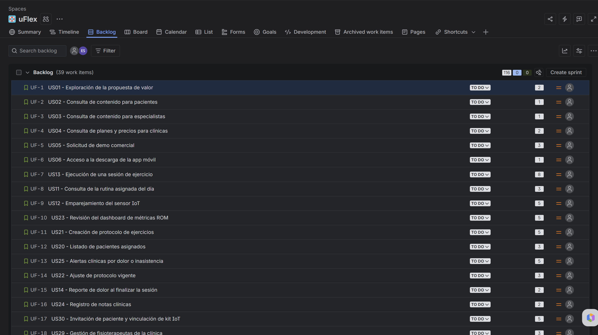

**Enlace al Product Backlog en Jira:** [https://fastpavos.atlassian.net/jira/software/projects/UF/boards/34/backlog](https://fastpavos.atlassian.net/jira/software/projects/UF/boards/34/backlog?atlOrigin=eyJpIjoiM2Y1YzMxNzZjOTkxNDkwY2IzZTYxZGQzNWZhMmUxYWEiLCJwIjoiaiJ9)

URL completa: https://fastpavos.atlassian.net/jira/software/projects/UF/boards/34/backlog?atlOrigin=eyJpIjoiM2Y1YzMxNzZjOTkxNDkwY2IzZTYxZGQzNWZhMmUxYWEiLCJwIjoiaiJ9

<table>
  <thead>
    <tr>
      <th># Orden</th>
      <th>User Story Id</th>
      <th>Título</th>
      <th>Descripción</th>
      <th>Story Points (1 / 2 / 3 / 5 / 8)</th>
    </tr>
  </thead>
  <tbody>
    <tr><td>1</td><td>US01</td><td>Exploración de la propuesta de valor</td><td>Como Visitante, quiero explorar la propuesta de valor de uFlex en la página principal para entender qué ofrece la plataforma y decidir si me interesa continuar navegando.</td><td>2</td></tr>
    <tr><td>2</td><td>US02</td><td>Consulta de contenido para pacientes</td><td>Como Visitante del segmento paciente, quiero consultar la sección "Cómo funciona para pacientes" para comprender el proceso de rehabilitación remota que ofrece uFlex.</td><td>1</td></tr>
    <tr><td>3</td><td>US03</td><td>Consulta de contenido para especialistas</td><td>Como Visitante del segmento fisioterapeuta, quiero consultar la sección "Cómo funciona para especialistas" para entender cómo uFlex apoya mi práctica clínica.</td><td>1</td></tr>
    <tr><td>4</td><td>US04</td><td>Consulta de planes y precios para clínicas</td><td>Como Visitante del segmento clínica, quiero consultar los planes y precios de uFlex para evaluar la viabilidad económica de adoptar la solución.</td><td>2</td></tr>
    <tr><td>5</td><td>US05</td><td>Solicitud de demo comercial</td><td>Como Visitante del segmento clínica, quiero solicitar una demostración comercial mediante un formulario para iniciar contacto con el equipo de uFlex.</td><td>3</td></tr>
    <tr><td>6</td><td>US06</td><td>Acceso a la descarga de la app móvil</td><td>Como Visitante, quiero acceder al enlace de descarga de la aplicación móvil de uFlex para instalarla en mi dispositivo.</td><td>1</td></tr>
    <tr><td>7</td><td>US13</td><td>Ejecución de una sesión de ejercicio</td><td>Como Paciente, quiero ejecutar una sesión de ejercicio con captura de datos en tiempo real para cumplir mi protocolo de rehabilitación de manera guiada.</td><td>8</td></tr>
    <tr><td>8</td><td>US11</td><td>Consulta de la rutina asignada del día</td><td>Como Paciente, quiero consultar la rutina de rehabilitación asignada del día para saber qué ejercicios me corresponde realizar.</td><td>3</td></tr>
    <tr><td>9</td><td>US12</td><td>Emparejamiento del sensor IoT</td><td>Como Paciente, quiero emparejar el sensor IoT con la aplicación móvil para que mis movimientos sean capturados durante la sesión.</td><td>5</td></tr>
    <tr><td>10</td><td>US23</td><td>Revisión del dashboard de métricas ROM</td><td>Como Fisioterapeuta, quiero revisar el dashboard de métricas ROM de un paciente para tomar decisiones clínicas basadas en datos objetivos.</td><td>5</td></tr>
    <tr><td>11</td><td>US21</td><td>Creación de protocolo de ejercicios</td><td>Como Fisioterapeuta, quiero crear un protocolo de ejercicios para un paciente para definir su plan terapéutico personalizado.</td><td>5</td></tr>
    <tr><td>12</td><td>US20</td><td>Listado de pacientes asignados</td><td>Como Fisioterapeuta, quiero consultar el listado de pacientes asignados para identificar rápidamente a quiénes debo atender.</td><td>3</td></tr>
    <tr><td>13</td><td>US25</td><td>Alertas clínicas por dolor o inasistencia</td><td>Como Fisioterapeuta, quiero recibir alertas cuando un paciente reporta dolor elevado o falta a sus sesiones para actuar a tiempo sobre casos críticos.</td><td>5</td></tr>
    <tr><td>14</td><td>US22</td><td>Ajuste de protocolo vigente</td><td>Como Fisioterapeuta, quiero ajustar un protocolo vigente según el avance del paciente para adaptar la terapia a su evolución.</td><td>3</td></tr>
    <tr><td>15</td><td>US14</td><td>Reporte de dolor al finalizar la sesión</td><td>Como Paciente, quiero reportar mi nivel de dolor al finalizar la sesión para que mi fisioterapeuta pueda ajustar el protocolo si es necesario.</td><td>2</td></tr>
    <tr><td>16</td><td>US24</td><td>Registro de notas clínicas</td><td>Como Fisioterapeuta, quiero registrar notas clínicas sobre la sesión de un paciente para mantener trazabilidad del seguimiento terapéutico.</td><td>2</td></tr>
    <tr><td>17</td><td>US30</td><td>Invitación de paciente y vinculación de kit IoT</td><td>Como Administrador, quiero invitar pacientes y vincular un kit IoT aprovisionado para habilitarles el acceso a la rehabilitación remota.</td><td>5</td></tr>
    <tr><td>18</td><td>US29</td><td>Gestión de fisioterapeutas de la clínica</td><td>Como Administrador, quiero registrar o desactivar fisioterapeutas de la clínica para mantener actualizado el equipo de especialistas autorizados.</td><td>3</td></tr>
    <tr><td>19</td><td>US31</td><td>Gestión de suscripción y pagos</td><td>Como Administrador, quiero gestionar la suscripción de la clínica mediante la pasarela de pagos externa para mantener activo el servicio.</td><td>5</td></tr>
    <tr><td>20</td><td>US32</td><td>Consulta de reportes de uso de la clínica</td><td>Como Administrador, quiero consultar reportes de uso y facturación de la clínica para tomar decisiones sobre la operación.</td><td>3</td></tr>
    <tr><td>21</td><td>US15</td><td>Consulta del histórico de progreso</td><td>Como Paciente, quiero consultar mi histórico de progreso para ver mi evolución en términos de adherencia y rango articular.</td><td>3</td></tr>
    <tr><td>22</td><td>US33</td><td>Configuración del perfil de la clínica</td><td>Como Administrador, quiero configurar el perfil y los datos institucionales de la clínica para personalizar la experiencia dentro de la plataforma.</td><td>2</td></tr>
    <tr><td>23</td><td>US16</td><td>Recordatorio de sesiones pendientes</td><td>Como Paciente, quiero recibir recordatorios de mis sesiones pendientes para no omitir ejercicios de mi rutina.</td><td>2</td></tr>
    <tr><td>24</td><td>US07</td><td>Activación de cuenta con código de invitación</td><td>Como Paciente, quiero activar mi cuenta con el código de invitación que me entrega la clínica para ingresar por primera vez a la aplicación móvil.</td><td>3</td></tr>
    <tr><td>25</td><td>US08</td><td>Inicio de sesión del paciente</td><td>Como Paciente, quiero iniciar sesión en la aplicación móvil con mis credenciales para acceder a mi rutina de rehabilitación.</td><td>2</td></tr>
    <tr><td>26</td><td>US17</td><td>Inicio de sesión del fisioterapeuta</td><td>Como Fisioterapeuta, quiero iniciar sesión en la aplicación web para acceder al panel de supervisión de mis pacientes.</td><td>2</td></tr>
    <tr><td>27</td><td>US26</td><td>Inicio de sesión del administrador</td><td>Como Administrador, quiero iniciar sesión en el panel administrativo para gestionar la operación de mi clínica en uFlex.</td><td>2</td></tr>
    <tr><td>28</td><td>TS34</td><td>Endpoint de registro de sesiones de rehabilitación</td><td>Como Developer, quiero consumir el endpoint POST /api/v1/sessions para registrar una sesión de rehabilitación de un paciente desde los clientes móviles.</td><td>3</td></tr>
    <tr><td>29</td><td>TS36</td><td>Envío de telemetría al Edge API</td><td>Como Developer, quiero enviar datos inerciales del sensor al Edge API mediante POST /edge/telemetry para que sean procesados antes de su persistencia en el backend central.</td><td>5</td></tr>
    <tr><td>30</td><td>TS35</td><td>Endpoint de consulta de métricas del paciente</td><td>Como Developer, quiero consumir el endpoint GET /api/v1/patients/{id}/metrics para obtener el histórico ROM de un paciente en los clientes web y móvil.</td><td>3</td></tr>
    <tr><td>31</td><td>TS37</td><td>Autenticación JWT con filtro multitenant</td><td>Como Developer, quiero autenticar las solicitudes al API mediante JWT y aplicar un filtro multitenant para garantizar que cada usuario opere únicamente sobre los recursos de su clínica.</td><td>5</td></tr>
    <tr><td>32</td><td>TS38</td><td>Integración con la pasarela de pagos externa</td><td>Como Developer, quiero integrar la pasarela de pagos externa (Stripe) para activar y renovar las suscripciones de las clínicas.</td><td>5</td></tr>
    <tr><td>33</td><td>TS39</td><td>Envío de notificaciones transaccionales</td><td>Como Developer, quiero enviar notificaciones transaccionales por correo a través de un proveedor externo cuando ocurran eventos relevantes del dominio.</td><td>3</td></tr>
    <tr><td>34</td><td>US09</td><td>Recuperación de contraseña del paciente</td><td>Como Paciente, quiero recuperar mi contraseña cuando la olvido para volver a acceder a la aplicación móvil y continuar con mi rutina.</td><td>2</td></tr>
    <tr><td>35</td><td>US18</td><td>Recuperación de contraseña del fisioterapeuta</td><td>Como Fisioterapeuta, quiero recuperar mi contraseña cuando la olvido para volver a acceder al panel clínico sin depender del administrador.</td><td>2</td></tr>
    <tr><td>36</td><td>US27</td><td>Recuperación de contraseña del administrador</td><td>Como Administrador, quiero recuperar mi contraseña cuando la olvido para volver a acceder al panel administrativo de mi clínica.</td><td>2</td></tr>
    <tr><td>37</td><td>US10</td><td>Cierre de sesión del paciente</td><td>Como Paciente, quiero cerrar mi sesión en la aplicación móvil para proteger mi información cuando termino de usar la app.</td><td>1</td></tr>
    <tr><td>38</td><td>US19</td><td>Cierre de sesión del fisioterapeuta</td><td>Como Fisioterapeuta, quiero cerrar mi sesión en la aplicación web para proteger la información clínica de mis pacientes.</td><td>1</td></tr>
    <tr><td>39</td><td>US28</td><td>Cierre de sesión del administrador</td><td>Como Administrador, quiero cerrar mi sesión en el panel administrativo para proteger la información operativa de mi clínica.</td><td>1</td></tr>
  </tbody>
</table>

# Capítulo IV: Solution Software Design

## 4.1. Strategic-Level Domain-Driven Design

En esta sección se aborda la perspectiva estratégica del enfoque Domain-Driven Design (DDD), la cual se centra en definir los límites del dominio y establecer una visión clara de cómo las diferentes partes del sistema interactúan entre sí. A través de técnicas como Event Storming, Context Mapping y la definición de una arquitectura de software adecuada, se busca garantizar que el diseño del sistema esté alineado con los objetivos del negocio y las necesidades de los usuarios.

### 4.1.1. Design-Level EventStorming

El Event Storming se llevó a cabo en una sesión colaborativa con la participación de cinco miembros del equipo, incluyendo un facilitador y un relator. Durante la sesión, se utilizaron notas adhesivas de colores para representar eventos de dominio, comandos, agregados y otros elementos clave del sistema. El objetivo principal fue capturar una visión integral del flujo de eventos dentro del dominio educativo, identificar puntos críticos y descubrir posibles bounded contexts.

A continuación, se detallan los pasos seguidos y los resultados obtenidos en cada una de las fases del Event Storming.

**Antes de la sesión:**

Primero, se preparó el espacio de trabajo con un mural digital (Miro) y se definieron las reglas básicas para la participación. Se estableció que todas las ideas eran bienvenidas y que el objetivo era fomentar la colaboración y la creatividad.

**Durante la sesión:**

1. **Unstructured Exploration:** Se comenzó con una lluvia de ideas para identificar eventos de dominio relevantes. Cada participante escribió eventos en notas adhesivas y las colocó en el mural, sin preocuparse inicialmente por el orden o la estructura.

    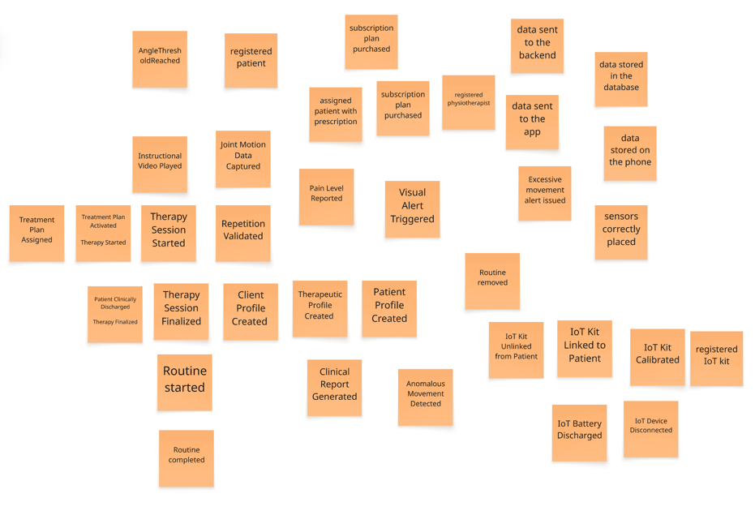

2. **Timelines:** Se organizó la secuencia temporal de los eventos identificados, creando una línea de tiempo que reflejaba el flujo natural del dominio. Se agruparon eventos relacionados y se identificaron interacciones clave.

    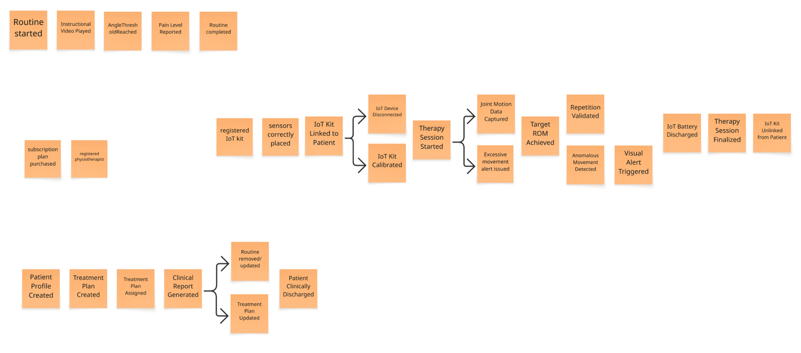

3. **Pain points:** Se identificaron puntos de dolor y áreas de incertidumbre dentro del flujo de eventos. Estos puntos se marcaron con notas de color diferente para destacarlos y facilitar su análisis posterior.

    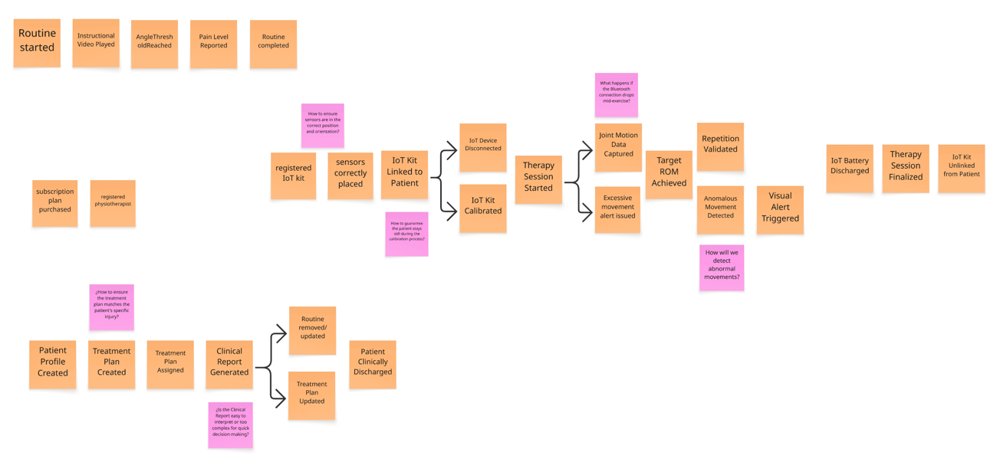

4. **Pivotal points:** Se destacaron eventos clave que representaban cambios significativos en el estado del sistema o que tenían un impacto considerable en el negocio. Estos eventos se utilizaron como referencia para definir los límites de los bounded contexts.

    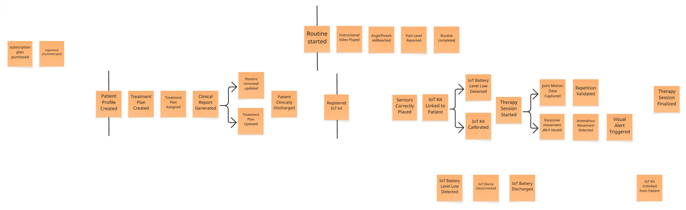

5. **Commands:** Se añadieron comandos que desencadenaban los eventos identificados. Esto ayudó a clarificar las acciones que los usuarios o sistemas externos podían realizar dentro del dominio.

    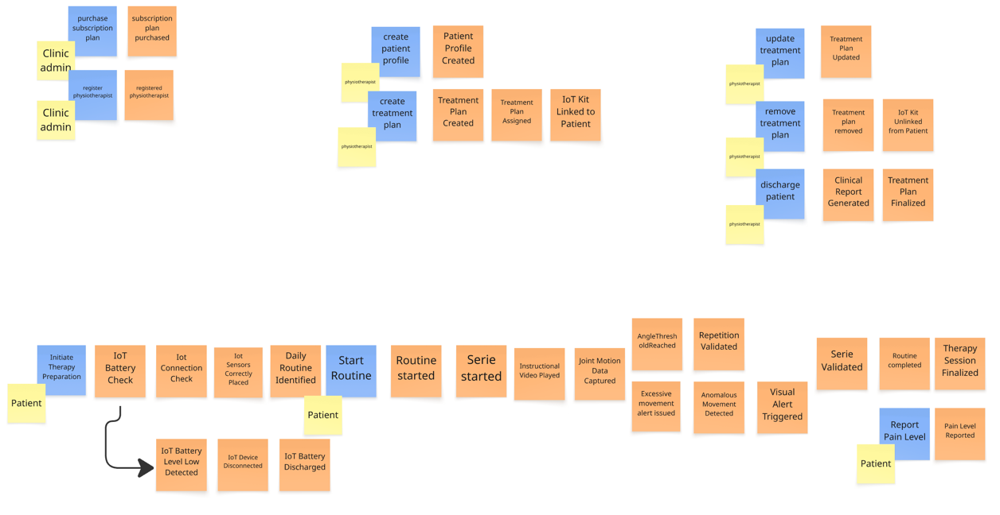

6. **Policies:** Se definieron políticas que regulaban cómo y cuándo se ejecutaban ciertos comandos o eventos, estableciendo reglas de negocio claras.

    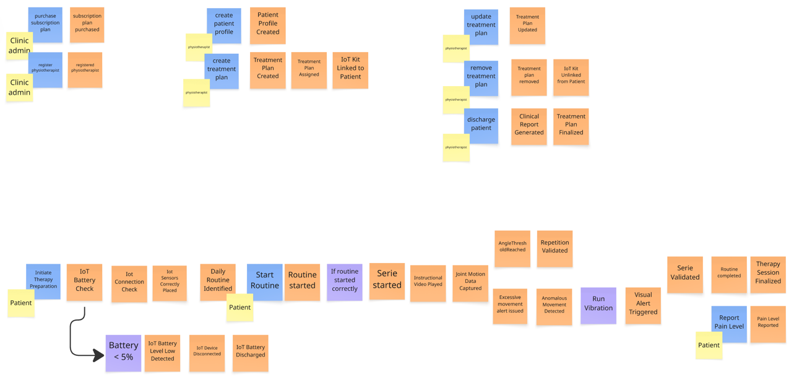

7. **Read models:** Se identificaron modelos de lectura necesarios para consultar el estado del sistema y presentar información relevante a los usuarios.

    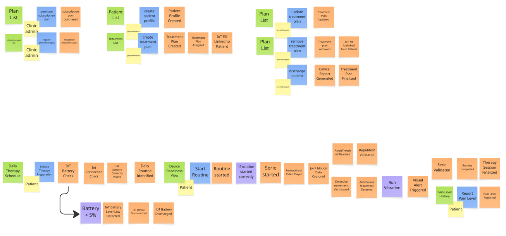

8. **External systems:** Se mapearon sistemas externos que interactuaban con el dominio, identificando puntos de integración y comunicación.

    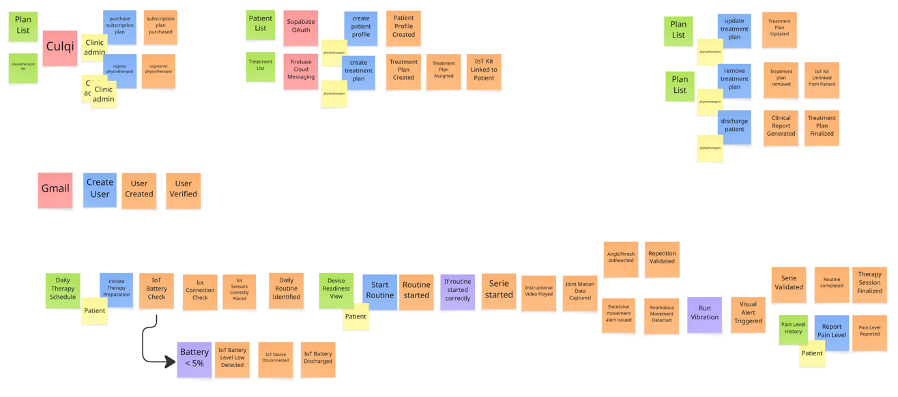

9. **Aggregates:** Se agruparon eventos y comandos en agregados, definiendo las unidades de consistencia dentro del dominio.

    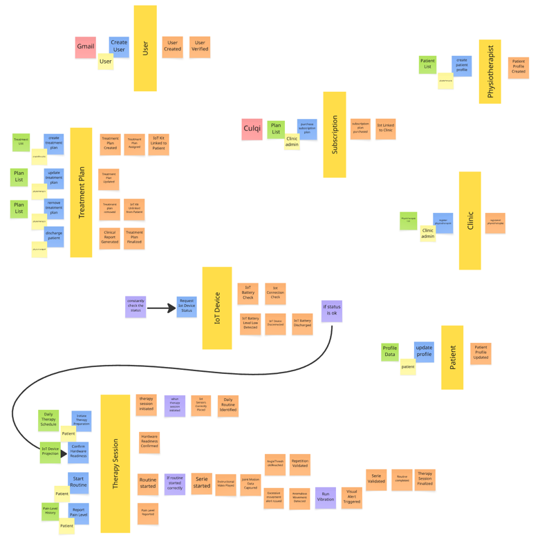

10. **Bounded Contexts:** Finalmente, se delinearon los límites de los bounded contexts basados en los eventos, agregados y puntos clave identificados. Esta agrupación en clústeres permitirá discutir y clasificar los contexts en Core, Supporting y Generic.

    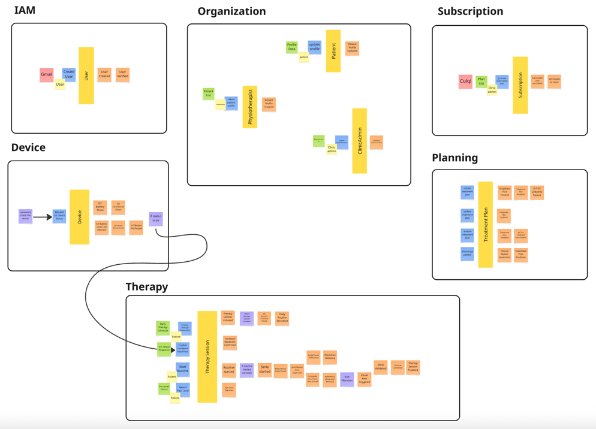

#### 4.1.1.1 Candidate Context Discovery

#### 4.1.1.2 Domain Message Flows Modeling

#### 4.1.1.3 Bounded Context Canvases

### 4.1.2. Context Mapping

### 4.1.3. Software Architecture

#### 4.1.3.1. Software Architecture System Landscape Diagram

#### 4.1.3.2. Software Architecture Context Level Diagrams

#### 4.1.3.3. Software Architecture Container Level Diagrams

#### 4.1.3.4. Software Architecture Deployment Diagrams

## 4.2. Tactical-Level Domain-Driven Design

### 4.2.X. Bounded Context: <Bounded Context Name>

#### 4.2.X.1. Domain Layer

#### 4.2.X.2. Interface Layer

#### 4.2.X.3. Application Layer

#### 4.2.X.4. Infrastructure Layer

#### 4.2.X.5. Bounded Context Software Architecture Component Level Diagrams

#### 4.2.X.6. Bounded Context Software Architecture Code Level Diagrams

##### 4.2.X.6.1. Bounded Context Domain Layer Class Diagrams

##### 4.2.X.6.2. Bounded Context Database Design Diagram

# Conclusiones

## Conclusiones y recomendaciones

# Bibliografía

