

  

<h2 style="text-align: center;"> Universidad Peruana de Ciencias Aplicadas </h2>

<h4 style="text-align: center"> Ingeniería de Software </h4>

<h4 style="text-align: center"> Periodo: 202610 </h4>

<h4 style="text-align: center"> 1ASI0572 | Desarrollo de Soluciones IOT </h4>

<h4 style="text-align: center"> NRC: 17755  </h4>

<h4 style="text-align: center"> Docente: Marco Antonio León Baca </h4>

<h3 style="text-align: center;"> Informe del Trabajo Final </h3>

<h4 style="text-align: center"> Startup: KinIoT </h4>

<h4 style="text-align: center"> Producto: uFlex </h4>

<h4 style="text-align: center">Integrantes:</h4>

   <table style="margin-left: auto; margin-right: auto;">
      <tr>
         <th>Código</th>
         <th>Apellidos y Nombres</th>
      </tr>
      <tr>
         <td>U20221G120</td>
         <td>Crispín Ramos, Daniel Franco</td>
      </tr>
      <tr>
         <td>U20201E843</td>
         <td>Ramirez Mestanza, Salim Ignacio</td>
      </tr>
      <tr>
         <td>U202312222</td>
         <td>Rivera Sosa, Eduardo Gael</td>
      </tr>
      <tr>
         <td>U20221C486</td>
         <td>Sulca Gonzales, Paúl Fernando</td>
      </tr>
      <tr>
         <td>U202312222</td>
         <td>Varela Bustinza, Marcelo Alessandro</td>
      </tr>
   </table>

 

<h5 style="text-align: center; font-style: italic;"> Abril 2026 </h5>

# Registro de Versiones del Informe

| Version  | Fecha      | Autor                                 | Descripción de modificación                                                     |
|----------|------------|---------------------------------------|---------------------------------------------------------------------------------|
| 1.0.0    | 2026-04-04 | Ramirez Mestanza, Salim Ignacio       | Creación de estructura base, carátula y registro de versiones.                  |
| 1.1.0    | 2026-04-05 | Varela Bustinza, Marcelo Alessandro   | Redacción de Capítulo I: Startup Profile y Solution Profile (Lean UX).          |
| 1.2.0    | 2026-04-07 | Sulca Gonzales, Paúl Fernando         | Desarrollo de Capítulo II: Requirements Elicitation & Analysis.                 |
| 1.3.0    | 2026-04-10 | Crispín Ramos, Daniel Franco          | Desarrollo de Capítulo III: Requirements Specification.                         |
| 1.4.0    | 2026-04-13 | Rivera Sosa, Eduardo Gael             | Desarrollo de Capítulo IV: Strategic DDD y Software Architecture.               |
| 1.5.1    | 2026-04-16 | Varela Bustinza, Marcelo Alessandro   | Desarrollo Tactical DDD del Bounded Context: Organization.                      |
| 1.5.2    | 2026-04-16 | Rivera Sosa, Eduardo Gael             | Desarrollo Tactical DDD del Bounded Context: IAM y Subscription.                |
| 1.5.3    | 2026-04-19 | Crispín Ramos, Daniel Franco          | Desarrollo Tactical DDD del Bounded Context: Device.                            |
| 1.5.4    | 2026-04-21 | Ramirez Mestanza, Salim Ignacio       | Desarrollo Tactical DDD del Bounded Context: Planning.                          |
| 1.5.5    | 2026-04-22 | Sulca Gonzales, Paúl Fernando         | Desarrollo Tactical DDD del Bounded Context: Therapy.                           |
| 1.6.0    | 2026-04-23 | Ramirez Mestanza, Salim Ignacio       | Integración de Student Outcome, Conclusiones (avance) y Bibliografía para AV1.  |

# Project Report Collaboration Insights

En esta sección se presenta un resumen de las actividades de colaboración realizadas para la elaboración del informe del proyecto.

Se utilizó **GitHub** como plataforma de control de versiones y colaboración en equipo. Se incluye enlace para acceder al repositorio para el reporte del proyecto. [Ver en Github](https://github.com/kiniot/uflex-project-report)

Los integrantes del equipo y sus nombres de usuario en GitHub son los siguientes:

| Integrantes                         | Nombre en GitHub |
|-------------------------------------|------------------|
| Crispin Ramos, Daniel Franco        | `danielcr04`     |
| Ramirez Mestanza, Salim Ignacio     | `salimramirez`   |
| Sulca Gonzales, Paúl Fernando       | `Kyrubi`         |
| Rivera Sosa, Eduardo Gael           | `gael-rs`        |
| Varela Bustinza, Marcelo Alessandro | `VarBus`         |

Se usó el flujo de trabajo **GitFlow**, que incluye las siguientes ramas principales:

- **main:** Rama principal que contiene la versión estable y consolidada del documento.
- **develop:** Rama de integración utilizada para fusionar los cambios realizados en las ramas de características.
- **feature/feature-name:** Ramas de características utilizadas para desarrollar secciones específicas del informe, como "feature/introduccion", "feature-requirements", etc.
- **release/vX.X.X:** Rama creada para preparar versiones candidatas al reporte final, siguiendo *Semantic Versioning 2.0.0*. En esta rama se realizan ajustes finales como correcciones menores y revisiones antes de integrarla a `main`.
- **hotfix/fix-name:** Rama utilizada para aplicar correcciones críticas directamente sobre `main`, asegurando la estabilidad de la versión publicada.

## TB1

**Tareas**

Para el desarrollo del TB1, cada participante del equipo realizó las siguientes tareas:

| Integrantes                      | Tarea asignada                                                                                                                                                                                                                                                                 |
|----------------------------------|--------------------------------------------------------------------------------------------------------------------------------------------------------------------------------------------------------------------------------------------------------------------------------|

**GitHub Collaboration Insights**

En GitHub se presenta un timeline de las principales ramas creadas por cada integrante del equipo, así como los procesos de merge realizados.  
Todas las ramas fueron gestionadas siguiendo el flujo de trabajo **GitFlow**, adaptado para una organización que utiliza un sistema de control de versiones.

Gráfico de red (*network graph*) de ramas en el repositorio de GitHub.

A continuación, se presentan los gráficos que muestran el análisis de los commits en el repositorio correspondiente al informe.  
Estos gráficos detallan la cantidad de líneas de código añadidas por cada miembro del equipo y la actividad de commits registrada.

Análisis de líneas de código añadidas por contribuyente.

El siguiente gráfico muestra la cantidad de commits realizados en la semana con mayor actividad en el proyecto.

Análisis de cantidad de commits realizados por semana.

# Contenido

- [Capítulo I: Introducción](#capítulo-i-introducción)
   - [1.1. Startup Profile](#11-startup-profile)
      - [1.1.1. Descripción de la Startup](#111-descripción-de-la-startup)
      - [1.1.2. Perfiles de los integrantes del equipo](#112-perfiles-de-los-integrantes-del-equipo)
   - [1.2. Solution Profile](#12-solution-profile)
      - [1.2.1. Antecedentes y problemática](#121-antecedentes-y-problemática)
      - [1.2.2. Lean UX Process](#122-lean-ux-process)
         - [1.2.2.1. Lean UX Problem Statements](#1221-lean-ux-problem-statements)
         - [1.2.2.2. Lean UX Assumptions](#1222-lean-ux-assumptions)
         - [1.2.2.3. Lean UX Hypothesis](#1223-lean-ux-hypothesis-statements)
         - [1.2.2.4. Lean UX Canvas](#1224-lean-ux-canvas)
   - [1.3. Segmentos objetivo](#13-segmentos-objetivo)

- [Capítulo II: Requirements Elicitation & Analysis](#capítulo-ii-requirements-elicitation--analysis)
   - [2.1. Competidores](#21-competidores)
      - [2.1.1. Análisis competitivo](#211-análisis-competitivo)
      - [2.1.2. Estrategias y tácticas frente a competidores](#212-estrategias-y-tácticas-frente-a-competidores)
   - [2.2. Entrevistas](#22-entrevistas)
      - [2.2.1. Diseño de entrevistas](#221-diseño-de-entrevistas)
      - [2.2.2. Registro de entrevistas](#222-registro-de-entrevistas)
      - [2.2.3. Análisis de entrevistas](#223-análisis-de-entrevistas)
   - [2.3. Needfinding](#23-needfinding)
      - [2.3.1. User Personas](#231-user-personas)
      - [2.3.2. User Task Matrix](#232-user-task-matrix)
      - [2.3.3. User Journey Mapping](#233-user-journey-mapping)
      - [2.3.4. Empathy Mapping](#234-empathy-mapping)
   - [2.4. Big Picture EventStorming](#24-big-picture-eventstorming)
   - [2.5. Ubiquitous Language](#25-ubiquitous-language)

- [Capítulo III: Requirements Specification](#capítulo-iii-requirements-specification)
   - [3.1. User Stories](#31-user-stories)
   - [3.2. Impact Mapping](#32-impact-mapping)
   - [3.3. Product Backlog](#33-product-backlog)

- [Capítulo IV: Solution Software Design](#capítulo-iv-solution-software-design)
   - [4.1. Strategic-Level Domain-Driven Design](#41-strategic-level-domain-driven-design)
      - [4.1.1. Design-Level EventStorming](#411-design-level-eventstorming)
         - [4.1.1.1. Candidate Context Discovery](#4111-candidate-context-discovery)
         - [4.1.1.2. Domain Message Flows Modeling](#4112-domain-message-flows-modeling)
         - [4.1.1.3. Bounded Context Canvases](#4113-bounded-context-canvases)
      - [4.1.2. Context Mapping](#412-context-mapping)
      - [4.1.3. Software Architecture](#413-software-architecture)
         - [4,1.3.1. Software Architecture System Landscape Diagram](#4131-software-architecture-system-landscape-diagram)
         - [4,1.3.2. Software Architecture Context Level Diagrams](#4132-software-architecture-context-level-diagrams)
         - [4.1.3.3. Software Architecture Container Level Diagrams](#4133-software-architecture-container-level-diagrams)
         - [4.1.3.4. Software Architecture Deployment Diagrams](#4134-software-architecture-deployment-diagrams)
   - [4.2. Tactical-Level Domain-Driven Design](#42-tactical-level-domain-driven-design)
      - [4.2.1. Bounded Context: IAM](#421-bounded-context-iam)
         - [4.2.1.1. Domain Layer](#4211-domain-layer)
         - [4.2.1.2. Interface Layer](#4212-interface-layer)
         - [4.2.1.3. Application Layer](#4213-application-layer)
         - [4.2.1.4. Infrastructure Layer](#4214-infrastructure-layer)
         - [4.2.1.5. Bounded Context Software Architecture Component Level Diagrams](#4215-bounded-context-software-architecture-component-level-diagrams)
         - [4.2.1.6. Bounded Context Software Architecture Code Level Diagrams](#4216-bounded-context-software-architecture-code-level-diagrams)
            - [4.2.1.6.1. Bounded Context Domain Layer Class Diagrams](#42161-bounded-context-domain-layer-class-diagrams)
            - [4.2.1.6.2. Bounded Context Database Design Diagram](#42162-bounded-context-database-design-diagram)
      - [4.2.2. Bounded Context: Subscription](#422-bounded-context-subscription)
         - [4.2.2.1. Domain Layer](#4221-domain-layer)
         - [4.2.2.2. Interface Layer](#4222-interface-layer)
         - [4.2.2.3. Application Layer](#4223-application-layer)
         - [4.2.2.4. Infrastructure Layer](#4224-infrastructure-layer)
         - [4.2.2.5. Bounded Context Software Architecture Component Level Diagrams](#4225-bounded-context-software-architecture-component-level-diagrams)
         - [4.2.2.6. Bounded Context Software Architecture Code Level Diagrams](#4226-bounded-context-software-architecture-code-level-diagrams)
            - [4.2.2.6.1. Bounded Context Domain Layer Class Diagrams](#42261-bounded-context-domain-layer-class-diagrams)
            - [4.2.2.6.2. Bounded Context Database Design Diagram](#42262-bounded-context-database-design-diagram)
      - [4.2.3. Bounded Context: Organization](#423-bounded-context-organization)
          - [4.2.3.1. Domain Layer](#4231-domain-layer)
          - [4.2.3.2. Interface Layer](#4232-interface-layer)
          - [4.2.3.3. Application Layer](#4233-application-layer)
          - [4.2.3.4. Infrastructure Layer](#4234-infrastructure-layer)
          - [4.2.3.5. Bounded Context Software Architecture Component Level Diagrams](#4235-bounded-context-software-architecture-component-level-diagrams)
          - [4.2.3.6. Bounded Context Software Architecture Code Level Diagrams](#4236-bounded-context-software-architecture-code-level-diagrams)
            - [4.2.3.6.1. Bounded Context Domain Layer Class Diagrams](#42361-bounded-context-domain-layer-class-diagrams)
            - [4.2.3.6.2. Bounded Context Database Design Diagram](#42362-bounded-context-database-design-diagram)
      - [4.2.4. Bounded Context: Device](#424-bounded-context-device)
          - [4.2.4.1. Domain Layer](#4241-domain-layer)
          - [4.2.4.2. Interface Layer](#4242-interface-layer)
          - [4.2.4.3. Application Layer](#4243-application-layer)
          - [4.2.4.4. Infrastructure Layer](#4244-infrastructure-layer)
          - [4.2.4.5. Bounded Context Software Architecture Component Level Diagrams](#4245-bounded-context-software-architecture-component-level-diagrams)
          - [4.2.4.6. Bounded Context Software Architecture Code Level Diagrams](#4246-bounded-context-software-architecture-code-level-diagrams)
            - [4.2.4.6.1. Bounded Context Domain Layer Class Diagrams](#42461-bounded-context-domain-layer-class-diagrams)
            - [4.2.4.6.2. Bounded Context Database Design Diagram](#42462-bounded-context-database-design-diagram)
      - [4.2.5. Bounded Context: Planning](#425-bounded-context-planning)
          - [4.2.5.1. Domain Layer](#4251-domain-layer)
          - [4.2.5.2. Interface Layer](#4252-interface-layer)
          - [4.2.5.3. Application Layer](#4253-application-layer)
          - [4.2.5.4. Infrastructure Layer](#4254-infrastructure-layer)
          - [4.2.5.5. Bounded Context Software Architecture Component Level Diagrams](#4255-bounded-context-software-architecture-component-level-diagrams)
          - [4.2.5.6. Bounded Context Software Architecture Code Level Diagrams](#4256-bounded-context-software-architecture-code-level-diagrams)
            - [4.2.5.6.1. Bounded Context Domain Layer Class Diagrams](#42561-bounded-context-domain-layer-class-diagrams)
            - [4.2.5.6.2. Bounded Context Database Design Diagram](#42562-bounded-context-database-design-diagram)
      - [4.2.6. Bounded Context: Therapy](#426-bounded-context-therapy)
          - [4.2.6.1. Domain Layer](#4261-domain-layer)
          - [4.2.6.2. Interface Layer](#4262-interface-layer)
          - [4.2.6.3. Application Layer](#4263-application-layer)
          - [4.2.6.4. Infrastructure Layer](#4264-infrastructure-layer)
          - [4.2.6.5. Bounded Context Software Architecture Component Level Diagrams](#4265-bounded-context-software-architecture-component-level-diagrams)
          - [4.2.6.6. Bounded Context Software Architecture Code Level Diagrams](#4266-bounded-context-software-architecture-code-level-diagrams)
            - [4.2.6.6.1. Bounded Context Domain Layer Class Diagrams](#42661-bounded-context-domain-layer-class-diagrams)
            - [4.2.6.6.2. Bounded Context Database Design Diagram](#42662-bounded-context-database-design-diagram)

- [Conclusiones](#conclusiones)
   - [Conclusiones y recomendaciones](#conclusiones-y-recomendaciones)
- [Bibliografía](#bibliografía)

# Student Outcome

En el siguiente cuadro se describe las acciones realizadas y enunciados de conclusiones por parte del grupo, que permiten sustentar el haber alcanzado el logro del ABET – EAC - Student Outcome 5

<table>
  <thead>
    <tr>
      <th>Criterio específico</th>
      <th>Acciones realizadas</th>
      <th>Conclusiones</th>
    </tr>
  </thead>
  <tbody>
    <tr>
      <td rowspan="5"><strong>Trabaja en equipo para proporcionar liderazgo en forma conjunta</strong></td>
      <td><strong>Crispin Ramos, Daniel Franco</strong> <b>AV1:</b> Lideré la ejecución del Needfinding y la elaboración del Impact Mapping, articulando las necesidades del usuario con los objetivos de negocio. Asumí la responsabilidad del diseño estratégico Context Mapping y el desarrollo táctico DDD del Bounded Context Device. Participé activamente en las sesiones de EventStorming, guiando la delimitación de contextos y validando las interacciones estratégicas del sistema.</td>
      <td rowspan="5"><b>AV1:</b> Durante el desarrollo del AV1, que abarcó desde el perfil de la startup hasta el diseño de la solución de software, hemos aprendido que el liderazgo no recae en una sola persona sino que se ejerce de forma conjunta. Cada integrante tomó la conducción de las secciones en las que tenía mayor dominio y al mismo tiempo apoyó activamente al resto, lo que nos permitió avanzar de manera paralela sin perder coherencia. Actividades transversales como el EventStorming evidenciaron que compartir el liderazgo fortalece la calidad de las decisiones y nos ayuda a alinear el rumbo del proyecto como equipo.</td>
    </tr>
    <tr>
      <td><strong>Ramirez Mestanza, Salim Ignacio</strong> <b>AV1:</b> Lideré la elaboración de las User Stories del proyecto, estructurando los requerimientos funcionales y sus criterios de aceptación para mantener coherencia entre los módulos. Además, apoyé activamente en el Design-Level EventStorming para alinear decisiones de dominio con el equipo y desarrollé el Domain Message Flows Modeling, integrando los eventos y mensajes clave entre bounded contexts.</td>
    </tr>
    <tr>
      <td><strong>Rivera Sosa, Eduardo Gael</strong> <b>AV1:</b> Lideré el diseño de la arquitectura de software de uFlex elaborando los diagramas Landscape, Context, Container y Deployment. Facilité junto al equipo el Design-Level EventStorming, guiando las decisiones sobre eventos y bounded contexts. También dirigí el análisis competitivo y las estrategias frente a competidores, consolidando los aportes del equipo en un entregable coherente.</td>
    </tr>
    <tr>
      <td><strong>Sulca Gonzales, Paúl Fernando</strong> <b>AV1:</b> Lideré y facilité actividades de análisis centradas en el usuario, incluyendo la elaboración de entrevistas, User Task Matrix, User Journey Mapping y Empathy Mapping, articulando los aportes del equipo para convertirlos en insumos de diseño consistentes. Además, participé activamente en Big Picture Event Storming y Candidate Context Discovery para alinear decisiones de dominio y delimitar bounded contexts con enfoque estratégico.</td>
    </tr>
    <tr>
      <td><strong>Varela Bustinza, Marcelo Alessandro</strong> <b>AV1:</b>Durante el desarrollo del proyecto, aporté activamente en la organización y desarrollo de capítulos clave, participando en temas como Lean UX, entrevistas, needfinding y diseño de software. Mi contribución permitió coordinar ideas con el equipo y avanzar de manera conjunta hacia los objetivos del trabajo.</td>
    </tr>
    <tr>
      <td rowspan="5"><strong>Crea un entorno colaborativo e inclusivo, establece metas, planifica tareas y cumple objetivos</strong></td>
      <td><strong>Crispin Ramos, Daniel Franco</strong> <b>AV1:</b> Planifiqué y cumplí con los entregables de análisis y diseño asignados, coordinando con el equipo la priorización de las actividades dentro del Bounded Context Device. Mi participación activa en las sesiones de EventStorming y en la validación de diagramas tácticos facilitó el consenso técnico y aseguró que los aportes del equipo se integraran correctamente dentro de los plazos del AV1.</td>
      <td rowspan="5"><b>AV1:</b> A lo largo del AV1 hemos logrado cubrir todo el alcance planificado, desde la definición de la startup y el análisis del problema hasta el diseño completo de la solución de software. Para conseguirlo establecimos metas claras por capítulo, distribuimos las tareas según las fortalezas de cada integrante y realizamos revisiones constantes para mantener el avance alineado. Creemos que el entorno colaborativo e inclusivo que construimos fue clave: cada propuesta fue discutida en conjunto y los entregables finales reflejan aportes de todo el equipo, cumpliendo los objetivos acordados en los plazos previstos.</td>
    </tr>
    <tr>
      <td><strong>Ramirez Mestanza, Salim Ignacio</strong> <b>AV1:</b> Planifiqué y entregué en los plazos acordados las secciones a mi cargo, especialmente la definición de User Stories y el Domain Message Flows Modeling. Participé de forma activa en el Design-Level EventStorming como espacio colaborativo, incorporando los aportes del equipo para mantener metas comunes, una coordinación inclusiva y el cumplimiento de los objetivos del AV1.</td>
    </tr>
    <tr>
      <td><strong>Rivera Sosa, Eduardo Gael</strong> <b>AV1:</b> Planifiqué y entregué en los plazos acordados las secciones a mi cargo: segmentos objetivo, análisis competitivo, estrategias frente a competidores, user personas y la arquitectura de software con sus diagramas. Participé activamente en el Design-Level EventStorming como actividad colaborativa, asegurando que los aportes de todos los integrantes se reflejaran en el diseño final.</td>
    </tr>
    <tr>
      <td><strong>Sulca Gonzales, Paúl Fernando</strong> <b>AV1:</b> Planifiqué y cumplí los entregables asignados en las etapas de investigación y modelado del dominio, coordinando con el equipo la priorización de tareas para mantener el avance del AV1 dentro de los plazos. Mi participación en la definición de bounded contexts y en el diseño táctico DDD (capas y diagramas de soporte) contribuyó a consolidar un entorno de trabajo colaborativo, ordenado e inclusivo orientado al cumplimiento de objetivos.</td>
    </tr>
    <tr>
      <td><strong>Varela Bustinza, Marcelo Alessandro</strong> <b>AV1:</b>Participé de forma colaborativa en la distribución y ejecución de tareas, asumiendo responsabilidades concretas dentro del proyecto y cumpliendo con los entregables asignados. Esto ayudó a mantener un trabajo ordenado, con metas claras y un avance coordinado entre los integrantes.</td>
    </tr>
  </tbody>
</table>

# Capítulo I: Introducción

## 1.1. Startup Profile

### 1.1.1. Descripción de la Startup

KinIoT es una startup peruana conformada por estudiantes de Ingeniería de Software de la Universidad Peruana de Ciencias Aplicadas (UPC). Nuestra organización nace con el propósito de cerrar la brecha tecnológica en el sector salud, específicamente en el área de la medicina física y rehabilitación. Nos especializamos en el desarrollo de ecosistemas de Internet de las Cosas (IoT) y soluciones SaaS (Software as a Service) que transforman procesos terapéuticos convencionales en experiencias digitales precisas, seguras y monitoreadas.

Nuestro producto principal, uFlex, es una solución integral diseñada para la telerehabilitación de lesiones en el complejo articular de miembro superior. Mediante el uso de sensores vestibles de alta precisión y una plataforma cloud multitenant, permitimos que las clínicas y centros de salud extiendan su capacidad de atención al hogar del paciente, garantizando que cada movimiento sea auditado por especialistas y ejecutado correctamente por el usuario.

### Misión

Empoderar a pacientes y especialistas en rehabilitación mediante soluciones IoT innovadoras que garanticen la precisión clínica en el hogar, reduciendo los tiempos de recuperación y eliminando la incertidumbre en las terapias remotas.

### Visión

Ser reconocidos en el 2030 como la startup líder en telemonitoreo biomecánico en Latinoamérica, destacando por la integración de hardware de bajo costo y software de alta fidelidad para la salud articular.

### Valores

* Integridad de datos: Nos comprometemos a que la información capturada por nuestros sensores sea un reflejo fiel del progreso del paciente.
* Accesibilidad: Diseñamos tecnología compleja que sea fácil de usar para cualquier paciente, sin importar su experiencia técnica.
* Enfoque en el paciente: Cada línea de código y cada componente de hardware tiene como fin último una recuperación sin secuelas.
* Innovación constante: Buscamos optimizar continuamente nuestros algoritmos de procesamiento para ofrecer métricas cada vez más exactas.

### 1.1.2. Perfiles de los integrantes del equipo

<table>
  <thead>
    <tr>
      <th>Perfil</th>
      <th>Foto</th>
    </tr>
  </thead>
  <tbody>
    <tr>
      <td><strong>Crispín Ramos, Daniel Franco</strong>  Soy Daniel. Tengo interés por la arquitectura de sistemas y el diseño de soluciones. Me entusiasma profundizar en metodologías como Domain-Driven Design y patrones de diseño para entender cómo construir aplicaciones escalables y mantenibles. Soy una persona responsable, comprometida y con facilidad para trabajar en equipo.</td>
      <td>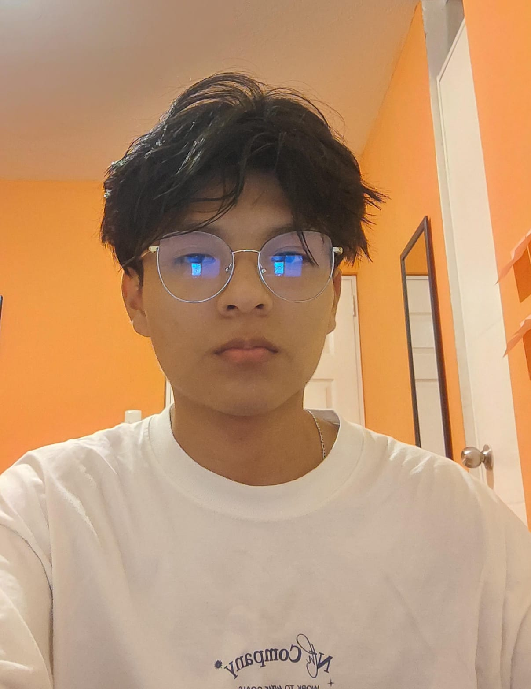</td>
    </tr>
    <tr>
      <td><strong>Ramirez Mestanza, Salim Ignacio</strong>  Soy Salim, estudiante de Ingenieria de Software, con entusiasmo por el desarrollo backend, la arquitectura de software y el cloud. Me enfoco en tomar decisiones tecnicas complejas que generen impacto directo en los resultados del proyecto y aporten a los atributos de calidad esperados del software. Me considero perseverante, no me rindo ante los retos y siempre busco la colaboracion del equipo para avanzar. Tambien asumo un rol de liderazgo, porque creo firmemente que cada integrante es una parte indispensable para el exito del proyecto.</td>
      <td></td>
    </tr>
    <tr>
      <td><strong>Rivera Sosa, Eduardo Gael</strong>  Soy Gael, desarrollador Full Stack con enfoque en IA. Me gusta construir productos que realmente funcionen y aprender rápido lo que sea necesario para lograrlo. Soy proactivo, me adapto bien al trabajo en equipo y disfruto resolver problemas desde la raíz. Cuando algo se puede hacer mejor, lo digo.</td>
      <td></td>
    </tr>
    <tr>
      <td><strong>Sulca Gonzales, Paúl Fernando</strong>  Soy Paúl, estudiante de 8vo ciclo de Ingeniería de Software en la Universidad Peruana de Ciencias Aplicadas. Tengo interés en el desarrollo full-stack, las metodologías ágiles y la gestión de proyectos. Me enfoco en aprender rápidamente y adaptarme a distintos retos, aportando soluciones tecnológicas innovadoras y de impacto. Me considero una persona analítica, con pensamiento crítico, y disfruto trabajar en equipo para lograr resultados sólidos y bien estructurados.</td>
      <td></td>
    </tr>
    <tr>
      <td><strong>Varela Bustinza, Marcelo Alessandro</strong>  Mi nombre es Marcelo Varela. Soy un estudiante de la carrera de Ingeniería De Software, tengo 21 años y actualmente me encuentro cursando el octavo ciclo de la carrera. Me caracterizo por ser una persona responsable, resiliente y proactiva, al cual le gusta aprender sobre tecnología y el desarrollo de software. Mi compromiso como miembro de este equipo es brindar mi apoyo y participación para enfrentar lo desafíos así como dar lo mejor de mí para el éxito de este proyecto.</td>
      <td>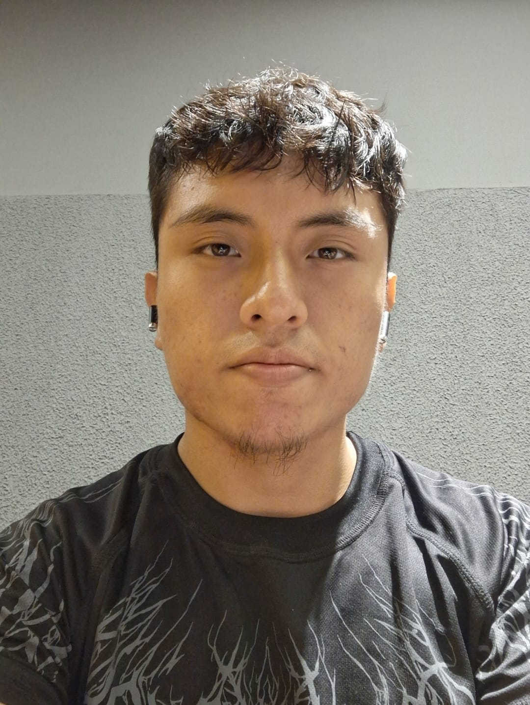</td>
    </tr>
  </tbody>
</table>

## 1.2. Solution Profile

### 1.2.1 Antecedentes y problemática

#### WHAT (Qué)

El principal problema es la falta de seguimiento preciso y continuo de la rehabilitación de fracturas de miembro superior en el domicilio del paciente, lo que genera riesgo de mala ejecución de ejercicios, recaídas, secuelas funcionales y prolongación de los tiempos de recuperación (Carbajal Galarza et al., 2021).
Muchos centros de rehabilitación en el Perú aún dependen de controles presenciales periódicos, dejando grandes lapsos de tiempo sin supervisión clínica efectiva entre sesiones, lo que limita la optimización del proceso terapéutico (MINSA, 2025b).

#### WHEN (Cuándo)

El problema se presenta principalmente durante la fase post‑operatoria o post‑inmovilización, cuando el paciente inicia una rutina de ejercicios diarios de forma autónoma en el domicilio, muchas veces sin supervisión directa del fisioterapeuta (Carbajal Galarza et al., 2021).
Es más evidente en pacientes que requieren terapias prolongadas (semanas o meses) y que, por limitaciones de movilidad, trabajo o distancia, acuden con menor frecuencia a los centros de rehabilitación, incrementando la probabilidad de técnicas incorrectas o de abandono parcial de la rutina (Andina, 2023).
El Instituto Nacional de Rehabilitación indica que el seguimiento del dolor, la inflamación y la progresión de los arcos de movilidad es crítico durante los primeros meses posteriores a la lesión, casi en forma continua, pero se pierde el control cuando el paciente no está en la clínica (INR, 2025).

#### WHERE (Dónde)

La problemática surge sobre todo en los hogares de los pacientes, especialmente en entornos urbanos como Lima Metropolitana, donde las barreras arquitectónicas y los tiempos de traslado dificultan la asistencia presencial frecuente a centros de rehabilitación (MVCS, 2022).
El problema también se origina en la brecha entre el instrumental clínico (goniómetros, plataformas de evaluación funcional) y el entorno domiciliario, donde la medición del movimiento se vuelve subjetiva o inexistente (León, 2023).
Además, la creciente demanda de telerehabilitación en el país muestra que más de 3 000 sesiones de terapia física se han realizado de forma remota en 2023 mediante el Centro Nacional de Telemedicina, evidenciando que la atención a distancia ya es un canal relevante pero aún sin sistemas de monitoreo biomecánico en tiempo real (Fernandez Agurto et al., 2025).

#### WHO (Quién)

El problema afecta principalmente a pacientes con lesiones de miembro superior que requieren rehabilitación prolongada, así como a fisioterapeutas que deben tomar decisiones clínicas sin datos objetivos entre sesiones presenciales. Según el MINSA (2019), en el Perú existen alrededor de 900 000 personas que presentan limitaciones de movilidad para usar brazos o piernas, lo que evidencia un grupo poblacional significativo que se vería beneficiado por sistemas de monitoreo remoto y estructurado.
Además, según Arias Tolentino (2022), las fracturas de extremidades son muy frecuentes en el Perú y representan más de la mitad de los pacientes con trauma, lo que implica que una alta proporción de rehabilitados requiere manejo cuidadoso de la función del miembro superior.

#### WHY (Por qué)

El problema se origina en la limitada adopción de tecnologías IoT y soluciones de telerehabilitación en el sistema de salud peruano, tanto público como privado, para el seguimiento continuo de la rehabilitación. Además, la falta de metodologías híbridas que integren de forma robusta la atención presencial con el monitoreo remoto hace que muchos programas dependan de reportes verbales o autoinformes del paciente, lo que reduce la precisión y la posibilidad de ajustar de forma oportuna la terapia (Carbajal Galarza et al., 2021).

#### HOW (Cómo)

El problema se diferencia del estado óptimo porque, en la práctica, la información sobre la rehabilitación domiciliaria se basa en la subjetividad del paciente, sin medición objetiva de rangos de movimiento, velocidad, repetición o patrones compensatorios (Carbajal Galarza et al., 2021).
Según explica Castro Villanueva (2023), el uso de sensores de carga y movimiento mejora de forma significativa la adherencia y la ejecución correcta de los ejercicios, lo que contrasta con la tendencia actual de sobrecargar el hombro o compensar movimientos de codo.
La tendencia no es aleatoria: se repite de forma sistemática en cada paciente que inicia una fase de rehabilitación domiciliaria prolongada sin herramientas de retroalimentación en tiempo real ni supervisión clínica continua (INR, 2025)

#### HOW MUCH (Cuánto)

El MINSA (2019) estima que más de 900 mil peruanos presentan limitaciones permanentes para mover brazos o piernas, lo que implica que una proporción importante de la población podría requerir rehabilitación de miembro superior y, por ende, seguimiento domiciliario.
A nivel macro, el sector de rehabilitación en Perú atiende cientos de miles de terapias al año, con un 68% de las atenciones cubiertas por el Seguro Integral de Salud, lo que refleja un volumen alto de pacientes que podrían beneficiarse de un sistema de seguimiento continuo (MINSA, 2025b).
En el caso de fracturas de extremidades, el INR (2020) señala que la rehabilitación debe ser continua y supervisada durante semanas o meses, lo que, a nivel de semanas por paciente, se traduce en cientos de miles de sesiones de ejercicio en casa que hoy se realizan sin medición objetiva ni registro centralizado.
Económicamente, una sesión de terapia individual cuesta entre S/ 100 y S/ 200 (Fisiofix, 2025). El incumplimiento de la terapia por falta de supervisión puede duplicar el tiempo de recuperación, incrementando los costos familiares en miles de soles anuales por complicaciones médicas mayores.

### 1.2.2 Lean UX Process

El Lean UX Process es una metodología ágil que prioriza el aprendizaje validado y la colaboración multidisciplinaria sobre la documentación exhaustiva. En el desarrollo de uFlex, aplicamos este enfoque para iterar rápidamente sobre la integración de hardware IoT y software, centrando el diseño en la reducción de la incertidumbre clínica y operativa mediante ciclos continuos de retroalimentación entre el paciente y el especialista.

#### 1.2.2.1. Lean UX Problem Statements

Nuestro servicio tiene como objetivo ofrecer un ecosistema de gestión y acompañamiento para la rehabilitación física traumatológica, permitiendo que las clínicas especializadas y sus pacientes mantengan una continuidad terapéutica eficiente fuera del entorno hospitalario. A través de nuestra plataforma, buscamos que los especialistas puedan supervisar el progreso biomecánico de sus pacientes de forma remota, asegurando que se cumplan los protocolos de recuperación establecidos para el miembro superior.
Hemos observado que un factor crítico que afecta el éxito de la rehabilitación y la eficiencia operativa de los centros de salud es la falta de datos objetivos y supervisión técnica durante los ejercicios realizados en el domicilio. Actualmente, existe una alta tasa de abandono de la terapia y una incidencia significativa de recuperaciones incompletas o erróneas, debido a que la información sobre el progreso del paciente se basa exclusivamente en reportes subjetivos y evaluaciones presenciales esporádicas. Esto impide que el tratamiento sea dinámico y preciso, generando incertidumbre tanto en el personal médico como en el usuario final.
¿Cómo podríamos mejorar la trazabilidad y la eficacia de las terapias remotas de miembro superior, logrando que los centros de salud y los pacientes cumplan sus objetivos de recuperación de manera informada y satisfactoria?

##### Domain:
La telerehabilitación y el monitoreo biomecánico remoto en el sector de medicina física y traumatología en el Perú.

##### Customer Segments:
- Administradores de Centros de Salud: Buscan optimizar la gestión de pacientes y la rentabilidad del servicio de terapia física.

- Fisioterapeutas: Requieren herramientas de seguimiento para validar y ajustar los protocolos de ejercicio basados en la evolución real.

- Pacientes en Rehabilitación: Personas con lesiones de codo o muñeca que necesitan guía y validación constante en sus hogares.

##### Pain Points:

- Incertidumbre Clínica: Desconocimiento de los rangos de movimiento reales alcanzados por el paciente en casa.

- Baja Adherencia: Desmotivación del paciente al no percibir un progreso medible o supervisado.

- Ineficiencia Operativa: Pérdida de tiempo en citas presenciales destinadas solo a verificar si el paciente realizó sus ejercicios básicos.

- Riesgo de Secuelas: Ejecución de movimientos compensatorios lesivos que no son detectados a tiempo.

##### Gap:

Existe una desconexión entre la prescripción médica en el consultorio y la ejecución física en el hogar, debido a la carencia de un sistema que capture e integre métricas articulares precisas en una plataforma de gestión centralizada.

##### Vision/Strategy:

Desarrollar una solución integral de monitoreo que combine tecnología de captura de movimiento con una plataforma de gestión multitenant. El enfoque estratégico es transformar la rehabilitación pasiva en un proceso basado en datos, donde la clínica mantenga el control operativo y el paciente reciba retroalimentación constante sobre su desempeño biomecánico.

##### Initial Segment:

Centros de rehabilitación física y clínicas traumatológicas privadas en Lima Metropolitana que ofrecen servicios de terapia ambulatoria para lesiones de miembro superior.

#### 1.2.2.2. Lean UX Assumptions

##### Business Assumptions

- Creo que mis clientes necesitan una forma de garantizar que la rehabilitación remota sea tan efectiva como la presencial, basándose en datos reales y no en suposiciones.

- Estas necesidades se pueden resolver con un ecosistema IoT reconfigurable de sensores sincronizado con una plataforma SaaS de gestión clínica.

- Mis clientes iniciales serán clínicas de fisioterapia y traumatología privadas en Lima que atienden a pacientes de los niveles socioeconómicos A y B.

- El valor #1 que un cliente quiere de mi servicio es la seguridad de una recuperación exitosa en menor tiempo gracias a la trazabilidad del movimiento.

- El cliente también puede obtener estos beneficios adicionales como reducción de costos de traslado, mayor disponibilidad de horarios para citas y una base de datos histórica de su evolución.

- Voy a adquirir la mayoría de mis clientes a través de venta directa B2B a directores de clínicas y marketing digital segmentado para centros de salud especializados.

- Haré dinero a través de un modelo híbrido de pago por kit de hardware (One-time fee) y una suscripción mensual por el uso del software SaaS (Fee por paciente activo).

- Mi competencia principal en el mercado serán centros de terapia física que usan métodos tradicionales (papel/video) y aplicaciones genéricas de fitness sin hardware especializado.

- Los venceremos debido a la precisión biomecánica de nuestros sensores vestibles y la capacidad de la clínica de autogestionar su propio ecosistema de datos.

- Mi mayor riesgo de producto es la resistencia al cambio por parte de fisioterapeutas tradicionales y la posible dificultad de algunos pacientes para configurar el hardware IoT.

- Resolveremos esto a través de un diseño Plug-and-Play simplificado, videos tutoriales integrados en la app y un soporte técnico especializado para la clínica.

##### User Assumptions

- ¿Quién es el usuario? Pacientes de 18 a 65 años con lesiones de miembro superior, fisioterapeutas (especialista clínico) y administradores de clínicas.

- ¿Dónde encaja nuestro producto en su trabajo o vida? En el caso del paciente, encaja en su rutina diaria de ejercicios en el hogar. Para el fisioterapeuta, en su flujo de supervisión y toma de decisiones clínicas asíncronas. Para el administrador, en el control de activos y rentabilidad del centro.

- ¿Qué problemas resuelve nuestro producto? Resuelve la falta de precisión en la medición de ángulos articulares fuera del consultorio, el miedo del paciente a realizar ejercicios incorrectos y la pérdida de ingresos de las clínicas por deserción de pacientes en tratamiento remoto.

- ¿Cuándo y cómo es usado nuestro producto? El hardware se usa durante las sesiones de ejercicio (20-40 min diarios). La aplicación móvil se usa para dar feedback en tiempo real y la aplicación web es consultada por el médico periódicamente para auditar el progreso.

- ¿Qué características son importantes? La precisión de los sensores (tolerancia de error < 5%), la facilidad de emparejamiento Bluetooth y la visualización de gráficos comparativos.

- ¿Cómo debe verse nuestro producto y cómo comportarse? La aplicación móvil debe ser intuitiva, con elementos visuales claros (gamificación) para guiar el movimiento. La aplicación debe ser profesional, de alta densidad de datos pero fácil de navegar.

#### 1.2.2.3. Lean UX Hypothesis Statements

##### Business Hypothesis Statement

- Hypothesis 01:
Creemos que el desarrollo de una plataforma SaaS multitenant con hardware IoT reconfigurable para clínicas de traumatología logrará que los centros de salud reduzcan su tasa de deserción de pacientes en un 25% y optimicen el tiempo de consulta de sus especialistas.
Sabremos que hemos tenido éxito cuando veamos que al menos 5 clínicas locales solicitan una demostración del sistema y recibamos reportes mensuales de un incremento en la retención de pacientes que iniciaron su terapia remota con uFlex.

##### Features Hypothesis Statement

- Hypothesis 02:
Creemos que proporcionar una aplicación web con dashboard y gráficos de ángulos articulares (ROM) capturados por sensores inerciales permitirá que los fisioterapeutas realicen ajustes precisos en los protocolos de ejercicio sin necesidad de una cita presencial semanal.
Sabremos que esto es cierto cuando veamos que el 80% de los especialistas encuestados afirman tener mayor confianza en la toma de decisiones clínicas y se registre una reducción del 30% en el tiempo promedio de evaluación manual con goniómetro en el consultorio.

- Hypothesis 03:
Creemos que la implementación de feedback visual en tiempo real y elementos de gamificación en la aplicación móvil logrará que los pacientes con fracturas de codo o muñeca realicen sus rutinas de ejercicio de manera autónoma y correcta.
Sabremos que esto es cierto cuando veamos que los logs del sistema muestran que el 90% de los pacientes completan sus repeticiones diarias dentro de los rangos de movimiento permitidos, reduciendo la percepción de dolor reportada en la aplicación en un 15% tras las primeras dos semanas.

- Hypothesis 04:
Creemos que el sistema de aprovisionamiento automático de dispositivos (ID de kit vinculado a la clínica) facilitará la escalabilidad del negocio de la startup y la gestión de inventario para el administrador de la clínica.
Sabremos que esto es cierto cuando veamos que el tiempo de configuración inicial (onboarding) de un nuevo kit IoT por parte del administrador es menor a 5 minutos y no se reportan incidencias de vinculación manual entre el sensor y la cuenta del paciente.

#### 1.2.2.4. Lean UX Canvas

A continuación, se presenta el Lean UX Canvas elaborado en la herramienta Miro:

Enlace al Lean UX Canvas:
https://miro.com/app/board/uXjVGuekPgY=/?share_link_id=263966947817 

## 1.3. Segmentos objetivo

En el análisis de los segmentos objetivo de KinIoT, hemos identificado tres grupos clave que conforman el ecosistema de uFlex: pacientes en rehabilitación, especialistas en fisioterapia y administradores de centros de salud.

### Pacientes en rehabilitación de miembro superior

Este segmento integra a personas que han sufrido lesiones traumáticas como fracturas de codo o muñeca y requieren recuperar la funcionalidad del miembro superior, constituyendo el usuario final que interactúa con el hardware IoT y la aplicación móvil.

La mayoría se encuentra en el rango de adultos económicamente activos con acceso frecuente a Internet y smartphones, lo que valida la viabilidad de una solución basada en app móvil y conectividad Bluetooth para el hogar (INEI, 2025; OSIPTEL, 2024).

- **Edad:** Adultos de 18 a 65 años, con énfasis en población activa y adultos mayores con riesgo de caídas y fracturas (INEI, 2022).
- **Necesidad clave:** Guía técnica precisa y retroalimentación inmediata para realizar ejercicios correctamente en casa, reduciendo el miedo al movimiento (kinesiofobia) y evitando compensaciones biomecánicas.
- **Nivel educativo:** Grado de instrucción variado, capaz de seguir instrucciones visuales y auditivas sin requerir altos niveles de formación técnica.
- **Uso de tecnología:** Usuarios habituales de smartphones, con alto uso de dispositivos móviles en el hogar, que prefieren interfaces simplificadas y tecnologías de conexión plug‑and‑play (INEI, 2025; OSIPTEL, 2024).

### Fisioterapeutas y especialistas en rehabilitación

Los fisioterapeutas y especialistas en rehabilitación son los usuarios operativos que toman decisiones clínicas basadas en los datos capturados por el sistema, ajustando protocolos de tratamiento entre sesiones presenciales (Rosales et al., 2023). La creciente demanda de atención y la expansión de la telemedicina en el Perú refuerzan la necesidad de herramientas de telemonitorización que permitan supervisar el progreso del paciente de forma objetiva (MINSA, 2025).

- **Edad:** Profesionales de 24 a 55 años, con formación en Tecnología Médica, Terapia Física y Rehabilitación (Rosales et al., 2023).
- **Necesidad clave:** Obtener métricas objetivas (ángulos de ROM, simetría de movimientos, número de repeticiones correctas) para ajustar protocolos y reducir complicaciones.
- **Nivel educativo:** Formación universitaria en salud y rehabilitación, con alta familiaridad con el manejo de información clínica.
- **Uso de tecnología:** Manejo intermedio de plataformas digitales de gestión clínica, con preferencia por dashboards intuitivos y reportes exportables, ya que según estudios en Lima Metropolitana, alrededor de la mitad no adoptó la práctica digital durante la pandemia sin suficiente apoyo institucional (Rosales et al., 2023).

### Administradores de clínicas y centros de salud

Este segmento agrupa a los tomadores de decisiones B2B que gestionan la operación y la rentabilidad de clínicas y centros de salud privados, encargados de la adopción de soluciones tecnológicas como sistemas IoT y SaaS (MINSA, 2025a). La consolidación de la telemedicina y la alta penetración de dispositivos móviles en el hogar peruano respaldan la viabilidad económica de sistemas de monitoreo remoto para mejorar la retención de pacientes y la eficiencia operativa (INEI, 2025; OSIPTEL, 2024).

- **Edad:** Profesionales de 30 a 60 años, con formación en Administración de Salud, Gestión Empresarial o Medicina.
- **Necesidad clave:** Reducir la tasa de abandono de tratamientos, aumentar la productividad del personal clínico y gestionar eficientemente el inventario de equipos tecnológicos.
- **Nivel educativo:** Formación superior en administración, gestión o área clínica, con experiencia en toma de decisiones estratégicas.
- **Uso de tecnología:** Interés en soluciones SaaS multi‑tenant que permitan controlar múltiples sedes y cuentas de usuario desde una sola consola, alineándose con la tendencia de digitalización del sistema de salud peruano (MINSA, 2025a; INEI, 2025).

# Capítulo II: Requirements Elicitation & Analysis

## 2.1. Competidores

### 2.1.1. Análisis competitivo

<table>
  <tr>
    <th colspan="6">Competitive Analysis landscape</th>
  </tr>
  <tr>
    <td colspan="2" align="center"><b>¿Por qué llevar a cabo este análisis?</b></td>
    <td colspan="4">¿De qué manera puede KinIoT diferenciarse de las soluciones de rehabilitación digital actuales mediante el uso de tecnología IoT para capturar datos cuantitativos precisos, superando las barreras de alto costo y falta de biofeedback en tiempo real que presentan los competidores en el mercado peruano?</td>
  </tr>
  <tr>
    <th colspan="2">Nombre</th>
    <th>KinIoT</th>
    <th>Sword Health</th>
    <th>Hinge Health</th>
    <th>Physitrack</th>
  </tr>
  <tr>
    <td colspan="2" align="center"><b>Logo</b></td>
    <td align="center"></td>
    <td align="center"></td>
    <td align="center"></td>
    <td align="center"></td>
  </tr>
  <tr>
    <td rowspan="2"><b>Perfil</b></td>
    <td><b>Overview</b></td>
    <td>Ecosistema IoT y SaaS para telerehabilitación con monitoreo biomecánico en tiempo real</td>
    <td>Líder global en terapia física digital con sensores de grado clínico y supervisión médica</td>
    <td>Clínica digital integral que usa sensores y visión computarizada para el cuidado articular</td>
    <td>Plataforma SaaS global para prescripción de ejercicios y seguimiento de resultados mediante video</td>
  </tr>
  <tr>
    <td><b>Ventaja competitiva ¿Qué valor ofrece a los clientes?</b></td>
    <td>Monitoreo cuantitativo preciso mediante sensores físicos a un costo accesible para el mercado local</td>
    <td>IA avanzada y sensores de alta fidelidad con validación clínica masiva en mercados premium</td>
    <td>Ecosistema híbrido que combina sensores físicos con visión artificial "TrueMotion"</td>
    <td>Marca establecida con una de las bibliotecas de ejercicios clínicos más grandes del mundo</td>
  </tr>
  <tr>
    <td rowspan="2"><b>Perfil de Marketing</b></td>
    <td><b>Mercado objetivo</b></td>
    <td>Centros de salud, Fisioterapeutas y pacientes con lesiones de miembro superior.</td>
    <td>Grandes corporaciones y planes de salud empresariales en EE. UU. y Europa</td>
    <td>Empleadores y planes de salud que buscan reducir costos por cirugías innecesarias</td>
    <td>Fisioterapeutas independientes y clínicas de tamaño medio a nivel global</td>
  </tr>
  <tr>
    <td><b>Estrategias de Marketing</b></td>
    <td>B2B enfocado en reducir la deserción y optimizar el tiempo de evaluación manual.</td>
    <td>Enfoque en el ahorro de costos para empleadores al evitar cirugías innecesarias</td>
    <td>Marketing basado en la reducción del dolor crónico y programas preventivos corporativos</td>
    <td>Marketing digital masivo y alianzas con asociaciones profesionales de fisioterapia</td>
  </tr>
  <tr>
    <td rowspan="3"><b>Perfil de Producto</b></td>
    <td><b>Productos &amp; Servicios</b></td>
    <td>Kinetic Track: Nodos vestibles (IoT) + App móvil con gamificación + Dashboard Web.</td>
    <td>Plataforma de "Terapeuta Digital", sensores propios y programas especializados como Bloom</td>
    <td>Sensores de movimiento, programas de coaching de salud y visión computarizada</td>
    <td>Aplicación para prescripción de ejercicios, telemedicina y seguimiento de adherencia</td>
  </tr>
  <tr>
    <td><b>Precios y Costos</b></td>
    <td>Pago por kit de hardware + Suscripción mensual por paciente activo (SaaS)</td>
    <td>Modelo de precios premium orientado a contratos corporativos de alto volumen</td>
    <td>Modelo de suscripción B2B de alto nivel para grandes beneficios corporativos</td>
    <td>Suscripción de bajo costo por profesional de la salud.</td>
  </tr>
  <tr>
    <td><b>Canales de distribución</b></td>
    <td>Web para especialistas y Administradores; App Móvil para pacientes.</td>
    <td>Ecosistema cerrado de Hardware, Tablet y Aplicaciones Móviles</td>
    <td>Aplicaciones móviles integradas con hardware y cámara</td>
    <td>Aplicaciones Web y Móviles multiplataforma</td>
  </tr>
  <tr>
    <td rowspan="4"><b>Análisis SWOT</b></td>
    <td><b>Fortalezas</b></td>
    <td>Captura de datos biomecánicos precisos que elimina la subjetividad clínica y enfoque específico en lesiones de miembro superior, permitiendo algoritmos más exactos</td>
    <td>Capital masivo, algoritmos de IA de vanguardia y validación clínica de nivel superior</td>
    <td>Utiliza una combinación avanzada de sensores vestibles y visión computarizada a través de la cámara del smartphone para corregir la postura en tiempo real</td>
    <td>Gran base de usuarios instalada y reconocimiento de marca global</td>
  </tr>
  <tr>
    <td><b>Oportunidades</b></td>
    <td>Alta penetración de smartphones y demanda de telemedicina en el hogar peruano</td>
    <td>Expansión a Latinoamérica mediante alianzas con aseguradoras globales.</td>
    <td>Aunque domina el mercado estadounidense, tiene una gran oportunidad de crecimiento en regiones como Latinoamérica</td>
    <td>Integrar visión computarizada para actualizar su propuesta tecnológica</td>
  </tr>
  <tr>
    <td><b>Debilidades</b></td>
    <td>Marca nueva en el mercado sin historial extenso de datos clínicos acumulados</td>
    <td>Precio prohibitivo para el mercado de clínicas pequeñas (MYPES) en regiones emergentes como Perú</td>
    <td>Su modelo de negocio está diseñado para grandes corporaciones (B2B), lo que resulta económicamente inviable para clínicas pequeñas o independientes</td>
    <td>Carece de herramientas de biofeedback en tiempo real o sensores de movimiento</td>
  </tr>
  <tr>
    <td><b>Amenazas</b></td>
    <td>Resistencia al cambio por parte de fisioterapeutas con métodos tradicionales analógicos</td>
    <td>Competencia agresiva de Hinge Health en el sector corporativo</td>
    <td>Usuarios que requieran mayor precisión clínica (IoT) para patologías complejas</td>
    <td>El surgimiento de sensores IoT de bajo costo y alta precisión que pueden democratizar el acceso a la tecnología que antes eran exclusivas</td>
  </tr>
</table>

### 2.1.2. Estrategias y tácticas frente a competidores

En esta sección se detallan las estrategias y tácticas que KinIoT aplicará para establecer una ventaja competitiva en el sector de la telerehabilitación biomecánica.

**Estrategias para afrontar las fortalezas de los competidores**

- **Diferenciación por Precisión Articular Específica:** Para enfrentar la fortaleza de Hinge Health y su tecnología de visión artificial, KinIoT aplicará la táctica de "Validación Biomecánica por Sensores Inerciales". Dado que la visión por cámara puede perder precisión ante oclusiones físicas, nuestros sensores físicos garantizan una captura de datos del Rango de Movimiento (ROM) con un margen de error menor al 5%, lo cual es fundamental para la rehabilitación de codo y muñeca.

- **Estrategia de Accesibilidad B2B Local:** Ante el dominio de Sword Health en mercados corporativos de alto nivel, implementaremos una táctica de "Aprovisionamiento de Bajo Costo para MYPES". Nos enfocaremos en clínicas privadas de Lima Metropolitana ofreciendo un modelo de pago por kit de hardware y una suscripción SaaS escalable, permitiendo que centros locales adopten tecnología de punta sin la inversión prohibitiva de los competidores globales.

**Estrategias para aprovechar las debilidades de los competidores**

- **Táctica de Biofeedback Activo en Tiempo Real:** Aprovecharemos la debilidad de Physitrack, que se limita al seguimiento pasivo basado en videos, mediante la implementación de corrección postural inmediata. La aplicación móvil de Kinetic Track proporcionará alertas visuales y gamificadas que guiarán al paciente durante la ejecución del ejercicio, asegurando que se cumplan los protocolos terapéuticos y reduciendo el riesgo de movimientos compensatorios lesivos.

- **Estrategia de Fidelización basada en Datos Objetivos:** Capitalizaremos la falta de métricas cuantitativas en las terapias tradicionales para ofrecer a los fisioterapeutas un dashboard de alta densidad de datos. Esto les permitirá ajustar los planes de tratamiento basados en evidencia clínica real, mejorando la adherencia del paciente y reduciendo la tasa de deserción que afecta la rentabilidad de las clínicas.

**Contexto de Oportunidades y Amenazas**

- **Oportunidades:** Aprovecharemos la alta penetración de smartphones en los hogares peruanos (94.8%) y el crecimiento de las atenciones por telemedicina (más de 3.4 millones recientemente) para posicionar la telerehabilitación como un estándar accesible.

- **Amenazas:** Para mitigar la resistencia al cambio de los especialistas tradicionales, se aplicará una táctica de "Onboarding y Soporte Especializado", demostrando mediante informes automáticos cómo nuestra herramienta reduce en un 30% el tiempo de evaluación manual en el consultorio.

## 2.2. Entrevistas

### 2.2.1. Diseño de entrevistas

**Segmento 1: Administradores de Clínicas y Centros de Salud**

**Preguntas de contexto y perfil (1-3)**

1. ¿Cuál es su nombre, edad y en qué distrito vive actualmente?
   - ¿Con quién vive? ¿Tiene pareja o hijos?
   - ¿Cuál es su formación académica y cuántos años lleva trabajando en administración de salud?

2. ¿Cómo está organizado el centro donde trabaja? ¿Cuántas sedes o especialistas tiene a cargo y cuántos pacientes atienden aproximadamente al mes?
3. ¿Qué herramientas o sistemas utiliza actualmente para gestionar el seguimiento de pacientes y la operación del centro?

**Preguntas sobre la problemática (4-8)**

4. ¿Cuáles son los procesos que más le consumen tiempo o que le resultan más difíciles de controlar en la operación diaria?
5. ¿Han tenido casos de pacientes que abandonan su tratamiento de rehabilitación antes de completarlo?
6. ¿Cómo realizan actualmente el seguimiento de un paciente durante el tiempo que está en casa, entre una sesión presencial y otra?
7. ¿Qué tan fácil o difícil es para usted saber si los fisioterapeutas están siendo productivos y si los pacientes están progresando correctamente?
8. ¿Han implementado alguna tecnología nueva en el centro anteriormente?

**Preguntas de perfil digital y objetivos (9-10)**

9. ¿Qué dispositivos usa más en su trabajo diario y cómo prefiere acceder a información del centro: laptop, tablet o celular?
10. ¿Cuáles son sus principales objetivos para el centro en términos de crecimiento, retención de pacientes o mejora de la calidad del servicio?

**Preguntas de validación de solución (11-12)**

11. Si pudiera monitorear en tiempo real cómo sus pacientes realizan los ejercicios en casa —con datos precisos de movimiento y alertas automáticas para sus especialistas— ¿qué impacto tendría eso en su servicio y en el negocio?
12. ¿Qué factores priorizaría al decidir adoptar una nueva plataforma tecnológica en su centro? (costo, facilidad de uso, soporte técnico, integración con sistemas actuales, tiempo de implementación)

**Segmento 2: Fisioterapeutas y Especialistas en Rehabilitación**

**Preguntas de contexto y perfil (1-3)**

1. ¿Cuál es su nombre, edad y en qué distrito vive actualmente?
   - ¿Con quién vive? ¿Tiene pareja o hijos?
   - ¿Cuál es su especialidad y cuántos años lleva ejerciendo como fisioterapeuta?

2. ¿Cómo es el entorno donde trabaja? ¿Ejerce en una clínica, centro de rehabilitación, de forma independiente o en varios lugares?
3. ¿Qué herramientas o métodos utiliza actualmente para registrar el progreso de sus pacientes y planificar sus sesiones?

**Preguntas sobre la problemática (4-8)**

4. ¿Cuáles son los mayores desafíos que enfrenta al hacer seguimiento del progreso de un paciente entre una sesión presencial y otra?
5. ¿Cómo sabe si un paciente está realizando correctamente los ejercicios en casa? ¿Qué pasa cuando no lo hace bien?
6. ¿Ha tenido pacientes que abandonan el tratamiento antes de completarlo? ¿Qué cree que lo provoca?
7. ¿Qué información le resulta más difícil de obtener para ajustar el protocolo de ejercicios de un paciente?
8. ¿Cómo se comunica habitualmente con sus pacientes fuera de las sesiones presenciales?

**Preguntas de perfil digital y objetivos (9-10)**

9. ¿Qué dispositivos usa más en su práctica diaria: laptop, tablet o celular? ¿Utiliza alguna app o plataforma digital actualmente?
10. ¿Cuál es su mayor objetivo profesional en este momento? ¿Qué le haría sentir que está brindando la mejor atención posible a sus pacientes?

**Preguntas de validación de solución (11-12)**

11. Si tuviera acceso a datos en tiempo real sobre los movimientos de su paciente durante sus ejercicios en casa —ángulos articulares, repeticiones, alertas de mala ejecución— ¿cómo cambiaría su forma de trabajar?
12. ¿Qué tan importante es para usted que una herramienta digital sea fácil de usar y no interrumpa su flujo de trabajo clínico?

**Segmento 3: Pacientes en Rehabilitación de Miembro Superior**

**Preguntas de contexto y perfil (1-3)**

1. ¿Cuál es su nombre, edad y en qué distrito vive actualmente?
   - ¿Con quién vive? ¿Tiene pareja o hijos?
   - ¿A qué se dedica actualmente? ¿Trabaja, estudia o ambas?

2. ¿Podría contarme brevemente sobre su lesión? ¿Qué le ocurrió y cuánto tiempo lleva en proceso de rehabilitación?
3. ¿Cómo está siendo su experiencia de rehabilitación hasta ahora? ¿Va al centro de salud con frecuencia o realiza la mayoría de ejercicios en casa?

**Preguntas sobre la problemática (4-8)**

4. ¿Cómo realiza sus ejercicios de rehabilitación en casa? ¿Alguien le supervisa o los hace solo?
5. ¿Qué tan seguro se siente al hacer los ejercicios en casa? ¿Ha tenido dudas sobre si los está haciendo correctamente?
6. ¿Qué dificultades ha encontrado durante su proceso de rehabilitación, tanto dentro como fuera del centro de salud?
7. ¿Cómo se comunica con su fisioterapeuta fuera de las sesiones cuando tiene dudas o inconvenientes?
8. ¿Ha sentido en algún momento que su progreso se estanca o que no sabe si está mejorando?

**Preguntas de perfil digital y objetivos (9-10)**

9. ¿Qué dispositivos usa con más frecuencia en su día a día: celular, tablet o computadora? ¿Qué aplicaciones utiliza habitualmente?
10. ¿Cuál es su principal motivación para completar su rehabilitación? ¿Qué espera poder hacer cuando se recupere?

**Preguntas de validación de solución (11-12)**

11. Si existiera un dispositivo que midiera con precisión sus movimientos durante los ejercicios en casa y le indicara en tiempo real si los está haciendo bien, ¿lo usaría?
12. ¿Qué tan importante es para usted que una herramienta así sea fácil de colocar y usar sin ayuda de otra persona?

### 2.2.2. Registro de entrevistas

**Segmento Administrativos: Entrevistado 1**

| Atributo                | Detalle                                                                                                                                                                                                                                                                                                                                                                                                                                                                                                                                                                                                                                       |
|-------------------------|-----------------------------------------------------------------------------------------------------------------------------------------------------------------------------------------------------------------------------------------------------------------------------------------------------------------------------------------------------------------------------------------------------------------------------------------------------------------------------------------------------------------------------------------------------------------------------------------------------------------------------------------------|
| **Nombre**              | Carlos Vega                                                                                                                                                                                                                                                                                                                                                                                                                                                                                                                                                                                                                                   |
| **Edad**                | 45                                                                                                                                                                                                                                                                                                                                                                                                                                                                                                                                                                                                                                            |
| **Sexo**                | Masculino                                                                                                                                                                                                                                                                                                                                                                                                                                                                                                                                                                                                                                     |
| **Distrito**            | Miraflores                                                                                                                                                                                                                                                                                                                                                                                                                                                                                                                                                                                                                                    |
| **Ocupación**           | Administrador principal en centro de salud                                                                                                                                                                                                                                                                                                                                                                                                                                                                                                                                                                                                    |
| **Fecha de entrevista** | 2026-04-11                                                                                                                                                                                                                                                                                                                                                                                                                                                                                                                                                                                                                                    |
| **Timing**              | 00:00 - 03:40                                                                                                                                                                                                                                                                                                                                                                                                                                                                                                                                                                                                                                 |
| **Video**               | [Ver en Microsoft Stream](https://upcedupe-my.sharepoint.com/:v:/g/personal/u20201e843_upc_edu_pe/IQBi9_cKZMuRQaK0-UbxF7MIAZnukHun0vDhy1qki_eRsUs?nav=eyJyZWZlcnJhbEluZm8iOnsicmVmZXJyYWxBcHAiOiJPbmVEcml2ZUZvckJ1c2luZXNzIiwicmVmZXJyYWxBcHBQbGF0Zm9ybSI6IldlYiIsInJlZmVycmFsTW9kZSI6InZpZXciLCJyZWZlcnJhbFZpZXciOiJNeUZpbGVzTGlua0NvcHkifX0&e=JVqpgO)                                                                                                                                                                                                                                                                                       |
| **Captura**             | 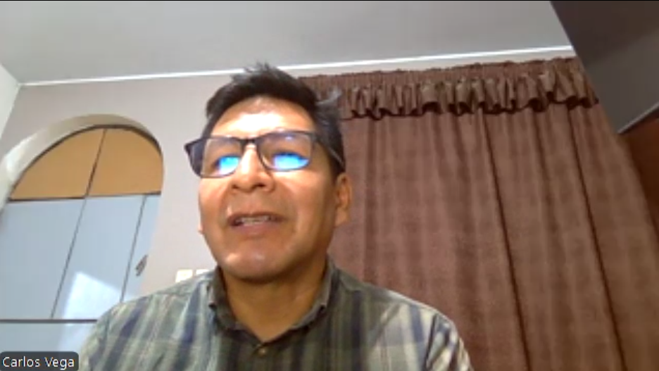                                                                                                                                                                                                                                                                                                                                                                                                                                                                                                                                                     |
| **Resumen**             | Carlos cuenta con 10 años de experiencia, cuya gestión se ve limitada por procesos operativos fragmentados y una alta tasa de deserción de pacientes tras las primeras semanas de tratamiento. Actualmente, enfrenta dificultades para estandarizar la atención debido a la falta de automatización y a la ausencia de visibilidad sobre el progreso clínico fuera de las instalaciones. Busca implementar una solución tecnológica que le permita monitorear objetivamente los resultados para mejorar la retención, optimizar la rentabilidad del centro y ofrecer un servicio diferenciado y basado en datos medibles ante la competencia. |

**Segmento Administrativos: Entrevistado 2**

| Atributo                | Detalle                                                                                                                                                                                                                                                                                                                                                                                                                                                                                                                                                                                                                                                                            |
|-------------------------|------------------------------------------------------------------------------------------------------------------------------------------------------------------------------------------------------------------------------------------------------------------------------------------------------------------------------------------------------------------------------------------------------------------------------------------------------------------------------------------------------------------------------------------------------------------------------------------------------------------------------------------------------------------------------------|
| **Nombre**              | Ricardo Méndez                                                                                                                                                                                                                                                                                                                                                                                                                                                                                                                                                                                                                                                                     |
| **Edad**                | 30                                                                                                                                                                                                                                                                                                                                                                                                                                                                                                                                                                                                                                                                                 |
| **Sexo**                | Masculino                                                                                                                                                                                                                                                                                                                                                                                                                                                                                                                                                                                                                                                                          |
| **Distrito**            | Miraflores                                                                                                                                                                                                                                                                                                                                                                                                                                                                                                                                                                                                                                                                         |
| **Ocupación**           | Administrador de clínicas y centros de rehabilitación                                                                                                                                                                                                                                                                                                                                                                                                                                                                                                                                                                                                                              |
| **Fecha de entrevista** | 2026-04-15                                                                                                                                                                                                                                                                                                                                                                                                                                                                                                                                                                                                                                                                         |
| **Timing**              | 03:40 - 13:00                                                                                                                                                                                                                                                                                                                                                                                                                                                                                                                                                                                                                                                                      |
| **Video**               | [Ver en Microsoft Stream](https://upcedupe-my.sharepoint.com/:v:/g/personal/u20201e843_upc_edu_pe/IQBi9_cKZMuRQaK0-UbxF7MIAZnukHun0vDhy1qki_eRsUs?nav=eyJyZWZlcnJhbEluZm8iOnsicmVmZXJyYWxBcHAiOiJPbmVEcml2ZUZvckJ1c2luZXNzIiwicmVmZXJyYWxBcHBQbGF0Zm9ybSI6IldlYiIsInJlZmVycmFsTW9kZSI6InZpZXciLCJyZWZlcnJhbFZpZXciOiJNeUZpbGVzTGlua0NvcHkifX0&e=JVqpgO)                                                                                                                                                                                                                                                                                                                            |
| **Captura**             |                                                                                                                                                                                                                                                                                                                                                                                                                                                                                                                                                                                          |
| **Resumen**             | Administrador con 12 años de trayectoria y un MBA en Gestión de Salud, que actualmente supervisa dos sedes y un equipo de 14 fisioterapeutas con un flujo de 600 pacientes mensuales. Su gestión se ve obstaculizada por procesos arcaicos (uso de papel y coordinación por WhatsApp) que le impiden medir la productividad del personal y el progreso real del paciente, factor que contribuye a una tasa de abandono del 20-25%. Busca una solución digital que permita el monitoreo preventivo de los pacientes en casa, priorizando ante todo la facilidad de uso y un soporte técnico sólido para asegurar la adopción inmediata de su equipo sin generar fricción operativa. |

**Segmento Administrativos: Entrevistado 3**

| Atributo                | Detalle                                                                                                                                                                                                                                                                                                                                                                                                                                                                                                                                                                                                                                                                                                                                                            |
|-------------------------|--------------------------------------------------------------------------------------------------------------------------------------------------------------------------------------------------------------------------------------------------------------------------------------------------------------------------------------------------------------------------------------------------------------------------------------------------------------------------------------------------------------------------------------------------------------------------------------------------------------------------------------------------------------------------------------------------------------------------------------------------------------------|
| **Nombre**              | Luis Torres                                                                                                                                                                                                                                                                                                                                                                                                                                                                                                                                                                                                                                                                                                                                                        |
| **Edad**                | 38                                                                                                                                                                                                                                                                                                                                                                                                                                                                                                                                                                                                                                                                                                                                                                 |
| **Sexo**                | Masculino                                                                                                                                                                                                                                                                                                                                                                                                                                                                                                                                                                                                                                                                                                                                                          |
| **Distrito**            | Chorrillos                                                                                                                                                                                                                                                                                                                                                                                                                                                                                                                                                                                                                                                                                                                                                         |
| **Ocupación**           | Fisioterapeuta y Administrador de centro de salud propio                                                                                                                                                                                                                                                                                                                                                                                                                                                                                                                                                                                                                                                                                                           |
| **Fecha de entrevista** | 2026-04-16                                                                                                                                                                                                                                                                                                                                                                                                                                                                                                                                                                                                                                                                                                                                                         |
| **Timing**              | 13:00 - 21:52                                                                                                                                                                                                                                                                                                                                                                                                                                                                                                                                                                                                                                                                                                                                                      |
| **Video**               | [Ver en Microsoft Stream](https://upcedupe-my.sharepoint.com/:v:/g/personal/u20201e843_upc_edu_pe/IQBi9_cKZMuRQaK0-UbxF7MIAZnukHun0vDhy1qki_eRsUs?nav=eyJyZWZlcnJhbEluZm8iOnsicmVmZXJyYWxBcHAiOiJPbmVEcml2ZUZvckJ1c2luZXNzIiwicmVmZXJyYWxBcHBQbGF0Zm9ybSI6IldlYiIsInJlZmVycmFsTW9kZSI6InZpZXciLCJyZWZlcnJhbFZpZXciOiJNeUZpbGVzTGlua0NvcHkifX0&e=JVqpgO)                                                                                                                                                                                                                                                                                                                                                                                                            |
| **Captura**             |                                                                                                                                                                                                                                                                                                                                                                                                                                                                                                                                                                                                                                                                             |
| **Resumen**             | Administrador con 6 años liderando su propio centro, operando con un equipo de 42 profesionales y un volumen de hasta 200 pacientes mensuales. Su gestión se basa actualmente en herramientas analógicas (cuadernos y archivos locales), lo que provoca ineficiencias críticas en la gestión de citas, altas tasas de abandono y una total carencia de métricas objetivas sobre la productividad de su personal y la evolución clínica de los pacientes. Identifica una oportunidad estratégica en la tele-rehabilitación para ofrecer un servicio "premium" y diferenciado ante la competencia, condicionando su adopción a un modelo de costo accesible, una usabilidad extrema que no sature a su personal y, crucialmente, la resistencia física del hardware. |

**Segmento Pacientes: Entrevistado 1**

| Atributo                | Detalle                                                                                                                                                                                                                                                                                                                                                                                                                                                                                                                                                                           |
|-------------------------|-----------------------------------------------------------------------------------------------------------------------------------------------------------------------------------------------------------------------------------------------------------------------------------------------------------------------------------------------------------------------------------------------------------------------------------------------------------------------------------------------------------------------------------------------------------------------------------|
| **Nombre**              | Bianca Díaz                                                                                                                                                                                                                                                                                                                                                                                                                                                                                                                                                                       |
| **Edad**                | 20                                                                                                                                                                                                                                                                                                                                                                                                                                                                                                                                                                                |
| **Sexo**                | Femenino                                                                                                                                                                                                                                                                                                                                                                                                                                                                                                                                                                          |
| **Distrito**            | San Juan de Lurigancho                                                                                                                                                                                                                                                                                                                                                                                                                                                                                                                                                            |
| **Ocupación**           | Estudiante                                                                                                                                                                                                                                                                                                                                                                                                                                                                                                                                                                        |
| **Fecha de entrevista** | 2026-04-09                                                                                                                                                                                                                                                                                                                                                                                                                                                                                                                                                                        |
| **Timing**              | 21:52 - 30:32                                                                                                                                                                                                                                                                                                                                                                                                                                                                                                                                                                     |
| **Video**               | [Ver en Microsoft Stream](https://upcedupe-my.sharepoint.com/:v:/g/personal/u20201e843_upc_edu_pe/IQBi9_cKZMuRQaK0-UbxF7MIAZnukHun0vDhy1qki_eRsUs?nav=eyJyZWZlcnJhbEluZm8iOnsicmVmZXJyYWxBcHAiOiJPbmVEcml2ZUZvckJ1c2luZXNzIiwicmVmZXJyYWxBcHBQbGF0Zm9ybSI6IldlYiIsInJlZmVycmFsTW9kZSI6InZpZXciLCJyZWZlcnJhbFZpZXciOiJNeUZpbGVzTGlua0NvcHkifX0&e=JVqpgO)                                                                                                                                                                                                                           |
| **Captura**             |                                                                                                                                                                                                                                                                                                                                                                                                                                                                                       |
| **Resumen**             | Paciente joven en proceso de rehabilitación de miembro superior que manifiesta dificultades críticas con la adherencia al tratamiento y la falta de supervisión técnica en el hogar. Su principal barrera es la incertidumbre sobre la ejecución correcta de los ejercicios, lo que genera desmotivación y sensación de estancamiento. Valora positivamente una solución que ofrezca retroalimentación técnica en tiempo real y enfatiza que la usabilidad autónoma —específicamente la facilidad de colocación y uso sin asistencia— es un factor determinante para su adopción. |

**Segmento Pacientes: Entrevistado 2**

| Atributo                | Detalle                                                                                                                                                                                                                                                                                                                                                                                                                                                                                                                                                                                                                        |
|-------------------------|--------------------------------------------------------------------------------------------------------------------------------------------------------------------------------------------------------------------------------------------------------------------------------------------------------------------------------------------------------------------------------------------------------------------------------------------------------------------------------------------------------------------------------------------------------------------------------------------------------------------------------|
| **Nombre**              | Gabriel                                                                                                                                                                                                                                                                                                                                                                                                                                                                                                                                                                                                                        |
| **Edad**                | 23                                                                                                                                                                                                                                                                                                                                                                                                                                                                                                                                                                                                                             |
| **Sexo**                | Masculino                                                                                                                                                                                                                                                                                                                                                                                                                                                                                                                                                                                                                      |
| **Distrito**            | Barranco                                                                                                                                                                                                                                                                                                                                                                                                                                                                                                                                                                                                                       |
| **Ocupación**           | Estudiante                                                                                                                                                                                                                                                                                                                                                                                                                                                                                                                                                                                                                     |
| **Fecha de entrevista** | 2026-04-11                                                                                                                                                                                                                                                                                                                                                                                                                                                                                                                                                                                                                     |
| **Timing**              | 30:32 - 37:02                                                                                                                                                                                                                                                                                                                                                                                                                                                                                                                                                                                                                  |
| **Video**               | [Ver en Microsoft Stream](https://upcedupe-my.sharepoint.com/:v:/g/personal/u20201e843_upc_edu_pe/IQBi9_cKZMuRQaK0-UbxF7MIAZnukHun0vDhy1qki_eRsUs?nav=eyJyZWZlcnJhbEluZm8iOnsicmVmZXJyYWxBcHAiOiJPbmVEcml2ZUZvckJ1c2luZXNzIiwicmVmZXJyYWxBcHBQbGF0Zm9ybSI6IldlYiIsInJlZmVycmFsTW9kZSI6InZpZXciLCJyZWZlcnJhbFZpZXciOiJNeUZpbGVzTGlua0NvcHkifX0&e=JVqpgO)                                                                                                                                                                                                                                                                        |
| **Captura**             |                                                                                                                                                                                                                                                                                                                                                                                                                                                                                                                                   |
| **Resumen**             | Estudiante de 23 años en proceso de recuperación de una lesión de grado 1 en el brazo derecho. Aunque cuenta con supervisión profesional externa que le brinda seguridad, manifiesta una notable falta de indicadores objetivos para medir su evolución diaria, lo que genera incertidumbre sobre su progreso real. Su motivación principal es recuperar la funcionalidad completa de sus extremidades; por ello, valora soluciones tecnológicas que ofrezcan alta precisión y usabilidad autónoma, aunque se muestra escéptico ante la fiabilidad de herramientas digitales que no garanticen información exacta y accesible. |

**Segmento Pacientes: Entrevistado 3**

| Atributo                | Detalle                                                                                                                                                                                                                                                                                                                                                                                                                                                                                                                                                                                                                                                                                                       |
|-------------------------|---------------------------------------------------------------------------------------------------------------------------------------------------------------------------------------------------------------------------------------------------------------------------------------------------------------------------------------------------------------------------------------------------------------------------------------------------------------------------------------------------------------------------------------------------------------------------------------------------------------------------------------------------------------------------------------------------------------|
| **Nombre**              | Henry Esteban                                                                                                                                                                                                                                                                                                                                                                                                                                                                                                                                                                                                                                                                                                 |
| **Edad**                | 20                                                                                                                                                                                                                                                                                                                                                                                                                                                                                                                                                                                                                                                                                                            |
| **Sexo**                | Masculino                                                                                                                                                                                                                                                                                                                                                                                                                                                                                                                                                                                                                                                                                                     |
| **Distrito**            | Ate                                                                                                                                                                                                                                                                                                                                                                                                                                                                                                                                                                                                                                                                                                           |
| **Ocupación**           | Estudiante universitario                                                                                                                                                                                                                                                                                                                                                                                                                                                                                                                                                                                                                                                                                      |
| **Fecha de entrevista** | 2026-04-12                                                                                                                                                                                                                                                                                                                                                                                                                                                                                                                                                                                                                                                                                                    |
| **Timing**              | 37:02 - 46:59                                                                                                                                                                                                                                                                                                                                                                                                                                                                                                                                                                                                                                                                                                 |
| **Video**               | [Ver en Microsoft Stream](https://upcedupe-my.sharepoint.com/:v:/g/personal/u20201e843_upc_edu_pe/IQBi9_cKZMuRQaK0-UbxF7MIAZnukHun0vDhy1qki_eRsUs?nav=eyJyZWZlcnJhbEluZm8iOnsicmVmZXJyYWxBcHAiOiJPbmVEcml2ZUZvckJ1c2luZXNzIiwicmVmZXJyYWxBcHBQbGF0Zm9ybSI6IldlYiIsInJlZmVycmFsTW9kZSI6InZpZXciLCJyZWZlcnJhbFZpZXciOiJNeUZpbGVzTGlua0NvcHkifX0&e=JVqpgO)                                                                                                                                                                                                                                                                                                                                                       |
| **Captura**             | 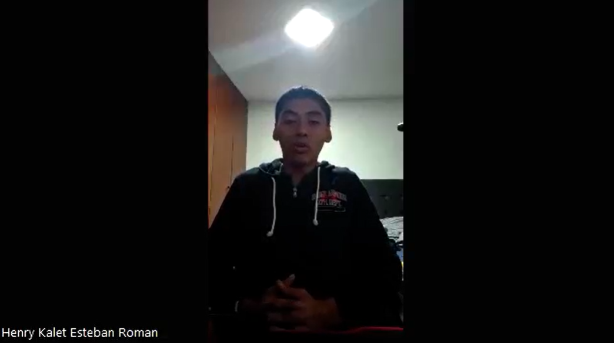                                                                                                                                                                                                                                                                                                                                                                                                                                                                                                                                                                                                                   |
| **Resumen**             | Estudiante universitario que experimentó una fractura en la infancia tratada exclusivamente con inmovilización, sin acceso a terapia física profesional, lo que resultó en atrofia muscular y pérdida de movilidad que tuvo que gestionar por cuenta propia. Su experiencia subraya una necesidad crítica de democratizar el acceso a guías de rehabilitación técnicas y precisas que eliminen la incertidumbre del paciente. Valora altamente una solución que ofrezca retroalimentación en tiempo real, aunque advierte que el éxito de la herramienta depende de una usabilidad extremadamente intuitiva o de un modelo de asistencia, especialmente para usuarios no nativos digitales o adultos mayores. |

**Segmento Fisioterapeutas: Entrevistado 1**

| Atributo                | Detalle                                                                                                                                                                                                                                                                                                                                                                                                                                                                                                                                                                                                                                                                                                                                                     |
|-------------------------|-------------------------------------------------------------------------------------------------------------------------------------------------------------------------------------------------------------------------------------------------------------------------------------------------------------------------------------------------------------------------------------------------------------------------------------------------------------------------------------------------------------------------------------------------------------------------------------------------------------------------------------------------------------------------------------------------------------------------------------------------------------|
| **Nombre**              | Gustavo Pérez                                                                                                                                                                                                                                                                                                                                                                                                                                                                                                                                                                                                                                                                                                                                               |
| **Edad**                | 21                                                                                                                                                                                                                                                                                                                                                                                                                                                                                                                                                                                                                                                                                                                                                          |
| **Sexo**                | Masculino                                                                                                                                                                                                                                                                                                                                                                                                                                                                                                                                                                                                                                                                                                                                                   |
| **Distrito**            | San Miguel                                                                                                                                                                                                                                                                                                                                                                                                                                                                                                                                                                                                                                                                                                                                                  |
| **Ocupación**           | Estudiante de Fisioterapia                                                                                                                                                                                                                                                                                                                                                                                                                                                                                                                                                                                                                                                                                                                                  |
| **Fecha de entrevista** | 2026-04-11                                                                                                                                                                                                                                                                                                                                                                                                                                                                                                                                                                                                                                                                                                                                                  |
| **Timing**              | 46:59 - 52:36                                                                                                                                                                                                                                                                                                                                                                                                                                                                                                                                                                                                                                                                                                                                               |
| **Video**               | [Ver en Microsoft Stream](https://upcedupe-my.sharepoint.com/:v:/g/personal/u20201e843_upc_edu_pe/IQBi9_cKZMuRQaK0-UbxF7MIAZnukHun0vDhy1qki_eRsUs?nav=eyJyZWZlcnJhbEluZm8iOnsicmVmZXJyYWxBcHAiOiJPbmVEcml2ZUZvckJ1c2luZXNzIiwicmVmZXJyYWxBcHBQbGF0Zm9ybSI6IldlYiIsInJlZmVycmFsTW9kZSI6InZpZXciLCJyZWZlcnJhbFZpZXciOiJNeUZpbGVzTGlua0NvcHkifX0&e=JVqpgO)                                                                                                                                                                                                                                                                                                                                                                                                     |
| **Captura**             |                                                                                                                                                                                                                                                                                                                                                                                                                                                                                                                                                                                                                                                          |
| **Resumen**             | Estudiante de fisioterapia con experiencia en centros especializados de alta rotación, donde actualmente depende de procesos manuales y en papel para el seguimiento de pacientes. Identifica como su mayor desafío clínico la falta de supervisión remota, lo que resulta en pacientes que ejecutan ejercicios con técnica incorrecta (compensaciones musculares) o abandonan el tratamiento por desmotivación al no sentirse guiados. Su principal motivación es la transición hacia un modelo de trabajo proactivo: busca una herramienta que le permita corregir ejercicios en tiempo real mediante datos objetivos, enfatizando que cualquier solución digital debe ser extremadamente ágil para no entorpecer el ritmo acelerado de atención clínica. |

**Segmento Fisioterapeutas: Entrevistado 2**

| Atributo                | Detalle                                                                                                                                                                                                                                                                                                                                                                                                                                                                                                                                                                                                                                                                                                            |
|-------------------------|--------------------------------------------------------------------------------------------------------------------------------------------------------------------------------------------------------------------------------------------------------------------------------------------------------------------------------------------------------------------------------------------------------------------------------------------------------------------------------------------------------------------------------------------------------------------------------------------------------------------------------------------------------------------------------------------------------------------|
| **Nombre**              | Fabián Alejandro López                                                                                                                                                                                                                                                                                                                                                                                                                                                                                                                                                                                                                                                                                             |
| **Edad**                | 26                                                                                                                                                                                                                                                                                                                                                                                                                                                                                                                                                                                                                                                                                                                 |
| **Sexo**                | Masculino                                                                                                                                                                                                                                                                                                                                                                                                                                                                                                                                                                                                                                                                                                          |
| **Distrito**            | San Luis                                                                                                                                                                                                                                                                                                                                                                                                                                                                                                                                                                                                                                                                                                           |
| **Ocupación**           | Fisioterapeuta especialista en fracturas de brazos                                                                                                                                                                                                                                                                                                                                                                                                                                                                                                                                                                                                                                                                 |
| **Fecha de entrevista** | 2026-04-14                                                                                                                                                                                                                                                                                                                                                                                                                                                                                                                                                                                                                                                                                                         |
| **Timing**              | 52:36 - 01:00:20                                                                                                                                                                                                                                                                                                                                                                                                                                                                                                                                                                                                                                                                                                   |
| **Video**               | [Ver en Microsoft Stream](https://upcedupe-my.sharepoint.com/:v:/g/personal/u20201e843_upc_edu_pe/IQBi9_cKZMuRQaK0-UbxF7MIAZnukHun0vDhy1qki_eRsUs?nav=eyJyZWZlcnJhbEluZm8iOnsicmVmZXJyYWxBcHAiOiJPbmVEcml2ZUZvckJ1c2luZXNzIiwicmVmZXJyYWxBcHBQbGF0Zm9ybSI6IldlYiIsInJlZmVycmFsTW9kZSI6InZpZXciLCJyZWZlcnJhbFZpZXciOiJNeUZpbGVzTGlua0NvcHkifX0&e=JVqpgO)                                                                                                                                                                                                                                                                                                                                                            |
| **Captura**             |                                                                                                                                                                                                                                                                                                                                                                                                                                                                                                                                                                                                                  |
| **Resumen**             | Especialista con 3 años de experiencia en el ámbito clínico, donde gestiona un flujo dinámico de pacientes mediante herramientas analógicas (WhatsApp y reportes manuales). Identifica como principal obstáculo la falta de constancia y la omisión de evidencia por parte del paciente, quienes suelen abandonar el tratamiento prematuramente al sentir una mejoría inicial, lo que deriva en recaídas graves. Valora de forma muy positiva la posibilidad de acceder a telemetría en tiempo real, ya que le permitiría transitar de un seguimiento reactivo a uno preventivo, asegurando que el paciente cumpla con la técnica correcta sin necesidad de solicitar constantemente videos o reportes informales. |

**Segmento Fisioterapeutas: Entrevistado 3**

| Atributo                | Detalle                                                                                                                                                                                                                                                                                                                                                                                                                                                                                                                                                                                                                                                                                                          |
|-------------------------|------------------------------------------------------------------------------------------------------------------------------------------------------------------------------------------------------------------------------------------------------------------------------------------------------------------------------------------------------------------------------------------------------------------------------------------------------------------------------------------------------------------------------------------------------------------------------------------------------------------------------------------------------------------------------------------------------------------|
| **Nombre**              | Diego Garcia                                                                                                                                                                                                                                                                                                                                                                                                                                                                                                                                                                                                                                                                                                     |
| **Edad**                | 28                                                                                                                                                                                                                                                                                                                                                                                                                                                                                                                                                                                                                                                                                                               |
| **Sexo**                | Masculino                                                                                                                                                                                                                                                                                                                                                                                                                                                                                                                                                                                                                                                                                                        |
| **Distrito**            | San Borja                                                                                                                                                                                                                                                                                                                                                                                                                                                                                                                                                                                                                                                                                                        |
| **Ocupación**           | Fisioterapeuta clínico                                                                                                                                                                                                                                                                                                                                                                                                                                                                                                                                                                                                                                                                                           |
| **Fecha de entrevista** | 2026-04-15                                                                                                                                                                                                                                                                                                                                                                                                                                                                                                                                                                                                                                                                                                       |
| **Timing**              | 01:00:20 - 01:05:36                                                                                                                                                                                                                                                                                                                                                                                                                                                                                                                                                                                                                                                                                              |
| **Video**               | [Ver en Microsoft Stream](https://upcedupe-my.sharepoint.com/:v:/g/personal/u20201e843_upc_edu_pe/IQBi9_cKZMuRQaK0-UbxF7MIAZnukHun0vDhy1qki_eRsUs?nav=eyJyZWZlcnJhbEluZm8iOnsicmVmZXJyYWxBcHAiOiJPbmVEcml2ZUZvckJ1c2luZXNzIiwicmVmZXJyYWxBcHBQbGF0Zm9ybSI6IldlYiIsInJlZmVycmFsTW9kZSI6InZpZXciLCJyZWZlcnJhbFZpZXciOiJNeUZpbGVzTGlua0NvcHkifX0&e=JVqpgO)                                                                                                                                                                                                                                                                                                                                                          |
| **Captura**             |                                                                                                                                                                                                                                                                                                                                                                                                                                                                                                                                                                                                                 |
| **Resumen**             | Diego cuenta con 5 años de experiencia, frustrado por la falta de rigor técnico en el seguimiento remoto, ya que actualmente depende de reportes verbales subjetivos que no garantizan la seguridad ni la eficacia del tratamiento. Percibe una brecha importante en la continuidad del cuidado al no tener visibilidad sobre el cumplimiento del paciente en casa, lo que frecuentemente deriva en abandono o recuperaciones lentas. Su mayor motivación es integrar herramientas que proporcionen datos biomecánicos en tiempo real, permitiéndole realizar ajustes terapéuticos precisos y proactivos sin que esto signifique una carga administrativa adicional que interrumpa su flujo de atención directa. |

Link Video - Entrevistas: https://upcedupe-my.sharepoint.com/:v:/g/personal/u20201e843_upc_edu_pe/IQBi9_cKZMuRQaK0-UbxF7MIAZnukHun0vDhy1qki_eRsUs?nav=eyJyZWZlcnJhbEluZm8iOnsicmVmZXJyYWxBcHAiOiJPbmVEcml2ZUZvckJ1c2luZXNzIiwicmVmZXJyYWxBcHBQbGF0Zm9ybSI6IldlYiIsInJlZmVycmFsTW9kZSI6InZpZXciLCJyZWZlcnJhbFZpZXciOiJNeUZpbGVzTGlua0NvcHkifX0&e=JVqpgO

### 2.2.3. Análisis de entrevistas

Las entrevistas se realizaron entre el 9 y el 16 de abril de 2026, involucrando a nueve participantes clave (tres administradores, tres fisioterapeutas y tres pacientes) en Lima. El objetivo fue mapear el flujo de trabajo actual, identificar los puntos críticos de dolor y validar la propuesta de valor de *Uflex* centrada en la tele-rehabilitación monitorizada.

---

**Segmento: Administradores de clínicas**

**Características objetivas:**
* Uso de métodos analógicos (papel, Excel, cuadernos): **3/3 (100%)**
* Ausencia de sistemas integrados para seguimiento remoto: **3/3 (100%)**
* Volumen operativo superior a 180 pacientes mensuales: **3/3 (100%)**

**Características subjetivas:**
* Perciben el abandono del tratamiento (20-25%) como su mayor crisis financiera: **3/3 (100%)**
* Frustración por falta de métricas de productividad del personal: **3/3 (100%)**
* Disposición a invertir en tecnología si garantiza retención y eficiencia: **3/3 (100%)**
* Priorizan facilidad de uso y resistencia del hardware sobre funciones complejas: **3/3 (100%)**

---

**Segmento: Fisioterapeutas**

**Características objetivas:**
* Dependencia de comunicación informal (WhatsApp) y memoria para seguimiento: **3/3 (100%)**
* Entornos clínicos de alta rotación con tiempo limitado por paciente: **3/3 (100%)**
* Ausencia de datos biomecánicos (ángulos, repeticiones) del trabajo en casa: **3/3 (100%)**

**Características subjetivas:**
* Sensación de trabajar "a ciegas" entre sesiones presenciales: **3/3 (100%)**
* Motivación alta por corregir pacientes en tiempo real para evitar lesiones: **3/3 (100%)**
* Rechazo a herramientas digitales que interrumpan el flujo clínico acelerado: **3/3 (100%)**
* Valoran la tele-rehabilitación como un medio para evitar recaídas y costos mayores: **2/3 (66%)**

---

**Segmento: Pacientes en rehabilitación**

**Características objetivas:**
* Uso intensivo de dispositivos móviles (celulares) en su día a día: **3/3 (100%)**
* Realizan ejercicios en casa sin supervisión técnica presencial: **3/3 (100%)**
* Inseguridad constante sobre si la ejecución técnica es correcta: **3/3 (100%)**

**Características subjetivas:**
* Sensación de estancamiento por falta de feedback objetivo: **3/3 (100%)**
* Alta disposición a usar tecnología si garantiza precisión y seguridad: **3/3 (100%)**
* El factor determinante para la adopción es la autonomía (colocación sin ayuda): **3/3 (100%)**
* Escepticismo ante soluciones que no ofrecen exactitud comprobable: **2/3 (66%)**

---

Tras analizar la interrelación de las entrevistas, se han identificado tres pilares críticos que justifican el desarrollo de *Uflex*:

1. **La brecha de datos como causa de abandono:** Existe una correlación directa entre la falta de supervisión técnica en casa (pacientes), la carencia de métricas objetivas (fisioterapeutas) y la tasa de deserción (administradores). Los pacientes abandonan porque se sienten estancados, los fisioterapeutas no pueden intervenir porque no ven el error, y los administradores pierden ingresos porque el ciclo terapéutico no se cierra. *Uflex* rompe este círculo vicioso mediante la telemetría.

2. **Validación de la propuesta de valor según segmento:**
    * **Para el Administrador:** *Uflex* no es un gasto, es una herramienta de retención y un elemento diferenciador (servicio "premium").
    * **Para el Fisioterapeuta:** *Uflex* no es una carga administrativa, es un aliado que permite el monitoreo proactivo sin necesidad de horas extra de supervisión.
    * **Para el Paciente:** *Uflex* no es un dispositivo complejo, es un "guía" personal que le devuelve la confianza y la seguridad necesaria para sanar.

3. **Criterios técnicos innegociables:**
    * **Usabilidad:** Cualquier interfaz debe ser "cero fricción". Tanto fisioterapeutas como administradores coinciden en que una herramienta compleja será descartada por el ritmo acelerado del entorno clínico.
    * **Autonomía:** El paciente, especialmente aquel que vive solo o busca independencia, requiere un hardware fácil de poner sin asistencia externa.
    * **Integración:** La solución debe ser un ecosistema que conecte la ejecución en casa con el reporte clínico en la clínica, eliminando el uso de mensajería informal (WhatsApp) como canal de registro técnico.

**Conclusión:**
Los resultados validan la necesidad de *Uflex*. El problema no es la falta de voluntad de rehabilitación, sino la falta de **tecnología de supervisión no invasiva**. La solución debe enfocarse en traducir datos biomecánicos complejos a alertas accionables y simples para el fisioterapeuta, asegurando así que el paciente reciba el acompañamiento necesario para completar su recuperación al 100%.

## 2.3. Needfinding

### 2.3.1. User Personas

Esta sección presenta nuestros usuarios ideales diseñados para el ecosistema de KinIoT. Estos artefactos se han construido a partir del análisis del mercado peruano de salud, el comportamiento de las clínicas privadas y las barreras de accesibilidad en la rehabilitación física.

**User persona del segmento de pacientes en rehabilitación del miembro superior**

**User persona del segmento de fisioterapeuta**

**User persona del segmento de administradores de clínica y centros de salud**

### 2.3.2. User Task Matrix

En este User Task Matrix se detallan las tareas clave que cada tipo de usuario puede realizar dentro del ecosistema de uFlex.

| **TAREA** | **Mateo Rojas (Paciente en Rehab.) - Frecuencia** | **Mateo Rojas (Paciente en Rehab.) - Importancia** |
|---|:---:|:---:|
| Realizar rutina de ejercicios físicos | Alta | Alta |
| Evaluar el rango de movimiento (ROM) | Media | Media |
| Reportar/Registrar síntomas y dolor | Alta | Alta |
| Ajustar el plan de tratamiento | N/A | N/A |
| Instruir/Aprender postura biomecánica | Alta | Alta |
| Monitorear asistencia y retención | N/A | N/A |
| Gestionar recursos y equipamiento | N/A | N/A |
| Pagar / Facturar servicios de terapia | Baja | Alta |

| **TAREA** | **Valeria Castro (Fisioterapeuta) - Frecuencia** | **Valeria Castro (Fisioterapeuta) - Importancia** |
|---|:---:|:---:|
| Realizar rutina de ejercicios físicos | Baja | Baja |
| Evaluar el rango de movimiento (ROM) | Alta | Alta |
| Reportar/Registrar síntomas y dolor | Alta | Alta |
| Ajustar el plan de tratamiento | Media | Alta |
| Instruir/Aprender postura biomecánica | Alta | Alta |
| Monitorear asistencia y retención | Media | Media |
| Gestionar recursos y equipamiento | Baja | Baja |
| Pagar / Facturar servicios de terapia | N/A | N/A |

| **TAREA** | **Roberto Villanueva (Administrador) - Frecuencia** | **Roberto Villanueva (Administrador) - Importancia** |
|---|:---:|:---:|
| Realizar rutina de ejercicios físicos | N/A | N/A |
| Evaluar el rango de movimiento (ROM) | N/A | N/A |
| Reportar/Registrar síntomas y dolor | N/A | N/A |
| Ajustar el plan de tratamiento | N/A | N/A |
| Instruir/Aprender postura biomecánica | N/A | N/A |
| Monitorear asistencia y retención | Alta | Alta |
| Gestionar recursos y equipamiento | Alta | Alta |
| Pagar / Facturar servicios de terapia | Media | Alta |

**Análisis de la Matriz**

El análisis revela que las tareas críticas del paciente (ejecución física) y del fisioterapeuta (evaluación del ROM) convergen fuertemente en el reporte de síntomas y la corrección postural, validando la necesidad de comunicación clínica bidireccional. En contraste, el administrador opera en un flujo completamente aislado del proceso médico, enfocando sus tareas de alta importancia en la gestión de recursos, retención y facturación. Esta clara división confirma que la solución debe separar funcionalmente la captura autónoma de datos biomecánicos del panel de control gerencial.

### 2.3.3. User Journey Mapping

A continuación, se presentan los User Journey Maps de cada User Persona priorizado para uFlex. Estos mapas permiten visualizar el recorrido completo de cada segmento durante el proceso de rehabilitación remota, identificando puntos de dolor, necesidades de información y oportunidades de mejora en cada etapa de interacción con la solución.

* User Journey Map de Mateo Rojas (Paciente en rehabilitación):

  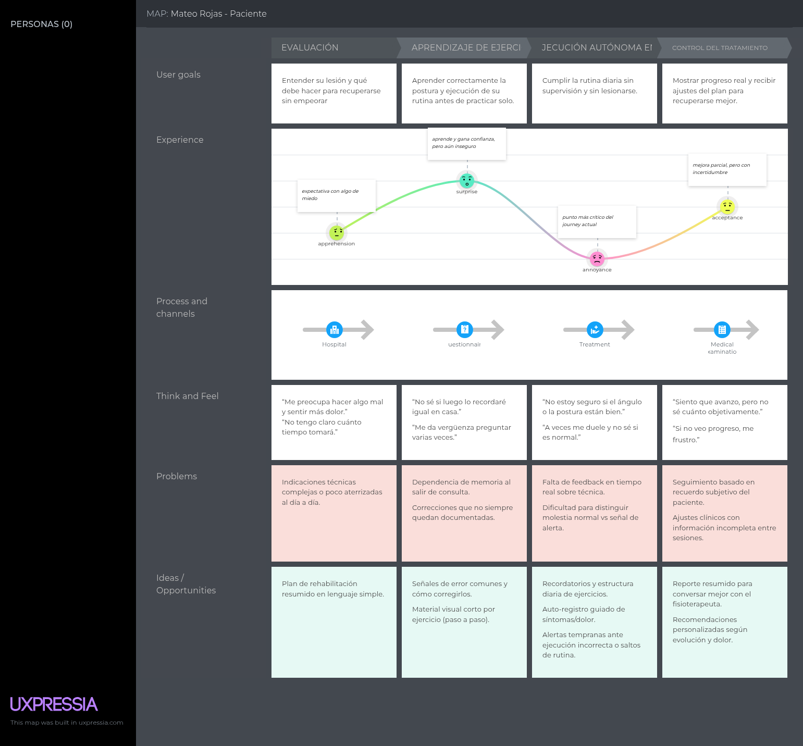

* User Journey Map de Valeria Castro (Fisioterapeuta):

  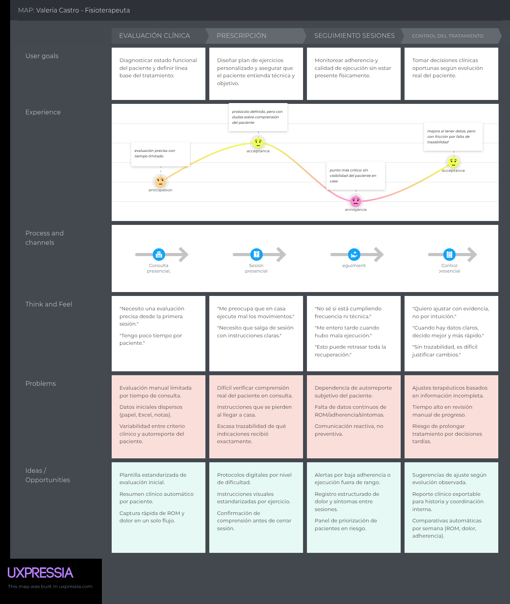

* User Journey Map de Roberto Villanueva (Administrador de clínica):

  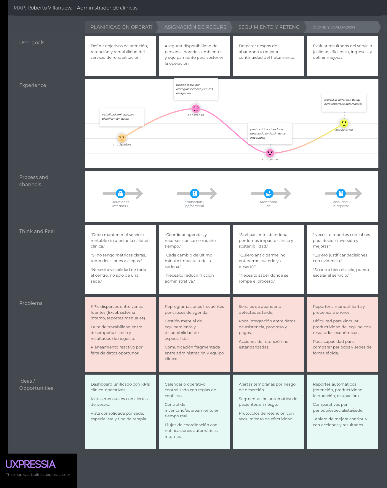

### 2.3.4. Empathy Mapping

Se elaboraron los Empathy Mapping para los tres User Personas priorizados de uFlex: **Mateo Rojas (Paciente)**, **Valeria Castro (Fisioterapeuta)** y **Roberto Villanueva (Administrador de clínica)**. Este ejercicio permitió comprender de forma integral lo que cada perfil dice, piensa, hace y siente durante su experiencia con el proceso de rehabilitación remota, identificando sus principales pains y gains para orientar decisiones de diseño centradas en valor clínico, operativo y de adherencia.

---

#### Paciente en rehabilitación (Mateo Rojas)

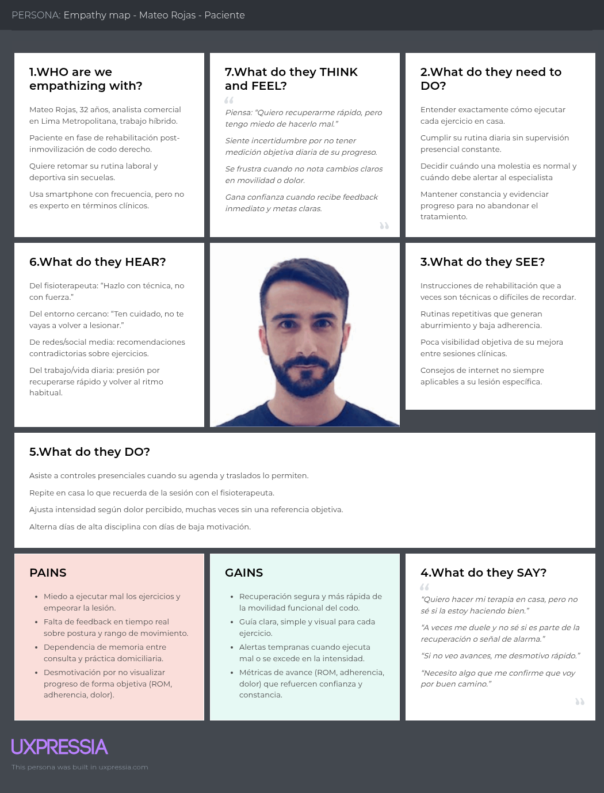

---

#### Fisioterapeuta (Valeria Castro)

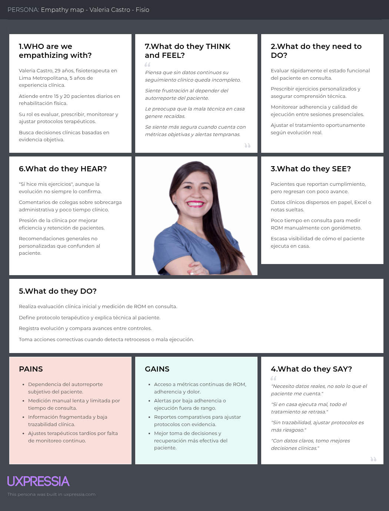

---

#### Administrador de clínica (Roberto Villanueva)

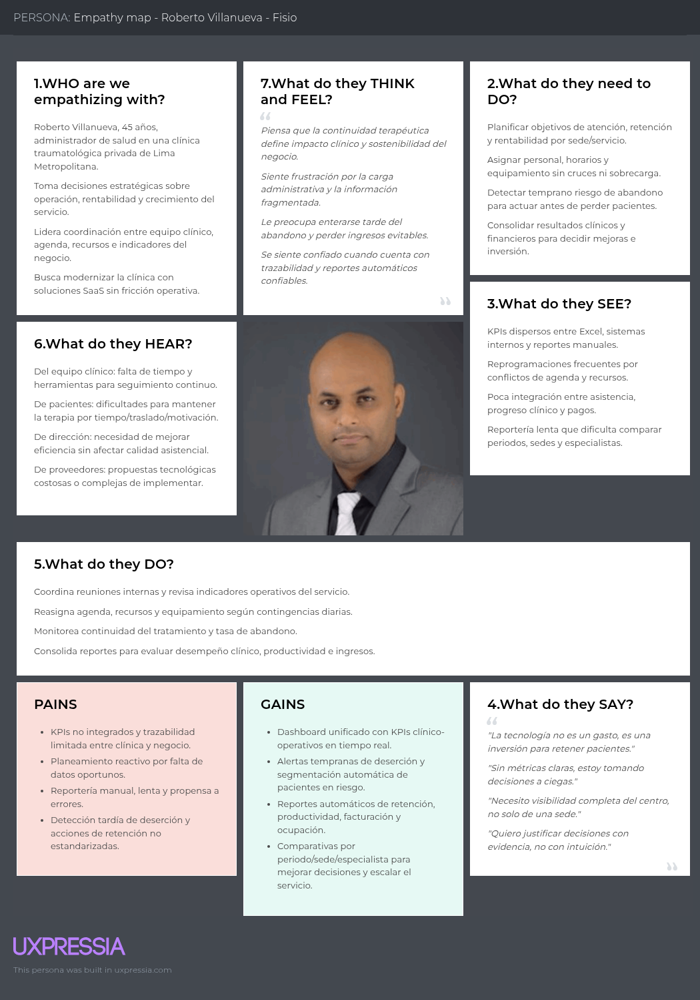

---

## 2.4. Big Picture EventStorming

En esta sección se introduce y resume el proceso realizado por el equipo para el Big Picture Event Storming, que fue realizado por todos los integrantes y plasmado con la ayuda de la herramienta Miro. A continuación, se explica el proceso:

**1. Open**

En esta etapa el equipo se concentró en generar la mayor cantidad de eventos de dominio posibles (cosas que suceden en el negocio) escribiendo en los post-its naranjas.

**2. Explore**

Después de la anterior etapa, en esta se concentró en ordenar cronológicamente los eventos, eliminar los eventos repetidos, identificar sus actores y posibles sistemas externos, y finalmente algunos puntos de dolor en post-its morados.

**3. Close**

En esta última etapa, se documentaron en post-its rosados los problemas más relevantes detectados, junto con aspectos que debíamos investigar más a fondo o descartar según el alcance definido.

Luego de conversar un poco, el equipo descartó algunos eventos y se ordenaron mejor las líneas de tiempo.

Finalmente, se presenta el Big Picture Event Storming finalizado, con los eventos ordenados, los puntos de dolor identificados y los aspectos a investigar destacados.

Se puede acceder al Big Picture Event Storming en el siguiente enlace de la herramienta Miro: [Version final del Big Picture Event Storming](https://miro.com/app/board/uXjVGsDiw2M=/?share_link_id=274967609887)

> *Enlace completo:* https://miro.com/app/board/uXjVGsDiw2M=/?share_link_id=274967609887

Este proceso permitió al equipo obtener una visión de alto nivel de los principales eventos del negocio, identificar puntos críticos y definir prioridades para las siguientes etapas del proyecto.

## 2.5. Ubiquitous Language

| Término                    | Equivalente                    | Definición                                                                                                                                                                         |
|----------------------------|--------------------------------|------------------------------------------------------------------------------------------------------------------------------------------------------------------------------------|
| Range of Motion (ROM)      | Rango de Movimiento            | Magnitud de arco, medida en grados, que una articulación puede recorrer en un plano específico. Es el indicador principal para evaluar la recuperación funcional de codo y muñeca. |
| Flexion                    | Flexión                        | Movimiento que reduce el ángulo entre los huesos de una articulación. En el codo, es acercar la mano al hombro; en la muñeca, es mover la palma hacia el antebrazo.                |
| Extension                  | Extensión                      | Movimiento que aumenta el ángulo entre los huesos de una articulación, estirando el miembro. Es lo opuesto a la flexión.                                                           |
| Pronation                  | Pronación                      | Movimiento de rotación del antebrazo que permite girar la palma de la mano hacia abajo (hacia el suelo).                                                                           |
| Supination                 | Supinación                     | Movimiento de rotación del antebrazo que permite girar la palma de la mano hacia arriba (hacia el techo).                                                                          |
| Compensatory Movement      | Movimiento Compensatorio       | Movimiento involuntario o erróneo de una articulación adyacente (ej. el hombro) para sustituir la falta de movilidad de la articulación lesionada (ej. el codo).                   |
| Clinical Session           | Sesión Clínica                 | Conjunto de ejercicios prescritos por el fisioterapeuta que el paciente debe ejecutar en un periodo de tiempo determinado, bajo el monitoreo de los sensores.                      |
| Kinematic Chain            | Cadena Cinemática              | Conjunto de articulaciones y segmentos óseos conectados (hombro-codo-muñeca) que actúan de forma coordinada para realizar un movimiento funcional.                                 |
| Therapeutic Protocol       | Protocolo Terapéutico          | Plan de rehabilitación personalizado que incluye el número de repeticiones, series y los límites de ángulos permitidos para un paciente específico.                                |
| Joint Rigidity (Ankylosis) | Rigidez Articular (Anquilosis) | Limitación o pérdida total de la movilidad en una articulación debido a una lesión o falta de ejercicio post-operatorio.                                                           |
| Wearable Node              | Nodo Vestible                  | Dispositivo físico que contiene los sensores inerciales y se coloca sobre el segmento corporal del paciente para capturar datos biomecánicos.                                      |
| Clinic                     | Clínica                        | Organización que adquiere el servicio SaaS y gestiona a sus propios especialistas y pacientes dentro de la plataforma.                                                             |
| Physiotherapist            | Fisioterapeuta                 | Profesional de la salud encargado de crear los protocolos, monitorear los datos de los sensores y validar el progreso del paciente.                                                |
| Adherence                  | Adherencia                     | Nivel de compromiso y cumplimiento del paciente con respecto al plan de ejercicios prescrito por el especialista.                                                                  |

# Capítulo III: Requirements Specification

## 3.1. User Stories

A partir del análisis de los segmentos objetivo, las entrevistas, las hipótesis Lean UX y los bounded contexts identificados para uFlex, hemos elaborado el siguiente conjunto de Epics y User Stories que describe el alcance funcional de la solución. Las historias cubren la experiencia pública en la Landing Page, la aplicación móvil del paciente integrada con el sensor IoT, la aplicación web para el fisioterapeuta, el panel administrativo para el administrador de la clínica y las Technical Stories que soportan la infraestructura (RESTful API interno, Edge API, integración con proveedor de pagos externo y servicio de notificaciones). Cada User Story incluye criterios de aceptación redactados en formato Gherkin (Given–When–Then), en tercera persona y tiempo presente, describiendo el comportamiento esperado del sistema sin referenciar detalles de interfaz.

<table>
  <thead>
    <tr>
      <th>Epic / Story ID</th>
      <th>Título</th>
      <th>Descripción</th>
      <th>Criterios de Aceptación</th>
      <th>Relacionado con (Epic ID)</th>
    </tr>
  </thead>
  <tbody>
    <tr>
      <td><b>EP01</b></td>
      <td>Landing Page pública de uFlex</td>
      <td>Conjunto de historias orientadas al visitante del sitio web estático, donde se presenta la propuesta de valor, los planes, el contenido segmentado por audiencia y los puntos de acceso a las aplicaciones web y móvil.</td>
      <td>—</td>
      <td>—</td>
    </tr>
    <tr>
      <td>US01</td>
      <td>Exploración de la propuesta de valor</td>
      <td>Como Visitante, quiero explorar la propuesta de valor de uFlex en la página principal para entender qué ofrece la plataforma y decidir si me interesa continuar navegando.</td>
      <td>
        <b>Escenario 1: Carga exitosa de la página principal</b> 
        <b>Given</b> que el Visitante solicita la página principal del sitio, 
        <b>When</b> el sistema responde a la solicitud, 
        <b>Then</b> el sistema entrega el contenido con la propuesta de valor, los beneficios principales y los enlaces hacia las secciones de cada segmento.  
        <b>Escenario 2: Recurso no disponible por caída del servicio</b> 
        <b>Given</b> que el Visitante solicita la página principal, 
        <b>When</b> el servicio estático no puede resolver el recurso, 
        <b>Then</b> el sistema responde con una página de estado que informa la indisponibilidad temporal y preserva la navegabilidad del resto del sitio.
      </td>
      <td>EP01</td>
    </tr>
    <tr>
      <td>US02</td>
      <td>Consulta de contenido para pacientes</td>
      <td>Como Visitante del segmento paciente, quiero consultar la sección "Cómo funciona para pacientes" para comprender el proceso de rehabilitación remota que ofrece uFlex.</td>
      <td>
        <b>Escenario 1: Acceso a la sección de pacientes</b> 
        <b>Given</b> que el Visitante del segmento paciente navega desde la página principal, 
        <b>When</b> el sistema recibe la solicitud de la sección dirigida a pacientes, 
        <b>Then</b> el sistema entrega el contenido que explica el flujo del paciente y los beneficios del acompañamiento remoto.  
        <b>Escenario 2: Contenido segmentado inexistente</b> 
        <b>Given</b> que el Visitante solicita una subsección dentro del contenido para pacientes, 
        <b>When</b> la ruta solicitada no existe en el sitio, 
        <b>Then</b> el sistema responde con un estado 404 y ofrece la navegación a secciones equivalentes del mismo segmento.
      </td>
      <td>EP01</td>
    </tr>
    <tr>
      <td>US03</td>
      <td>Consulta de contenido para especialistas</td>
      <td>Como Visitante del segmento fisioterapeuta, quiero consultar la sección "Cómo funciona para especialistas" para entender cómo uFlex apoya mi práctica clínica.</td>
      <td>
        <b>Escenario 1: Acceso a la sección de especialistas</b> 
        <b>Given</b> que el Visitante del segmento fisioterapeuta navega al contenido dirigido a especialistas, 
        <b>When</b> el sistema procesa la solicitud, 
        <b>Then</b> el sistema entrega la descripción de las capacidades clínicas, métricas ROM y herramientas de supervisión.  
        <b>Escenario 2: Recurso estático ilegible</b> 
        <b>Given</b> que el Visitante solicita un recurso multimedia de la sección, 
        <b>When</b> el recurso está corrupto o inaccesible, 
        <b>Then</b> el sistema continúa entregando el contenido textual y omite el recurso no disponible sin interrumpir la navegación.
      </td>
      <td>EP01</td>
    </tr>
    <tr>
      <td>US04</td>
      <td>Consulta de planes y precios para clínicas</td>
      <td>Como Visitante del segmento clínica, quiero consultar los planes y precios de uFlex para evaluar la viabilidad económica de adoptar la solución.</td>
      <td>
        <b>Escenario 1: Visualización de planes vigentes</b> 
        <b>Given</b> que el Visitante del segmento clínica solicita la sección de planes, 
        <b>When</b> el sistema procesa la solicitud, 
        <b>Then</b> el sistema entrega los planes vigentes con sus características, límites y precios en moneda local.  
        <b>Escenario 2: Planes no configurados</b> 
        <b>Given</b> que el Visitante solicita la sección de planes, 
        <b>When</b> no existen planes publicados en el sistema, 
        <b>Then</b> el sistema entrega un mensaje informativo que indica que la información comercial está siendo actualizada.
      </td>
      <td>EP01</td>
    </tr>
    <tr>
      <td>US05</td>
      <td>Solicitud de demo comercial</td>
      <td>Como Visitante del segmento clínica, quiero solicitar una demostración comercial mediante un formulario para iniciar contacto con el equipo de uFlex.</td>
      <td>
        <b>Escenario 1: Envío exitoso del formulario</b> 
        <b>Given</b> que el Visitante completa el formulario de demo con datos válidos, 
        <b>When</b> el sistema recibe la solicitud, 
        <b>Then</b> el sistema persiste el lead comercial y confirma la recepción al Visitante.  
        <b>Escenario 2: Datos obligatorios ausentes</b> 
        <b>Given</b> que el Visitante envía el formulario sin campos obligatorios, 
        <b>When</b> el sistema valida el payload, 
        <b>Then</b> el sistema rechaza la solicitud sin persistir el lead e informa qué campos son requeridos.
      </td>
      <td>EP01</td>
    </tr>
    <tr>
      <td>US06</td>
      <td>Acceso a la descarga de la app móvil</td>
      <td>Como Visitante, quiero acceder al enlace de descarga de la aplicación móvil de uFlex para instalarla en mi dispositivo.</td>
      <td>
        <b>Escenario 1: Redirección a la tienda correspondiente</b> 
        <b>Given</b> que el Visitante activa el enlace de descarga desde la Landing, 
        <b>When</b> el sistema identifica el sistema operativo del dispositivo, 
        <b>Then</b> el sistema redirige a la tienda oficial correspondiente al sistema operativo detectado.  
        <b>Escenario 2: Sistema operativo no soportado</b> 
        <b>Given</b> que el Visitante accede al enlace desde un dispositivo con sistema operativo no soportado, 
        <b>When</b> el sistema procesa la solicitud, 
        <b>Then</b> el sistema entrega un mensaje informativo indicando las plataformas soportadas y no realiza redirección.
      </td>
      <td>EP01</td>
    </tr>
    <tr>
      <td><b>EP02</b></td>
      <td>Experiencia del Paciente en la app móvil</td>
      <td>Conjunto de historias orientadas al paciente en rehabilitación del miembro superior, desde el onboarding hasta la ejecución de sesiones con el sensor IoT, el reporte de dolor y la consulta de su progreso.</td>
      <td>—</td>
      <td>—</td>
    </tr>
    <tr>
      <td>US07</td>
      <td>Activación de cuenta con código de invitación</td>
      <td>Como Paciente, quiero activar mi cuenta con el código de invitación que me entrega la clínica para ingresar por primera vez a la aplicación móvil.</td>
      <td>
        <b>Escenario 1: Activación con código válido</b> 
        <b>Given</b> que el Paciente envía un código de invitación vigente y sus datos personales, 
        <b>When</b> el sistema valida el código contra la clínica emisora, 
        <b>Then</b> el sistema crea la cuenta del Paciente y la asocia a la clínica y al fisioterapeuta responsable.  
        <b>Escenario 2: Código expirado o inexistente</b> 
        <b>Given</b> que el Paciente envía un código inválido o vencido, 
        <b>When</b> el sistema intenta validar el código, 
        <b>Then</b> el sistema rechaza la activación y no crea ninguna cuenta.
      </td>
      <td>EP02</td>
    </tr>
    <tr>
      <td>US08</td>
      <td>Inicio de sesión del paciente</td>
      <td>Como Paciente, quiero iniciar sesión en la aplicación móvil con mis credenciales para acceder a mi rutina de rehabilitación.</td>
      <td>
        <b>Escenario 1: Autenticación exitosa</b> 
        <b>Given</b> que el Paciente tiene credenciales válidas y una cuenta activa, 
        <b>When</b> el sistema recibe la solicitud de autenticación, 
        <b>Then</b> el sistema emite un token de sesión y habilita el acceso al contexto del Paciente.  
        <b>Escenario 2: Credenciales inválidas</b> 
        <b>Given</b> que el Paciente envía credenciales que no coinciden con un registro activo, 
        <b>When</b> el sistema procesa la solicitud de autenticación, 
        <b>Then</b> el sistema rechaza la solicitud y no emite token de sesión.
      </td>
      <td>EP02</td>
    </tr>
    <tr>
      <td>US09</td>
      <td>Recuperación de contraseña del paciente</td>
      <td>Como Paciente, quiero recuperar mi contraseña cuando la olvido para volver a acceder a la aplicación móvil y continuar con mi rutina.</td>
      <td>
        <b>Escenario 1: Solicitud de recuperación con correo registrado</b> 
        <b>Given</b> que el Paciente envía una solicitud de recuperación con un correo asociado a una cuenta activa, 
        <b>When</b> el sistema procesa la solicitud, 
        <b>Then</b> el sistema genera un token de recuperación de un solo uso y lo envía por correo al Paciente.  
        <b>Escenario 2: Correo no registrado</b> 
        <b>Given</b> que el Paciente envía una solicitud de recuperación con un correo no asociado a ninguna cuenta, 
        <b>When</b> el sistema procesa la solicitud, 
        <b>Then</b> el sistema no emite ningún token y responde sin revelar si el correo existe.
      </td>
      <td>EP02</td>
    </tr>
    <tr>
      <td>US10</td>
      <td>Cierre de sesión del paciente</td>
      <td>Como Paciente, quiero cerrar mi sesión en la aplicación móvil para proteger mi información cuando termino de usar la app.</td>
      <td>
        <b>Escenario 1: Cierre de sesión exitoso</b> 
        <b>Given</b> que el Paciente tiene una sesión activa en la aplicación móvil, 
        <b>When</b> el sistema recibe la solicitud de cierre de sesión, 
        <b>Then</b> el sistema invalida el token de sesión del Paciente y requiere una nueva autenticación para accesos posteriores.  
        <b>Escenario 2: Cierre con token ya expirado</b> 
        <b>Given</b> que el Paciente envía una solicitud de cierre con un token que ya expiró, 
        <b>When</b> el sistema valida el token, 
        <b>Then</b> el sistema considera la sesión cerrada y no realiza ninguna acción adicional.
      </td>
      <td>EP02</td>
    </tr>
    <tr>
      <td>US11</td>
      <td>Consulta de la rutina asignada del día</td>
      <td>Como Paciente, quiero consultar la rutina de rehabilitación asignada del día para saber qué ejercicios me corresponde realizar.</td>
      <td>
        <b>Escenario 1: Rutina vigente disponible</b> 
        <b>Given</b> que el Paciente tiene una rutina vigente asignada por su fisioterapeuta, 
        <b>When</b> el sistema recibe la solicitud de la rutina del día, 
        <b>Then</b> el sistema entrega la lista de ejercicios con sus repeticiones, series y rangos articulares objetivo.  
        <b>Escenario 2: Sin rutina asignada</b> 
        <b>Given</b> que el Paciente no tiene una rutina vigente para la fecha actual, 
        <b>When</b> el sistema consulta la asignación, 
        <b>Then</b> el sistema responde indicando que no existe rutina para el día y sugiere contactar al especialista.
      </td>
      <td>EP02</td>
    </tr>
    <tr>
      <td>US12</td>
      <td>Emparejamiento del sensor IoT</td>
      <td>Como Paciente, quiero emparejar el sensor IoT con la aplicación móvil para que mis movimientos sean capturados durante la sesión.</td>
      <td>
        <b>Escenario 1: Emparejamiento exitoso</b> 
        <b>Given</b> que el Paciente tiene un sensor aprovisionado a su cuenta y encendido, 
        <b>When</b> el sistema descubre el dispositivo por Bluetooth y valida su identificador, 
        <b>Then</b> el sistema establece la conexión y habilita el envío de telemetría al Edge API.  
        <b>Escenario 2: Sensor no aprovisionado</b> 
        <b>Given</b> que el Paciente intenta emparejar un sensor cuyo identificador no está vinculado a su cuenta, 
        <b>When</b> el sistema valida la propiedad del dispositivo, 
        <b>Then</b> el sistema rechaza el emparejamiento y no inicia sesión de captura.
      </td>
      <td>EP02</td>
    </tr>
    <tr>
      <td>US13</td>
      <td>Ejecución de una sesión de ejercicio</td>
      <td>Como Paciente, quiero ejecutar una sesión de ejercicio con captura de datos en tiempo real para cumplir mi protocolo de rehabilitación de manera guiada.</td>
      <td>
        <b>Escenario 1: Sesión completada dentro del rango terapéutico</b> 
        <b>Given</b> que el Paciente tiene una rutina activa y un sensor emparejado, 
        <b>When</b> el sistema recibe la telemetría del sensor durante el ejercicio, 
        <b>Then</b> el sistema registra la sesión con las mediciones de ángulo articular y marca el cumplimiento del protocolo.  
        <b>Escenario 2: Pérdida de conexión con el sensor</b> 
        <b>Given</b> que el Paciente está ejecutando una sesión activa, 
        <b>When</b> el sistema detecta que el sensor deja de enviar telemetría por más del umbral permitido, 
        <b>Then</b> el sistema pausa la sesión, marca el tramo como incompleto y la deja en estado pendiente de sincronización.
      </td>
      <td>EP02</td>
    </tr>
    <tr>
      <td>US14</td>
      <td>Reporte de dolor al finalizar la sesión</td>
      <td>Como Paciente, quiero reportar mi nivel de dolor al finalizar la sesión para que mi fisioterapeuta pueda ajustar el protocolo si es necesario.</td>
      <td>
        <b>Escenario 1: Reporte de dolor registrado</b> 
        <b>Given</b> que el Paciente acaba de finalizar una sesión registrada, 
        <b>When</b> el sistema recibe el valor de dolor reportado dentro del rango permitido, 
        <b>Then</b> el sistema asocia el reporte a la sesión y lo pone a disposición del fisioterapeuta asignado.  
        <b>Escenario 2: Valor de dolor fuera del rango permitido</b> 
        <b>Given</b> que el Paciente envía un valor de dolor fuera del rango establecido, 
        <b>When</b> el sistema valida el reporte, 
        <b>Then</b> el sistema rechaza el registro y conserva la sesión sin reporte asociado.
      </td>
      <td>EP02</td>
    </tr>
    <tr>
      <td>US15</td>
      <td>Consulta del histórico de progreso</td>
      <td>Como Paciente, quiero consultar mi histórico de progreso para ver mi evolución en términos de adherencia y rango articular.</td>
      <td>
        <b>Escenario 1: Histórico con sesiones registradas</b> 
        <b>Given</b> que el Paciente cuenta con sesiones registradas en el sistema, 
        <b>When</b> el sistema recibe la solicitud del histórico, 
        <b>Then</b> el sistema entrega la serie temporal de métricas ROM y el porcentaje de adherencia al protocolo.  
        <b>Escenario 2: Paciente sin sesiones registradas</b> 
        <b>Given</b> que el Paciente aún no cuenta con sesiones registradas, 
        <b>When</b> el sistema consulta el histórico, 
        <b>Then</b> el sistema responde con un histórico vacío e indica que no existen mediciones disponibles.
      </td>
      <td>EP02</td>
    </tr>
    <tr>
      <td>US16</td>
      <td>Recordatorio de sesiones pendientes</td>
      <td>Como Paciente, quiero recibir recordatorios de mis sesiones pendientes para no omitir ejercicios de mi rutina.</td>
      <td>
        <b>Escenario 1: Envío de recordatorio programado</b> 
        <b>Given</b> que el Paciente tiene una sesión pendiente del día y autorizó notificaciones, 
        <b>When</b> el sistema alcanza el horario de recordatorio configurado, 
        <b>Then</b> el sistema emite una notificación push al dispositivo del Paciente.  
        <b>Escenario 2: Paciente con notificaciones deshabilitadas</b> 
        <b>Given</b> que el Paciente ha revocado el permiso de notificaciones, 
        <b>When</b> el sistema intenta emitir el recordatorio, 
        <b>Then</b> el sistema omite el envío y registra el intento como no entregado.
      </td>
      <td>EP02</td>
    </tr>
    <tr>
      <td><b>EP03</b></td>
      <td>Gestión clínica del Fisioterapeuta</td>
      <td>Conjunto de historias orientadas al fisioterapeuta que supervisa remotamente a los pacientes asignados, construye protocolos, revisa métricas ROM y recibe alertas clínicas desde la aplicación web.</td>
      <td>—</td>
      <td>—</td>
    </tr>
    <tr>
      <td>US17</td>
      <td>Inicio de sesión del fisioterapeuta</td>
      <td>Como Fisioterapeuta, quiero iniciar sesión en la aplicación web para acceder al panel de supervisión de mis pacientes.</td>
      <td>
        <b>Escenario 1: Autenticación exitosa</b> 
        <b>Given</b> que el Fisioterapeuta tiene credenciales válidas y su cuenta está activa en la clínica, 
        <b>When</b> el sistema recibe la solicitud de autenticación, 
        <b>Then</b> el sistema emite un token de sesión con el contexto de la clínica correspondiente.  
        <b>Escenario 2: Cuenta suspendida</b> 
        <b>Given</b> que el Fisioterapeuta tiene una cuenta suspendida por el administrador, 
        <b>When</b> el sistema procesa la solicitud de autenticación, 
        <b>Then</b> el sistema rechaza la autenticación y no emite token de sesión.
      </td>
      <td>EP03</td>
    </tr>
    <tr>
      <td>US18</td>
      <td>Recuperación de contraseña del fisioterapeuta</td>
      <td>Como Fisioterapeuta, quiero recuperar mi contraseña cuando la olvido para volver a acceder al panel clínico sin depender del administrador.</td>
      <td>
        <b>Escenario 1: Solicitud de recuperación con correo institucional válido</b> 
        <b>Given</b> que el Fisioterapeuta envía una solicitud de recuperación con un correo asociado a una cuenta activa, 
        <b>When</b> el sistema procesa la solicitud, 
        <b>Then</b> el sistema genera un token de recuperación de un solo uso y lo envía por correo al Fisioterapeuta.  
        <b>Escenario 2: Correo asociado a una cuenta suspendida</b> 
        <b>Given</b> que el Fisioterapeuta envía una solicitud con un correo asociado a una cuenta suspendida por el administrador, 
        <b>When</b> el sistema procesa la solicitud, 
        <b>Then</b> el sistema no emite ningún token y mantiene la cuenta en estado suspendido.
      </td>
      <td>EP03</td>
    </tr>
    <tr>
      <td>US19</td>
      <td>Cierre de sesión del fisioterapeuta</td>
      <td>Como Fisioterapeuta, quiero cerrar mi sesión en la aplicación web para proteger la información clínica de mis pacientes.</td>
      <td>
        <b>Escenario 1: Cierre de sesión exitoso</b> 
        <b>Given</b> que el Fisioterapeuta tiene una sesión activa en la aplicación web, 
        <b>When</b> el sistema recibe la solicitud de cierre de sesión, 
        <b>Then</b> el sistema invalida el token de sesión y requiere una nueva autenticación para accesos posteriores.  
        <b>Escenario 2: Cierre con token ya invalidado</b> 
        <b>Given</b> que el Fisioterapeuta envía una solicitud de cierre con un token ya invalidado, 
        <b>When</b> el sistema valida el token, 
        <b>Then</b> el sistema considera la sesión cerrada y no realiza ninguna acción adicional.
      </td>
      <td>EP03</td>
    </tr>
    <tr>
      <td>US20</td>
      <td>Listado de pacientes asignados</td>
      <td>Como Fisioterapeuta, quiero consultar el listado de pacientes asignados para identificar rápidamente a quiénes debo atender.</td>
      <td>
        <b>Escenario 1: Listado con pacientes asignados</b> 
        <b>Given</b> que el Fisioterapeuta tiene pacientes asignados en su clínica, 
        <b>When</b> el sistema recibe la solicitud del listado, 
        <b>Then</b> el sistema entrega la relación de pacientes con su estado de adherencia y última sesión registrada.  
        <b>Escenario 2: Sin pacientes asignados</b> 
        <b>Given</b> que el Fisioterapeuta aún no tiene pacientes asignados, 
        <b>When</b> el sistema consulta su cartera, 
        <b>Then</b> el sistema responde con un listado vacío.
      </td>
      <td>EP03</td>
    </tr>
    <tr>
      <td>US21</td>
      <td>Creación de protocolo de ejercicios</td>
      <td>Como Fisioterapeuta, quiero crear un protocolo de ejercicios para un paciente para definir su plan terapéutico personalizado.</td>
      <td>
        <b>Escenario 1: Protocolo creado exitosamente</b> 
        <b>Given</b> que el Fisioterapeuta define un protocolo con ejercicios, rangos y frecuencia válidos, 
        <b>When</b> el sistema recibe la solicitud de creación, 
        <b>Then</b> el sistema persiste el protocolo y lo asocia al paciente indicado.  
        <b>Escenario 2: Parámetros terapéuticos inválidos</b> 
        <b>Given</b> que el Fisioterapeuta define rangos articulares fuera de los límites fisiológicos permitidos, 
        <b>When</b> el sistema valida el protocolo, 
        <b>Then</b> el sistema rechaza la creación y no persiste el protocolo.
      </td>
      <td>EP03</td>
    </tr>
    <tr>
      <td>US22</td>
      <td>Ajuste de protocolo vigente</td>
      <td>Como Fisioterapeuta, quiero ajustar un protocolo vigente según el avance del paciente para adaptar la terapia a su evolución.</td>
      <td>
        <b>Escenario 1: Ajuste aplicado al protocolo</b> 
        <b>Given</b> que el Fisioterapeuta modifica los parámetros de un protocolo activo, 
        <b>When</b> el sistema recibe la actualización, 
        <b>Then</b> el sistema versiona el protocolo y aplica los cambios a las próximas sesiones del paciente.  
        <b>Escenario 2: Protocolo archivado</b> 
        <b>Given</b> que el Fisioterapeuta intenta modificar un protocolo que ya fue archivado, 
        <b>When</b> el sistema valida el estado del protocolo, 
        <b>Then</b> el sistema rechaza la actualización y preserva el protocolo archivado intacto.
      </td>
      <td>EP03</td>
    </tr>
    <tr>
      <td>US23</td>
      <td>Revisión del dashboard de métricas ROM</td>
      <td>Como Fisioterapeuta, quiero revisar el dashboard de métricas ROM de un paciente para tomar decisiones clínicas basadas en datos objetivos.</td>
      <td>
        <b>Escenario 1: Dashboard con datos disponibles</b> 
        <b>Given</b> que el paciente seleccionado tiene sesiones registradas, 
        <b>When</b> el sistema recibe la solicitud del dashboard, 
        <b>Then</b> el sistema entrega las series temporales de ángulo articular, adherencia y reportes de dolor agregados.  
        <b>Escenario 2: Paciente sin datos suficientes</b> 
        <b>Given</b> que el paciente seleccionado no tiene sesiones registradas recientemente, 
        <b>When</b> el sistema consulta las métricas, 
        <b>Then</b> el sistema entrega el dashboard vacío indicando que no existen mediciones suficientes para el periodo consultado.
      </td>
      <td>EP03</td>
    </tr>
    <tr>
      <td>US24</td>
      <td>Registro de notas clínicas</td>
      <td>Como Fisioterapeuta, quiero registrar notas clínicas sobre la sesión de un paciente para mantener trazabilidad del seguimiento terapéutico.</td>
      <td>
        <b>Escenario 1: Nota clínica registrada</b> 
        <b>Given</b> que el Fisioterapeuta redacta una nota asociada a una sesión existente del paciente, 
        <b>When</b> el sistema recibe la solicitud de registro, 
        <b>Then</b> el sistema persiste la nota asociada a la sesión con el autor y la marca temporal.  
        <b>Escenario 2: Sesión inexistente</b> 
        <b>Given</b> que el Fisioterapeuta intenta registrar una nota sobre una sesión que no existe, 
        <b>When</b> el sistema valida la referencia de la sesión, 
        <b>Then</b> el sistema rechaza el registro de la nota.
      </td>
      <td>EP03</td>
    </tr>
    <tr>
      <td>US25</td>
      <td>Alertas clínicas por dolor o inasistencia</td>
      <td>Como Fisioterapeuta, quiero recibir alertas cuando un paciente reporta dolor elevado o falta a sus sesiones para actuar a tiempo sobre casos críticos.</td>
      <td>
        <b>Escenario 1: Alerta emitida por dolor elevado</b> 
        <b>Given</b> que un paciente reporta un nivel de dolor por encima del umbral clínico configurado, 
        <b>When</b> el sistema procesa el reporte, 
        <b>Then</b> el sistema genera una alerta priorizada para el fisioterapeuta responsable.  
        <b>Escenario 2: Paciente con inasistencia acumulada</b> 
        <b>Given</b> que un paciente no registra sesiones durante un número de días superior al umbral, 
        <b>When</b> el sistema evalúa la adherencia diaria, 
        <b>Then</b> el sistema genera una alerta de inasistencia para el fisioterapeuta responsable.
      </td>
      <td>EP03</td>
    </tr>
    <tr>
      <td><b>EP04</b></td>
      <td>Operación de la clínica (Administrador)</td>
      <td>Conjunto de historias orientadas al administrador de la clínica para gestionar usuarios, aprovisionar kits IoT, administrar la suscripción con el proveedor de pagos externo y monitorear el uso general de la plataforma.</td>
      <td>—</td>
      <td>—</td>
    </tr>
    <tr>
      <td>US26</td>
      <td>Inicio de sesión del administrador</td>
      <td>Como Administrador, quiero iniciar sesión en el panel administrativo para gestionar la operación de mi clínica en uFlex.</td>
      <td>
        <b>Escenario 1: Autenticación exitosa</b> 
        <b>Given</b> que el Administrador tiene credenciales válidas y la clínica está activa, 
        <b>When</b> el sistema recibe la solicitud de autenticación, 
        <b>Then</b> el sistema emite un token de sesión con el contexto administrativo de la clínica.  
        <b>Escenario 2: Clínica con suscripción vencida</b> 
        <b>Given</b> que la clínica del Administrador tiene la suscripción vencida, 
        <b>When</b> el sistema procesa la solicitud de autenticación, 
        <b>Then</b> el sistema emite un token restringido que solo habilita las acciones de regularización de pago.
      </td>
      <td>EP04</td>
    </tr>
    <tr>
      <td>US27</td>
      <td>Recuperación de contraseña del administrador</td>
      <td>Como Administrador, quiero recuperar mi contraseña cuando la olvido para volver a acceder al panel administrativo de mi clínica.</td>
      <td>
        <b>Escenario 1: Solicitud de recuperación con correo registrado</b> 
        <b>Given</b> que el Administrador envía una solicitud de recuperación con un correo asociado a una cuenta administrativa activa, 
        <b>When</b> el sistema procesa la solicitud, 
        <b>Then</b> el sistema genera un token de recuperación de un solo uso y lo envía por correo al Administrador.  
        <b>Escenario 2: Correo no asociado a una cuenta administrativa</b> 
        <b>Given</b> que el Administrador envía una solicitud con un correo que no corresponde a ninguna cuenta administrativa, 
        <b>When</b> el sistema procesa la solicitud, 
        <b>Then</b> el sistema no emite ningún token y responde sin revelar si el correo existe.
      </td>
      <td>EP04</td>
    </tr>
    <tr>
      <td>US28</td>
      <td>Cierre de sesión del administrador</td>
      <td>Como Administrador, quiero cerrar mi sesión en el panel administrativo para proteger la información operativa de mi clínica.</td>
      <td>
        <b>Escenario 1: Cierre de sesión exitoso</b> 
        <b>Given</b> que el Administrador tiene una sesión activa en el panel administrativo, 
        <b>When</b> el sistema recibe la solicitud de cierre de sesión, 
        <b>Then</b> el sistema invalida el token de sesión y requiere una nueva autenticación para accesos posteriores.  
        <b>Escenario 2: Cierre con token ya invalidado</b> 
        <b>Given</b> que el Administrador envía una solicitud de cierre con un token ya invalidado, 
        <b>When</b> el sistema valida el token, 
        <b>Then</b> el sistema considera la sesión cerrada y no realiza ninguna acción adicional.
      </td>
      <td>EP04</td>
    </tr>
    <tr>
      <td>US29</td>
      <td>Gestión de fisioterapeutas de la clínica</td>
      <td>Como Administrador, quiero registrar o desactivar fisioterapeutas de la clínica para mantener actualizado el equipo de especialistas autorizados.</td>
      <td>
        <b>Escenario 1: Registro exitoso de fisioterapeuta</b> 
        <b>Given</b> que el Administrador envía los datos válidos de un fisioterapeuta que aún no existe, 
        <b>When</b> el sistema procesa el alta, 
        <b>Then</b> el sistema crea la cuenta y la asocia a la clínica correspondiente.  
        <b>Escenario 2: Desactivación con pacientes activos</b> 
        <b>Given</b> que el Administrador solicita desactivar un fisioterapeuta con pacientes activos asignados, 
        <b>When</b> el sistema valida la operación, 
        <b>Then</b> el sistema rechaza la desactivación y exige la reasignación previa de los pacientes.
      </td>
      <td>EP04</td>
    </tr>
    <tr>
      <td>US30</td>
      <td>Invitación de paciente y vinculación de kit IoT</td>
      <td>Como Administrador, quiero invitar pacientes y vincular un kit IoT aprovisionado para habilitarles el acceso a la rehabilitación remota.</td>
      <td>
        <b>Escenario 1: Invitación con kit disponible</b> 
        <b>Given</b> que el Administrador envía los datos del paciente y un identificador de kit disponible, 
        <b>When</b> el sistema valida el kit y genera el código de invitación, 
        <b>Then</b> el sistema asocia el kit al paciente y emite la invitación.  
        <b>Escenario 2: Kit ya asignado</b> 
        <b>Given</b> que el Administrador intenta vincular un kit que ya está asignado a otro paciente, 
        <b>When</b> el sistema valida la disponibilidad del kit, 
        <b>Then</b> el sistema rechaza la operación y no emite la invitación.
      </td>
      <td>EP04</td>
    </tr>
    <tr>
      <td>US31</td>
      <td>Gestión de suscripción y pagos</td>
      <td>Como Administrador, quiero gestionar la suscripción de la clínica mediante la pasarela de pagos externa para mantener activo el servicio.</td>
      <td>
        <b>Escenario 1: Pago procesado correctamente</b> 
        <b>Given</b> que el Administrador confirma el pago de un plan vigente con un método de pago válido, 
        <b>When</b> el sistema recibe la confirmación del proveedor externo, 
        <b>Then</b> el sistema activa o renueva la suscripción de la clínica y registra la transacción.  
        <b>Escenario 2: Pago rechazado por el proveedor externo</b> 
        <b>Given</b> que el Administrador confirma el pago, 
        <b>When</b> el proveedor externo responde con rechazo de la transacción, 
        <b>Then</b> el sistema no modifica el estado de la suscripción y registra el intento fallido.
      </td>
      <td>EP04</td>
    </tr>
    <tr>
      <td>US32</td>
      <td>Consulta de reportes de uso de la clínica</td>
      <td>Como Administrador, quiero consultar reportes de uso y facturación de la clínica para tomar decisiones sobre la operación.</td>
      <td>
        <b>Escenario 1: Reporte generado con datos</b> 
        <b>Given</b> que la clínica tiene actividad registrada en el periodo solicitado, 
        <b>When</b> el sistema procesa la solicitud del reporte, 
        <b>Then</b> el sistema entrega los indicadores agregados de sesiones, pacientes activos y consumo del plan.  
        <b>Escenario 2: Periodo sin actividad</b> 
        <b>Given</b> que el periodo solicitado no registra actividad, 
        <b>When</b> el sistema consulta el reporte, 
        <b>Then</b> el sistema responde con los indicadores en cero indicando que no hay actividad para el periodo.
      </td>
      <td>EP04</td>
    </tr>
    <tr>
      <td>US33</td>
      <td>Configuración del perfil de la clínica</td>
      <td>Como Administrador, quiero configurar el perfil y los datos institucionales de la clínica para personalizar la experiencia dentro de la plataforma.</td>
      <td>
        <b>Escenario 1: Actualización exitosa del perfil</b> 
        <b>Given</b> que el Administrador envía datos válidos del perfil de la clínica, 
        <b>When</b> el sistema procesa la actualización, 
        <b>Then</b> el sistema persiste los cambios y los propaga al contexto de la clínica.  
        <b>Escenario 2: Datos institucionales inválidos</b> 
        <b>Given</b> que el Administrador envía datos obligatorios con formato incorrecto, 
        <b>When</b> el sistema valida el payload, 
        <b>Then</b> el sistema rechaza la actualización y no modifica el perfil vigente.
      </td>
      <td>EP04</td>
    </tr>
    <tr>
      <td><b>EP05</b></td>
      <td>Technical Stories (APIs, Edge e integraciones)</td>
      <td>Conjunto de Technical Stories que soportan los productos digitales sin interacción directa con usuarios finales: RESTful API interno, Edge API para telemetría del sensor, integración con la pasarela de pagos externa y servicio de notificaciones transaccionales.</td>
      <td>—</td>
      <td>—</td>
    </tr>
    <tr>
      <td>TS34</td>
      <td>Endpoint de registro de sesiones de rehabilitación</td>
      <td>Como Developer, quiero consumir el endpoint <code>POST /api/v1/sessions</code> para registrar una sesión de rehabilitación de un paciente desde los clientes móviles.</td>
      <td>
        <b>Escenario 1: Registro de sesión exitoso</b> 
        <b>Given</b> que el cliente envía un <code>POST /api/v1/sessions</code> con payload válido y token autorizado, 
        <b>When</b> el API procesa la solicitud, 
        <b>Then</b> el API responde <code>201 Created</code> con el identificador de la sesión creada.  
        <b>Escenario 2: Payload inválido</b> 
        <b>Given</b> que el cliente envía un payload que omite campos obligatorios, 
        <b>When</b> el API valida la solicitud, 
        <b>Then</b> el API responde <code>400 Bad Request</code> con el detalle de los campos faltantes.
      </td>
      <td>EP05</td>
    </tr>
    <tr>
      <td>TS35</td>
      <td>Endpoint de consulta de métricas del paciente</td>
      <td>Como Developer, quiero consumir el endpoint <code>GET /api/v1/patients/{id}/metrics</code> para obtener el histórico ROM de un paciente en los clientes web y móvil.</td>
      <td>
        <b>Escenario 1: Métricas disponibles</b> 
        <b>Given</b> que el cliente envía un <code>GET /api/v1/patients/{id}/metrics</code> con token autorizado y el paciente existe, 
        <b>When</b> el API procesa la solicitud, 
        <b>Then</b> el API responde <code>200 OK</code> con la serie temporal de métricas del paciente.  
        <b>Escenario 2: Paciente inexistente</b> 
        <b>Given</b> que el cliente envía la solicitud con un identificador de paciente que no existe, 
        <b>When</b> el API consulta el repositorio, 
        <b>Then</b> el API responde <code>404 Not Found</code>.
      </td>
      <td>EP05</td>
    </tr>
    <tr>
      <td>TS36</td>
      <td>Envío de telemetría al Edge API</td>
      <td>Como Developer, quiero enviar datos inerciales del sensor al Edge API mediante <code>POST /edge/telemetry</code> para que sean procesados antes de su persistencia en el backend central.</td>
      <td>
        <b>Escenario 1: Telemetría aceptada</b> 
        <b>Given</b> que el cliente envía un lote de mediciones con el formato y la firma del dispositivo válidos, 
        <b>When</b> el Edge API procesa el lote, 
        <b>Then</b> el Edge API responde <code>202 Accepted</code> y encola los datos para su procesamiento.  
        <b>Escenario 2: Dispositivo no autorizado</b> 
        <b>Given</b> que el cliente envía un lote con la firma de un dispositivo no registrado, 
        <b>When</b> el Edge API valida la firma, 
        <b>Then</b> el Edge API responde <code>401 Unauthorized</code> y descarta el lote.
      </td>
      <td>EP05</td>
    </tr>
    <tr>
      <td>TS37</td>
      <td>Autenticación JWT con filtro multitenant</td>
      <td>Como Developer, quiero autenticar las solicitudes al API mediante JWT y aplicar un filtro multitenant para garantizar que cada usuario opere únicamente sobre los recursos de su clínica.</td>
      <td>
        <b>Escenario 1: Solicitud dentro del tenant</b> 
        <b>Given</b> que el cliente envía una solicitud con un token JWT válido hacia un recurso de su propia clínica, 
        <b>When</b> el API valida el token y el tenant, 
        <b>Then</b> el API continúa el procesamiento del recurso solicitado.  
        <b>Escenario 2: Solicitud a recurso de otro tenant</b> 
        <b>Given</b> que el cliente envía una solicitud con un token válido hacia un recurso de otra clínica, 
        <b>When</b> el API valida el tenant, 
        <b>Then</b> el API responde <code>403 Forbidden</code> y no expone información del recurso.
      </td>
      <td>EP05</td>
    </tr>
    <tr>
      <td>TS38</td>
      <td>Integración con la pasarela de pagos externa</td>
      <td>Como Developer, quiero integrar la pasarela de pagos externa (Culqi) para activar y renovar las suscripciones de las clínicas.</td>
      <td>
        <b>Escenario 1: Confirmación de pago recibida</b> 
        <b>Given</b> que la pasarela externa envía un webhook de pago confirmado con firma válida, 
        <b>When</b> el API procesa el evento, 
        <b>Then</b> el API actualiza el estado de la suscripción correspondiente a activa y responde <code>200 OK</code>.  
        <b>Escenario 2: Webhook con firma inválida</b> 
        <b>Given</b> que la pasarela envía un webhook con firma no verificable, 
        <b>When</b> el API valida la firma, 
        <b>Then</b> el API responde <code>400 Bad Request</code> y no modifica el estado de la suscripción.
      </td>
      <td>EP05</td>
    </tr>
    <tr>
      <td>TS39</td>
      <td>Envío de notificaciones transaccionales</td>
      <td>Como Developer, quiero enviar notificaciones transaccionales por correo a través de un proveedor externo cuando ocurran eventos relevantes del dominio.</td>
      <td>
        <b>Escenario 1: Notificación entregada al proveedor</b> 
        <b>Given</b> que ocurre un evento de dominio que requiere notificación por correo, 
        <b>When</b> el servicio de notificaciones envía la solicitud al proveedor externo, 
        <b>Then</b> el proveedor responde con aceptación y el servicio registra el evento como entregado.  
        <b>Escenario 2: Proveedor externo no disponible</b> 
        <b>Given</b> que ocurre un evento de dominio que requiere notificación por correo, 
        <b>When</b> el proveedor externo no responde dentro del tiempo máximo, 
        <b>Then</b> el servicio marca el envío como pendiente y lo encola para reintento posterior.
      </td>
      <td>EP05</td>
    </tr>
  </tbody>
</table>

## 3.2. Impact Mapping

Para asegurar que los esfuerzos de ingeniería de uFlex generen valor tangible para el negocio, hemos utilizado la técnica de Impact Mapping. Esta herramienta nos permite visualizar la relación causa-efecto entre nuestros objetivos estratégicos y los entregables técnicos, evitando el desarrollo de funcionalidades innecesarias y manteniendo al equipo alineado con las necesidades reales de nuestros usuarios.

A continuación, se presenta nuestro Impact Map, estructurado sobre dos objetivos de negocio (Business Goals) críticos, definidos bajo criterios SMART:

- Expansión Comercial: Lograr que 15 clínicas de rehabilitación en Lima se suscriban al plan 'uFlex' en los primeros 10 meses de lanzamiento.

- Retención de Clientes: Reducir la tasa de abandono del tratamiento en un 25% durante el primer año mediante el uso de biofeedback IoT.

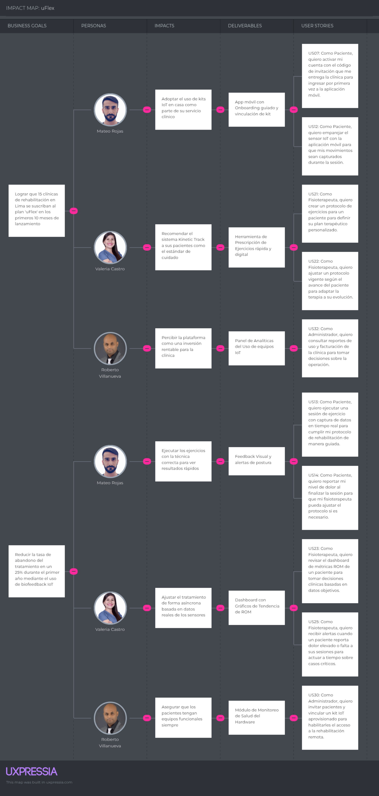

## 3.3. Product Backlog

A continuación, se presenta el Product Backlog de uFlex con todas las User Stories y Technical Stories definidas en la sección 3.1, ordenadas por valor para el negocio y estimadas con Story Points siguiendo la escala de Fibonacci (1, 2, 3, 5, 8). El orden se construyó considerando que las historias del sitio web estático (Landing Page) deben estar consideradas desde el primer sprint, seguidas por el flujo funcional principal que genera valor al paciente y al fisioterapeuta (ejecución de sesiones, supervisión clínica y aprovisionamiento de kits), luego las capacidades administrativas y de integración, y finalmente las historias transversales de autenticación, recuperación y cierre de sesión. Se priorizó el valor para el negocio sobre criterios técnicos o de seguridad, evitando colocar al inicio las historias ligadas exclusivamente a autenticación.

La herramienta utilizada para la gestión del Product Backlog de uFlex es **Jira Software**. A continuación se presenta una captura del backlog en la herramienta junto con el enlace público al tablero:

**Enlace al Product Backlog en Jira:** [https://fastpavos.atlassian.net/jira/software/projects/UF/boards/34/backlog](https://fastpavos.atlassian.net/jira/software/projects/UF/boards/34/backlog?atlOrigin=eyJpIjoiM2Y1YzMxNzZjOTkxNDkwY2IzZTYxZGQzNWZhMmUxYWEiLCJwIjoiaiJ9)

URL completa: https://fastpavos.atlassian.net/jira/software/projects/UF/boards/34/backlog?atlOrigin=eyJpIjoiM2Y1YzMxNzZjOTkxNDkwY2IzZTYxZGQzNWZhMmUxYWEiLCJwIjoiaiJ9

<table>
  <thead>
    <tr>
      <th># Orden</th>
      <th>User Story Id</th>
      <th>Título</th>
      <th>Descripción</th>
      <th>Story Points (1 / 2 / 3 / 5 / 8)</th>
    </tr>
  </thead>
  <tbody>
    <tr><td>1</td><td>US01</td><td>Exploración de la propuesta de valor</td><td>Como Visitante, quiero explorar la propuesta de valor de uFlex en la página principal para entender qué ofrece la plataforma y decidir si me interesa continuar navegando.</td><td>2</td></tr>
    <tr><td>2</td><td>US02</td><td>Consulta de contenido para pacientes</td><td>Como Visitante del segmento paciente, quiero consultar la sección "Cómo funciona para pacientes" para comprender el proceso de rehabilitación remota que ofrece uFlex.</td><td>1</td></tr>
    <tr><td>3</td><td>US03</td><td>Consulta de contenido para especialistas</td><td>Como Visitante del segmento fisioterapeuta, quiero consultar la sección "Cómo funciona para especialistas" para entender cómo uFlex apoya mi práctica clínica.</td><td>1</td></tr>
    <tr><td>4</td><td>US04</td><td>Consulta de planes y precios para clínicas</td><td>Como Visitante del segmento clínica, quiero consultar los planes y precios de uFlex para evaluar la viabilidad económica de adoptar la solución.</td><td>2</td></tr>
    <tr><td>5</td><td>US05</td><td>Solicitud de demo comercial</td><td>Como Visitante del segmento clínica, quiero solicitar una demostración comercial mediante un formulario para iniciar contacto con el equipo de uFlex.</td><td>3</td></tr>
    <tr><td>6</td><td>US06</td><td>Acceso a la descarga de la app móvil</td><td>Como Visitante, quiero acceder al enlace de descarga de la aplicación móvil de uFlex para instalarla en mi dispositivo.</td><td>1</td></tr>
    <tr><td>7</td><td>US13</td><td>Ejecución de una sesión de ejercicio</td><td>Como Paciente, quiero ejecutar una sesión de ejercicio con captura de datos en tiempo real para cumplir mi protocolo de rehabilitación de manera guiada.</td><td>8</td></tr>
    <tr><td>8</td><td>US11</td><td>Consulta de la rutina asignada del día</td><td>Como Paciente, quiero consultar la rutina de rehabilitación asignada del día para saber qué ejercicios me corresponde realizar.</td><td>3</td></tr>
    <tr><td>9</td><td>US12</td><td>Emparejamiento del sensor IoT</td><td>Como Paciente, quiero emparejar el sensor IoT con la aplicación móvil para que mis movimientos sean capturados durante la sesión.</td><td>5</td></tr>
    <tr><td>10</td><td>US23</td><td>Revisión del dashboard de métricas ROM</td><td>Como Fisioterapeuta, quiero revisar el dashboard de métricas ROM de un paciente para tomar decisiones clínicas basadas en datos objetivos.</td><td>5</td></tr>
    <tr><td>11</td><td>US21</td><td>Creación de protocolo de ejercicios</td><td>Como Fisioterapeuta, quiero crear un protocolo de ejercicios para un paciente para definir su plan terapéutico personalizado.</td><td>5</td></tr>
    <tr><td>12</td><td>US20</td><td>Listado de pacientes asignados</td><td>Como Fisioterapeuta, quiero consultar el listado de pacientes asignados para identificar rápidamente a quiénes debo atender.</td><td>3</td></tr>
    <tr><td>13</td><td>US25</td><td>Alertas clínicas por dolor o inasistencia</td><td>Como Fisioterapeuta, quiero recibir alertas cuando un paciente reporta dolor elevado o falta a sus sesiones para actuar a tiempo sobre casos críticos.</td><td>5</td></tr>
    <tr><td>14</td><td>US22</td><td>Ajuste de protocolo vigente</td><td>Como Fisioterapeuta, quiero ajustar un protocolo vigente según el avance del paciente para adaptar la terapia a su evolución.</td><td>3</td></tr>
    <tr><td>15</td><td>US14</td><td>Reporte de dolor al finalizar la sesión</td><td>Como Paciente, quiero reportar mi nivel de dolor al finalizar la sesión para que mi fisioterapeuta pueda ajustar el protocolo si es necesario.</td><td>2</td></tr>
    <tr><td>16</td><td>US24</td><td>Registro de notas clínicas</td><td>Como Fisioterapeuta, quiero registrar notas clínicas sobre la sesión de un paciente para mantener trazabilidad del seguimiento terapéutico.</td><td>2</td></tr>
    <tr><td>17</td><td>US30</td><td>Invitación de paciente y vinculación de kit IoT</td><td>Como Administrador, quiero invitar pacientes y vincular un kit IoT aprovisionado para habilitarles el acceso a la rehabilitación remota.</td><td>5</td></tr>
    <tr><td>18</td><td>US29</td><td>Gestión de fisioterapeutas de la clínica</td><td>Como Administrador, quiero registrar o desactivar fisioterapeutas de la clínica para mantener actualizado el equipo de especialistas autorizados.</td><td>3</td></tr>
    <tr><td>19</td><td>US31</td><td>Gestión de suscripción y pagos</td><td>Como Administrador, quiero gestionar la suscripción de la clínica mediante la pasarela de pagos externa para mantener activo el servicio.</td><td>5</td></tr>
    <tr><td>20</td><td>US32</td><td>Consulta de reportes de uso de la clínica</td><td>Como Administrador, quiero consultar reportes de uso y facturación de la clínica para tomar decisiones sobre la operación.</td><td>3</td></tr>
    <tr><td>21</td><td>US15</td><td>Consulta del histórico de progreso</td><td>Como Paciente, quiero consultar mi histórico de progreso para ver mi evolución en términos de adherencia y rango articular.</td><td>3</td></tr>
    <tr><td>22</td><td>US33</td><td>Configuración del perfil de la clínica</td><td>Como Administrador, quiero configurar el perfil y los datos institucionales de la clínica para personalizar la experiencia dentro de la plataforma.</td><td>2</td></tr>
    <tr><td>23</td><td>US16</td><td>Recordatorio de sesiones pendientes</td><td>Como Paciente, quiero recibir recordatorios de mis sesiones pendientes para no omitir ejercicios de mi rutina.</td><td>2</td></tr>
    <tr><td>24</td><td>US07</td><td>Activación de cuenta con código de invitación</td><td>Como Paciente, quiero activar mi cuenta con el código de invitación que me entrega la clínica para ingresar por primera vez a la aplicación móvil.</td><td>3</td></tr>
    <tr><td>25</td><td>US08</td><td>Inicio de sesión del paciente</td><td>Como Paciente, quiero iniciar sesión en la aplicación móvil con mis credenciales para acceder a mi rutina de rehabilitación.</td><td>2</td></tr>
    <tr><td>26</td><td>US17</td><td>Inicio de sesión del fisioterapeuta</td><td>Como Fisioterapeuta, quiero iniciar sesión en la aplicación web para acceder al panel de supervisión de mis pacientes.</td><td>2</td></tr>
    <tr><td>27</td><td>US26</td><td>Inicio de sesión del administrador</td><td>Como Administrador, quiero iniciar sesión en el panel administrativo para gestionar la operación de mi clínica en uFlex.</td><td>2</td></tr>
    <tr><td>28</td><td>TS34</td><td>Endpoint de registro de sesiones de rehabilitación</td><td>Como Developer, quiero consumir el endpoint POST /api/v1/sessions para registrar una sesión de rehabilitación de un paciente desde los clientes móviles.</td><td>3</td></tr>
    <tr><td>29</td><td>TS36</td><td>Envío de telemetría al Edge API</td><td>Como Developer, quiero enviar datos inerciales del sensor al Edge API mediante POST /edge/telemetry para que sean procesados antes de su persistencia en el backend central.</td><td>5</td></tr>
    <tr><td>30</td><td>TS35</td><td>Endpoint de consulta de métricas del paciente</td><td>Como Developer, quiero consumir el endpoint GET /api/v1/patients/{id}/metrics para obtener el histórico ROM de un paciente en los clientes web y móvil.</td><td>3</td></tr>
    <tr><td>31</td><td>TS37</td><td>Autenticación JWT con filtro multitenant</td><td>Como Developer, quiero autenticar las solicitudes al API mediante JWT y aplicar un filtro multitenant para garantizar que cada usuario opere únicamente sobre los recursos de su clínica.</td><td>5</td></tr>
    <tr><td>32</td><td>TS38</td><td>Integración con la pasarela de pagos externa</td><td>Como Developer, quiero integrar la pasarela de pagos externa (Culqi) para activar y renovar las suscripciones de las clínicas.</td><td>5</td></tr>
    <tr><td>33</td><td>TS39</td><td>Envío de notificaciones transaccionales</td><td>Como Developer, quiero enviar notificaciones transaccionales por correo a través de un proveedor externo cuando ocurran eventos relevantes del dominio.</td><td>3</td></tr>
    <tr><td>34</td><td>US09</td><td>Recuperación de contraseña del paciente</td><td>Como Paciente, quiero recuperar mi contraseña cuando la olvido para volver a acceder a la aplicación móvil y continuar con mi rutina.</td><td>2</td></tr>
    <tr><td>35</td><td>US18</td><td>Recuperación de contraseña del fisioterapeuta</td><td>Como Fisioterapeuta, quiero recuperar mi contraseña cuando la olvido para volver a acceder al panel clínico sin depender del administrador.</td><td>2</td></tr>
    <tr><td>36</td><td>US27</td><td>Recuperación de contraseña del administrador</td><td>Como Administrador, quiero recuperar mi contraseña cuando la olvido para volver a acceder al panel administrativo de mi clínica.</td><td>2</td></tr>
    <tr><td>37</td><td>US10</td><td>Cierre de sesión del paciente</td><td>Como Paciente, quiero cerrar mi sesión en la aplicación móvil para proteger mi información cuando termino de usar la app.</td><td>1</td></tr>
    <tr><td>38</td><td>US19</td><td>Cierre de sesión del fisioterapeuta</td><td>Como Fisioterapeuta, quiero cerrar mi sesión en la aplicación web para proteger la información clínica de mis pacientes.</td><td>1</td></tr>
    <tr><td>39</td><td>US28</td><td>Cierre de sesión del administrador</td><td>Como Administrador, quiero cerrar mi sesión en el panel administrativo para proteger la información operativa de mi clínica.</td><td>1</td></tr>
  </tbody>
</table>

# Capítulo IV: Solution Software Design

## 4.1. Strategic-Level Domain-Driven Design

En esta sección se aborda la perspectiva estratégica del enfoque Domain-Driven Design (DDD), la cual se centra en definir los límites del dominio y establecer una visión clara de cómo las diferentes partes del sistema interactúan entre sí. A través de técnicas como Event Storming, Context Mapping y la definición de una arquitectura de software adecuada, se busca garantizar que el diseño del sistema esté alineado con los objetivos del negocio y las necesidades de los usuarios.

### 4.1.1. Design-Level EventStorming

El Event Storming se llevó a cabo en una sesión colaborativa con la participación de cinco miembros del equipo, incluyendo un facilitador y un relator. Durante la sesión, se utilizaron notas adhesivas de colores para representar eventos de dominio, comandos, agregados y otros elementos clave del sistema. El objetivo principal fue capturar una visión integral del flujo de eventos dentro del dominio educativo, identificar puntos críticos y descubrir posibles bounded contexts.

A continuación, se detallan los pasos seguidos y los resultados obtenidos en cada una de las fases del Event Storming.

**Antes de la sesión:**

Primero, se preparó el espacio de trabajo con un mural digital (Miro) y se definieron las reglas básicas para la participación. Se estableció que todas las ideas eran bienvenidas y que el objetivo era fomentar la colaboración y la creatividad.

**Durante la sesión:**

1. **Unstructured Exploration:** Se comenzó con una lluvia de ideas para identificar eventos de dominio relevantes. Cada participante escribió eventos en notas adhesivas y las colocó en el mural, sin preocuparse inicialmente por el orden o la estructura.

    

2. **Timelines:** Se organizó la secuencia temporal de los eventos identificados, creando una línea de tiempo que reflejaba el flujo natural del dominio. Se agruparon eventos relacionados y se identificaron interacciones clave.

    

3. **Pain points:** Se identificaron puntos de dolor y áreas de incertidumbre dentro del flujo de eventos. Estos puntos se marcaron con notas de color diferente para destacarlos y facilitar su análisis posterior.

    

4. **Pivotal points:** Se destacaron eventos clave que representaban cambios significativos en el estado del sistema o que tenían un impacto considerable en el negocio. Estos eventos se utilizaron como referencia para definir los límites de los bounded contexts.

    

5. **Commands:** Se añadieron comandos que desencadenaban los eventos identificados. Esto ayudó a clarificar las acciones que los usuarios o sistemas externos podían realizar dentro del dominio.

    

6. **Policies:** Se definieron políticas que regulaban cómo y cuándo se ejecutaban ciertos comandos o eventos, estableciendo reglas de negocio claras.

    

7. **Read models:** Se identificaron modelos de lectura necesarios para consultar el estado del sistema y presentar información relevante a los usuarios.

    

8. **External systems:** Se mapearon sistemas externos que interactuaban con el dominio, identificando puntos de integración y comunicación.

    

9. **Aggregates:** Se agruparon eventos y comandos en agregados, definiendo las unidades de consistencia dentro del dominio.

    

10. **Bounded Contexts:** Finalmente, se delinearon los límites de los bounded contexts basados en los eventos, agregados y puntos clave identificados. Esta agrupación en clústeres permitirá discutir y clasificar los contexts en Core, Supporting y Generic.

    

#### 4.1.1.1 Candidate Context Discovery

En esta sección se describe el proceso seguido por el equipo para descubrir los bounded contexts candidatos de uFlex a partir del Design-Level EventStorming. El objetivo fue identificar límites naturales del dominio de telerehabilitación, priorizar las partes con mayor valor estratégico para el negocio y preparar una base clara para el modelado posterior (Domain Message Flows y Bounded Context Canvases).

La sesión se realizó en Miro con una duración aproximada de 1 hora 45 minutos (dentro del límite recomendado de 2 horas). Como insumos se utilizaron la línea de tiempo de eventos, los comandos asociados, los actores identificados y los puntos de dolor detectados en la sesión anterior.

**Técnica aplicada: Start-with-Value (complementada con Look-for-Pivotal-Events)**

Se priorizó Start-with-Value para ubicar primero los flujos que diferencian a uFlex en el mercado: monitoreo biomecánico remoto, retroalimentación en tiempo real y continuidad terapéutica basada en datos. De forma complementaria, se revisaron eventos pivote para detectar cambios de estado entre subdominios (por ejemplo: activación de plan, inicio/cierre de sesión terapéutica, alertas de movimiento anómalo, y estado del kit IoT).

El proceso se organizó en tres pasos documentados:

1. **Identificación de valor estratégico:** cada miembro del equipo respondió a la pregunta: “¿Qué parte del sistema genera directamente valor para los usuarios y diferencia la solución de otras similares?”. 

   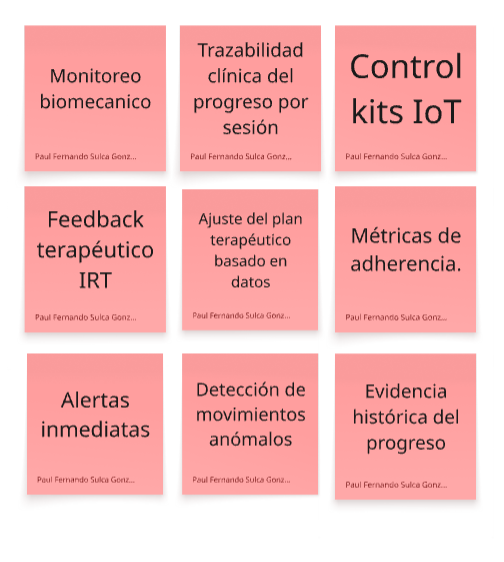

2. **Agrupación de eventos en torno al valor:** luego se agruparon los eventos por afinidad de negocio y cohesión funcional, emergiendo clústeres naturales alrededor de identidad y acceso, organización clínica, suscripción, planificación terapéutica, ciclo de vida de dispositivos y ejecución de terapia.

   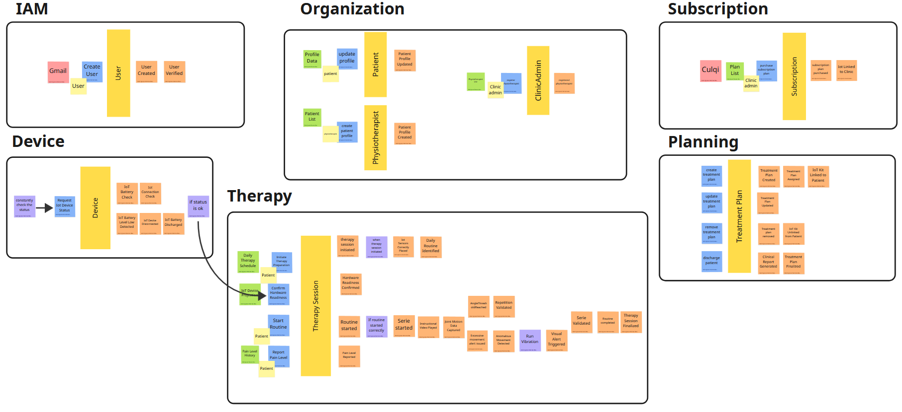

3. **Clasificación Core, Supporting y Generic:** con los clústeres ya estabilizados, se clasificaron los candidate contexts según su aporte de diferenciación al negocio y su rol dentro del ecosistema. En esta fase se distinguieron los contextos núcleo que sostienen la propuesta de valor clínica de uFlex, los contextos de soporte operacional y los contextos genéricos de plataforma.

   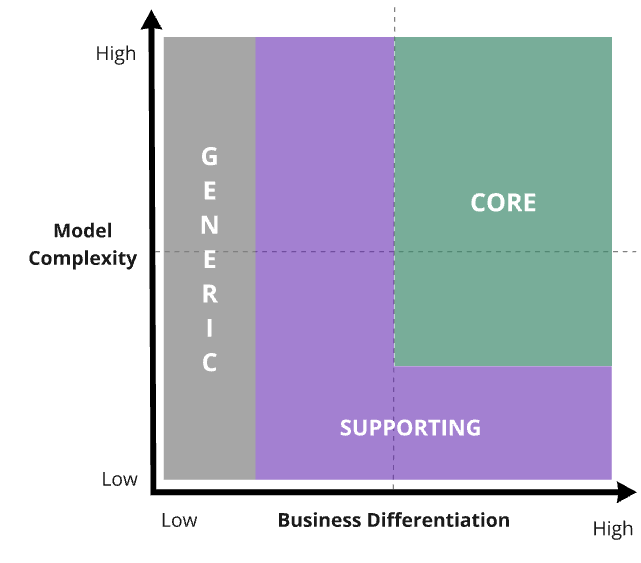

Con esta tercera iteración, el equipo dejó una base consistente para pasar al detalle de candidate contexts y su justificación estratégica en la siguiente subsección.

**Candidate Contexts identificados**

Como resultado de la sesión, se identificaron seis bounded contexts candidatos para uFlex:

| Candidate Context | Eventos clave asociados | Clasificación | Descripción | Justificación |
|---|---|---|---|---|
| IAM | `Create User`, `User Created`, `User Verified` | Generic | Gestión de identidad, autenticación y acceso por rol. | Es transversal y necesario para operar, pero no representa diferenciación de negocio en telerehabilitación. |
| Organization | `Patient Profile Created`, `Patient Profile Updated`, `Physiotherapist Registered` | Supporting | Administración de perfiles clínicos y estructura organizacional de la clínica. | Sostiene la operación multiusuario y multirol, habilitando la trazabilidad de pacientes y especialistas. |
| Subscription | `Purchase Subscription Plan`, `Subscription Plan Purchased`, `IoT Linked To Clinic` | Supporting | Gestión comercial del plan contratado y habilitación operativa de la clínica. | Es clave para monetización y activación del servicio, aunque no constituye el núcleo clínico diferencial. |
| Planning | `Treatment Plan Created`, `Treatment Plan Assigned`, `Treatment Plan Updated`, `Treatment Plan Removed`, `Treatment Plan Finalized` | Core | Ciclo de vida del plan terapéutico y su asignación a cada paciente. | Define la estrategia clínica personalizada y conecta la prescripción con la ejecución terapéutica remota. |
| Device | `IoT Kit Registered`, `IoT Kit Linked To Patient`, `IoT Kit Calibrated`, `IoT Battery Low Level Detected`, `IoT Device Disconnected` | Supporting | Gestión de estado, vinculación y salud operativa de dispositivos IoT. | Es indispensable para la continuidad técnica de la terapia remota y la calidad de captura de datos. |
| Therapy | `Therapy Session Initiated`, `Routine Started`, `Joint Motion Data Captured`, `Repetition Validated`, `Anomalous Movement Detected`, `Visual Alert Triggered`, `Pain Level Reported`, `Routine Completed`, `Therapy Session Finalized` | Core | Orquestación de la sesión terapéutica y procesamiento de señales biomecánicas en tiempo real. | Contiene la propuesta de valor principal de uFlex: monitoreo objetivo, feedback inmediato y trazabilidad clínica del progreso. |

**Clasificación estratégica**

Como parte del análisis Start-with-Value, se representó gráficamente la clasificación de los bounded contexts en una matriz de dos ejes:

- **Business Differentiation** (eje X): grado en que el contexto aporta valor estratégico o diferenciación frente a otras soluciones.
- **Model Complexity** (eje Y): nivel de complejidad requerido para implementar y mantener el contexto.

En esta matriz de clasificación de bounded contexts, se distribuyeron los contextos en los tres tipos:

- **Core:** `Planning`, `Therapy`.
- **Supporting:** `Organization`, `Subscription`, `Device`.
- **Generic:** `IAM`.

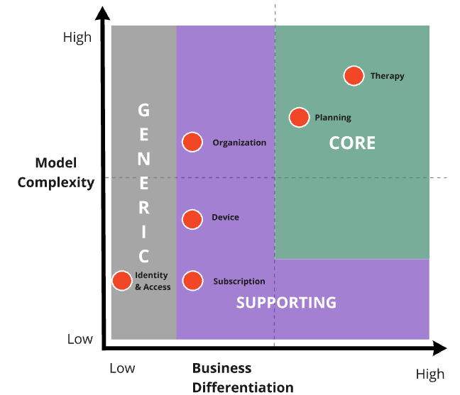

**Resultados**

Se definieron seis bounded contexts candidatos, de los cuales:

- 2 Core (`Planning`, `Therapy`).
- 3 Supporting (`Organization`, `Subscription`, `Device`).
- 1 Generic (`IAM`).

La aplicación de la técnica Start-with-Value permitió asegurar que la atención principal del diseño táctico se concentre en `Therapy` y `Planning`, dado que allí reside la propuesta de valor diferenciadora de uFlex: monitoreo biomecánico en tiempo real y continuidad terapéutica basada en datos.

El resto de contexts se modelan en las siguientes secciones mediante Domain Message Flows y Bounded Context Canvases, garantizando consistencia y claridad en la arquitectura estratégica.

#### 4.1.1.2 Domain Message Flows Modeling

El Domain Storytelling es una técnica visual y colaborativa que facilita la exploración del conocimiento dentro del dominio del negocio, cuyo propósito principal es generar una comprensión común sobre lo que se desarrolla en un proceso específico, involucrando tanto a los expertos del negocio como a los equipos técnicos.

En este sentido, elaboramos los domain storytelling tomando como referencia las interacciones entre los bounded contexts, con el fin de analizar y comprender de manera más clara la lógica del negocio.

**Escenario 1:** Clínica adquiere suscripción y activa operación

**Objetivo:** El Administrador de la Clínica compra un plan para habilitar el uso de la plataforma y vincular hardware.

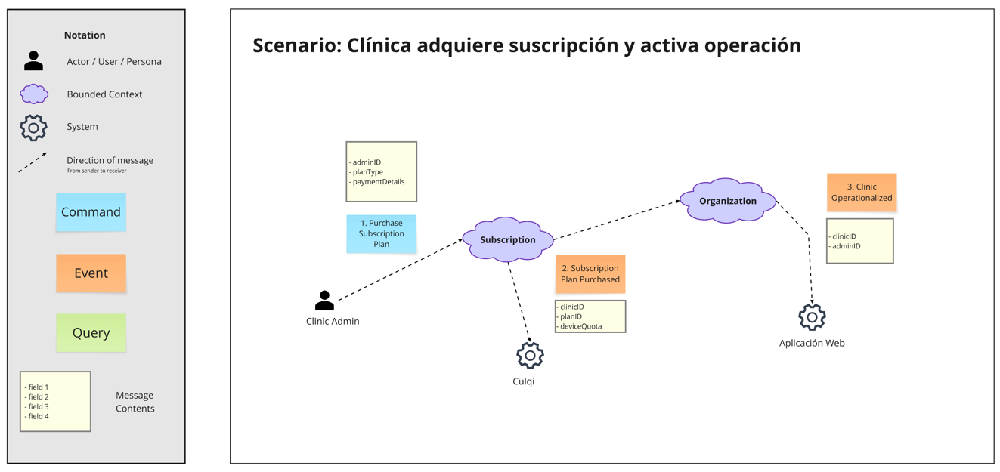

**Escenario 2:** Registro de Fisioterapeuta y asignación de credenciales

**Objetivo:** El Administrador registra a un nuevo Fisioterapeuta en la plataforma, asignándole credenciales de acceso para que pueda supervisar pacientes.

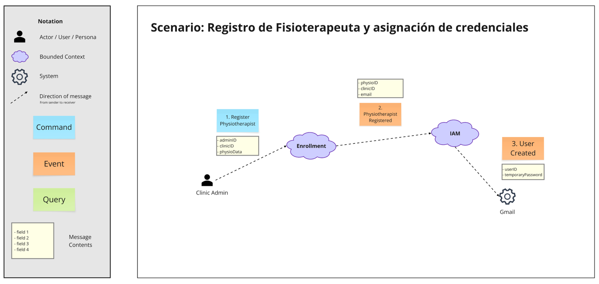

**Escenario 3:** Creación de Plan de Tratamiento y asignación de Kit IoT

**Objetivo:** El Fisioterapeuta crea un plan de tratamiento para un paciente y asigna un kit IoT para que el paciente pueda ejecutar su rutina de rehabilitación remota.

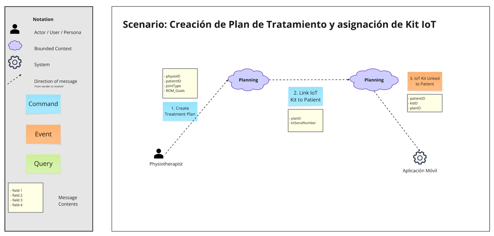

**Escenario 4:** Verificación de estado de hardware previo a Terapia

**Objetivo:** El sistema asegura que el sensor tiene batería y conexión antes de iniciar la sesión de terapia para garantizar la captura de datos en tiempo real.

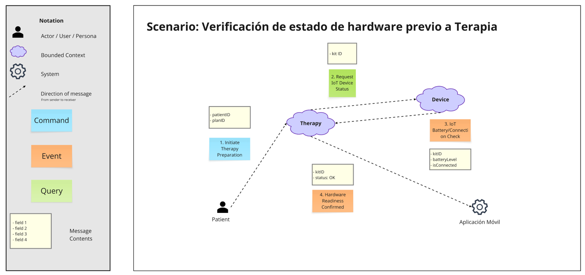

**Escenario 5:** Ejecución de Terapia con detección de compensaciones

**Objetivo:** Monitorear el movimiento en tiempo real y alertar si hay "trampa" (movimiento anómalo).

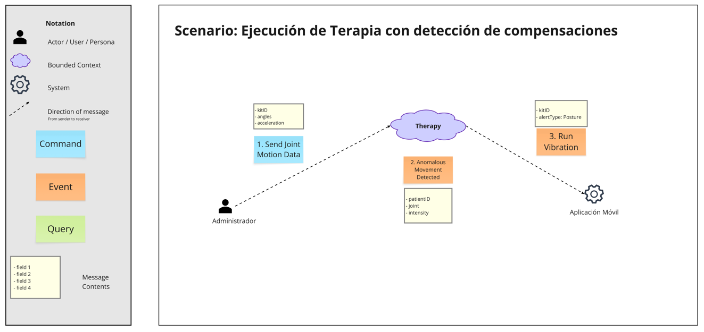

**Escenario 6:** Finalización de sesión y actualización de progreso

**Objetivo:** Cerrar la sesión y enviar los datos para que el médico los analice y ajuste el plan de tratamiento si es necesario.

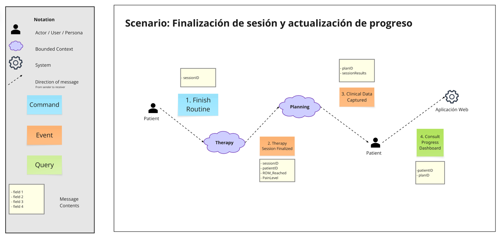

#### 4.1.1.3 Bounded Context Canvases

En esta sección el equipo presenta sus Bounded Context Canvases, empezando por los
importantes.

##### IAM

Contexto génerico para la identificación y acceso.

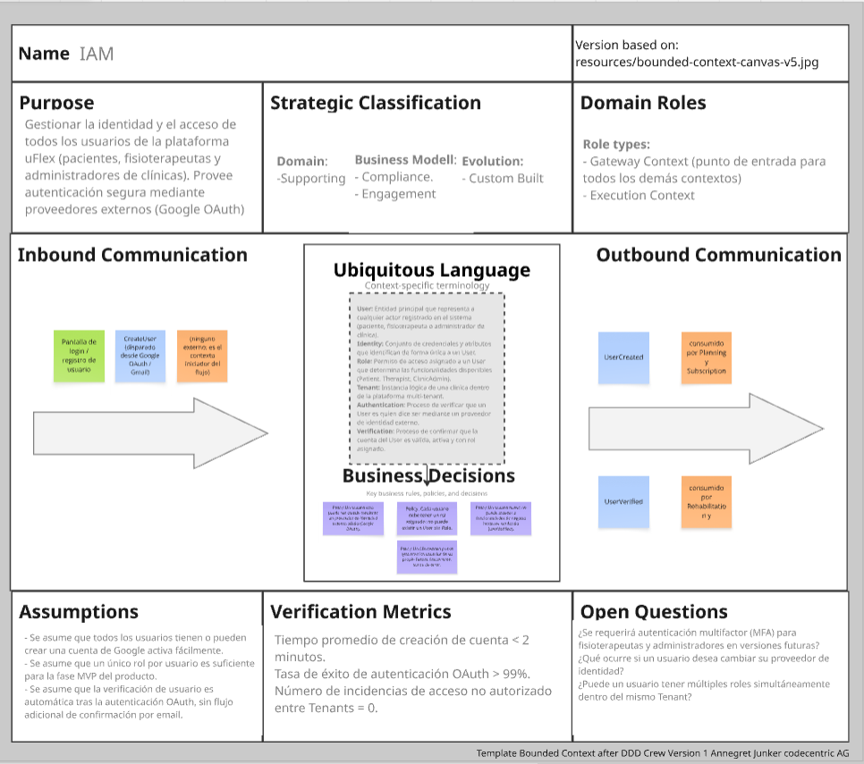

##### Organization

Encargado de gestionar la información personal de cada usuario registrado en la aplicación.

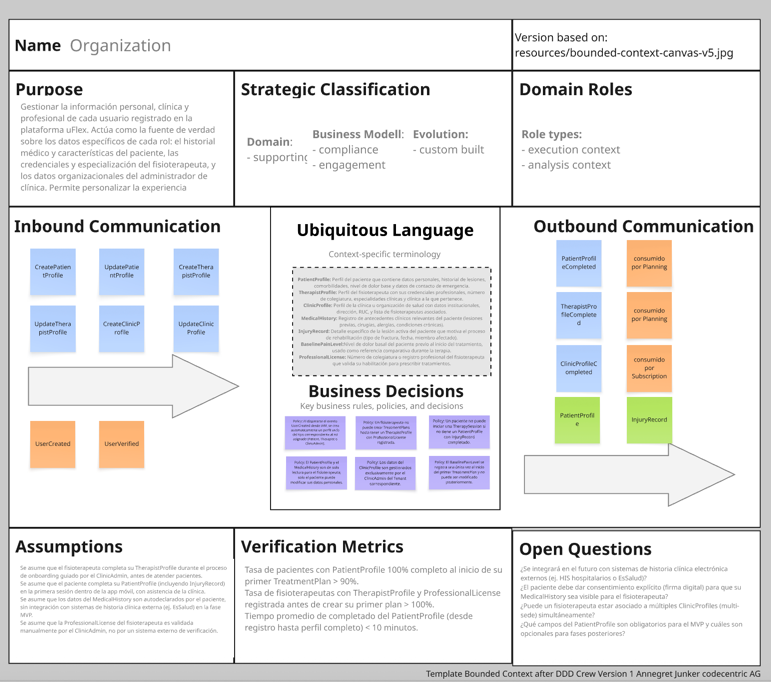

##### Subscription

Encargado de gestionar la adquisición y activación de los planes de suscripción.

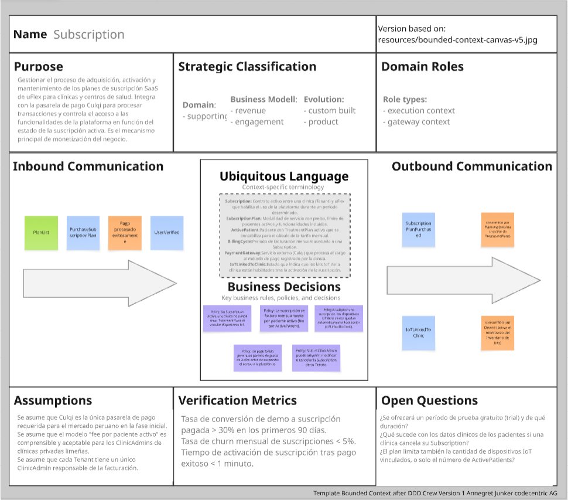

##### Planning

Encargado del ciclo de vida de los planes de tratamiento de los pacientes.

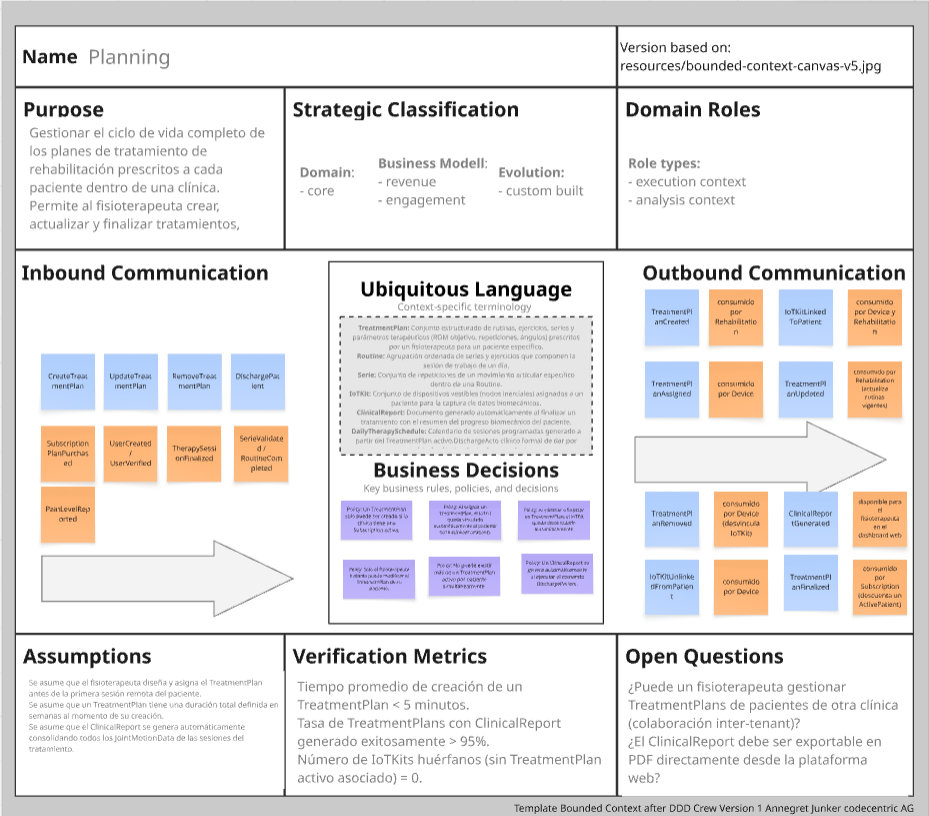

##### Device

Encargado del ciclo de vida de los dispositivos IOT.

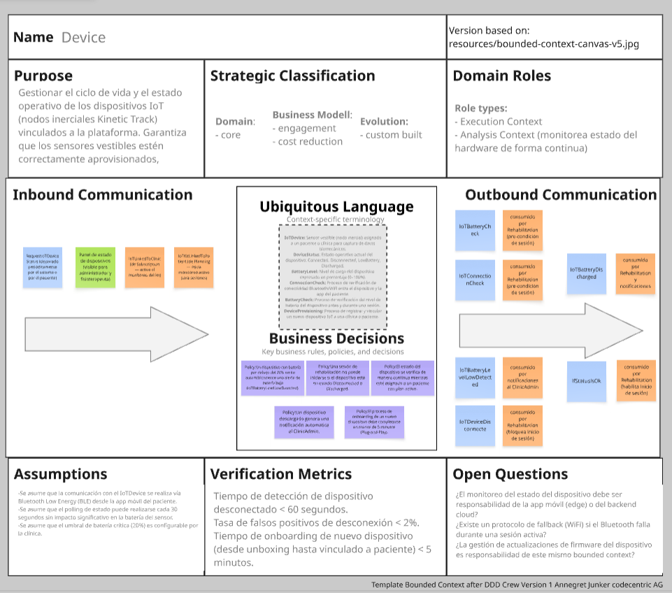

##### Therapy

Encargado de orquestar cada sesión de cada terapia física ejecutada por el paciente.

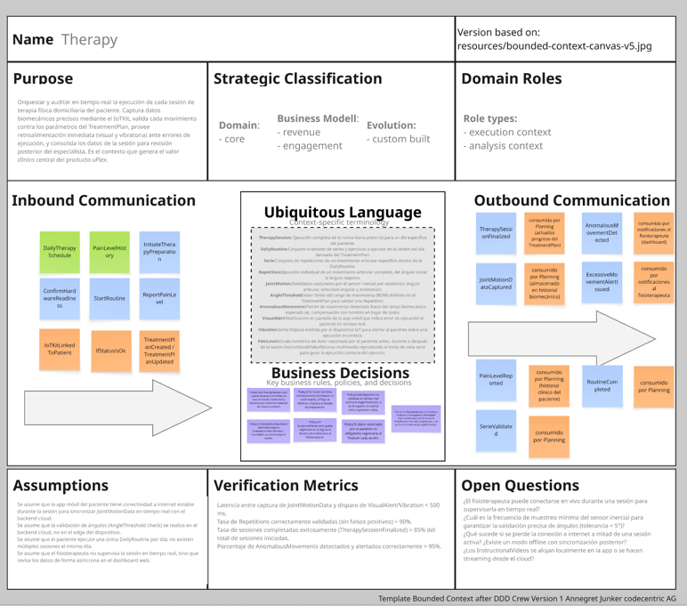

### 4.1.2. Context Mapping

Como equipo, realizamos sesiones de trabajo colaborativo para definir las relaciones estructurales entre nuestros *Bounded Contexts*. Para garantizar una arquitectura robusta, cuestionamos nuestras decisiones iniciales mediante un análisis de tipo "What-if":

* **¿Qué pasaría si fusionamos el contexto de *Device* con el de *Therapy*?**
    * *Análisis:* Se descartó esta opción. El contexto de *Device* maneja telemetría cruda y protocolos de hardware que son volátiles. Fusionarlos contaminaría nuestro *Core Domain* (*Therapy*) con detalles técnicos innecesarios, dificultando el mantenimiento a largo plazo.
* **¿Qué pasaría si creamos un *Shared Kernel* para los datos de pacientes entre *Organization* y *Therapy*?**
    * *Análisis:* Se decidió no aplicar esta alternativa. El uso de un *Shared Kernel* implica un acoplamiento excesivo entre equipos de desarrollo. Preferimos establecer una relación *Customer/Supplier* para mantener la independencia entre los dominios.
* **¿Qué pasaría si el contexto de *Subscription* expusiera un servicio directo a *Therapy*?**
    * *Análisis:* Se concluyó que no es necesario. *Planning* actúa como un filtro natural y validador de los estados de suscripción antes de permitir la ejecución de una rutina. Esto mantiene a *Therapy* enfocado exclusivamente en la ejecución clínica.
* **¿Qué pasaría si *IAM* gestionara permisos personalizados dentro de cada contexto?**
    * *Análisis:* Se descartó por redundancia. Se optó por una interfaz centralizada para evitar la duplicidad de lógica de seguridad en todo el sistema.

A continuación, se describen las relaciones establecidas en nuestro diseño:

* **IAM hacia Todos los contextos (Patrón: Open Host Service - OHS):**
    * *IAM* actúa como un servicio base unificado. Todos los demás contextos consumen su API para la validación de identidad. El uso de *OHS* garantiza que la interfaz de autenticación sea estable y transversal, sin exponer la lógica interna de almacenamiento de credenciales.
* **Organization hacia Planning / Therapy (Patrón: Customer/Supplier - C/S):**
    * *Organization* provee los perfiles clínicos (pacientes y especialistas). *Planning* y *Therapy* actúan como consumidores (*Customers*) que requieren estos datos para operar. Sin estos perfiles, los contextos *Core* no tienen contexto de sobre quién ejecutar la terapia.
* **Subscription hacia Planning (Patrón: Customer/Supplier - C/S):**
    * El contexto de *Planning* valida el estado comercial del cliente antes de permitir la creación de nuevos planes terapéuticos. Esta relación asegura que el acceso al servicio esté alineado con el plan contratado.
* **Device hacia Therapy (Patrón: Anti-corruption Layer - ACL):**
    * Esta es una relación crítica para proteger nuestro *Core Domain*. La capa *ACL* actúa como un traductor que convierte las señales técnicas crudas (voltaje, frecuencia) provenientes de los dispositivos IoT en conceptos clínicos (ángulos de articulación, validación de repeticiones) que *Therapy* puede procesar.
* **Planning hacia Therapy (Patrón: Customer/Supplier - C/S):**
    * *Planning* entrega la configuración y *Therapy* la ejecuta. Existe una separación clara de responsabilidades: uno gestiona la estrategia clínica y el otro la ejecución en tiempo real.

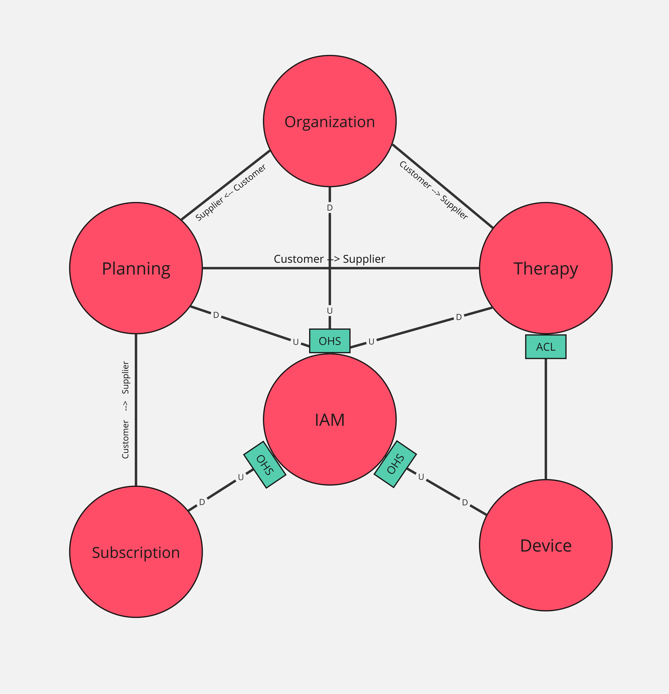

Como se observa en el diagrama, hemos priorizado la protección de nuestros contextos *Core* (*Therapy* y *Planning*). La implementación de un *Anti-corruption Layer* (ACL) entre *Device* y *Therapy* es fundamental. Esto evita que cualquier cambio futuro en el hardware del dispositivo impacte nuestra lógica de negocio principal, permitiendo que *uFlex* evolucione su tecnología sin corromper su modelo clínico.

### 4.1.3. Software Architecture

#### 4.1.3.1. Software Architecture System Landscape Diagram

El System Landscape Diagram presenta una vista de alto nivel del ecosistema tecnológico en el que opera uFlex, el producto insignia de la startup KinIoT. A diferencia del Context Diagram —que enfoca a uFlex como un único sistema— el Landscape descompone a uFlex en los cuatro sub-sistemas que conforman su portafolio técnico y muestra cómo estos interactúan entre sí y con el ecosistema externo. Su propósito es ofrecer a cualquier lector, técnico o no, una comprensión rápida y completa del alcance del producto y sus integraciones.

Dentro del *Enterprise Boundary* de KinIoT se distinguen cuatro sistemas propios: **uFlex Web Platform** (landing público y PWA clínica desplegados en Vercel, usados por fisioterapeutas y administradores de clínica), **uFlex Mobile Platform** (apps nativas iOS y Android por las cuales el paciente ejecuta sus rutinas y recibe retroalimentación biomecánica), **uFlex Wearable Platform** (hardware propio de KinIoT: el sensor IMU vestible junto con su firmware embebido en C++ y la capa edge en Python que procesa las señales en tiempo real) y **uFlex Clinical Cloud** (los microservicios Spring Boot y las bases de datos Azure que orquestan sesiones clínicas, suscripciones multi-tenant, analítica y notificaciones). Las interacciones internas se visualizan explícitamente: la Mobile Platform se comunica con el Wearable vía BLE y con el Clinical Cloud vía HTTPS; la Web Platform también consume las APIs clínicas; y el Wearable envía datos anonimizados directamente al Cloud.

El ecosistema externo se agrupa en tres categorías diferenciadas por color para que el lector identifique de un vistazo el rol de cada proveedor. En gris se encuentran los **SaaS core** (Supabase para autenticación OAuth e identidad, Culqi para pagos de suscripción y Resend para correos transaccionales), integraciones de negocio sin las cuales uFlex no puede operar. En azul-grisáceo se muestran los **servicios de plataforma y observabilidad** (FCM/APNs para notificaciones push al paciente y Azure Monitor / Application Insights para telemetría del backend), que soportan la operación técnica sin ser parte del dominio. En un gris azulado más claro aparece la **integración planificada** con el EHR de la clínica, representando en el roadmap la futura exportación de informes biomecánicos al expediente oficial del paciente.

Los tres actores que interactúan con uFlex en este nivel son el **paciente** (toca tres sistemas: navega el landing antes de registrarse, usa la app móvil para las rutinas y el sensor vestible durante los ejercicios), el **fisioterapeuta** (accede a la PWA para supervisar sesiones y ajustar protocolos) y el **administrador de clínica** (gestiona sedes, usuarios y suscripción desde la misma PWA). Esta distribución refleja la realidad clínica: el paciente es quien genera los datos en casa, mientras que el staff clínico los consume y los convierte en decisiones terapéuticas.

  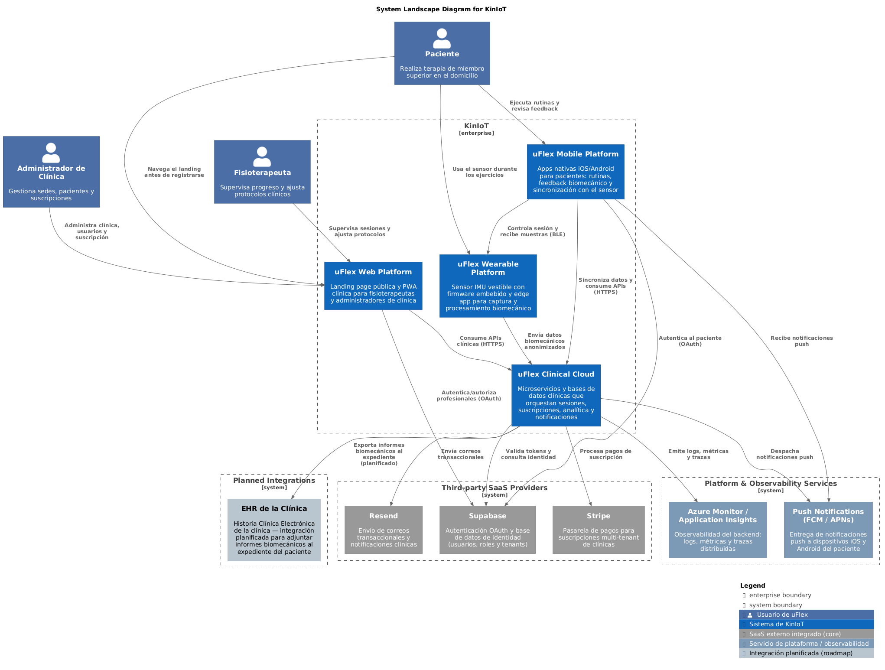

*Figura 4.1.3.1. Diagrama de Paisaje (System Landscape) del ecosistema KinIoT — uFlex descompuesto en sus cuatro sub-sistemas, junto a sus proveedores SaaS, servicios de plataforma e integraciones planificadas.*

#### 4.1.3.2. Software Architecture Context Level Diagrams

El diagrama de contexto de uFlex muestra a los tres actores operativos que interactúan directamente con la plataforma (paciente, fisioterapeuta y administrador de clínica), el sistema uFlex como unidad en foco —que encapsula los sensores IMU vestibles, el firmware embebido, la app móvil y el backend cloud— y los tres servicios externos con los que se integra: Supabase (OAuth), Culqi (pagos) y Resend (correos transaccionales).

  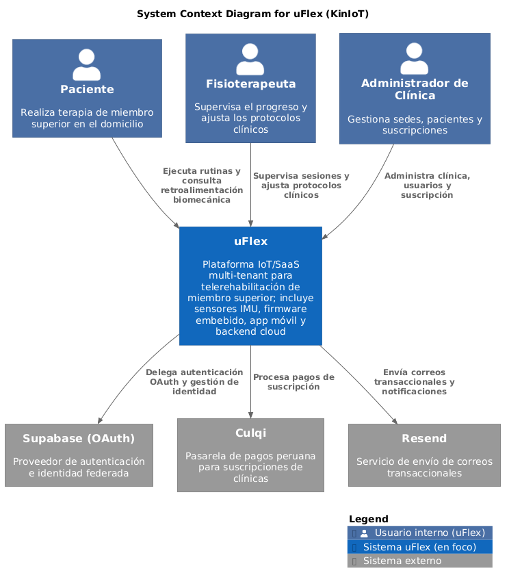

*Figura 4.1.3.2. Diagrama de contexto (C4 Nivel 1) de uFlex.*

#### 4.1.3.3. Software Architecture Container Level Diagrams

El diagrama de contenedores detalla la arquitectura interna de uFlex, organizada en tres capas: la capa IoT & Edge (sensor IMU vestible, firmware embebido, procesamiento biomecánico en el edge y buffer local), la capa de aplicaciones cliente (app móvil nativa del paciente y PWA web para fisioterapeutas y administradores de clínica) y la capa de servicios backend (microservicios de identidad, sesiones de terapia, tendencias clínicas, suscripciones, analítica y notificaciones, cada uno con su base de datos). El IAM Service actúa como capa delgada sobre Supabase para enriquecer los perfiles con rol clínico y clínica asociada. El API Gateway centraliza el enrutamiento entre clientes y servicios, y las integraciones externas con Supabase (OAuth), Culqi (pagos) y Resend (correos) se muestran fuera del límite del sistema.

  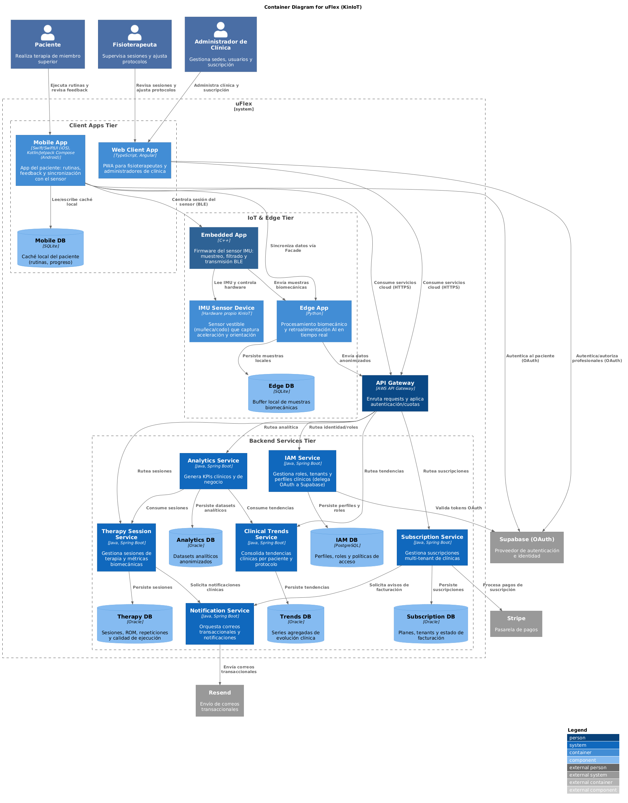

*Figura 4.1.3.3. Diagrama de contenedores (C4 Nivel 2) de uFlex.*

#### 4.1.3.4. Software Architecture Deployment Diagrams

El Deployment Diagram muestra cómo los contenedores lógicos definidos en la sección anterior se despliegan físicamente sobre la infraestructura real de producción. Su propósito es responder a la pregunta "¿dónde corre cada pieza de software?" y es especialmente útil para el equipo de operaciones, DevOps y soporte, ya que explicita los dispositivos, proveedores cloud y protocolos de comunicación entre cada capa.

El diagrama se organiza en cuatro zonas de despliegue claramente diferenciadas. La primera es el **Entorno Local (Paciente / Clínica)**, que agrupa los tres nodos que viven físicamente fuera de la nube: el **IMU Sensor Device** (hardware propio de KinIoT con el firmware embebido en C++), el **Smartphone del Paciente** (iOS 17+ o Android 13+ corriendo la Mobile App y su Mobile DB en SQLite) y el **Edge Server** (una laptop Ubuntu/Windows conectada a la LAN local que ejecuta la Edge App en Python y el Edge DB en SQLite para el procesamiento biomecánico en tiempo real). La comunicación entre el sensor y el smartphone se realiza por **BLE**, y entre el smartphone y el edge por **WiFi / HTTPS** dentro de la red local.

La segunda zona es **Vercel** (Edge Network / CDN global), donde se despliegan la **Landing Page** (TypeScript / Next.js como sitio público estático) y la **Web Client App** (PWA Angular para fisioterapeutas y administradores de clínica). La tercera zona es **Microsoft Azure Cloud** en la región Brazil South, que concentra todo el backend: **Azure API Management** como gateway PaaS que enruta tráfico, valida JWT y aplica cuotas; **Azure Container Apps Environment** como runtime gestionado donde corren los cinco microservicios Java/Spring Boot (Therapy Session, Clinical Trends, Subscription, Analytics y Notification Services) —representados por simplicidad como un solo bloque "uFlex Microservices"—; **Azure Database for PostgreSQL Flexible Server** que hospeda las cuatro bases de datos de dominio (Therapy, Trends, Subscription y Analytics); y **Azure Monitor / Application Insights** para la observabilidad del backend (logs, métricas y trazas distribuidas).

La cuarta zona agrupa a los **Third-party SaaS Providers**: Supabase (que concentra la autenticación OAuth y la base de datos de identidad), Culqi (pasarela de pagos peruana para las suscripciones multi-tenant de clínicas) y Resend (envío de correos transaccionales). Todas las comunicaciones entre zonas viajan por **HTTPS**, salvo la conexión interna entre los microservicios y la base de datos, que usa **JDBC/SSL**. Este nivel de detalle permite, por ejemplo, identificar qué latencia esperar en cada salto, qué firewall o grupo de seguridad proteger, y qué credenciales/secretos rotar en cada integración.

  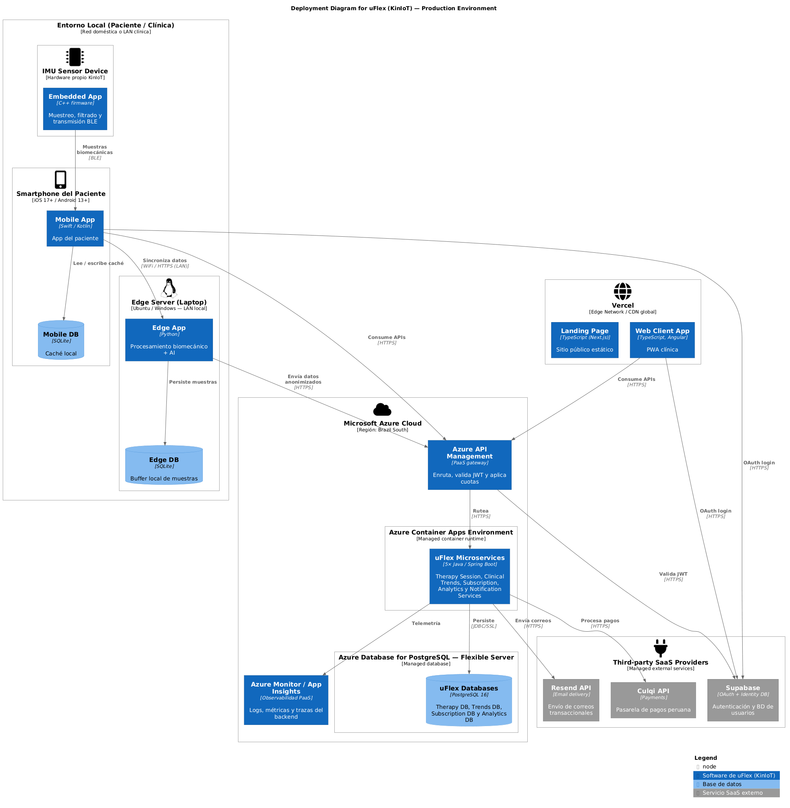

*Figura 4.1.3.4. Diagrama de Despliegue (Deployment) de uFlex — distribución física de contenedores sobre el entorno local del paciente, Vercel, Microsoft Azure y los proveedores SaaS de terceros.*

## 4.2. Tactical-Level Domain-Driven Design

En esta sección se aborda la perspectiva táctica del enfoque Domain-Driven Design (DDD), la cual se centra en representar el dominio del negocio mediante elementos concretos de software. A partir de los límites definidos en el diseño estratégico, se modelan entidades, objetos de valor, servicios y otros componentes clave que encapsulan las reglas del dominio y responden a las necesidades del sistema. Este nivel permite estructurar la solución de manera más alineada con los procesos y problemáticas reales, garantizando una implementación coherente y sostenible.

Cada bounded context contará con su propio apartado, donde se detallará cómo estos elementos se articulan para gestionar los flujos de aplicación, facilitar la interacción con sistemas externos y contribuir al objetivo central de la solución.

### 4.2.1. Bounded Context: IAM

El bounded context **IAM (Identity and Access Management)** concentra todo lo relacionado con la identidad de los usuarios de uFlex y su rol dentro del ecosistema clínico. A diferencia de Supabase —que actúa como identity provider externo y responsable de la autenticación OAuth— el BC IAM se encarga del **perfil enriquecido** del usuario dentro del dominio: su rol clínico (Paciente, Fisioterapeuta o Administrador de Clínica), su clínica asociada y su ciclo de vida (pendiente de verificación, verificado, suspendido). La relación con Supabase se implementa mediante un Anti-Corruption Layer (ACL), de modo que un cambio en la API de Supabase no contamine el modelo de dominio. Los comandos y eventos emitidos por este BC (`CreateUserCommand`, `VerifyUserCommand`, `UserCreatedEvent`, `UserVerifiedEvent`) fueron identificados durante el Design-Level EventStorming.

#### 4.2.1.1. Domain Layer

En esta sección se describen los elementos del Domain Layer del contexto de IAM, que son necesarios para modelar la gestión de identidades y accesos dentro de uFlex. Estos componentes definen las reglas de negocio y las invariantes asociadas a la autenticación, autorización y administración de usuarios en la plataforma clínica multi-tenant.

**1. User (Aggregate Root)**

Representa al usuario del sistema, con su identidad enriquecida, roles clínicos y asociación al tenant (clínica). La autenticación real (contraseña/OAuth) vive en Supabase; por eso el aggregate guarda `supabaseUserId` como referencia externa en lugar de almacenar la contraseña.

**Atributos principales:**

| Atributo | Tipo | Visibilidad | Descripción |
|---|---|---|---|
| `id` | `UserId` | private | Identificador interno del usuario. |
| `supabaseUserId` | `String` | private | Identificador del usuario en Supabase (UUID emitido por el OAuth provider). Inmutable tras la creación. |
| `emailAddress` | `EmailAddress` | private | Correo del usuario (VO compartido con otros BCs). |
| `fullName` | `FullName` | private | Nombre completo del usuario. |
| `roles` | `Set<Role>` | private | Conjunto de roles clínicos asignados. |
| `verificationStatus` | `VerificationStatus` | private | Estado de verificación de correo (`NOT_VERIFIED` / `VERIFIED`). |
| `accountStatus` | `AccountStatus` | private | Estado de la cuenta (`PENDING`, `ACTIVE`, `BLOCKED`, `DELETED`). |
| `verificationCode` | `VerificationCode` | private | Código y expiración para verificación clínica adicional (por ejemplo, validación por el Administrador de Clínica). |
| `clinicId` | `ClinicId` | private | Identificador de la clínica (tenant) asociada; puede quedar sin asignar hasta el onboarding. |

**Métodos principales:**

| Método | Tipo Retorno | Visibilidad | Descripción |
|---|---|---|---|
| `User()` | Constructor | public | Constructor vacío requerido por JPA. |
| `User(EmailAddress, String supabaseUserId, VerificationCode)` | Constructor | public | Crea un usuario en estado `PENDING` y `NOT_VERIFIED`, con `clinicId` vacío y sin roles. |
| `User(EmailAddress, String supabaseUserId, VerificationCode, List<Role>)` | Constructor | public | Crea usuario e inicializa roles usando `validateRoleSet`. |
| `addRole(Role role)` | `User` | public | Agrega un rol al conjunto y valida la coherencia con el tenant. |
| `addRoles(List<Role> roles)` | `User` | public | Valida y agrega múltiples roles. |
| `isVerified()` | `boolean` | public | Devuelve `true` si `verificationStatus == VERIFIED`. |
| `activate()` | `void` | public | Cambia `accountStatus` a `ACTIVE` solo si el usuario ya está `VERIFIED`. |
| `assignVerificationCode(String email, String code, Integer expirationMinutes)` | `void` | public | Asigna un nuevo `VerificationCode` y publica `UserVerificationCodeAssignedEvent`. |
| `verifyUser(String code)` | `void` | public | Valida el código, marca `VERIFIED`, activa la cuenta y limpia el `VerificationCode`. |
| `associateClinic(ClinicId clinicId)` | `void` | public | Asocia un `clinicId` si el usuario aún no tenía tenant asignado. |
| `disassociateClinic(ClinicId clinicId)` | `void` | public | Desasocia si coincide con el tenant actual; de lo contrario lanza excepción. |

**2. Role (Entity)**

Define un rol clínico asignable a un usuario. Persiste como entidad para permitir nuevas autorizaciones granulares a futuro sin migrar el schema del aggregate.

**Atributos principales:**

| Atributo | Tipo | Visibilidad | Descripción |
|---|---|---|---|
| `id` | `Long` | private | Identificador único del rol. |
| `name` | `Roles` | private | Nombre del rol (enum `PATIENT`, `PHYSIOTHERAPIST`, `CLINIC_ADMIN`). |

**Métodos principales:**

| Método | Tipo Retorno | Visibilidad | Descripción |
|---|---|---|---|
| `Role()` | Constructor | public | Constructor vacío (JPA/Lombok). |
| `Role(Roles name)` | Constructor | public | Inicializa rol con el enum correspondiente. |
| `getStringName()` | `String` | public | Devuelve el nombre del enum como string. |
| `getDefaultRole()` *(static)* | `Role` | public | Devuelve el rol por defecto (`PATIENT`). |
| `toRoleFromName(String name)` *(static)* | `Role` | public | Crea un `Role` a partir del nombre del enum. |
| `validateRoleSet(List<Role> roles)` *(static)* | `List<Role>` | public | Si la lista es nula o vacía, retorna `[PATIENT]`. |

**3. AccountStatus (Value Object)**

Estado actual de la cuenta del usuario.

| Atributo | Tipo | Visibilidad | Descripción |
|---|---|---|---|
| `PENDING` | Enum | public | La cuenta está pendiente de activación. |
| `ACTIVE` | Enum | public | La cuenta está activa. |
| `BLOCKED` | Enum | public | La cuenta está bloqueada por el Administrador de Clínica o por Soporte. |
| `DELETED` | Enum | public | La cuenta fue eliminada lógicamente. |

**4. VerificationStatus (Value Object)**

Indica si el correo del usuario ya fue verificado.

| Atributo | Tipo | Visibilidad | Descripción |
|---|---|---|---|
| `NOT_VERIFIED` | Enum | public | El correo aún no está verificado. |
| `VERIFIED` | Enum | public | El correo fue verificado exitosamente. |

**5. Roles (Value Object)**

Enumera los roles clínicos disponibles en uFlex.

| Atributo | Tipo | Visibilidad | Descripción |
|---|---|---|---|
| `PATIENT` | Enum | public | Paciente en rehabilitación que usa la Mobile App y el sensor vestible. |
| `PHYSIOTHERAPIST` | Enum | public | Fisioterapeuta que supervisa sesiones y ajusta protocolos clínicos. |
| `CLINIC_ADMIN` | Enum | public | Administrador de clínica que gestiona sedes, usuarios y suscripción. |

**6. ClinicId (Value Object)**

Identificador del tenant (clínica) al que se asocia un usuario. Es una referencia lógica al BC Subscription; no es una foreign key dura para mantener la autonomía entre bounded contexts.

| Atributo | Tipo | Visibilidad | Descripción |
|---|---|---|---|
| `clinicId` | `UUID` | private | Identificador de la clínica; puede ser `null` si aún no ha sido asignado. |

**Métodos principales:**

| Método | Tipo Retorno | Visibilidad | Descripción |
|---|---|---|---|
| `ClinicId()` | Constructor | public | Inicializa con `null` (no asignado). |
| `ClinicId(UUID clinicId)` | Constructor | public | Valida que el UUID no sea nulo. |
| `isAssigned()` | `boolean` | public | `true` si `clinicId != null`. |

**7. VerificationCode (Value Object)**

Código y fecha de expiración usados para verificar usuarios (activación de correo o re-validación clínica). El envío del código se delega a Resend a través del `EmailService`.

**Atributos principales:**

| Atributo | Tipo | Visibilidad | Descripción |
|---|---|---|---|
| `code` | `String` | private | Código de verificación (puede quedar `null` tras la verificación). |
| `expiration` | `LocalDateTime` | private | Fecha y hora de expiración del código. |

**Métodos principales:**

| Método | Tipo Retorno | Visibilidad | Descripción |
|---|---|---|---|
| `VerificationCode(String, LocalDateTime)` | Constructor | public | Valida que el código no sea vacío y que la expiración sea futura. |
| `isExpired()` | `boolean` | public | `true` si `now > expiration`. |
| `matches(String inputCode)` | `boolean` | public | `true` si el código coincide y no ha expirado. |

**8. EmailAddress (Value Object)**

VO compartido entre bounded contexts para representar un correo electrónico válido.

| Atributo | Tipo | Visibilidad | Descripción |
|---|---|---|---|
| `value` | `String` | private | Valor del correo, validado contra formato RFC 5322. |

**9. FullName (Value Object)**

Nombre completo del usuario, compuesto por nombre y apellidos.

| Atributo | Tipo | Visibilidad | Descripción |
|---|---|---|---|
| `firstName` | `String` | private | Nombre(s) del usuario. |
| `lastName` | `String` | private | Apellidos del usuario. |

**10. SignUpCommand (Command)**

Comando para registrar un nuevo usuario en uFlex tras el flujo OAuth de Supabase.

| Atributo | Tipo | Visibilidad | Descripción |
|---|---|---|---|
| `supabaseUserId` | `String` | public | ID del usuario emitido por Supabase. |
| `emailAddress` | `EmailAddress` | public | Correo del usuario. |
| `fullName` | `FullName` | public | Nombre completo. |
| `roles` | `List<Role>` | public | Roles iniciales (validados por `validateRoleSet`). |
| `clinicId` | `ClinicId` | public | Clínica a la que se asocia (opcional en el onboarding inicial). |

**11. SignInCommand (Command)**

Comando para iniciar sesión. En uFlex la autenticación la realiza Supabase; este comando valida el JWT emitido por Supabase y carga el contexto clínico.

| Atributo | Tipo | Visibilidad | Descripción |
|---|---|---|---|
| `supabaseJwt` | `String` | public | Token JWT emitido por Supabase tras autenticación OAuth. |

**12. VerifyUserCommand (Command)**

Comando para verificar un usuario mediante código (verificación clínica adicional aparte de la verificación de correo de Supabase).

| Atributo | Tipo | Visibilidad | Descripción |
|---|---|---|---|
| `email` | `String` | public | Correo del usuario a verificar. |
| `code` | `String` | public | Código de verificación recibido por correo. |

**13. ResendVerificationCodeCommand (Command)**

Comando para reenviar un código de verificación.

| Atributo | Tipo | Visibilidad | Descripción |
|---|---|---|---|
| `email` | `String` | public | Correo válido del usuario al que se reenvía el código. |

**14. AssignUserClinicIdCommand (Command)**

Comando para asociar un usuario a una clínica (tenant). Es emitido típicamente por el BC Subscription cuando se activa el plan de la clínica y el administrador invita a sus fisioterapeutas.

| Atributo | Tipo | Visibilidad | Descripción |
|---|---|---|---|
| `userId` | `Long` | public | ID del usuario objetivo. |
| `clinicId` | `UUID` | public | ID de la clínica a asociar. |

**15. SeedRolesCommand (Command)**

Comando utilizado al arranque del servicio para sembrar los roles clínicos base si aún no existen en la base de datos.

| Atributo | Tipo | Visibilidad | Descripción |
|---|---|---|---|
| *(ninguno)* | — | — | No requiere atributos; su ejecución crea los roles `PATIENT`, `PHYSIOTHERAPIST` y `CLINIC_ADMIN`. |

**16. GetAuthenticatedUserClinicIdQuery (Query)**

Consulta para obtener el `ClinicId` del usuario autenticado en el contexto de seguridad.

| Atributo | Tipo | Visibilidad | Descripción |
|---|---|---|---|
| *(ninguno)* | — | — | No requiere atributos; retorna el `ClinicId` del usuario autenticado a partir del token JWT. |

**17. GetUserByIdQuery (Query)**

Consulta un usuario por su identificador interno.

| Atributo | Tipo | Visibilidad | Descripción |
|---|---|---|---|
| `userId` | `Long` | public | ID interno del usuario. |

**18. GetUsersByClinicIdQuery (Query)**

Lista los usuarios asociados a una clínica (útil para la PWA del Administrador de Clínica).

| Atributo | Tipo | Visibilidad | Descripción |
|---|---|---|---|
| `clinicId` | `UUID` | public | ID de la clínica. |

**19. GetUsersByRoleQuery (Query)**

Lista los usuarios de una clínica filtrados por rol (p. ej. todos los fisioterapeutas de una sede).

| Atributo | Tipo | Visibilidad | Descripción |
|---|---|---|---|
| `clinicId` | `UUID` | public | ID de la clínica sobre la que se filtra. |
| `role` | `Roles` | public | Rol a filtrar. |

**20. UserCreatedEvent (Domain Event)**

Evento publicado al crear un usuario. Permite al BC Subscription u otros reaccionar (por ejemplo, asignar un asiento del plan).

| Atributo | Tipo | Visibilidad | Descripción |
|---|---|---|---|
| `userId` | `Long` | private | ID del usuario creado. |
| `supabaseUserId` | `String` | private | ID en Supabase. |
| `emailAddress` | `String` | private | Correo del usuario. |
| `occurredOn` | `Instant` | private | Marca temporal del evento. |

**21. UserVerifiedEvent (Domain Event)**

Evento publicado cuando el usuario completa la verificación.

| Atributo | Tipo | Visibilidad | Descripción |
|---|---|---|---|
| `userId` | `Long` | private | ID del usuario verificado. |
| `verifiedAt` | `Instant` | private | Marca temporal de la verificación. |

**22. UserVerificationCodeAssignedEvent (Domain Event)**

Evento publicado al asignar un código de verificación; es consumido por un handler que dispara el envío del correo vía Resend.

| Atributo | Tipo | Visibilidad | Descripción |
|---|---|---|---|
| `source` (heredado) | `Object` | private | Objeto origen del evento (`ApplicationEvent`). |
| `email` | `String` | private | Correo destinatario del código. |
| `code` | `String` | private | Código generado. |
| `expirationMinutes` | `Integer` | private | Minutos hasta la expiración. |

**23. UserCommandService (Domain Service)**

Maneja los commands relacionados con usuarios.

| Método | Tipo Retorno | Visibilidad | Descripción |
|---|---|---|---|
| `handle(SignInCommand)` | `Optional<ImmutablePair<User, String>>` | public | Valida el JWT de Supabase y retorna el par (usuario, token enriquecido con clínica). |
| `handle(SignUpCommand)` | `Optional<User>` | public | Registra un usuario nuevo en uFlex tras el OAuth de Supabase. |
| `handle(VerifyUserCommand)` | `boolean` | public | Verifica el usuario por código y activa la cuenta. |
| `handle(ResendVerificationCodeCommand)` | `boolean` | public | Reenvía el código de verificación si el usuario aún no está verificado. |
| `handle(AssignUserClinicIdCommand)` | `void` | public | Asocia un usuario a una clínica. |

**24. UserQueryService (Domain Service)**

Maneja las queries relacionadas con usuarios.

| Método | Tipo Retorno | Visibilidad | Descripción |
|---|---|---|---|
| `handle(GetAuthenticatedUserClinicIdQuery)` | `Optional<ClinicId>` | public | Obtiene el `ClinicId` del usuario autenticado. |
| `handle(GetUserByIdQuery)` | `Optional<User>` | public | Recupera un usuario por su ID interno. |
| `handle(GetUsersByClinicIdQuery)` | `List<User>` | public | Lista los usuarios asociados a una clínica. |
| `handle(GetUsersByRoleQuery)` | `List<User>` | public | Lista los usuarios de una clínica filtrados por rol. |

**25. RoleCommandService (Domain Service)**

Maneja los commands relacionados con la gestión de roles.

| Método | Tipo Retorno | Visibilidad | Descripción |
|---|---|---|---|
| `handle(SeedRolesCommand)` | `void` | public | Siembra los roles clínicos base si aún no existen. |

#### 4.2.1.2. Interface Layer

**1. AuthenticationController (REST Controller)**

Expone las funcionalidades de autenticación y registro a través de endpoints HTTP. Internamente delega la autenticación a Supabase y enriquece la respuesta con el perfil clínico local.

**Endpoints principales:**

| Método | Ruta base | HTTP | Descripción |
|---|---|---|---|
| `signIn` | `/api/v1/authentication/sign-in` | POST | Recibe el JWT de Supabase, lo valida y retorna la sesión enriquecida con rol clínico y `clinicId`. |
| `signUp` | `/api/v1/authentication/sign-up` | POST | Registra un nuevo usuario local tras el signup en Supabase. |
| `verify` | `/api/v1/authentication/verify` | POST | Verifica al usuario con el código clínico enviado por correo. |
| `resendCode` | `/api/v1/authentication/resend-code` | POST | Reenvía el código de verificación al correo del usuario. |

**2. UserController (REST Controller)**

Expone operaciones de consulta y administración del perfil clínico.

**Endpoints principales:**

| Método | Ruta base | HTTP | Descripción |
|---|---|---|---|
| `getUserById` | `/api/v1/users/{id}` | GET | Obtiene el perfil clínico por ID interno. |
| `getUsersByClinic` | `/api/v1/users?clinicId={id}` | GET | Lista los usuarios de una clínica (requiere rol `CLINIC_ADMIN`). |
| `getUsersByRole` | `/api/v1/users?clinicId={id}&role={role}` | GET | Lista los usuarios de una clínica filtrados por rol. |
| `assignClinic` | `/api/v1/users/{id}/clinic` | PATCH | Asocia un usuario a una clínica (invocado desde el BC Subscription). |

**3. Resources (DTOs)**

DTOs utilizados para la comunicación REST, modelados como Java Records.

| Resource | Atributos principales | Descripción |
|---|---|---|
| `AuthenticatedUserResource` | `id: Long`, `emailAddress: String`, `roles: List<String>`, `clinicId: UUID`, `token: String` | Respuesta del sign-in (perfil enriquecido + token). |
| `SignInResource` | `supabaseJwt: String` | Token JWT emitido por Supabase que se envía para canjear por sesión local. |
| `SignUpResource` | `supabaseUserId: String`, `emailAddress: String`, `fullName: String`, `roles: List<String>`, `clinicId: UUID` | Datos mínimos para crear el perfil local. |
| `VerifyUserResource` | `email: String`, `code: String` | Verificación de usuario por código. |
| `ResendVerificationCodeResource` | `email: String` | Solicita reenviar el código de verificación. |
| `UserResource` | `id: Long`, `emailAddress: String`, `fullName: String`, `roles: List<String>`, `clinicId: UUID`, `accountStatus: String` | Usuario expuesto por la API de consulta. |
| `RoleResource` | `id: Long`, `name: String` | Representación de un rol clínico. |

**4. Transform (Assemblers)**

Convierten entre entidades del dominio y recursos REST, así como entre recursos y commands/queries.

| Assembler | Entrada | Salida | Descripción |
|---|---|---|---|
| `AuthenticatedUserResourceFromEntityAssembler` | `User`, `token: String` | `AuthenticatedUserResource` | Mapea el aggregate `User` y el token enriquecido al recurso de respuesta de sign-in. |
| `SignInCommandFromResourceAssembler` | `SignInResource` | `SignInCommand` | Construye el command de sign-in a partir del JWT recibido. |
| `SignUpCommandFromResourceAssembler` | `SignUpResource` | `SignUpCommand` | Construye el command de registro, mapeando `List<String>` a `List<Role>`. |
| `VerifyUserCommandFromResourceAssembler` | `VerifyUserResource` | `VerifyUserCommand` | Construye el command de verificación por código. |
| `ResendVerificationCodeCommandFromResourceAssembler` | `ResendVerificationCodeResource` | `ResendVerificationCodeCommand` | Construye el command de reenvío de código. |
| `UserResourceFromEntityAssembler` | `User` | `UserResource` | Expone el aggregate como recurso de consulta. |
| `RoleResourceFromEntityAssembler` | `Role` | `RoleResource` | Expone el rol como recurso. |

#### 4.2.1.3. Application Layer

**1. IamContextFacadeImpl (ACL Facade)**

Implementa la fachada que otros bounded contexts (Subscription, Therapy, Trends, Analytics) usan para obtener información de identidad sin conocer el modelo interno del BC IAM.

| Atributo | Tipo | Visibilidad | Descripción |
|---|---|---|---|
| `userQueryService` | `UserQueryService` | private | Servicio de consultas del dominio IAM. |

**Métodos principales:**

| Método | Tipo Retorno | Visibilidad | Descripción |
|---|---|---|---|
| `fetchAuthenticatedUserClinicId()` | `UUID` | public | Retorna el `clinicId` actual a partir del contexto de seguridad (o `null` si no existe). |
| `fetchUserById(Long userId)` | `Optional<UserDto>` | public | Expone un DTO ligero del perfil, sin el aggregate interno. |

**2. RoleCommandServiceImpl (Command Service Implementation)**

| Atributo | Tipo | Visibilidad | Descripción |
|---|---|---|---|
| `roleRepository` | `RoleRepository` | private | Acceso a la persistencia de roles. |

**Métodos principales:**

| Método | Tipo Retorno | Visibilidad | Descripción |
|---|---|---|---|
| `handle(SeedRolesCommand)` | `void` | public | Crea los roles del enum `Roles` si aún no existen. |

**3. UserCommandServiceImpl (Command Service Implementation)**

Orquesta registro, validación de sesión, verificación y asociación de clínica. No gestiona contraseñas (eso vive en Supabase).

| Atributo | Tipo | Visibilidad | Descripción |
|---|---|---|---|
| `userRepository` | `UserRepository` | private | Persistencia de usuarios. |
| `supabaseAuthPort` | `SupabaseAuthPort` | private | ACL contra el OAuth provider externo. |
| `jwtValidationPort` | `JwtValidationPort` | private | Validación de los JWT emitidos por Supabase. |
| `verificationService` | `VerificationService` | private | Generación y validación de códigos de verificación. |
| `roleRepository` | `RoleRepository` | private | Resolución de roles por nombre. |
| `eventPublisher` | `ApplicationEventPublisher` | private | Publicación de domain events. |

**Métodos principales:**

| Método | Tipo Retorno | Visibilidad | Descripción |
|---|---|---|---|
| `handle(SignInCommand)` | `Optional<ImmutablePair<User, String>>` | public | Valida el JWT de Supabase, carga el perfil local y retorna `(user, token enriquecido con clinicId)`. |
| `handle(SignUpCommand)` | `Optional<User>` | public | Crea el perfil local tras el signup en Supabase, asigna roles y genera el código de verificación clínica. |
| `handle(VerifyUserCommand)` | `boolean` | public | Valida el código y activa la cuenta. |
| `handle(ResendVerificationCodeCommand)` | `boolean` | public | Reenvía el código de verificación si el usuario no está verificado. |
| `handle(AssignUserClinicIdCommand)` | `void` | public | Asocia la clínica al usuario objetivo. |

**4. UserQueryServiceImpl (Query Service Implementation)**

| Atributo | Tipo | Visibilidad | Descripción |
|---|---|---|---|
| `userRepository` | `UserRepository` | private | Lectura del read model de usuarios. |
| `identityService` | `IdentityService` | private | Proveedor del contexto de identidad actual. |

**Métodos principales:**

| Método | Tipo Retorno | Visibilidad | Descripción |
|---|---|---|---|
| `handle(GetAuthenticatedUserClinicIdQuery)` | `Optional<ClinicId>` | public | Retorna el `ClinicId` del usuario autenticado. |
| `handle(GetUserByIdQuery)` | `Optional<User>` | public | Recupera un usuario por su ID interno. |
| `handle(GetUsersByClinicIdQuery)` | `List<User>` | public | Lista los usuarios asociados a una clínica. |
| `handle(GetUsersByRoleQuery)` | `List<User>` | public | Lista los usuarios de una clínica por rol. |

**5. SubscriptionActivatedEventHandler (Domain Event Handler)**

Reacciona al evento `SubscriptionActivatedEvent` emitido por el BC Subscription para sincronizar el `clinicId` del Administrador de Clínica tras la activación del plan.

| Atributo | Tipo | Visibilidad | Descripción |
|---|---|---|---|
| `userCommandService` | `UserCommandService` | private | Envía `AssignUserClinicIdCommand` al usuario administrador. |

| Método | Tipo Retorno | Visibilidad | Descripción |
|---|---|---|---|
| `on(SubscriptionActivatedEvent)` | `void` | public | Asocia el `clinicId` recién creado al administrador de la clínica. |

**6. ApplicationReadyEventHandler (Framework Event Handler)**

| Atributo | Tipo | Visibilidad | Descripción |
|---|---|---|---|
| `roleCommandService` | `RoleCommandService` | private | Orquesta la siembra de roles. |

| Método | Tipo Retorno | Visibilidad | Descripción |
|---|---|---|---|
| `on(ApplicationReadyEvent)` | `void` | public | Ejecuta `SeedRolesCommand` al arrancar el servicio. |

**7. UserVerificationCodeAssignedEventHandler (Domain Event Handler)**

| Atributo | Tipo | Visibilidad | Descripción |
|---|---|---|---|
| `emailService` | `EmailService` | private | Servicio para envío de correos (Resend). |

| Método | Tipo Retorno | Visibilidad | Descripción |
|---|---|---|---|
| `handle(UserVerificationCodeAssignedEvent)` | `void` | public | Envía el correo con el código y la expiración (ejecución `@Async`). |

**8. EmailService (Outbound Service Port)**

Interfaz para envío de correos (implementada contra Resend en la Infrastructure Layer).

| Método | Tipo Retorno | Visibilidad | Descripción |
|---|---|---|---|
| `sendVerificationEmail(String to, String code, int expirationMinutes)` | `void` | public | Envía un correo de verificación. |
| `sendPasswordResetEmail(String to, String link)` | `void` | public | Envía un correo de restablecimiento (delegado a Supabase que genera el link). |
| `sendClinicInvitationEmail(String to, String clinicName, String token)` | `void` | public | Envía invitación a fisioterapeuta para unirse a una clínica. |

**9. SupabaseAuthPort (Outbound Service Port — ACL)**

Puerto hacia Supabase Auth. Reemplaza al `HashingService` y `TokenService` del ejemplo clásico (Supabase gestiona contraseñas y emite tokens).

| Método | Tipo Retorno | Visibilidad | Descripción |
|---|---|---|---|
| `createIdentity(EmailAddress, FullName)` | `String` | public | Crea una identidad en Supabase y retorna el `supabaseUserId`. |
| `resendSupabaseVerification(EmailAddress)` | `void` | public | Solicita a Supabase reenviar el correo de verificación de su lado. |
| `disableIdentity(String supabaseUserId)` | `void` | public | Inhabilita la identidad en Supabase al eliminar/bloquear el perfil local. |

**10. JwtValidationPort (Outbound Service Port)**

Valida los JWT emitidos por Supabase y extrae claims. uFlex **no emite** tokens propios.

| Método | Tipo Retorno | Visibilidad | Descripción |
|---|---|---|---|
| `validateToken(String jwt)` | `boolean` | public | Valida firma, emisor y expiración del JWT de Supabase. |
| `getSupabaseUserIdFromToken(String jwt)` | `Optional<String>` | public | Extrae el claim `sub` (UUID de Supabase). |
| `getEmailFromToken(String jwt)` | `Optional<String>` | public | Extrae el claim `email`. |

**11. IdentityService (Outbound Service Port)**

Interfaz para obtener los datos del contexto de seguridad actual (principalmente leídos del JWT tras su validación por el filtro de seguridad).

| Método | Tipo Retorno | Visibilidad | Descripción |
|---|---|---|---|
| `getUserId()` | `Optional<Long>` | public | ID interno del usuario autenticado. |
| `getSupabaseUserId()` | `Optional<String>` | public | ID en Supabase del usuario autenticado. |
| `getEmail()` | `Optional<String>` | public | Email del contexto. |
| `getRoles()` | `Set<String>` | public | Roles del contexto. |
| `getClinicId()` | `Optional<UUID>` | public | Clínica asociada al usuario actual. |
| `isServiceAccount()` | `boolean` | public | Indica si el caller es una service account (por ejemplo, otro microservicio interno). |

**12. VerificationService (Outbound Service Port)**

Interfaz para generar y validar códigos de verificación.

| Método | Tipo Retorno | Visibilidad | Descripción |
|---|---|---|---|
| `generateCode()` | `String` | public | Genera un código con longitud por defecto. |
| `generateCode(int length)` | `String` | public | Genera un código con longitud indicada. |
| `generateExpirationMinutes()` | `Integer` | public | Devuelve los minutos de expiración configurados. |
| `verifyCode(String code, String expected, LocalDateTime expiration)` | `boolean` | public | Verifica coincidencia y vigencia del código. |

#### 4.2.1.4. Infrastructure Layer

**1. UserRepository (Repository Interface)**

Interfaz de acceso a datos para usuarios, implementada por Spring Data JPA sobre Azure Database for PostgreSQL.

| Método | Tipo Retorno | Visibilidad | Descripción |
|---|---|---|---|
| `findById(Long id)` | `Optional<User>` | public | Busca un usuario por su identificador interno. |
| `save(User user)` | `User` | public | Persiste o actualiza un usuario. |
| `findByEmailAddress(EmailAddress email)` | `Optional<User>` | public | Obtiene un usuario por su correo. |
| `findBySupabaseUserId(String supabaseUserId)` | `Optional<User>` | public | Obtiene un usuario por su ID en Supabase. |
| `existsByEmailAddress(EmailAddress email)` | `boolean` | public | Verifica la existencia de un usuario por correo. |
| `findAllByClinicId(UUID clinicId)` | `List<User>` | public | Lista usuarios por clínica. |
| `findAllByClinicIdAndRole(UUID clinicId, Roles role)` | `List<User>` | public | Lista usuarios por clínica y rol. |

**2. RoleRepository (Repository Interface)**

| Método | Tipo Retorno | Visibilidad | Descripción |
|---|---|---|---|
| `findById(Long id)` | `Optional<Role>` | public | Busca un rol por su identificador. |
| `save(Role role)` | `Role` | public | Persiste o actualiza un rol. |
| `findByName(Roles name)` | `Optional<Role>` | public | Obtiene un rol por su enum `Roles`. |
| `existsByName(Roles name)` | `boolean` | public | Verifica existencia por nombre de rol. |

**3. WebSecurityConfiguration (Security Config)**

Configuración de Spring Security stateless con validación del JWT emitido por Supabase (no se emiten tokens propios).

| Método/Bean | Tipo Retorno | Visibilidad | Descripción |
|---|---|---|---|
| `supabaseJwtFilter()` | `SupabaseJwtAuthenticationFilter` | public | Filtro que extrae y valida el JWT emitido por Supabase y autentica el request. |
| `authenticationManager(config)` | `AuthenticationManager` | public | Expone el `AuthenticationManager` de Spring Security. |
| `filterChain(HttpSecurity http)` | `SecurityFilterChain` | public | CORS, CSRF off, handler 401, stateless; `permitAll` a `/api/v1/authentication/**` y a Swagger. |

**4. SupabaseJwtAuthenticationFilter (Security Filter)**

Filtro que autentica requests a partir del JWT Bearer emitido por Supabase.

| Método | Tipo Retorno | Visibilidad | Descripción |
|---|---|---|---|
| `doFilterInternal(request, response, chain)` | `void` | protected | Extrae el token, lo valida contra `JwtValidationPort`, carga el `UserDetails` local y establece la autenticación. |

**5. UnauthorizedRequestHandlerEntryPoint (Auth EntryPoint)**

Maneja las respuestas 401 no autorizadas.

| Método | Tipo Retorno | Visibilidad | Descripción |
|---|---|---|---|
| `commence(request, response, authException)` | `void` | public | Responde con `401 Unauthorized` en formato JSON. |

**6. UserDetailsServiceImpl (UserDetailsService)**

Carga el perfil local a partir del `supabaseUserId` extraído del JWT.

| Método | Tipo Retorno | Visibilidad | Descripción |
|---|---|---|---|
| `loadUserBySupabaseId(String supabaseUserId)` | `UserDetails` | public | Carga el perfil local a partir del ID de Supabase. |

**7. UserDetailsImpl (Security Model)**

Adaptador con authorities y `clinicId`.

| Método | Tipo Retorno | Visibilidad | Descripción |
|---|---|---|---|
| `build(User user)` | `UserDetailsImpl` | public | Construye desde la entidad `User` (roles → authorities, `clinicId` como claim extra). |

**8. VerificationServiceImpl (Verification Service)**

Generación y validación de códigos OTP con configuración externa.

| Método | Tipo Retorno | Visibilidad | Descripción |
|---|---|---|---|
| `generateCode()` | `String` | public | Genera un código con longitud por defecto. |
| `generateCode(int length)` | `String` | public | Genera un código con la longitud indicada. |
| `generateExpirationMinutes()` | `Integer` | public | Minutos de expiración configurados. |
| `verifyCode(String code, String expected, LocalDateTime expiration)` | `boolean` | public | Verifica coincidencia y vigencia. |

**9. VerificationProperties (Configuration Properties)**

Propiedades externas para OTP (prefijo `uflex.iam.verification`).

| Campo | Tipo | Visibilidad | Descripción |
|---|---|---|---|
| `expirationMinutes` | `Integer` | private | Minutos de expiración por defecto. |
| `codeLength` | `Integer` | private | Longitud del código OTP. |

**10. ResendEmailServiceImpl (Email Adapter)**

Implementación de `EmailService` contra la API de Resend.

| Atributo | Tipo | Visibilidad | Descripción |
|---|---|---|---|
| `resendClient` | `ResendHttpClient` | private | Cliente HTTP hacia la API de Resend. |
| `templateRenderer` | `EmailTemplateRenderer` | private | Motor de plantillas (Thymeleaf) para los correos. |

| Método | Tipo Retorno | Visibilidad | Descripción |
|---|---|---|---|
| `sendVerificationEmail(String to, String code, int exp)` | `void` | public | Renderiza la plantilla y llama a Resend. |
| `sendPasswordResetEmail(String to, String link)` | `void` | public | Envía correo de reseteo con plantilla. |
| `sendClinicInvitationEmail(String to, String clinicName, String token)` | `void` | public | Envía correo de invitación a clínica. |

**11. SupabaseAuthAdapter (ACL Adapter)**

Implementa `SupabaseAuthPort`. Único componente que conoce el vocabulario de Supabase; consume además los webhooks de signup/verificación emitidos por Supabase.

| Atributo | Tipo | Visibilidad | Descripción |
|---|---|---|---|
| `supabaseClient` | `SupabaseHttpClient` | private | Cliente HTTP hacia la Admin API de Supabase. |
| `userCommandService` | `UserCommandService` | private | Se invoca desde el handler de webhook para disparar `SignUpCommand`. |

| Método | Tipo Retorno | Visibilidad | Descripción |
|---|---|---|---|
| `createIdentity(EmailAddress, FullName)` | `String` | public | Crea identidad en Supabase vía Admin API y retorna su `id`. |
| `resendSupabaseVerification(EmailAddress)` | `void` | public | Llama al endpoint `/auth/v1/resend` de Supabase. |
| `disableIdentity(String supabaseUserId)` | `void` | public | Inhabilita la identidad en Supabase. |
| `onSignupWebhook(SupabaseSignupPayload)` | `void` | public | Endpoint de webhook que recibe el evento de signup y dispara `SignUpCommand` internamente. |

**12. SupabaseJwtValidator (JWT Validation Adapter)**

Implementa `JwtValidationPort` sobre la librería `jjwt`, cargando la JWKS pública de Supabase.

| Método | Tipo Retorno | Visibilidad | Descripción |
|---|---|---|---|
| `validateToken(String jwt)` | `boolean` | public | Valida firma, issuer y expiración contra la JWKS de Supabase. |
| `getSupabaseUserIdFromToken(String jwt)` | `Optional<String>` | public | Extrae el claim `sub`. |
| `getEmailFromToken(String jwt)` | `Optional<String>` | public | Extrae el claim `email`. |

**13. CurrentUserProviderImpl (Identity Adapter)**

Implementa `IdentityService` leyendo el contexto de `SecurityContextHolder` de Spring Security.

| Método | Tipo Retorno | Visibilidad | Descripción |
|---|---|---|---|
| `getUserId()` | `Optional<Long>` | public | ID interno del usuario autenticado. |
| `getSupabaseUserId()` | `Optional<String>` | public | ID en Supabase del usuario autenticado. |
| `getEmail()` | `Optional<String>` | public | Email del contexto. |
| `getRoles()` | `Set<String>` | public | Authorities del contexto. |
| `getClinicId()` | `Optional<UUID>` | public | `clinicId` del contexto. |
| `isServiceAccount()` | `boolean` | public | Indica si es una cuenta de servicio interna. |

#### 4.2.1.5. Bounded Context Software Architecture Component Level Diagrams

El diagrama de componentes (C4 Nivel 3) muestra cómo se organiza internamente el contenedor `IAM Service` (Java/Spring Boot). Se distinguen cinco componentes principales: el `User Controller` como punto de entrada REST, los dos application services `User Command Service` y `User Query Service` que materializan el patrón CQRS, el `User Repository (JPA)` como abstracción de persistencia y el `Supabase Auth Adapter` como ACL contra el identity provider externo. Todos los componentes viven dentro del *Container Boundary* del IAM Service; el API Gateway queda fuera (delega tráfico), la `IAM DB` también (Azure Database for PostgreSQL, consumida por JDBC/SSL) y Supabase aparece como sistema externo con doble flujo (el adapter lo consulta vía HTTPS y Supabase lo notifica vía webhook).

  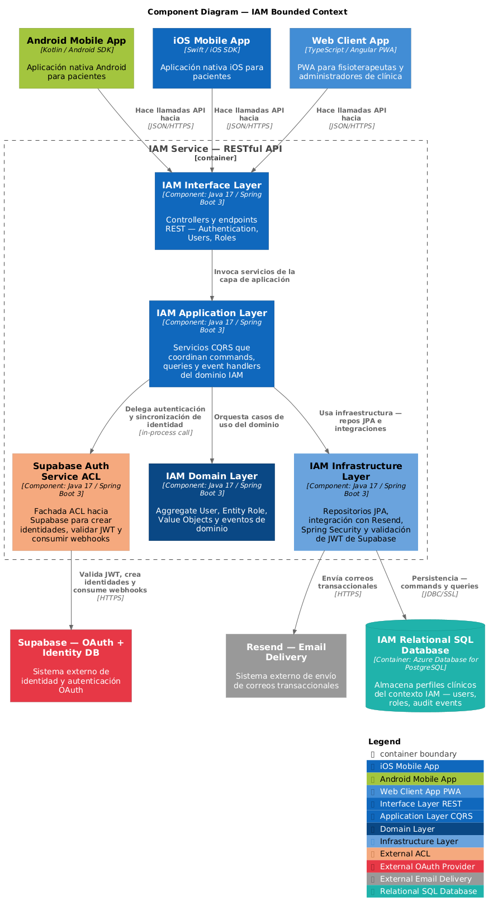

*Figura 4.2.1.5. Diagrama de componentes (C4 Nivel 3) del Bounded Context IAM.*

#### 4.2.1.6. Bounded Context Software Architecture Code Level Diagrams

##### 4.2.1.6.1. Bounded Context Domain Layer Class Diagrams

El diagrama de clases del Domain Layer del BC IAM modela exclusivamente los conceptos centrales del dominio, sin incluir las capas de application ni infrastructure. El paquete `domain.model.aggregates` contiene al Aggregate Root `User` y a la Entity `Role`; `domain.model.valueobjects` agrupa los Value Objects (`UserId`, `EmailAddress`, `FullName`, `ClinicId`, `VerificationCode`) y los enumerados (`Roles`, `AccountStatus`, `VerificationStatus`); `domain.model.events` encapsula los Domain Events publicados por el aggregate (`UserCreatedEvent`, `UserVerifiedEvent`, `UserVerificationCodeAssignedEvent`); y `domain.exceptions` reúne las excepciones de negocio que protegen las invariantes del dominio. Las flechas con línea continua marcan composición (el `User` contiene sus Value Objects), las flechas con línea punteada marcan dependencias semánticas (eventos publicados y excepciones lanzadas) y los rombos vacíos indican agregación con cardinalidad opcional o múltiple (relación de `User` con `ClinicId` y con `Role`).

  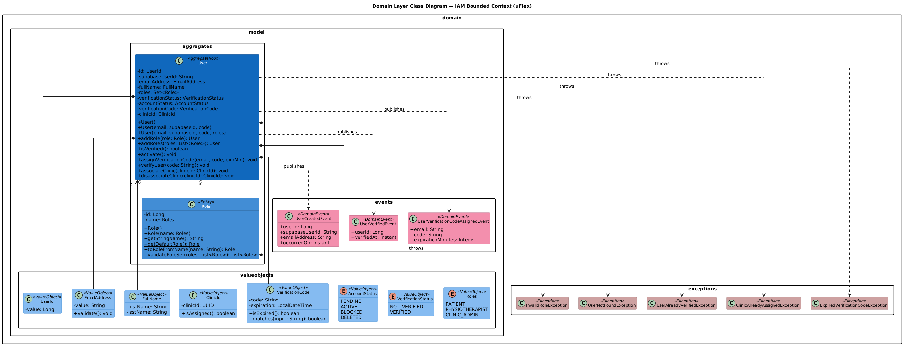

*Figura 4.2.1.6.1. Diagrama de clases del dominio del Bounded Context IAM.*

##### 4.2.1.6.2. Bounded Context Database Design Diagram

El esquema físico del BC IAM en Azure Database for PostgreSQL consta de una tabla principal `users` que almacena el perfil enriquecido (identificador interno, referencia al usuario en Supabase, email único, nombre completo, rol, estado, clínica asociada y timestamps de auditoría), dos tablas de catálogo `user_roles` y `user_statuses` para mantener normalizados los valores permitidos (usadas también para internacionalizar descripciones en el futuro) y una tabla `user_audit_events` que registra los eventos significativos del ciclo de vida del usuario (creación, verificación, cambios de rol, suspensiones) con un payload JSONB flexible. Los índices incluyen unicidad sobre `email` y `supabase_user_id`, e índices compuestos por `(role, clinic_id)` y `(clinic_id)` para soportar las queries más frecuentes de la Web Client App (listado por clínica y por rol). Se optó deliberadamente por **no** declarar una foreign key dura sobre `clinic_id` hacia la tabla de clínicas del BC Subscription: cada bounded context aísla su schema y la referencia es lógica, respetando la autonomía entre contextos.

  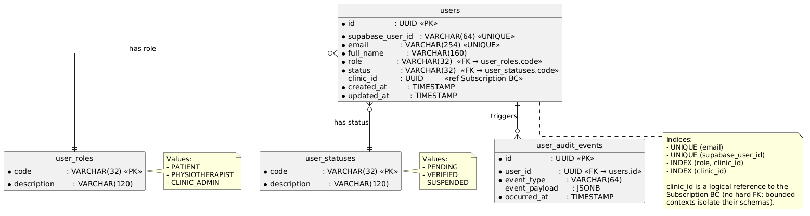

*Figura 4.2.1.6.2. Diagrama entidad-relación del Bounded Context IAM.*

### 4.2.2. Bounded Context: Subscription

El bounded context **Subscription** concentra la gestión comercial del modelo SaaS multi-tenant de uFlex: catálogo de planes, ciclo de vida de la suscripción de cada clínica (compra, activación, renovación, vencimiento, cancelación), emisión de facturas y reconciliación de pagos con la pasarela externa Culqi. A diferencia del BC IAM —que modela la identidad del usuario individual— este contexto trabaja a nivel de *clínica* (tenant) y es disparado típicamente por el Administrador de Clínica. Los comandos y eventos principales (`PurchaseSubscriptionPlanCommand`, `SubscriptionPurchasedEvent`, `SubscriptionLinkedToClinicEvent`) fueron identificados durante el Design-Level EventStorming.

#### 4.2.2.1. Domain Layer

En esta sección se describen los elementos del Domain Layer del contexto de Subscription, que modelan las reglas de negocio asociadas a la venta, activación y facturación de los planes multi-tenant de uFlex. Las invariantes clave son: una clínica puede tener una sola suscripción `ACTIVE` a la vez, una suscripción no puede activarse sin un cobro confirmado por Culqi, y las facturas emitidas son inmutables salvo por transiciones de estado controladas.

**1. Subscription (Aggregate Root)**

Representa la suscripción de una clínica a uFlex. Encapsula el plan contratado, el ciclo de facturación, las ventanas temporales (periodo actual, próxima facturación, periodo de prueba) y la colección de facturas emitidas.

**Atributos principales:**

| Atributo | Tipo | Visibilidad | Descripción |
|---|---|---|---|
| `id` | `SubscriptionId` | private | Identificador interno de la suscripción. |
| `clinicId` | `ClinicId` | private | Tenant (clínica) al que pertenece la suscripción. |
| `plan` | `SubscriptionPlan` | private | Plan contratado (referencia a la Entity del catálogo). |
| `status` | `SubscriptionStatus` | private | Estado actual (`PENDING_PAYMENT`, `TRIAL`, `ACTIVE`, `PAST_DUE`, `CANCELLED`, `EXPIRED`). |
| `billingCycle` | `BillingCycle` | private | Ciclo de facturación elegido (`MONTHLY` o `YEARLY`). |
| `currentPeriodStart` | `LocalDate` | private | Fecha de inicio del periodo actual. |
| `currentPeriodEnd` | `LocalDate` | private | Fecha de fin del periodo actual. |
| `nextBillingDate` | `LocalDate` | private | Fecha en la que se cobrará la renovación automática. |
| `trialUntil` | `LocalDate` | private | Fecha de fin del periodo de prueba (si aplica). |
| `paymentReference` | `PaymentReference` | private | Referencia al medio de pago tokenizado en Culqi. |
| `invoices` | `List<Invoice>` | private | Historial de facturas emitidas para esta suscripción. |

**Métodos principales:**

| Método | Tipo Retorno | Visibilidad | Descripción |
|---|---|---|---|
| `Subscription()` | Constructor | public | Constructor vacío requerido por JPA. |
| `Subscription(ClinicId, SubscriptionPlan, BillingCycle)` | Constructor | public | Crea una suscripción en estado `PENDING_PAYMENT`. |
| `activate()` | `void` | public | Cambia el estado a `ACTIVE` tras confirmar el primer cobro; publica `SubscriptionActivatedEvent`. |
| `renew()` | `Invoice` | public | Genera una nueva factura para el siguiente periodo y actualiza `nextBillingDate`. |
| `cancel(String reason)` | `void` | public | Cambia el estado a `CANCELLED` y publica `SubscriptionCancelledEvent`. |
| `markPastDue()` | `void` | public | Marca la suscripción como `PAST_DUE` si un cobro falla. |
| `expire()` | `void` | public | Transiciona a `EXPIRED` cuando la cuenta lleva más de N días en `PAST_DUE`. |
| `linkToClinic(ClinicId)` | `void` | public | Asocia la suscripción a la clínica en la primera compra; publica `SubscriptionLinkedToClinicEvent`. |
| `registerPayment(PaymentReference)` | `void` | public | Registra una referencia de pago tokenizada para cobros recurrentes. |
| `isActive()` | `boolean` | public | Devuelve `true` si el estado actual es `ACTIVE` o `TRIAL`. |

**2. SubscriptionPlan (Entity)**

Define un plan del catálogo comercial (por ejemplo, *Starter*, *Professional*, *Enterprise*). Persiste como entidad para permitir al equipo comercial crear nuevos planes sin redesplegar el código.

**Atributos principales:**

| Atributo | Tipo | Visibilidad | Descripción |
|---|---|---|---|
| `id` | `PlanId` | private | Identificador del plan. |
| `name` | `String` | private | Nombre comercial (p. ej. *Starter*). |
| `code` | `String` | private | Código único tipo SKU. |
| `monthlyPrice` | `Money` | private | Precio del ciclo mensual. |
| `yearlyPrice` | `Money` | private | Precio del ciclo anual (usualmente con descuento). |
| `maxPatients` | `Integer` | private | Tope de pacientes concurrentes incluidos. |
| `maxPhysiotherapists` | `Integer` | private | Tope de fisioterapeutas incluidos. |
| `features` | `Set<String>` | private | Funcionalidades incluidas (tags). |
| `active` | `boolean` | private | `true` si el plan está disponible para nueva compra. |

**Métodos principales:**

| Método | Tipo Retorno | Visibilidad | Descripción |
|---|---|---|---|
| `priceFor(BillingCycle)` | `Money` | public | Retorna `monthlyPrice` o `yearlyPrice` según el ciclo. |
| `isActive()` | `boolean` | public | `true` si el plan está activo en el catálogo. |
| `deactivate()` | `void` | public | Retira el plan del catálogo (no afecta a suscripciones ya vendidas). |

**3. Invoice (Entity)**

Factura emitida para cada periodo facturable de una suscripción. Una vez emitida es prácticamente inmutable; solo cambia su estado a través de transiciones controladas.

**Atributos principales:**

| Atributo | Tipo | Visibilidad | Descripción |
|---|---|---|---|
| `id` | `InvoiceId` | private | Identificador de la factura. |
| `subscriptionId` | `SubscriptionId` | private | Suscripción a la que pertenece. |
| `amount` | `Money` | private | Monto cobrado. |
| `issuedAt` | `Instant` | private | Fecha/hora de emisión. |
| `dueAt` | `Instant` | private | Fecha/hora límite de pago. |
| `paidAt` | `Instant` | private | Fecha/hora de confirmación del pago. |
| `status` | `InvoiceStatus` | private | Estado (`PENDING`, `PAID`, `FAILED`, `VOID`). |
| `providerTransactionId` | `String` | private | ID de la transacción en Culqi. |

**Métodos principales:**

| Método | Tipo Retorno | Visibilidad | Descripción |
|---|---|---|---|
| `markAsPaid(String txId)` | `void` | public | Marca la factura como `PAID` y publica `InvoicePaidEvent`. |
| `markAsFailed(String reason)` | `void` | public | Marca la factura como `FAILED` y publica `InvoicePaymentFailedEvent`. |
| `voidInvoice()` | `void` | public | Anula la factura (por ejemplo, ante una cancelación dentro del periodo de gracia). |
| `isOverdue()` | `boolean` | public | `true` si `now > dueAt` y el estado es `PENDING`. |

**4. SubscriptionId / PlanId / InvoiceId / ClinicId (Value Objects)**

Identificadores opacos basados en UUID. `ClinicId` es compartido con el BC IAM (referencia lógica al tenant).

| Atributo | Tipo | Visibilidad | Descripción |
|---|---|---|---|
| `value` | `UUID` | private | Valor inmutable generado al crear el agregado/entidad. |

**5. Money (Value Object)**

Monto monetario con moneda explícita.

| Atributo | Tipo | Visibilidad | Descripción |
|---|---|---|---|
| `amount` | `BigDecimal` | private | Valor numérico con precisión suficiente para evitar pérdidas por redondeo. |
| `currency` | `String` | private | Código ISO 4217 (por ejemplo `PEN` o `USD`). |

**Métodos principales:**

| Método | Tipo Retorno | Visibilidad | Descripción |
|---|---|---|---|
| `plus(Money other)` | `Money` | public | Suma dos montos (misma moneda). |
| `isZero()` | `boolean` | public | `true` si el monto es cero. |

**6. PaymentReference (Value Object)**

Referencia tokenizada al medio de pago registrado en Culqi (uFlex no almacena números de tarjeta).

| Atributo | Tipo | Visibilidad | Descripción |
|---|---|---|---|
| `providerToken` | `String` | private | Token opaco emitido por Culqi. |
| `last4` | `String` | private | Últimos 4 dígitos (para mostrar al usuario). |
| `expiresOn` | `YearMonth` | private | Fecha de expiración de la tarjeta. |

**7. BillingCycle (Value Object)**

| Atributo | Tipo | Visibilidad | Descripción |
|---|---|---|---|
| `MONTHLY` | Enum | public | Cobro mensual recurrente. |
| `YEARLY` | Enum | public | Cobro anual con descuento. |

**8. SubscriptionStatus (Value Object)**

| Atributo | Tipo | Visibilidad | Descripción |
|---|---|---|---|
| `PENDING_PAYMENT` | Enum | public | Suscripción creada, a la espera del primer cobro. |
| `TRIAL` | Enum | public | Periodo de prueba activo. |
| `ACTIVE` | Enum | public | Suscripción activa y al día. |
| `PAST_DUE` | Enum | public | Falló un cobro recurrente; en periodo de gracia. |
| `CANCELLED` | Enum | public | Cancelada por la clínica; sigue activa hasta fin del periodo. |
| `EXPIRED` | Enum | public | Expiró definitivamente. |

**9. InvoiceStatus (Value Object)**

| Atributo | Tipo | Visibilidad | Descripción |
|---|---|---|---|
| `PENDING` | Enum | public | Factura emitida, pago pendiente. |
| `PAID` | Enum | public | Pago confirmado por Culqi. |
| `FAILED` | Enum | public | Pago rechazado por Culqi. |
| `VOID` | Enum | public | Factura anulada. |

**10. PurchaseSubscriptionPlanCommand (Command)**

Comando emitido por el Administrador de Clínica al comprar una suscripción.

| Atributo | Tipo | Visibilidad | Descripción |
|---|---|---|---|
| `clinicId` | `UUID` | public | Tenant que compra. |
| `planId` | `UUID` | public | Plan seleccionado. |
| `billingCycle` | `BillingCycle` | public | Ciclo `MONTHLY` o `YEARLY`. |
| `paymentToken` | `String` | public | Token emitido por el SDK de Culqi en el frontend. |

**11. LinkSubscriptionToClinicCommand (Command)**

| Atributo | Tipo | Visibilidad | Descripción |
|---|---|---|---|
| `subscriptionId` | `UUID` | public | Suscripción a asociar. |
| `clinicId` | `UUID` | public | Clínica destino. |

**12. RenewSubscriptionCommand (Command)**

Emitido por el scheduler cuando llega la `nextBillingDate`.

| Atributo | Tipo | Visibilidad | Descripción |
|---|---|---|---|
| `subscriptionId` | `UUID` | public | Suscripción a renovar. |

**13. CancelSubscriptionCommand (Command)**

| Atributo | Tipo | Visibilidad | Descripción |
|---|---|---|---|
| `subscriptionId` | `UUID` | public | Suscripción a cancelar. |
| `reason` | `String` | public | Motivo informado por el usuario. |

**14. RegisterInvoicePaymentCommand (Command)**

Emitido por el webhook de Culqi al confirmar un cobro.

| Atributo | Tipo | Visibilidad | Descripción |
|---|---|---|---|
| `invoiceId` | `UUID` | public | Factura pagada. |
| `providerTransactionId` | `String` | public | ID de la transacción en Culqi. |

**15. CreatePlanCommand (Command)**

Usado por Operaciones para crear nuevos planes en el catálogo.

| Atributo | Tipo | Visibilidad | Descripción |
|---|---|---|---|
| `name` | `String` | public | Nombre comercial. |
| `code` | `String` | public | Código SKU único. |
| `monthlyPrice` | `Money` | public | Precio mensual. |
| `yearlyPrice` | `Money` | public | Precio anual. |
| `maxPatients` | `Integer` | public | Tope de pacientes. |
| `maxPhysiotherapists` | `Integer` | public | Tope de fisioterapeutas. |

**16. DeactivatePlanCommand (Command)**

| Atributo | Tipo | Visibilidad | Descripción |
|---|---|---|---|
| `planId` | `UUID` | public | Plan a retirar del catálogo. |

**17. ChangeSubscriptionPlanCommand (Command)**

Emitido por el Administrador de Clínica desde el dashboard para hacer upgrade o downgrade a otro plan. El servicio de precios calcula el monto prorrateado para el resto del periodo vigente.

| Atributo | Tipo | Visibilidad | Descripción |
|---|---|---|---|
| `subscriptionId` | `UUID` | public | Suscripción a modificar. |
| `newPlanId` | `UUID` | public | Nuevo plan deseado. |
| `newBillingCycle` | `BillingCycle` | public | Ciclo de facturación para el nuevo plan (puede coincidir con el anterior). |
| `effectiveAt` | `EffectivePolicy` | public | Política de aplicación: `IMMEDIATE` (prorratea y cobra la diferencia) o `AT_NEXT_PERIOD` (aplica al renovar). |

**18. UpdatePaymentMethodCommand (Command)**

Emitido desde el dashboard cuando el Administrador de Clínica actualiza su tarjeta (por ejemplo, tras un vencimiento). El `paymentToken` es emitido por el SDK de Culqi en el frontend y reemplaza al almacenado en el aggregate.

| Atributo | Tipo | Visibilidad | Descripción |
|---|---|---|---|
| `subscriptionId` | `UUID` | public | Suscripción cuyo medio de pago se actualiza. |
| `paymentToken` | `String` | public | Nuevo token tokenizado por Culqi. |

**19. GetPlanListQuery (Query)**

Consulta usada por la Web Client App para mostrar el catálogo de planes.

| Atributo | Tipo | Visibilidad | Descripción |
|---|---|---|---|
| `activeOnly` | `boolean` | public | Si `true`, solo planes vigentes; si `false`, incluye deprecados (uso interno). |

**20. GetPlanByIdQuery (Query)**

| Atributo | Tipo | Visibilidad | Descripción |
|---|---|---|---|
| `planId` | `UUID` | public | ID del plan. |

**21. GetSubscriptionByIdQuery (Query)**

| Atributo | Tipo | Visibilidad | Descripción |
|---|---|---|---|
| `subscriptionId` | `UUID` | public | ID de la suscripción. |

**22. GetSubscriptionByClinicQuery (Query)**

| Atributo | Tipo | Visibilidad | Descripción |
|---|---|---|---|
| `clinicId` | `UUID` | public | Clínica dueña de la suscripción. |

**23. GetInvoiceHistoryQuery (Query)**

| Atributo | Tipo | Visibilidad | Descripción |
|---|---|---|---|
| `subscriptionId` | `UUID` | public | Suscripción cuyo historial se consulta. |

**24. SubscriptionPurchasedEvent (Domain Event)**

Evento publicado al concretarse una compra. Consumido internamente para disparar la emisión de la primera factura.

| Atributo | Tipo | Visibilidad | Descripción |
|---|---|---|---|
| `subscriptionId` | `UUID` | private | Suscripción recién creada. |
| `clinicId` | `UUID` | private | Clínica compradora. |
| `planId` | `UUID` | private | Plan contratado. |
| `amount` | `Money` | private | Monto cobrado. |
| `occurredOn` | `Instant` | private | Marca temporal. |

**25. SubscriptionLinkedToClinicEvent (Domain Event)**

Evento que **consumen otros BCs** (especialmente IAM) para sincronizar el `clinicId` del Administrador de Clínica.

| Atributo | Tipo | Visibilidad | Descripción |
|---|---|---|---|
| `subscriptionId` | `UUID` | private | Suscripción. |
| `clinicId` | `UUID` | private | Tenant asociado. |
| `occurredOn` | `Instant` | private | Marca temporal. |

**26. SubscriptionActivatedEvent (Domain Event)**

| Atributo | Tipo | Visibilidad | Descripción |
|---|---|---|---|
| `subscriptionId` | `UUID` | private | Suscripción activada. |
| `clinicId` | `UUID` | private | Tenant. |
| `activatedAt` | `Instant` | private | Marca temporal. |

**27. SubscriptionRenewedEvent (Domain Event)**

| Atributo | Tipo | Visibilidad | Descripción |
|---|---|---|---|
| `subscriptionId` | `UUID` | private | Suscripción renovada. |
| `newPeriodEnd` | `LocalDate` | private | Fin del nuevo periodo. |

**28. SubscriptionCancelledEvent (Domain Event)**

| Atributo | Tipo | Visibilidad | Descripción |
|---|---|---|---|
| `subscriptionId` | `UUID` | private | Suscripción cancelada. |
| `reason` | `String` | private | Motivo. |
| `cancelledAt` | `Instant` | private | Marca temporal. |

**29. InvoicePaidEvent (Domain Event)**

| Atributo | Tipo | Visibilidad | Descripción |
|---|---|---|---|
| `invoiceId` | `UUID` | private | Factura pagada. |
| `amount` | `Money` | private | Monto cobrado. |
| `paidAt` | `Instant` | private | Marca temporal. |

**30. InvoicePaymentFailedEvent (Domain Event)**

| Atributo | Tipo | Visibilidad | Descripción |
|---|---|---|---|
| `invoiceId` | `UUID` | private | Factura fallida. |
| `reason` | `String` | private | Motivo del rechazo. |
| `failedAt` | `Instant` | private | Marca temporal. |

**31. SubscriptionPlanChangedEvent (Domain Event)**

Evento publicado al cambiar el plan de una suscripción. Permite al BC Analytics registrar conversiones y a otros contextos ajustar los topes de uso.

| Atributo | Tipo | Visibilidad | Descripción |
|---|---|---|---|
| `subscriptionId` | `UUID` | private | Suscripción modificada. |
| `oldPlanId` | `UUID` | private | Plan anterior. |
| `newPlanId` | `UUID` | private | Plan nuevo. |
| `proratedAmount` | `Money` | private | Monto prorrateado cobrado (cero si `AT_NEXT_PERIOD`). |
| `changedAt` | `Instant` | private | Marca temporal. |

**32. PaymentMethodUpdatedEvent (Domain Event)**

Evento publicado al actualizar el medio de pago. Consumido por el `NotificationService` para enviar un correo de confirmación al administrador.

| Atributo | Tipo | Visibilidad | Descripción |
|---|---|---|---|
| `subscriptionId` | `UUID` | private | Suscripción afectada. |
| `last4` | `String` | private | Últimos 4 dígitos de la nueva tarjeta (para mostrar). |
| `updatedAt` | `Instant` | private | Marca temporal. |

**33. SubscriptionCommandService (Domain Service)**

Maneja los commands relacionados con el ciclo de vida de la suscripción.

| Método | Tipo Retorno | Visibilidad | Descripción |
|---|---|---|---|
| `handle(PurchaseSubscriptionPlanCommand)` | `SubscriptionId` | public | Ejecuta la compra: llama a Culqi, crea la suscripción y emite la primera factura. |
| `handle(LinkSubscriptionToClinicCommand)` | `void` | public | Asocia la suscripción al tenant. |
| `handle(RenewSubscriptionCommand)` | `void` | public | Dispara la renovación recurrente. |
| `handle(CancelSubscriptionCommand)` | `void` | public | Cancela la suscripción con motivo. |
| `handle(RegisterInvoicePaymentCommand)` | `void` | public | Marca una factura como `PAID` tras el webhook de Culqi. |
| `handle(ChangeSubscriptionPlanCommand)` | `Money` | public | Cambia el plan (upgrade/downgrade); si `IMMEDIATE`, calcula y cobra el prorrateo con `SubscriptionPricingService`. |
| `handle(UpdatePaymentMethodCommand)` | `void` | public | Reemplaza la `PaymentReference` del aggregate con el nuevo token de Culqi. |

**34. SubscriptionQueryService (Domain Service)**

| Método | Tipo Retorno | Visibilidad | Descripción |
|---|---|---|---|
| `handle(GetSubscriptionByIdQuery)` | `Subscription` | public | Obtiene una suscripción por ID. |
| `handle(GetSubscriptionByClinicQuery)` | `Subscription` | public | Obtiene la suscripción activa de una clínica. |
| `handle(GetInvoiceHistoryQuery)` | `List<Invoice>` | public | Lista las facturas históricas. |

**35. PlanCommandService (Domain Service)**

| Método | Tipo Retorno | Visibilidad | Descripción |
|---|---|---|---|
| `handle(CreatePlanCommand)` | `PlanId` | public | Crea un nuevo plan en el catálogo. |
| `handle(DeactivatePlanCommand)` | `void` | public | Retira un plan del catálogo. |

**36. PlanQueryService (Domain Service)**

| Método | Tipo Retorno | Visibilidad | Descripción |
|---|---|---|---|
| `handle(GetPlanListQuery)` | `List<SubscriptionPlan>` | public | Lista los planes disponibles. |
| `handle(GetPlanByIdQuery)` | `SubscriptionPlan` | public | Obtiene un plan por ID. |

**37. SubscriptionPricingService (Domain Service)**

Servicio puro de cálculo de precios y prorrateo.

| Método | Tipo Retorno | Visibilidad | Descripción |
|---|---|---|---|
| `priceFor(SubscriptionPlan, BillingCycle)` | `Money` | public | Calcula el precio del plan para el ciclo indicado. |
| `applyProration(Subscription, SubscriptionPlan)` | `Money` | public | Calcula el monto prorrateado al cambiar de plan a mitad de periodo. |

#### 4.2.2.2. Interface Layer

**1. SubscriptionController (REST Controller)**

Expone los casos de uso de suscripción al Administrador de Clínica a través de la PWA.

| Método | Ruta base | HTTP | Descripción |
|---|---|---|---|
| `purchaseSubscription` | `/api/v1/subscriptions` | POST | Compra un plan usando un `paymentToken` emitido por el SDK de Culqi en el frontend. |
| `getSubscriptionByClinic` | `/api/v1/subscriptions?clinicId={id}` | GET | Obtiene la suscripción activa de la clínica. |
| `cancelSubscription` | `/api/v1/subscriptions/{id}/cancel` | POST | Cancela una suscripción vigente. |
| `changePlan` | `/api/v1/subscriptions/{id}/plan` | PATCH | Cambia el plan (upgrade/downgrade) con política `IMMEDIATE` o `AT_NEXT_PERIOD`. |
| `updatePaymentMethod` | `/api/v1/subscriptions/{id}/payment-method` | PATCH | Actualiza el medio de pago con un nuevo token de Culqi. |
| `getInvoiceHistory` | `/api/v1/subscriptions/{id}/invoices` | GET | Devuelve el historial de facturas. |

**2. PlanController (REST Controller)**

Catálogo público de planes visible en la landing y en la PWA.

| Método | Ruta base | HTTP | Descripción |
|---|---|---|---|
| `getPlans` | `/api/v1/plans` | GET | Lista los planes activos del catálogo. |
| `getPlanById` | `/api/v1/plans/{id}` | GET | Obtiene un plan específico. |
| `createPlan` | `/api/v1/plans` | POST | Crea un plan (operación de administración interna). |
| `deactivatePlan` | `/api/v1/plans/{id}` | DELETE | Retira un plan del catálogo. |

**3. CulqiWebhookController (REST Controller)**

Endpoint que recibe los eventos de Culqi (confirmación de cargo, fallo de cobro). Valida la firma HMAC antes de procesar.

| Método | Ruta base | HTTP | Descripción |
|---|---|---|---|
| `handleWebhook` | `/api/v1/webhooks/culqi` | POST | Recibe y procesa eventos de Culqi; traduce a `RegisterInvoicePaymentCommand` o `InvoicePaymentFailedEvent`. |

**4. Resources (DTOs)**

| Resource | Atributos principales | Descripción |
|---|---|---|
| `PurchaseSubscriptionResource` | `clinicId: UUID`, `planId: UUID`, `billingCycle: String`, `paymentToken: String` | Datos de compra recibidos desde el frontend. |
| `SubscriptionResource` | `id: UUID`, `clinicId: UUID`, `planName: String`, `status: String`, `billingCycle: String`, `currentPeriodEnd: LocalDate`, `nextBillingDate: LocalDate` | Representación de una suscripción. |
| `PlanResource` | `id: UUID`, `name: String`, `code: String`, `monthlyPrice: BigDecimal`, `yearlyPrice: BigDecimal`, `currency: String`, `maxPatients: Integer`, `maxPhysiotherapists: Integer`, `features: List<String>` | Representación de un plan. |
| `InvoiceResource` | `id: UUID`, `amount: BigDecimal`, `currency: String`, `issuedAt: Instant`, `dueAt: Instant`, `paidAt: Instant`, `status: String` | Representación de una factura. |
| `CancelSubscriptionResource` | `reason: String` | Motivo de cancelación. |
| `ChangePlanResource` | `newPlanId: UUID`, `newBillingCycle: String`, `effectiveAt: String` | Datos para cambiar de plan desde el dashboard. |
| `UpdatePaymentMethodResource` | `paymentToken: String` | Nuevo token tokenizado por el SDK de Culqi en el frontend. |

**5. Transform (Assemblers)**

| Assembler | Entrada | Salida | Descripción |
|---|---|---|---|
| `PurchaseSubscriptionCommandFromResourceAssembler` | `PurchaseSubscriptionResource` | `PurchaseSubscriptionPlanCommand` | Construye el command de compra. |
| `SubscriptionResourceFromEntityAssembler` | `Subscription` | `SubscriptionResource` | Expone el aggregate como recurso. |
| `PlanResourceFromEntityAssembler` | `SubscriptionPlan` | `PlanResource` | Expone el plan como recurso. |
| `InvoiceResourceFromEntityAssembler` | `Invoice` | `InvoiceResource` | Expone la factura como recurso. |
| `CancelSubscriptionCommandFromResourceAssembler` | `CancelSubscriptionResource`, `subscriptionId: UUID` | `CancelSubscriptionCommand` | Construye el command de cancelación. |
| `ChangeSubscriptionPlanCommandFromResourceAssembler` | `ChangePlanResource`, `subscriptionId: UUID` | `ChangeSubscriptionPlanCommand` | Construye el command de cambio de plan. |
| `UpdatePaymentMethodCommandFromResourceAssembler` | `UpdatePaymentMethodResource`, `subscriptionId: UUID` | `UpdatePaymentMethodCommand` | Construye el command de actualización del medio de pago. |

#### 4.2.2.3. Application Layer

**1. SubscriptionContextFacadeImpl (ACL Facade)**

Fachada que otros bounded contexts usan para consultar estado de suscripción sin acoplarse al modelo interno.

| Atributo | Tipo | Visibilidad | Descripción |
|---|---|---|---|
| `subscriptionQueryService` | `SubscriptionQueryService` | private | Servicio de consultas de Subscription. |

| Método | Tipo Retorno | Visibilidad | Descripción |
|---|---|---|---|
| `isClinicSubscriptionActive(UUID clinicId)` | `boolean` | public | Responde si el tenant tiene una suscripción vigente. |
| `fetchCurrentPlanCode(UUID clinicId)` | `Optional<String>` | public | Retorna el código del plan contratado para gating de features. |

**2. SubscriptionCommandServiceImpl**

Orquesta la compra, renovación, cancelación y reconciliación de pagos.

| Atributo | Tipo | Visibilidad | Descripción |
|---|---|---|---|
| `subscriptionRepository` | `SubscriptionRepository` | private | Persistencia del aggregate. |
| `planRepository` | `PlanRepository` | private | Consulta del catálogo. |
| `invoiceRepository` | `InvoiceRepository` | private | Persistencia de facturas. |
| `culqiPaymentPort` | `CulqiPaymentPort` | private | ACL hacia la pasarela. |
| `iamContextFacadePort` | `IamContextFacadePort` | private | Consulta del BC IAM. |
| `pricingService` | `SubscriptionPricingService` | private | Cálculo de precios. |
| `eventPublisher` | `ApplicationEventPublisher` | private | Publicación de domain events. |

| Método | Tipo Retorno | Visibilidad | Descripción |
|---|---|---|---|
| `handle(PurchaseSubscriptionPlanCommand)` | `SubscriptionId` | public | Valida admin, tokeniza el pago, crea la suscripción, emite factura y publica `SubscriptionPurchasedEvent`. |
| `handle(LinkSubscriptionToClinicCommand)` | `void` | public | Asocia la suscripción al tenant y publica `SubscriptionLinkedToClinicEvent`. |
| `handle(RenewSubscriptionCommand)` | `void` | public | Genera factura y cobra vía Culqi; maneja fallos con reintentos. |
| `handle(CancelSubscriptionCommand)` | `void` | public | Marca la suscripción como `CANCELLED` y publica el evento. |
| `handle(RegisterInvoicePaymentCommand)` | `void` | public | Marca la factura como `PAID` tras el webhook de Culqi. |
| `handle(ChangeSubscriptionPlanCommand)` | `Money` | public | Cambia de plan: si `IMMEDIATE`, usa `SubscriptionPricingService.applyProration` y cobra la diferencia vía `CulqiPaymentPort`; si `AT_NEXT_PERIOD`, difiere el cambio a la próxima renovación. Publica `SubscriptionPlanChangedEvent`. |
| `handle(UpdatePaymentMethodCommand)` | `void` | public | Tokeniza la nueva tarjeta con `CulqiPaymentPort`, reemplaza la `PaymentReference` en el aggregate y publica `PaymentMethodUpdatedEvent`. |

**3. SubscriptionQueryServiceImpl**

| Atributo | Tipo | Visibilidad | Descripción |
|---|---|---|---|
| `subscriptionRepository` | `SubscriptionRepository` | private | Lectura del aggregate. |
| `invoiceRepository` | `InvoiceRepository` | private | Lectura de facturas. |

| Método | Tipo Retorno | Visibilidad | Descripción |
|---|---|---|---|
| `handle(GetSubscriptionByIdQuery)` | `Subscription` | public | Recupera una suscripción por ID. |
| `handle(GetSubscriptionByClinicQuery)` | `Subscription` | public | Recupera la suscripción activa de una clínica. |
| `handle(GetInvoiceHistoryQuery)` | `List<Invoice>` | public | Historial de facturas. |

**4. PlanCommandServiceImpl**

| Atributo | Tipo | Visibilidad | Descripción |
|---|---|---|---|
| `planRepository` | `PlanRepository` | private | Acceso al catálogo. |

| Método | Tipo Retorno | Visibilidad | Descripción |
|---|---|---|---|
| `handle(CreatePlanCommand)` | `PlanId` | public | Crea un plan nuevo. |
| `handle(DeactivatePlanCommand)` | `void` | public | Retira un plan del catálogo. |

**5. PlanQueryServiceImpl**

| Método | Tipo Retorno | Visibilidad | Descripción |
|---|---|---|---|
| `handle(GetPlanListQuery)` | `List<SubscriptionPlan>` | public | Lista los planes. |
| `handle(GetPlanByIdQuery)` | `SubscriptionPlan` | public | Obtiene un plan por ID. |

**6. CulqiWebhookEventHandler (Integration Event Handler)**

Procesa los eventos de Culqi recibidos por el `CulqiWebhookController`.

| Método | Tipo Retorno | Visibilidad | Descripción |
|---|---|---|---|
| `on(CulqiChargeSucceeded)` | `void` | public | Traduce a `RegisterInvoicePaymentCommand` y lo despacha al Command Service. |
| `on(CulqiChargeFailed)` | `void` | public | Publica `InvoicePaymentFailedEvent` y marca la suscripción como `PAST_DUE` si corresponde. |

**7. SubscriptionRenewalScheduler (Scheduled Task)**

Job programado que detecta suscripciones cuyo `nextBillingDate` venció y dispara `RenewSubscriptionCommand`.

| Método | Tipo Retorno | Visibilidad | Descripción |
|---|---|---|---|
| `runDailyRenewalBatch()` | `void` | public | Ejecuta `@Scheduled(cron)`; recorre las suscripciones con `nextBillingDate <= today` y despacha los commands de renovación. |

**8. SubscriptionExpirationScheduler (Scheduled Task)**

| Método | Tipo Retorno | Visibilidad | Descripción |
|---|---|---|---|
| `runDailyExpirationBatch()` | `void` | public | Marca como `EXPIRED` las suscripciones que llevan más de N días en `PAST_DUE`. |

**9. ApplicationReadyEventHandler (Framework Event Handler)**

| Método | Tipo Retorno | Visibilidad | Descripción |
|---|---|---|---|
| `on(ApplicationReadyEvent)` | `void` | public | Ejecuta la semilla de planes base al arranque si el catálogo está vacío. |

**10. CulqiPaymentPort (Outbound Service Port)**

ACL hacia Culqi.

| Método | Tipo Retorno | Visibilidad | Descripción |
|---|---|---|---|
| `createCharge(Money amount, String token)` | `PaymentReference` | public | Crea un cargo contra el token emitido por el SDK de Culqi. |
| `refundCharge(PaymentReference)` | `void` | public | Reversa un cobro. |
| `verifyWebhookSignature(String payload, String signature)` | `boolean` | public | Valida la firma HMAC del webhook de Culqi. |

**11. IamContextFacadePort (Outbound Service Port)**

Puerto hacia la fachada del BC IAM para validar el usuario que compra.

| Método | Tipo Retorno | Visibilidad | Descripción |
|---|---|---|---|
| `fetchClinicIdOfAdmin(Long userId)` | `UUID` | public | Obtiene el `clinicId` del administrador autenticado. |
| `validateClinicAdmin(Long userId)` | `boolean` | public | Verifica que el usuario tenga el rol `CLINIC_ADMIN`. |

**12. NotificationServicePort (Outbound Service Port)**

Puerto hacia el Notification Service hermano para enviar correos (que a su vez usa Resend).

| Método | Tipo Retorno | Visibilidad | Descripción |
|---|---|---|---|
| `sendInvoiceIssuedNotification(String email, Invoice invoice)` | `void` | public | Solicita al Notification Service enviar la factura por correo. |
| `sendPaymentFailedNotification(String email, Invoice invoice)` | `void` | public | Notifica al admin que un cobro falló. |
| `sendSubscriptionCancelledNotification(String email, Subscription sub)` | `void` | public | Notifica la cancelación. |

#### 4.2.2.4. Infrastructure Layer

**1. SubscriptionRepository (Repository Interface)**

Spring Data JPA sobre Azure Database for PostgreSQL.

| Método | Tipo Retorno | Visibilidad | Descripción |
|---|---|---|---|
| `save(Subscription sub)` | `Subscription` | public | Persiste o actualiza una suscripción. |
| `findById(UUID id)` | `Optional<Subscription>` | public | Busca por ID. |
| `findByClinicId(UUID clinicId)` | `Optional<Subscription>` | public | Obtiene la suscripción activa de un tenant. |
| `findAllPastDue()` | `List<Subscription>` | public | Lista las suscripciones `PAST_DUE` (usado por el scheduler de expiración). |
| `findAllDueForRenewal(LocalDate today)` | `List<Subscription>` | public | Lista las suscripciones con `nextBillingDate <= today`. |

**2. PlanRepository (Repository Interface)**

| Método | Tipo Retorno | Visibilidad | Descripción |
|---|---|---|---|
| `save(SubscriptionPlan plan)` | `SubscriptionPlan` | public | Persiste un plan. |
| `findById(UUID id)` | `Optional<SubscriptionPlan>` | public | Busca por ID. |
| `findAllActive()` | `List<SubscriptionPlan>` | public | Lista los planes activos. |
| `findByCode(String code)` | `Optional<SubscriptionPlan>` | public | Busca por código SKU. |

**3. InvoiceRepository (Repository Interface)**

| Método | Tipo Retorno | Visibilidad | Descripción |
|---|---|---|---|
| `save(Invoice invoice)` | `Invoice` | public | Persiste una factura. |
| `findById(UUID id)` | `Optional<Invoice>` | public | Busca por ID. |
| `findBySubscriptionId(UUID id)` | `List<Invoice>` | public | Lista las facturas de una suscripción. |
| `findAllOverdue()` | `List<Invoice>` | public | Lista las facturas vencidas pendientes de cobro. |

**4. CulqiPaymentAdapter (ACL Adapter)**

Implementa `CulqiPaymentPort`. Único componente que conoce el vocabulario de Culqi.

| Atributo | Tipo | Visibilidad | Descripción |
|---|---|---|---|
| `culqiClient` | `CulqiHttpClient` | private | Cliente HTTP hacia la API pública de Culqi. |
| `webhookSecret` | `String` | private | Secreto compartido con Culqi para validar firmas HMAC. |

| Método | Tipo Retorno | Visibilidad | Descripción |
|---|---|---|---|
| `createCharge(Money amount, String token)` | `PaymentReference` | public | Invoca `POST /v2/charges` de Culqi y mapea la respuesta. |
| `refundCharge(PaymentReference)` | `void` | public | Invoca `POST /v2/refunds`. |
| `verifyWebhookSignature(String payload, String signature)` | `boolean` | public | Valida la firma HMAC-SHA256 del webhook. |

**5. CulqiHttpClient (HTTP Client)**

Wrapper de la API REST de Culqi usando `WebClient` de Spring.

| Atributo | Tipo | Visibilidad | Descripción |
|---|---|---|---|
| `webClient` | `WebClient` | private | Cliente HTTP reactivo. |
| `privateKey` | `String` | private | Clave privada de Culqi (cargada desde Azure Key Vault). |

| Método | Tipo Retorno | Visibilidad | Descripción |
|---|---|---|---|
| `post(String path, Object body)` | `JsonNode` | public | Ejecuta una petición POST autenticada. |
| `get(String path)` | `JsonNode` | public | Ejecuta una petición GET autenticada. |

**6. IamContextFacadeAdapter (ACL Adapter)**

Implementa `IamContextFacadePort` invocando al IAM Service hermano vía HTTP interno.

| Método | Tipo Retorno | Visibilidad | Descripción |
|---|---|---|---|
| `fetchClinicIdOfAdmin(Long userId)` | `UUID` | public | Llama a `GET /api/v1/users/{id}` del IAM Service. |
| `validateClinicAdmin(Long userId)` | `boolean` | public | Valida que el usuario tenga el rol `CLINIC_ADMIN`. |

**7. NotificationServiceAdapter (ACL Adapter)**

Implementa `NotificationServicePort` invocando al Notification Service hermano.

| Método | Tipo Retorno | Visibilidad | Descripción |
|---|---|---|---|
| `sendInvoiceIssuedNotification(email, invoice)` | `void` | public | Encola una petición contra el Notification Service que a su vez envía el correo vía Resend. |
| `sendPaymentFailedNotification(email, invoice)` | `void` | public | Notifica fallo de cobro. |
| `sendSubscriptionCancelledNotification(email, sub)` | `void` | public | Notifica cancelación. |

**8. SubscriptionScheduler (Spring Scheduled)**

Implementación del scheduler basado en Spring `@Scheduled` con cron expressions configurables.

| Método | Tipo Retorno | Visibilidad | Descripción |
|---|---|---|---|
| `runDailyRenewalBatch()` | `void` | public | `@Scheduled(cron = "${uflex.subscription.renewal-cron}")`. |
| `runDailyExpirationBatch()` | `void` | public | `@Scheduled(cron = "${uflex.subscription.expiration-cron}")`. |

**9. CulqiWebhookController (Integration Controller)**

Endpoint REST que recibe los webhooks de Culqi.

| Método | Tipo Retorno | Visibilidad | Descripción |
|---|---|---|---|
| `handleWebhook(String body, String signature)` | `ResponseEntity<Void>` | public | Valida la firma HMAC, deserializa el evento y delega en el `CulqiWebhookEventHandler`. |

**10. PlanSeederProperties (Configuration Properties)**

Propiedades externas con los planes base que se insertan en un ambiente nuevo.

| Campo | Tipo | Visibilidad | Descripción |
|---|---|---|---|
| `seedPlans` | `List<PlanSeed>` | private | Lista de planes a sembrar al arranque. |

#### 4.2.2.5. Bounded Context Software Architecture Component Level Diagrams

El diagrama de componentes del BC Subscription replica el patrón de capas del BC IAM y añade dos Anti-Corruption Layers diferenciadas: **Culqi Payments Service ACL** (contra la pasarela de pagos externa) e **IAM Context Service ACL** (contra el BC IAM hermano, para validar el rol `CLINIC_ADMIN` y obtener el `clinicId` asociado al administrador autenticado). El Infrastructure Layer, además de persistir contra la Subscription DB, también se comunica con el Notification Service hermano para enviar facturas y avisos de cobro fallido por correo. La capa Domain permanece aislada de todas las integraciones externas.

  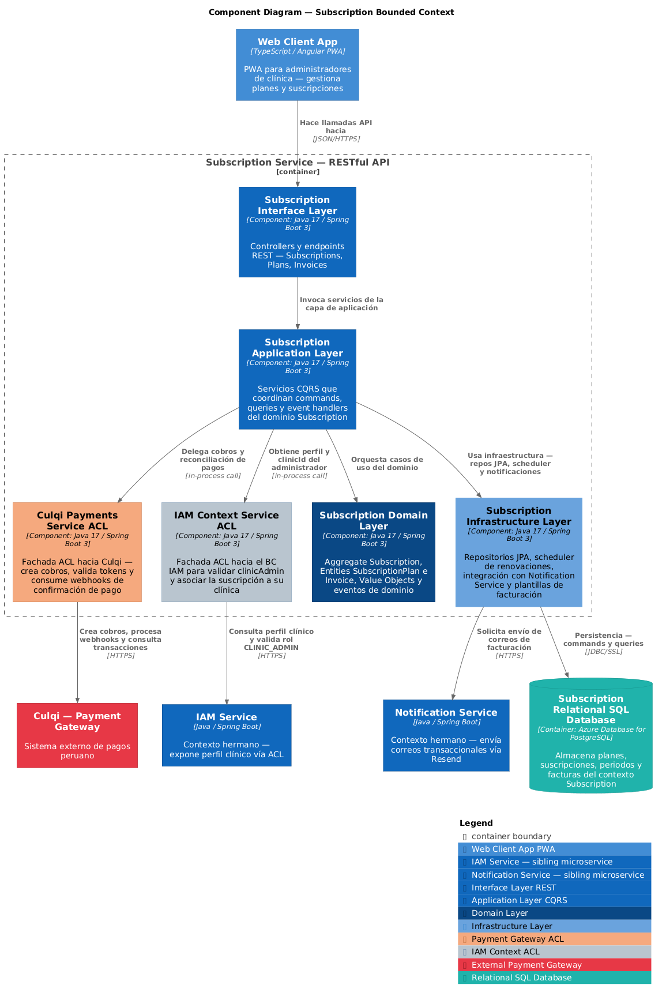

*Figura 4.2.2.5. Diagrama de componentes (C4 Nivel 3) del Bounded Context Subscription.*

#### 4.2.2.6. Bounded Context Software Architecture Code Level Diagrams

##### 4.2.2.6.1. Bounded Context Domain Layer Class Diagrams

El diagrama de clases del Domain Layer del BC Subscription modela exclusivamente los conceptos centrales del dominio, sin incluir las capas de application ni infrastructure. El Aggregate Root `Subscription` está compuesto por la Entity `SubscriptionPlan` (referencia al catálogo) y una colección de Entities `Invoice` (historial de facturas emitidas). Los Value Objects modelan los conceptos monetarios (`Money`, `PaymentReference`) y temporales (`BillingCycle`) así como los estados (`SubscriptionStatus`, `InvoiceStatus`). Los Domain Events publicados (`SubscriptionPurchasedEvent`, `SubscriptionLinkedToClinicEvent`, `SubscriptionActivatedEvent`, `SubscriptionRenewedEvent`, `SubscriptionCancelledEvent`, `InvoicePaidEvent`, `InvoicePaymentFailedEvent`) permiten que el BC IAM (sincronización del `clinicId`), el Notification Service (envío de correos) y la analítica interna reaccionen sin acoplamiento directo al aggregate. El único Domain Service en sentido estricto es `SubscriptionPricingService`, que encapsula la lógica de cálculo de precios y prorrateo entre planes y ciclos de facturación. El paquete `domain.exceptions` reúne las excepciones de negocio que protegen las invariantes del aggregate.

  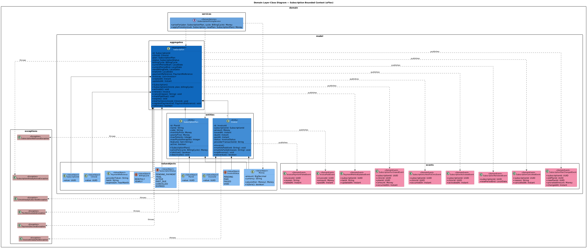

*Figura 4.2.2.6.1. Diagrama de clases del dominio del Bounded Context Subscription.*

##### 4.2.2.6.2. Bounded Context Database Design Diagram

El esquema físico del BC Subscription en Azure Database for PostgreSQL está compuesto por tres tablas principales: `subscription_plans` (catálogo con precios mensuales y anuales, topes de pacientes y fisioterapeutas, y estado activo/inactivo), `subscriptions` (suscripción por tenant, con FK lógica a `subscription_plans`, estado, ventanas del periodo actual, fecha de próxima facturación, referencia de pago tokenizada en Culqi y `clinic_id` como referencia lógica al BC IAM sin FK dura) e `invoices` (facturas emitidas por cada periodo, con FK a `subscriptions`, monto, estado y `provider_transaction_id` para reconciliación con Culqi). Se complementa con dos tablas de catálogo (`subscription_statuses` e `invoice_statuses`) para normalizar los enumerados, e índices compuestos por `(clinic_id, status)` y `(status, next_billing_date)` para soportar las queries más frecuentes (consulta de suscripción activa por clínica y detección de renovaciones vencidas por el scheduler).

  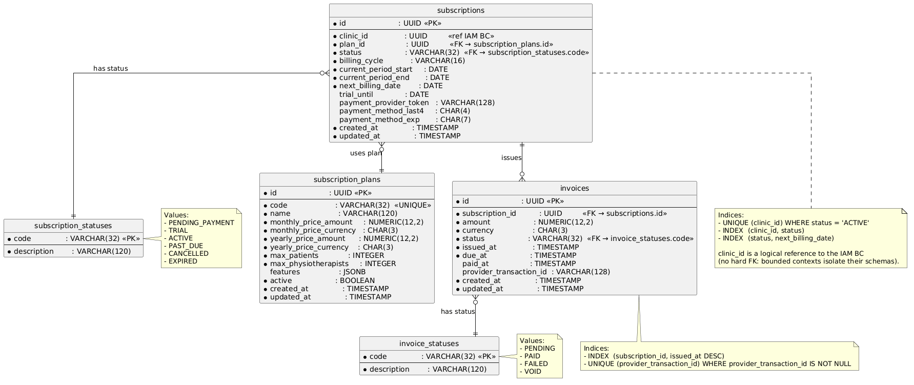

*Figura 4.2.2.6.2. Diagrama entidad-relación del Bounded Context Subscription.*

### 4.2.3. Bounded Context: Organization

<h3 id="4-2-3-bounded-context-organization">4.2.3. Bounded Context: Organization</h3>

El bounded context <strong>Organization</strong> concentra la información organizacional y el perfil enriquecido de cada actor clínico registrado en uFlex. Mientras que el BC IAM resuelve la identidad técnica del usuario (autenticación, roles y ciclo de vida de la cuenta) y el BC Subscription gobierna el contrato comercial del tenant, el BC Organization se encarga de representar a la <em>clínica como organización</em> (denominación legal, RUC, sedes, datos de contacto, logotipo, horarios) y de mantener el <em>perfil personal y clínico</em> de los usuarios asociados a esa clínica (fisioterapeutas con su número de colegiatura y especialidad, pacientes con sus datos demográficos, contacto de emergencia y breve historial clínico, y administradores con su ámbito de gestión). Este contexto es, por tanto, la fuente autoritativa del <code>ClinicId</code> referenciado lógicamente por el resto de bounded contexts y del árbol de <code>Branches</code> (sedes) sobre el que operan Planning, Device y Therapy. Los comandos y eventos principales (<code>RegisterClinicCommand</code>, <code>AddBranchCommand</code>, <code>RegisterPhysiotherapistProfileCommand</code>, <code>RegisterPatientProfileCommand</code>, <code>AssignPatientToPhysiotherapistCommand</code>, <code>ClinicRegisteredEvent</code>, <code>ClinicActivatedEvent</code>, <code>BranchAddedEvent</code>, <code>PhysiotherapistProfileRegisteredEvent</code>, <code>PatientProfileRegisteredEvent</code>, <code>PatientAssignedToPhysiotherapistEvent</code>) fueron identificados durante el Design-Level EventStorming.

<h4 id="4-2-3-1-domain-layer">4.2.3.1. Domain Layer</h4>

En esta sección se describen los elementos del Domain Layer del contexto de Organization, que modelan la estructura interna de la clínica multi-tenant y el perfil enriquecido de sus usuarios. Las invariantes clave son: una clínica no puede registrarse sin al menos una sede principal, el RUC de una clínica es único dentro de la plataforma, un paciente debe pertenecer a una única clínica a la vez y sólo puede ser asignado a un fisioterapeuta que forme parte de la misma clínica, y el perfil clínico del fisioterapeuta exige un número de colegiatura válido antes de pasar al estado <code>ACTIVE</code>.

<strong>1. Clinic (Aggregate Root)</strong>

Representa a la clínica (tenant) dentro del dominio: su identidad organizacional, sus datos fiscales y de contacto, sus sedes y el estado operativo. Encapsula la política de multi-sede y es la raíz a partir de la cual se accede a <code>Branch</code> y al directorio de perfiles clínicos.

Atributos principales:

<table>
  <thead>
    <tr><th>Atributo</th><th>Tipo</th><th>Visibilidad</th><th>Descripción</th></tr>
  </thead>
  <tbody>
    <tr><td><code>id</code></td><td><code>ClinicId</code></td><td>private</td><td>Identificador único de la clínica (UUID). Es el valor que el resto de bounded contexts referencia de forma lógica.</td></tr>
    <tr><td><code>legalName</code></td><td><code>LegalName</code></td><td>private</td><td>Razón social registrada de la clínica.</td></tr>
    <tr><td><code>commercialName</code></td><td><code>CommercialName</code></td><td>private</td><td>Nombre comercial visible al paciente en la PWA y en la app móvil.</td></tr>
    <tr><td><code>taxId</code></td><td><code>TaxId</code></td><td>private</td><td>RUC (u otro identificador tributario) de la clínica; único por tenant.</td></tr>
    <tr><td><code>contactInfo</code></td><td><code>ContactInfo</code></td><td>private</td><td>Correo corporativo, teléfono y sitio web públicos de la clínica.</td></tr>
    <tr><td><code>logoUrl</code></td><td><code>LogoUrl</code></td><td>private</td><td>URL del logotipo en Azure Blob Storage, utilizado para personalizar la PWA.</td></tr>
    <tr><td><code>branches</code></td><td><code>List&lt;Branch&gt;</code></td><td>private</td><td>Sedes físicas operadas por la clínica; al menos una es <code>isHeadquarters = true</code>.</td></tr>
    <tr><td><code>status</code></td><td><code>ClinicStatus</code></td><td>private</td><td>Estado del tenant (<code>PENDING_ACTIVATION</code>, <code>ACTIVE</code>, <code>SUSPENDED</code>, <code>ARCHIVED</code>).</td></tr>
    <tr><td><code>createdBy</code></td><td><code>UserId</code></td><td>private</td><td>Identificador del <em>Administrador de Clínica</em> (BC IAM) que realizó el registro inicial.</td></tr>
    <tr><td><code>createdAt</code></td><td><code>Instant</code></td><td>private</td><td>Fecha y hora de alta del tenant.</td></tr>
    <tr><td><code>updatedAt</code></td><td><code>Instant</code></td><td>private</td><td>Fecha y hora de la última actualización organizativa.</td></tr>
  </tbody>
</table>

Métodos principales:

<table>
  <thead>
    <tr><th>Método</th><th>Tipo Retorno</th><th>Visibilidad</th><th>Descripción</th></tr>
  </thead>
  <tbody>
    <tr><td><code>Clinic()</code></td><td>Constructor</td><td>public</td><td>Constructor vacío requerido por JPA.</td></tr>
    <tr><td><code>Clinic(LegalName, CommercialName, TaxId, ContactInfo, UserId createdBy)</code></td><td>Constructor</td><td>public</td><td>Registra una clínica en estado <code>PENDING_ACTIVATION</code> y publica <code>ClinicRegisteredEvent</code>.</td></tr>
    <tr><td><code>addBranch(Branch branch)</code></td><td><code>void</code></td><td>public</td><td>Agrega una nueva sede; valida unicidad del nombre dentro del tenant y publica <code>BranchAddedEvent</code>.</td></tr>
    <tr><td><code>designateHeadquarters(BranchId branchId)</code></td><td><code>void</code></td><td>public</td><td>Marca una sede existente como sede central; sólo una sede puede ser <code>isHeadquarters = true</code> simultáneamente.</td></tr>
    <tr><td><code>activate()</code></td><td><code>void</code></td><td>public</td><td>Cambia el estado a <code>ACTIVE</code> al confirmarse la suscripción; publica <code>ClinicActivatedEvent</code>.</td></tr>
    <tr><td><code>suspend(String reason)</code></td><td><code>void</code></td><td>public</td><td>Cambia el estado a <code>SUSPENDED</code> (por ejemplo, ante una suscripción <code>PAST_DUE</code>); publica <code>ClinicSuspendedEvent</code>.</td></tr>
    <tr><td><code>updateContactInfo(ContactInfo contactInfo)</code></td><td><code>void</code></td><td>public</td><td>Actualiza los datos de contacto públicos de la clínica.</td></tr>
    <tr><td><code>updateLogo(LogoUrl logoUrl)</code></td><td><code>void</code></td><td>public</td><td>Reemplaza la URL del logotipo tras un upload válido al blob.</td></tr>
    <tr><td><code>archive()</code></td><td><code>void</code></td><td>public</td><td>Transición final al estado <code>ARCHIVED</code>; bloquea todo acceso operativo.</td></tr>
  </tbody>
</table>

<strong>2. Branch (Entity)</strong>

Representa una sede física de la clínica. Es una Entity dentro del aggregate <code>Clinic</code>, por lo que su ciclo de vida se gobierna desde el aggregate root.

<table>
  <thead>
    <tr><th>Atributo</th><th>Tipo</th><th>Visibilidad</th><th>Descripción</th></tr>
  </thead>
  <tbody>
    <tr><td><code>id</code></td><td><code>BranchId</code></td><td>private</td><td>Identificador único de la sede.</td></tr>
    <tr><td><code>name</code></td><td><code>BranchName</code></td><td>private</td><td>Nombre operativo (por ejemplo, "Sede San Isidro").</td></tr>
    <tr><td><code>address</code></td><td><code>Address</code></td><td>private</td><td>Dirección estructurada (calle, distrito, provincia, departamento, país, código postal).</td></tr>
    <tr><td><code>phoneNumber</code></td><td><code>PhoneNumber</code></td><td>private</td><td>Teléfono local de la sede.</td></tr>
    <tr><td><code>openingHours</code></td><td><code>OpeningHours</code></td><td>private</td><td>Horario de atención por día de la semana.</td></tr>
    <tr><td><code>isHeadquarters</code></td><td><code>boolean</code></td><td>private</td><td>Indica si la sede es la central.</td></tr>
    <tr><td><code>status</code></td><td><code>BranchStatus</code></td><td>private</td><td>Estado operativo (<code>ACTIVE</code>, <code>INACTIVE</code>).</td></tr>
  </tbody>
</table>

<strong>3. PhysiotherapistProfile (Aggregate Root)</strong>

Representa el perfil clínico-personal de un fisioterapeuta dentro de la clínica. El <code>userId</code> referencia lógicamente al usuario en el BC IAM; aquí se añaden los datos que hacen al especialista profesional y laboralmente reconocible.

<table>
  <thead>
    <tr><th>Atributo</th><th>Tipo</th><th>Visibilidad</th><th>Descripción</th></tr>
  </thead>
  <tbody>
    <tr><td><code>id</code></td><td><code>PhysiotherapistProfileId</code></td><td>private</td><td>Identificador del perfil.</td></tr>
    <tr><td><code>userId</code></td><td><code>UserId</code></td><td>private</td><td>Referencia lógica al usuario en el BC IAM.</td></tr>
    <tr><td><code>clinicId</code></td><td><code>ClinicId</code></td><td>private</td><td>Clínica a la que pertenece el fisioterapeuta.</td></tr>
    <tr><td><code>primaryBranchId</code></td><td><code>BranchId</code></td><td>private</td><td>Sede principal en la que atiende.</td></tr>
    <tr><td><code>personalInfo</code></td><td><code>PersonalInfo</code></td><td>private</td><td>Nombre completo, DNI, fecha de nacimiento, género y teléfono de contacto.</td></tr>
    <tr><td><code>licenseNumber</code></td><td><code>LicenseNumber</code></td><td>private</td><td>Número de colegiatura (CMP/CTTMP); validado antes de activar.</td></tr>
    <tr><td><code>specialty</code></td><td><code>Specialty</code></td><td>private</td><td>Especialidad principal (traumatológica, neurológica, deportiva).</td></tr>
    <tr><td><code>yearsOfExperience</code></td><td><code>int</code></td><td>private</td><td>Años acreditados de ejercicio profesional.</td></tr>
    <tr><td><code>hireDate</code></td><td><code>LocalDate</code></td><td>private</td><td>Fecha de ingreso a la clínica.</td></tr>
    <tr><td><code>status</code></td><td><code>ProfileStatus</code></td><td>private</td><td>Estado del perfil (<code>PENDING_VALIDATION</code>, <code>ACTIVE</code>, <code>SUSPENDED</code>, <code>ARCHIVED</code>).</td></tr>
  </tbody>
</table>

Métodos principales:

<table>
  <thead>
    <tr><th>Método</th><th>Tipo Retorno</th><th>Visibilidad</th><th>Descripción</th></tr>
  </thead>
  <tbody>
    <tr><td><code>PhysiotherapistProfile()</code></td><td>Constructor</td><td>public</td><td>Constructor vacío requerido por JPA.</td></tr>
    <tr><td><code>PhysiotherapistProfile(UserId, ClinicId, BranchId, PersonalInfo, LicenseNumber, Specialty)</code></td><td>Constructor</td><td>public</td><td>Crea el perfil en estado <code>PENDING_VALIDATION</code> y publica <code>PhysiotherapistProfileRegisteredEvent</code>.</td></tr>
    <tr><td><code>validate()</code></td><td><code>void</code></td><td>public</td><td>Marca el perfil como <code>ACTIVE</code> tras la verificación del <code>licenseNumber</code>; publica <code>PhysiotherapistProfileActivatedEvent</code>.</td></tr>
    <tr><td><code>assignToBranch(BranchId branchId)</code></td><td><code>void</code></td><td>public</td><td>Actualiza la sede principal del fisioterapeuta.</td></tr>
    <tr><td><code>updatePersonalInfo(PersonalInfo personalInfo)</code></td><td><code>void</code></td><td>public</td><td>Actualiza el bloque de datos personales del especialista.</td></tr>
    <tr><td><code>suspend(String reason)</code></td><td><code>void</code></td><td>public</td><td>Cambia el estado a <code>SUSPENDED</code>.</td></tr>
    <tr><td><code>archive()</code></td><td><code>void</code></td><td>public</td><td>Archiva el perfil al cesar la relación laboral.</td></tr>
  </tbody>
</table>

<strong>4. PatientProfile (Aggregate Root)</strong>

Representa el perfil personal y clínico del paciente. Incluye datos demográficos, contacto de emergencia y un resumen clínico breve; el historial detallado de tratamientos vive en el BC Planning, no aquí.

<table>
  <thead>
    <tr><th>Atributo</th><th>Tipo</th><th>Visibilidad</th><th>Descripción</th></tr>
  </thead>
  <tbody>
    <tr><td><code>id</code></td><td><code>PatientProfileId</code></td><td>private</td><td>Identificador del perfil de paciente.</td></tr>
    <tr><td><code>userId</code></td><td><code>UserId</code></td><td>private</td><td>Referencia lógica al usuario en el BC IAM.</td></tr>
    <tr><td><code>clinicId</code></td><td><code>ClinicId</code></td><td>private</td><td>Clínica a la que pertenece el paciente.</td></tr>
    <tr><td><code>branchId</code></td><td><code>BranchId</code></td><td>private</td><td>Sede de atención habitual.</td></tr>
    <tr><td><code>assignedPhysiotherapistId</code></td><td><code>PhysiotherapistProfileId</code></td><td>private</td><td>Fisioterapeuta responsable; puede quedar sin asignar hasta que el Administrador complete el onboarding.</td></tr>
    <tr><td><code>personalInfo</code></td><td><code>PersonalInfo</code></td><td>private</td><td>Datos demográficos del paciente.</td></tr>
    <tr><td><code>emergencyContact</code></td><td><code>EmergencyContact</code></td><td>private</td><td>Persona de contacto en caso de emergencia (nombre, parentesco, teléfono).</td></tr>
    <tr><td><code>insurance</code></td><td><code>InsuranceInfo</code></td><td>private</td><td>Datos del seguro o convenio aplicable (opcional).</td></tr>
    <tr><td><code>clinicalSummary</code></td><td><code>ClinicalSummary</code></td><td>private</td><td>Resumen clínico breve: diagnóstico principal, alergias y observaciones relevantes.</td></tr>
    <tr><td><code>status</code></td><td><code>ProfileStatus</code></td><td>private</td><td>Estado del perfil (<code>ACTIVE</code>, <code>DISCHARGED</code>, <code>ARCHIVED</code>).</td></tr>
  </tbody>
</table>

Métodos principales:

<table>
  <thead>
    <tr><th>Método</th><th>Tipo Retorno</th><th>Visibilidad</th><th>Descripción</th></tr>
  </thead>
  <tbody>
    <tr><td><code>PatientProfile()</code></td><td>Constructor</td><td>public</td><td>Constructor vacío requerido por JPA.</td></tr>
    <tr><td><code>PatientProfile(UserId, ClinicId, BranchId, PersonalInfo, EmergencyContact)</code></td><td>Constructor</td><td>public</td><td>Crea el perfil del paciente en estado <code>ACTIVE</code>; publica <code>PatientProfileRegisteredEvent</code>.</td></tr>
    <tr><td><code>assignPhysiotherapist(PhysiotherapistProfileId id)</code></td><td><code>void</code></td><td>public</td><td>Asocia un fisioterapeuta responsable (mismo <code>clinicId</code>); publica <code>PatientAssignedToPhysiotherapistEvent</code>.</td></tr>
    <tr><td><code>updateClinicalSummary(ClinicalSummary summary)</code></td><td><code>void</code></td><td>public</td><td>Actualiza el resumen clínico (invocado por el fisioterapeuta).</td></tr>
    <tr><td><code>updateInsurance(InsuranceInfo insurance)</code></td><td><code>void</code></td><td>public</td><td>Actualiza los datos del seguro/convenio.</td></tr>
    <tr><td><code>discharge(String reason)</code></td><td><code>void</code></td><td>public</td><td>Marca el paciente como <code>DISCHARGED</code> al finalizar el tratamiento.</td></tr>
    <tr><td><code>archive()</code></td><td><code>void</code></td><td>public</td><td>Transición final al estado <code>ARCHIVED</code>.</td></tr>
  </tbody>
</table>

<strong>5. ClinicAdminProfile (Entity)</strong>

Perfil del Administrador de Clínica. Extiende el rol <code>CLINIC_ADMIN</code> del BC IAM con datos de contacto operativo y nivel de alcance (sede única vs. todas las sedes).

<table>
  <thead>
    <tr><th>Atributo</th><th>Tipo</th><th>Visibilidad</th><th>Descripción</th></tr>
  </thead>
  <tbody>
    <tr><td><code>id</code></td><td><code>ClinicAdminProfileId</code></td><td>private</td><td>Identificador del perfil administrativo.</td></tr>
    <tr><td><code>userId</code></td><td><code>UserId</code></td><td>private</td><td>Referencia al usuario en el BC IAM.</td></tr>
    <tr><td><code>clinicId</code></td><td><code>ClinicId</code></td><td>private</td><td>Clínica administrada.</td></tr>
    <tr><td><code>scope</code></td><td><code>AdminScope</code></td><td>private</td><td>Alcance administrativo (<code>CLINIC_WIDE</code> o <code>BRANCH_SCOPED</code>).</td></tr>
    <tr><td><code>managedBranchIds</code></td><td><code>Set&lt;BranchId&gt;</code></td><td>private</td><td>Sedes bajo su responsabilidad cuando el alcance es <code>BRANCH_SCOPED</code>.</td></tr>
    <tr><td><code>personalInfo</code></td><td><code>PersonalInfo</code></td><td>private</td><td>Datos personales y de contacto operativo.</td></tr>
  </tbody>
</table>

<strong>6. Value Objects</strong>

<table>
  <thead>
    <tr><th>Value Object</th><th>Atributos</th><th>Descripción</th></tr>
  </thead>
  <tbody>
    <tr><td><code>ClinicId</code></td><td><code>value: UUID</code></td><td>Identificador único y compartido lógicamente con el resto de bounded contexts.</td></tr>
    <tr><td><code>BranchId</code></td><td><code>value: UUID</code></td><td>Identificador de sede.</td></tr>
    <tr><td><code>PhysiotherapistProfileId</code></td><td><code>value: UUID</code></td><td>Identificador del perfil del fisioterapeuta.</td></tr>
    <tr><td><code>PatientProfileId</code></td><td><code>value: UUID</code></td><td>Identificador del perfil del paciente.</td></tr>
    <tr><td><code>LegalName</code> / <code>CommercialName</code></td><td><code>value: String</code></td><td>Denominaciones de la clínica con validación de longitud y caracteres.</td></tr>
    <tr><td><code>TaxId</code></td><td><code>value: String</code></td><td>RUC peruano de 11 dígitos; valida prefijo y dígito verificador.</td></tr>
    <tr><td><code>Address</code></td><td><code>street, district, province, department, country, postalCode</code></td><td>Dirección estructurada.</td></tr>
    <tr><td><code>ContactInfo</code></td><td><code>email, phone, website</code></td><td>Canal público de contacto de la clínica.</td></tr>
    <tr><td><code>PhoneNumber</code></td><td><code>countryCode, number</code></td><td>Teléfono con validación E.164.</td></tr>
    <tr><td><code>OpeningHours</code></td><td><code>Map&lt;DayOfWeek, TimeRange&gt;</code></td><td>Horario semanal de atención.</td></tr>
    <tr><td><code>LogoUrl</code></td><td><code>value: URI</code></td><td>URL del logo en Azure Blob Storage.</td></tr>
    <tr><td><code>PersonalInfo</code></td><td><code>fullName, documentNumber, birthDate, gender, phone</code></td><td>Datos personales comunes a pacientes, fisioterapeutas y administradores.</td></tr>
    <tr><td><code>EmergencyContact</code></td><td><code>fullName, relationship, phone</code></td><td>Contacto de emergencia del paciente.</td></tr>
    <tr><td><code>InsuranceInfo</code></td><td><code>provider, policyNumber, coverage</code></td><td>Datos opcionales del seguro/convenio.</td></tr>
    <tr><td><code>ClinicalSummary</code></td><td><code>primaryDiagnosis, allergies, notes</code></td><td>Resumen clínico de alto nivel del paciente.</td></tr>
    <tr><td><code>LicenseNumber</code></td><td><code>value: String</code></td><td>Colegiatura del fisioterapeuta (CMP/CTTMP).</td></tr>
    <tr><td><code>Specialty</code></td><td><code>Enum</code></td><td>Especialidad: <code>TRAUMATOLOGICAL</code>, <code>NEUROLOGICAL</code>, <code>SPORTS</code>, <code>GENERAL</code>.</td></tr>
    <tr><td><code>ClinicStatus</code></td><td><code>Enum</code></td><td><code>PENDING_ACTIVATION</code>, <code>ACTIVE</code>, <code>SUSPENDED</code>, <code>ARCHIVED</code>.</td></tr>
    <tr><td><code>BranchStatus</code></td><td><code>Enum</code></td><td><code>ACTIVE</code>, <code>INACTIVE</code>.</td></tr>
    <tr><td><code>ProfileStatus</code></td><td><code>Enum</code></td><td><code>PENDING_VALIDATION</code>, <code>ACTIVE</code>, <code>SUSPENDED</code>, <code>DISCHARGED</code>, <code>ARCHIVED</code>.</td></tr>
    <tr><td><code>AdminScope</code></td><td><code>Enum</code></td><td><code>CLINIC_WIDE</code>, <code>BRANCH_SCOPED</code>.</td></tr>
  </tbody>
</table>

<strong>7. Domain Events</strong>

<table>
  <thead>
    <tr><th>Evento</th><th>Payload</th><th>Descripción</th></tr>
  </thead>
  <tbody>
    <tr><td><code>ClinicRegisteredEvent</code></td><td><code>clinicId, legalName, taxId, createdBy, occurredAt</code></td><td>Se emite al crear una clínica en estado <code>PENDING_ACTIVATION</code>. Lo consume el BC Subscription para inicializar la suscripción base.</td></tr>
    <tr><td><code>ClinicActivatedEvent</code></td><td><code>clinicId, activatedAt</code></td><td>Se emite al pasar el tenant a <code>ACTIVE</code> tras confirmar la suscripción; lo consume el BC IAM para habilitar el login de los usuarios y el BC Device para habilitar el provisioning del kit.</td></tr>
    <tr><td><code>ClinicSuspendedEvent</code></td><td><code>clinicId, reason, occurredAt</code></td><td>Bloquea operaciones mientras dure la suspensión.</td></tr>
    <tr><td><code>BranchAddedEvent</code></td><td><code>clinicId, branchId, branchName, isHeadquarters, occurredAt</code></td><td>Nueva sede disponible para asignación de usuarios y dispositivos.</td></tr>
    <tr><td><code>PhysiotherapistProfileRegisteredEvent</code></td><td><code>profileId, userId, clinicId, primaryBranchId, occurredAt</code></td><td>Se publica al crear el perfil; permite al BC Planning habilitar la creación de <code>TreatmentPlan</code> por parte del fisioterapeuta.</td></tr>
    <tr><td><code>PhysiotherapistProfileActivatedEvent</code></td><td><code>profileId, userId, clinicId, occurredAt</code></td><td>Se publica tras la validación de la colegiatura.</td></tr>
    <tr><td><code>PatientProfileRegisteredEvent</code></td><td><code>profileId, userId, clinicId, branchId, occurredAt</code></td><td>El paciente queda habilitado para recibir un plan de tratamiento.</td></tr>
    <tr><td><code>PatientAssignedToPhysiotherapistEvent</code></td><td><code>patientProfileId, physiotherapistProfileId, clinicId, occurredAt</code></td><td>Relación clínica establecida; consumido por Planning y Therapy.</td></tr>
    <tr><td><code>ClinicArchivedEvent</code></td><td><code>clinicId, occurredAt</code></td><td>Cierre definitivo del tenant.</td></tr>
  </tbody>
</table>

<strong>8. Commands</strong>

<table>
  <thead>
    <tr><th>Command</th><th>Atributos</th><th>Descripción</th></tr>
  </thead>
  <tbody>
    <tr><td><code>RegisterClinicCommand</code></td><td><code>legalName, commercialName, taxId, contactInfo, headquartersAddress, createdBy</code></td><td>Crea la clínica y su sede central en una misma transacción.</td></tr>
    <tr><td><code>ActivateClinicCommand</code></td><td><code>clinicId</code></td><td>Activa el tenant al confirmarse la suscripción.</td></tr>
    <tr><td><code>SuspendClinicCommand</code></td><td><code>clinicId, reason</code></td><td>Suspende el tenant.</td></tr>
    <tr><td><code>AddBranchCommand</code></td><td><code>clinicId, name, address, phoneNumber, openingHours, isHeadquarters</code></td><td>Agrega una nueva sede.</td></tr>
    <tr><td><code>UpdateClinicContactInfoCommand</code></td><td><code>clinicId, contactInfo</code></td><td>Actualiza los datos públicos de la clínica.</td></tr>
    <tr><td><code>RegisterPhysiotherapistProfileCommand</code></td><td><code>userId, clinicId, primaryBranchId, personalInfo, licenseNumber, specialty, yearsOfExperience</code></td><td>Crea el perfil clínico del fisioterapeuta.</td></tr>
    <tr><td><code>ValidatePhysiotherapistLicenseCommand</code></td><td><code>profileId</code></td><td>Marca la colegiatura como validada y activa el perfil.</td></tr>
    <tr><td><code>RegisterPatientProfileCommand</code></td><td><code>userId, clinicId, branchId, personalInfo, emergencyContact, insurance</code></td><td>Crea el perfil del paciente.</td></tr>
    <tr><td><code>AssignPatientToPhysiotherapistCommand</code></td><td><code>patientProfileId, physiotherapistProfileId</code></td><td>Asigna responsable clínico.</td></tr>
    <tr><td><code>UpdatePatientClinicalSummaryCommand</code></td><td><code>patientProfileId, clinicalSummary</code></td><td>Actualiza el resumen clínico del paciente.</td></tr>
    <tr><td><code>DischargePatientCommand</code></td><td><code>patientProfileId, reason</code></td><td>Marca el alta del paciente.</td></tr>
  </tbody>
</table>

<strong>9. Queries</strong>

<table>
  <thead>
    <tr><th>Query</th><th>Atributos</th><th>Retorno</th><th>Descripción</th></tr>
  </thead>
  <tbody>
    <tr><td><code>GetClinicByIdQuery</code></td><td><code>clinicId</code></td><td><code>Optional&lt;Clinic&gt;</code></td><td>Recupera la clínica con sus sedes.</td></tr>
    <tr><td><code>GetClinicByTaxIdQuery</code></td><td><code>taxId</code></td><td><code>Optional&lt;Clinic&gt;</code></td><td>Resuelve clínica por RUC (usado en onboarding).</td></tr>
    <tr><td><code>GetBranchesByClinicIdQuery</code></td><td><code>clinicId</code></td><td><code>List&lt;Branch&gt;</code></td><td>Lista las sedes de una clínica.</td></tr>
    <tr><td><code>GetPhysiotherapistProfileByUserIdQuery</code></td><td><code>userId</code></td><td><code>Optional&lt;PhysiotherapistProfile&gt;</code></td><td>Perfil clínico del fisioterapeuta autenticado.</td></tr>
    <tr><td><code>GetPhysiotherapistsByClinicIdQuery</code></td><td><code>clinicId, branchId?</code></td><td><code>List&lt;PhysiotherapistProfile&gt;</code></td><td>Directorio de fisioterapeutas por clínica y sede.</td></tr>
    <tr><td><code>GetPatientProfileByUserIdQuery</code></td><td><code>userId</code></td><td><code>Optional&lt;PatientProfile&gt;</code></td><td>Perfil clínico del paciente autenticado.</td></tr>
    <tr><td><code>GetPatientsByPhysiotherapistIdQuery</code></td><td><code>physiotherapistProfileId</code></td><td><code>List&lt;PatientProfile&gt;</code></td><td>Pacientes asignados a un fisioterapeuta.</td></tr>
    <tr><td><code>GetPatientsByClinicIdQuery</code></td><td><code>clinicId, branchId?</code></td><td><code>List&lt;PatientProfile&gt;</code></td><td>Pacientes de una clínica (vista del Administrador).</td></tr>
  </tbody>
</table>

<strong>10. Domain Exceptions</strong>

<table>
  <thead>
    <tr><th>Excepción</th><th>Descripción</th></tr>
  </thead>
  <tbody>
    <tr><td><code>ClinicAlreadyRegisteredException</code></td><td>Se lanza cuando ya existe una clínica con el mismo <code>taxId</code>.</td></tr>
    <tr><td><code>ClinicNotActiveException</code></td><td>Se lanza al intentar operar sobre un tenant que no está en estado <code>ACTIVE</code>.</td></tr>
    <tr><td><code>BranchNotFoundException</code></td><td>Sede inexistente dentro del aggregate <code>Clinic</code>.</td></tr>
    <tr><td><code>DuplicateHeadquartersException</code></td><td>Se intenta designar más de una sede central simultáneamente.</td></tr>
    <tr><td><code>PhysiotherapistLicenseInvalidException</code></td><td>Número de colegiatura inválido o duplicado.</td></tr>
    <tr><td><code>PatientAlreadyRegisteredException</code></td><td>Se intenta registrar un perfil de paciente para un <code>userId</code> que ya tiene uno activo.</td></tr>
    <tr><td><code>CrossClinicAssignmentException</code></td><td>Se intenta asignar un paciente a un fisioterapeuta de otra clínica.</td></tr>
    <tr><td><code>InvalidTaxIdException</code></td><td>RUC mal formado o con dígito verificador inválido.</td></tr>
  </tbody>
</table>

<h4 id="4-2-3-2-interface-layer">4.2.3.2. Interface Layer</h4>

<strong>1. ClinicController (REST Controller)</strong>

Expone las operaciones de registro y administración del tenant. Sólo accesible por usuarios con rol <code>CLINIC_ADMIN</code>, salvo la lectura pública del perfil comercial.

<table>
  <thead>
    <tr><th>Método</th><th>Ruta base</th><th>HTTP</th><th>Descripción</th></tr>
  </thead>
  <tbody>
    <tr><td><code>registerClinic</code></td><td><code>/api/v1/clinics</code></td><td>POST</td><td>Registra una nueva clínica y su sede central.</td></tr>
    <tr><td><code>getClinicById</code></td><td><code>/api/v1/clinics/{clinicId}</code></td><td>GET</td><td>Obtiene el perfil organizacional de la clínica.</td></tr>
    <tr><td><code>updateContactInfo</code></td><td><code>/api/v1/clinics/{clinicId}/contact-info</code></td><td>PATCH</td><td>Actualiza correo, teléfono y web de la clínica.</td></tr>
    <tr><td><code>uploadLogo</code></td><td><code>/api/v1/clinics/{clinicId}/logo</code></td><td>POST</td><td>Sube un nuevo logotipo al blob y actualiza la URL.</td></tr>
    <tr><td><code>suspendClinic</code></td><td><code>/api/v1/clinics/{clinicId}/suspend</code></td><td>POST</td><td>Suspende el tenant (uso administrativo interno).</td></tr>
  </tbody>
</table>

<strong>2. BranchController (REST Controller)</strong>

<table>
  <thead>
    <tr><th>Método</th><th>Ruta base</th><th>HTTP</th><th>Descripción</th></tr>
  </thead>
  <tbody>
    <tr><td><code>addBranch</code></td><td><code>/api/v1/clinics/{clinicId}/branches</code></td><td>POST</td><td>Agrega una sede a la clínica.</td></tr>
    <tr><td><code>getBranchesByClinic</code></td><td><code>/api/v1/clinics/{clinicId}/branches</code></td><td>GET</td><td>Lista las sedes del tenant.</td></tr>
    <tr><td><code>updateBranch</code></td><td><code>/api/v1/clinics/{clinicId}/branches/{branchId}</code></td><td>PATCH</td><td>Actualiza datos de la sede (dirección, horarios, teléfono).</td></tr>
    <tr><td><code>deactivateBranch</code></td><td><code>/api/v1/clinics/{clinicId}/branches/{branchId}/deactivate</code></td><td>POST</td><td>Inactiva la sede sin eliminarla.</td></tr>
  </tbody>
</table>

<strong>3. PhysiotherapistProfileController (REST Controller)</strong>

<table>
  <thead>
    <tr><th>Método</th><th>Ruta base</th><th>HTTP</th><th>Descripción</th></tr>
  </thead>
  <tbody>
    <tr><td><code>registerPhysiotherapist</code></td><td><code>/api/v1/physiotherapists</code></td><td>POST</td><td>Crea el perfil clínico del fisioterapeuta tras su alta en IAM.</td></tr>
    <tr><td><code>validateLicense</code></td><td><code>/api/v1/physiotherapists/{id}/validate-license</code></td><td>POST</td><td>Activa el perfil tras verificar la colegiatura.</td></tr>
    <tr><td><code>getPhysiotherapistById</code></td><td><code>/api/v1/physiotherapists/{id}</code></td><td>GET</td><td>Obtiene el perfil del fisioterapeuta.</td></tr>
    <tr><td><code>getPhysiotherapistsByClinic</code></td><td><code>/api/v1/physiotherapists?clinicId={id}&amp;branchId={id}</code></td><td>GET</td><td>Lista los fisioterapeutas del tenant (y opcionalmente por sede).</td></tr>
    <tr><td><code>updatePhysiotherapistProfile</code></td><td><code>/api/v1/physiotherapists/{id}</code></td><td>PATCH</td><td>Actualiza datos personales o sede principal.</td></tr>
  </tbody>
</table>

<strong>4. PatientProfileController (REST Controller)</strong>

<table>
  <thead>
    <tr><th>Método</th><th>Ruta base</th><th>HTTP</th><th>Descripción</th></tr>
  </thead>
  <tbody>
    <tr><td><code>registerPatient</code></td><td><code>/api/v1/patients</code></td><td>POST</td><td>Crea el perfil del paciente.</td></tr>
    <tr><td><code>assignPhysiotherapist</code></td><td><code>/api/v1/patients/{id}/physiotherapist</code></td><td>PATCH</td><td>Asigna fisioterapeuta responsable.</td></tr>
    <tr><td><code>updateClinicalSummary</code></td><td><code>/api/v1/patients/{id}/clinical-summary</code></td><td>PATCH</td><td>Actualiza el resumen clínico (rol fisioterapeuta).</td></tr>
    <tr><td><code>getPatientById</code></td><td><code>/api/v1/patients/{id}</code></td><td>GET</td><td>Obtiene el perfil del paciente.</td></tr>
    <tr><td><code>getPatientsByPhysiotherapist</code></td><td><code>/api/v1/patients?physiotherapistId={id}</code></td><td>GET</td><td>Lista pacientes asignados a un fisioterapeuta.</td></tr>
    <tr><td><code>dischargePatient</code></td><td><code>/api/v1/patients/{id}/discharge</code></td><td>POST</td><td>Marca al paciente como dado de alta.</td></tr>
  </tbody>
</table>

<strong>5. Resources (DTOs)</strong>

DTOs modelados como Java Records para la comunicación REST.

<table>
  <thead>
    <tr><th>Resource</th><th>Atributos principales</th><th>Descripción</th></tr>
  </thead>
  <tbody>
    <tr><td><code>RegisterClinicResource</code></td><td><code>legalName, commercialName, taxId, contactInfo, headquartersAddress</code></td><td>Payload de registro de clínica.</td></tr>
    <tr><td><code>ClinicResource</code></td><td><code>id, legalName, commercialName, taxId, contactInfo, logoUrl, status, branches: List&lt;BranchResource&gt;</code></td><td>Representación pública de la clínica.</td></tr>
    <tr><td><code>AddBranchResource</code></td><td><code>name, address, phoneNumber, openingHours, isHeadquarters</code></td><td>Payload para agregar sede.</td></tr>
    <tr><td><code>BranchResource</code></td><td><code>id, name, address, phoneNumber, openingHours, isHeadquarters, status</code></td><td>Representación de la sede.</td></tr>
    <tr><td><code>RegisterPhysiotherapistProfileResource</code></td><td><code>userId, clinicId, primaryBranchId, personalInfo, licenseNumber, specialty, yearsOfExperience</code></td><td>Payload de alta del fisioterapeuta.</td></tr>
    <tr><td><code>PhysiotherapistProfileResource</code></td><td><code>id, userId, clinicId, primaryBranchId, personalInfo, licenseNumber, specialty, yearsOfExperience, status</code></td><td>Representación REST del perfil.</td></tr>
    <tr><td><code>RegisterPatientProfileResource</code></td><td><code>userId, clinicId, branchId, personalInfo, emergencyContact, insurance</code></td><td>Payload de alta del paciente.</td></tr>
    <tr><td><code>PatientProfileResource</code></td><td><code>id, userId, clinicId, branchId, assignedPhysiotherapistId, personalInfo, emergencyContact, insurance, clinicalSummary, status</code></td><td>Representación REST del perfil de paciente.</td></tr>
    <tr><td><code>AssignPhysiotherapistResource</code></td><td><code>physiotherapistProfileId</code></td><td>Payload para asignación.</td></tr>
    <tr><td><code>UpdateContactInfoResource</code></td><td><code>email, phone, website</code></td><td>Datos actualizables de contacto.</td></tr>
    <tr><td><code>UpdateClinicalSummaryResource</code></td><td><code>primaryDiagnosis, allergies, notes</code></td><td>Payload del fisioterapeuta.</td></tr>
  </tbody>
</table>

<strong>6. Transform (Assemblers)</strong>

<table>
  <thead>
    <tr><th>Assembler</th><th>Entrada</th><th>Salida</th><th>Descripción</th></tr>
  </thead>
  <tbody>
    <tr><td><code>RegisterClinicCommandFromResourceAssembler</code></td><td><code>RegisterClinicResource</code></td><td><code>RegisterClinicCommand</code></td><td>Construye el command de alta de clínica.</td></tr>
    <tr><td><code>ClinicResourceFromEntityAssembler</code></td><td><code>Clinic</code></td><td><code>ClinicResource</code></td><td>Expone el aggregate con sus sedes.</td></tr>
    <tr><td><code>AddBranchCommandFromResourceAssembler</code></td><td><code>AddBranchResource, clinicId</code></td><td><code>AddBranchCommand</code></td><td>Construye el command de alta de sede.</td></tr>
    <tr><td><code>BranchResourceFromEntityAssembler</code></td><td><code>Branch</code></td><td><code>BranchResource</code></td><td>Mapeo entidad → DTO.</td></tr>
    <tr><td><code>RegisterPhysiotherapistProfileCommandFromResourceAssembler</code></td><td><code>RegisterPhysiotherapistProfileResource</code></td><td><code>RegisterPhysiotherapistProfileCommand</code></td><td>Construye el command del perfil.</td></tr>
    <tr><td><code>PhysiotherapistProfileResourceFromEntityAssembler</code></td><td><code>PhysiotherapistProfile</code></td><td><code>PhysiotherapistProfileResource</code></td><td>Mapeo entidad → DTO.</td></tr>
    <tr><td><code>RegisterPatientProfileCommandFromResourceAssembler</code></td><td><code>RegisterPatientProfileResource</code></td><td><code>RegisterPatientProfileCommand</code></td><td>Construye el command del perfil del paciente.</td></tr>
    <tr><td><code>PatientProfileResourceFromEntityAssembler</code></td><td><code>PatientProfile</code></td><td><code>PatientProfileResource</code></td><td>Mapeo entidad → DTO.</td></tr>
    <tr><td><code>AssignPatientToPhysiotherapistCommandFromResourceAssembler</code></td><td><code>AssignPhysiotherapistResource, patientProfileId</code></td><td><code>AssignPatientToPhysiotherapistCommand</code></td><td>Construye el command de asignación.</td></tr>
  </tbody>
</table>

<h4 id="4-2-3-3-application-layer">4.2.3.3. Application Layer</h4>

<strong>1. OrganizationContextFacadeImpl (ACL Facade)</strong>

Fachada consumida por los BC hermanos (Planning, Device, Therapy, Subscription) que necesitan resolver datos organizacionales sin conocer el modelo interno.

<table>
  <thead>
    <tr><th>Atributo</th><th>Tipo</th><th>Visibilidad</th><th>Descripción</th></tr>
  </thead>
  <tbody>
    <tr><td><code>clinicQueryService</code></td><td><code>ClinicQueryService</code></td><td>private</td><td>Consultas del aggregate <code>Clinic</code>.</td></tr>
    <tr><td><code>physiotherapistQueryService</code></td><td><code>PhysiotherapistProfileQueryService</code></td><td>private</td><td>Consultas de perfiles de fisioterapeutas.</td></tr>
    <tr><td><code>patientQueryService</code></td><td><code>PatientProfileQueryService</code></td><td>private</td><td>Consultas de perfiles de pacientes.</td></tr>
  </tbody>
</table>

<table>
  <thead>
    <tr><th>Método</th><th>Tipo Retorno</th><th>Visibilidad</th><th>Descripción</th></tr>
  </thead>
  <tbody>
    <tr><td><code>fetchClinicSummaryById(UUID clinicId)</code></td><td><code>Optional&lt;ClinicSummaryDto&gt;</code></td><td>public</td><td>DTO ligero con nombre, estado y RUC del tenant.</td></tr>
    <tr><td><code>fetchActiveBranchIds(UUID clinicId)</code></td><td><code>List&lt;UUID&gt;</code></td><td>public</td><td>Lista de sedes activas (usado por Device al provisionar kits).</td></tr>
    <tr><td><code>fetchPhysiotherapistClinicId(UUID userId)</code></td><td><code>Optional&lt;UUID&gt;</code></td><td>public</td><td>Devuelve el <code>clinicId</code> al que pertenece un fisioterapeuta; usado por Planning para validar la creación de planes.</td></tr>
    <tr><td><code>fetchPatientContextByUserId(UUID userId)</code></td><td><code>Optional&lt;PatientContextDto&gt;</code></td><td>public</td><td>Devuelve <code>patientProfileId</code>, <code>clinicId</code>, <code>branchId</code> y <code>assignedPhysiotherapistId</code>.</td></tr>
  </tbody>
</table>

<strong>2. ClinicCommandServiceImpl (Command Service Implementation)</strong>

<table>
  <thead>
    <tr><th>Atributo</th><th>Tipo</th><th>Visibilidad</th><th>Descripción</th></tr>
  </thead>
  <tbody>
    <tr><td><code>clinicRepository</code></td><td><code>ClinicRepository</code></td><td>private</td><td>Persistencia del aggregate <code>Clinic</code>.</td></tr>
    <tr><td><code>taxIdValidationPort</code></td><td><code>TaxIdValidationPort</code></td><td>private</td><td>ACL contra el servicio externo de validación de RUC (SUNAT).</td></tr>
    <tr><td><code>blobStoragePort</code></td><td><code>BlobStoragePort</code></td><td>private</td><td>Puerto de Azure Blob Storage para logos.</td></tr>
    <tr><td><code>eventPublisher</code></td><td><code>ApplicationEventPublisher</code></td><td>private</td><td>Publicación de domain events.</td></tr>
  </tbody>
</table>

<table>
  <thead>
    <tr><th>Método</th><th>Tipo Retorno</th><th>Visibilidad</th><th>Descripción</th></tr>
  </thead>
  <tbody>
    <tr><td><code>handle(RegisterClinicCommand)</code></td><td><code>Optional&lt;Clinic&gt;</code></td><td>public</td><td>Valida el RUC, registra la clínica con su sede central y publica <code>ClinicRegisteredEvent</code>.</td></tr>
    <tr><td><code>handle(ActivateClinicCommand)</code></td><td><code>void</code></td><td>public</td><td>Activa el tenant y publica <code>ClinicActivatedEvent</code>.</td></tr>
    <tr><td><code>handle(SuspendClinicCommand)</code></td><td><code>void</code></td><td>public</td><td>Suspende el tenant.</td></tr>
    <tr><td><code>handle(AddBranchCommand)</code></td><td><code>Optional&lt;Branch&gt;</code></td><td>public</td><td>Agrega una sede al tenant.</td></tr>
    <tr><td><code>handle(UpdateClinicContactInfoCommand)</code></td><td><code>void</code></td><td>public</td><td>Actualiza los datos de contacto.</td></tr>
    <tr><td><code>handle(UploadClinicLogoCommand)</code></td><td><code>String</code></td><td>public</td><td>Sube el archivo al blob y devuelve la nueva URL.</td></tr>
  </tbody>
</table>

<strong>3. ClinicQueryServiceImpl (Query Service Implementation)</strong>

<table>
  <thead>
    <tr><th>Método</th><th>Tipo Retorno</th><th>Visibilidad</th><th>Descripción</th></tr>
  </thead>
  <tbody>
    <tr><td><code>handle(GetClinicByIdQuery)</code></td><td><code>Optional&lt;Clinic&gt;</code></td><td>public</td><td>Recupera el aggregate por su identificador.</td></tr>
    <tr><td><code>handle(GetClinicByTaxIdQuery)</code></td><td><code>Optional&lt;Clinic&gt;</code></td><td>public</td><td>Resuelve clínica por RUC.</td></tr>
    <tr><td><code>handle(GetBranchesByClinicIdQuery)</code></td><td><code>List&lt;Branch&gt;</code></td><td>public</td><td>Lista las sedes del tenant.</td></tr>
  </tbody>
</table>

<strong>4. PhysiotherapistProfileCommandServiceImpl (Command Service Implementation)</strong>

<table>
  <thead>
    <tr><th>Atributo</th><th>Tipo</th><th>Visibilidad</th><th>Descripción</th></tr>
  </thead>
  <tbody>
    <tr><td><code>physiotherapistRepository</code></td><td><code>PhysiotherapistProfileRepository</code></td><td>private</td><td>Persistencia del aggregate.</td></tr>
    <tr><td><code>licenseValidationPort</code></td><td><code>LicenseValidationPort</code></td><td>private</td><td>ACL contra el registro de colegiatura (CMP/CTTMP).</td></tr>
    <tr><td><code>iamContextFacade</code></td><td><code>IamContextFacade</code></td><td>private</td><td>Verifica que el <code>userId</code> exista y tenga rol <code>PHYSIOTHERAPIST</code>.</td></tr>
    <tr><td><code>eventPublisher</code></td><td><code>ApplicationEventPublisher</code></td><td>private</td><td>Publicación de domain events.</td></tr>
  </tbody>
</table>

<strong>5. PatientProfileCommandServiceImpl (Command Service Implementation)</strong>

<table>
  <thead>
    <tr><th>Atributo</th><th>Tipo</th><th>Visibilidad</th><th>Descripción</th></tr>
  </thead>
  <tbody>
    <tr><td><code>patientRepository</code></td><td><code>PatientProfileRepository</code></td><td>private</td><td>Persistencia del aggregate <code>PatientProfile</code>.</td></tr>
    <tr><td><code>physiotherapistRepository</code></td><td><code>PhysiotherapistProfileRepository</code></td><td>private</td><td>Permite validar la asignación dentro de la misma clínica.</td></tr>
    <tr><td><code>iamContextFacade</code></td><td><code>IamContextFacade</code></td><td>private</td><td>Verifica que el <code>userId</code> exista y tenga rol <code>PATIENT</code>.</td></tr>
    <tr><td><code>eventPublisher</code></td><td><code>ApplicationEventPublisher</code></td><td>private</td><td>Publicador de eventos del dominio.</td></tr>
  </tbody>
</table>

<h4 id="4-2-3-4-infrastructure-layer">4.2.3.4. Infrastructure Layer</h4>

<strong>1. ClinicRepository (Repository Interface)</strong>

Interfaz de acceso a datos para el aggregate <code>Clinic</code>, implementada por Spring Data JPA sobre Azure Database for PostgreSQL.

<table>
  <thead>
    <tr><th>Método</th><th>Tipo Retorno</th><th>Visibilidad</th><th>Descripción</th></tr>
  </thead>
  <tbody>
    <tr><td><code>findById(ClinicId id)</code></td><td><code>Optional&lt;Clinic&gt;</code></td><td>public</td><td>Busca la clínica por su identificador.</td></tr>
    <tr><td><code>save(Clinic clinic)</code></td><td><code>Clinic</code></td><td>public</td><td>Persiste o actualiza la clínica y sus sedes.</td></tr>
    <tr><td><code>findByTaxId(TaxId taxId)</code></td><td><code>Optional&lt;Clinic&gt;</code></td><td>public</td><td>Resuelve clínica por RUC.</td></tr>
    <tr><td><code>existsByTaxId(TaxId taxId)</code></td><td><code>boolean</code></td><td>public</td><td>Verifica duplicidad de RUC.</td></tr>
    <tr><td><code>findAllByStatus(ClinicStatus status)</code></td><td><code>List&lt;Clinic&gt;</code></td><td>public</td><td>Lista clínicas por estado (uso interno de mantenimiento).</td></tr>
  </tbody>
</table>

<strong>2. BranchRepository (Repository Interface)</strong>

<table>
  <thead>
    <tr><th>Método</th><th>Tipo Retorno</th><th>Visibilidad</th><th>Descripción</th></tr>
  </thead>
  <tbody>
    <tr><td><code>findAllByClinicId(ClinicId clinicId)</code></td><td><code>List&lt;Branch&gt;</code></td><td>public</td><td>Lista sedes de un tenant.</td></tr>
    <tr><td><code>findByIdAndClinicId(BranchId id, ClinicId clinicId)</code></td><td><code>Optional&lt;Branch&gt;</code></td><td>public</td><td>Obtiene una sede específica del tenant.</td></tr>
  </tbody>
</table>

<strong>3. PhysiotherapistProfileRepository (Repository Interface)</strong>

<table>
  <thead>
    <tr><th>Método</th><th>Tipo Retorno</th><th>Visibilidad</th><th>Descripción</th></tr>
  </thead>
  <tbody>
    <tr><td><code>findById(PhysiotherapistProfileId id)</code></td><td><code>Optional&lt;PhysiotherapistProfile&gt;</code></td><td>public</td><td>Busca perfil por ID.</td></tr>
    <tr><td><code>findByUserId(UserId userId)</code></td><td><code>Optional&lt;PhysiotherapistProfile&gt;</code></td><td>public</td><td>Resuelve el perfil del usuario autenticado.</td></tr>
    <tr><td><code>findAllByClinicId(ClinicId clinicId)</code></td><td><code>List&lt;PhysiotherapistProfile&gt;</code></td><td>public</td><td>Lista fisioterapeutas de la clínica.</td></tr>
    <tr><td><code>findAllByClinicIdAndPrimaryBranchId(ClinicId clinicId, BranchId branchId)</code></td><td><code>List&lt;PhysiotherapistProfile&gt;</code></td><td>public</td><td>Filtra fisioterapeutas por sede.</td></tr>
    <tr><td><code>existsByLicenseNumber(LicenseNumber licenseNumber)</code></td><td><code>boolean</code></td><td>public</td><td>Verifica duplicidad de colegiatura.</td></tr>
  </tbody>
</table>

<strong>4. PatientProfileRepository (Repository Interface)</strong>

<table>
  <thead>
    <tr><th>Método</th><th>Tipo Retorno</th><th>Visibilidad</th><th>Descripción</th></tr>
  </thead>
  <tbody>
    <tr><td><code>findById(PatientProfileId id)</code></td><td><code>Optional&lt;PatientProfile&gt;</code></td><td>public</td><td>Busca paciente por ID.</td></tr>
    <tr><td><code>findByUserId(UserId userId)</code></td><td><code>Optional&lt;PatientProfile&gt;</code></td><td>public</td><td>Resuelve el perfil del usuario autenticado.</td></tr>
    <tr><td><code>findAllByClinicId(ClinicId clinicId)</code></td><td><code>List&lt;PatientProfile&gt;</code></td><td>public</td><td>Lista pacientes del tenant.</td></tr>
    <tr><td><code>findAllByAssignedPhysiotherapistId(PhysiotherapistProfileId id)</code></td><td><code>List&lt;PatientProfile&gt;</code></td><td>public</td><td>Lista pacientes asignados a un fisioterapeuta.</td></tr>
    <tr><td><code>existsByUserId(UserId userId)</code></td><td><code>boolean</code></td><td>public</td><td>Evita duplicidad de perfil por usuario.</td></tr>
  </tbody>
</table>

<strong>5. External Adapters</strong>

<table>
  <thead>
    <tr><th>Adapter</th><th>Responsabilidad</th></tr>
  </thead>
  <tbody>
    <tr><td><code>SunatTaxIdAdapter</code></td><td>Valida el RUC de la clínica contra un servicio externo.</td></tr>
    <tr><td><code>LicenseRegistryAdapter</code></td><td>Valida la colegiatura del fisioterapeuta en el registro profesional correspondiente.</td></tr>
    <tr><td><code>AzureBlobStorageAdapter</code></td><td>Gestiona la carga y recuperación de logos y adjuntos clínicos.</td></tr>
  </tbody>
</table>

#### 4.2.3.5. Bounded Context Software Architecture Component Level Diagrams

El diagrama de componentes (C4 Nivel 3) muestra cómo se organiza internamente el contenedor Organization API (Java/Spring Boot). Se distinguen como piezas centrales los controladores ClinicController, BranchController, PhysiotherapistProfileController y PatientProfileController como puntos de entrada REST; los application services ClinicCommandServiceImpl, ClinicQueryServiceImpl, PhysiotherapistProfileCommandServiceImpl y PatientProfileCommandServiceImpl como responsables de materializar la lógica de aplicación; la fachada OrganizationContextFacadeImpl como ACL consumida por bounded contexts hermanos; los repositorios ClinicRepository, PhysiotherapistProfileRepository y PatientProfileRepository como abstracciones de persistencia; y los adaptadores SunatTaxIdAdapter, LicenseRegistryAdapter y AzureBlobStorageAdapter para integrarse con servicios externos de validación y almacenamiento. Todos estos componentes viven dentro del Container Boundary del Planning Service; el API Gateway queda fuera como mecanismo de enrutamiento y validación JWT, y la Organization DB también se modela externamente como Azure Database for PostgreSQL.

 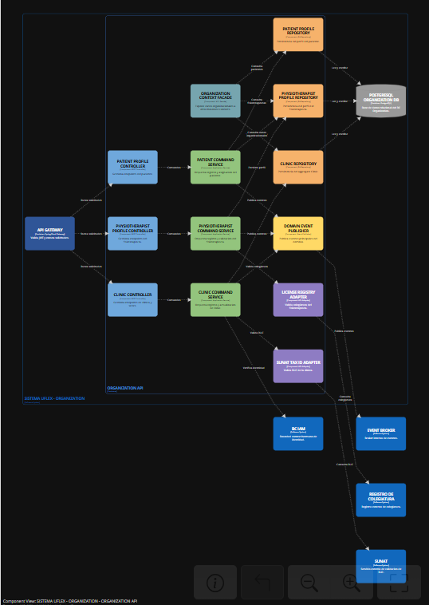 

Figura 4.2.3.5. Diagrama de componentes (C4 Nivel 3) del Bounded Context Organization.

#### 4.2.3.6. Bounded Context Software Architecture Code Level Diagrams
##### 4.2.3.6.1. Bounded Context Domain Layer Class Diagrams

El diagrama de clases del Domain Layer del BC Organization modela exclusivamente los conceptos centrales del dominio, sin incluir las capas de application ni infrastructure. El paquete domain.model.aggregates contiene los Aggregate Roots Clinic, PhysiotherapistProfile y PatientProfile; domain.model.entities incluye las Entities Branch y ClinicAdminProfile; domain.model.valueobjects agrupa los Value Objects que representan la identidad organizacional, los datos de contacto, la información clínica resumida y las referencias lógicas hacia otros bounded contexts, además de los enumerados que gobiernan los estados de clínicas, sedes y perfiles; domain.model.events encapsula los Domain Events publicados por los aggregates, como ClinicRegisteredEvent, ClinicActivatedEvent, BranchAddedEvent, PhysiotherapistProfileRegisteredEvent, PatientProfileRegisteredEvent y PatientAssignedToPhysiotherapistEvent; y domain.exceptions reúne las excepciones de negocio que protegen las invariantes del dominio, por ejemplo la unicidad del RUC, la existencia de una única sede central o la restricción de asignar pacientes únicamente a fisioterapeutas de la misma clínica. Las flechas con línea continua representan composición entre aggregates y sus Value Objects, las flechas con línea punteada expresan dependencias semánticas hacia eventos publicados y excepciones lanzadas, y los rombos vacíos indican relaciones de agregación o asociación opcional dentro del modelo del dominio.

 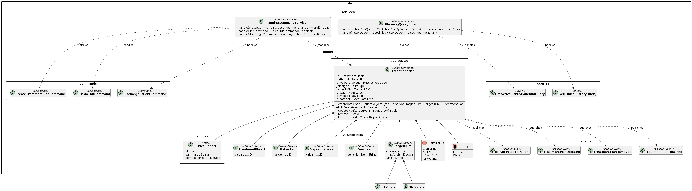 

Figura 4.2.3.6.1. Diagrama de clases del dominio del Bounded Context Organization.

##### 4.2.3.6.2. Bounded Context Database Design Diagram

El esquema físico del BC Organization en Azure Database for PostgreSQL se estructura alrededor de tablas principales para la gestión organizacional y de perfiles clínicos. La tabla clinics almacena la identidad de la clínica como tenant, incluyendo razón social, nombre comercial, RUC, datos de contacto, logotipo, estado y datos de auditoría; branches registra las sedes asociadas a cada clínica, con su dirección, teléfono, horarios y estado operativo; physiotherapist_profiles conserva la información profesional y laboral del fisioterapeuta, como colegiatura, especialidad, experiencia, sede principal y estado del perfil; y patient_profiles mantiene la información demográfica y clínica resumida del paciente, así como su asignación al fisioterapeuta responsable, contacto de emergencia y datos de seguro. Adicionalmente, pueden considerarse tablas de apoyo o catálogos para normalizar estados como clinic_statuses, branch_statuses, profile_statuses y admin_scopes. Los índices priorizan búsquedas por tax_id, por clinic_id, por user_id y por relaciones de asignación clínica, a fin de optimizar consultas operativas frecuentes. De manera coherente con el enfoque de bounded contexts, las referencias hacia elementos gestionados en otros contextos, como usuarios del BC IAM, se mantienen como referencias lógicas y no como foreign keys duras cruzadas entre dominios.

 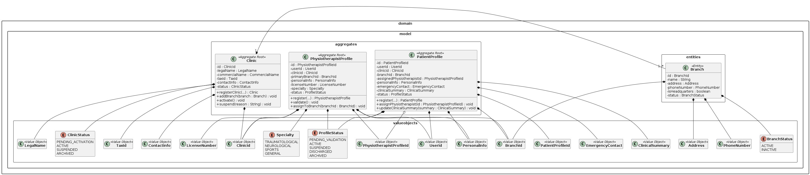 

Figura 4.2.3.6.2. Diagrama entidad-relación del Bounded Context Organization.

### 4.2.4. Bounded Context: Device

#### 4.2.4.1. Domain Layer

En esta sección se describen los elementos del Domain Layer del contexto de Device, los cuales gestionan el ciclo de vida del hardware IoT. Este componente asegura la integridad operativa de los kits de sensores, permitiendo su registro, calibración y monitoreo de salud antes de ser vinculados a un plan terapéutico.

**1. IotKit (Aggregate Root)**

Es el componente central que encapsula el estado físico del dispositivo IoT. Controla las invariantes de negocio, asegurando que un kit no pueda ser vinculado si no está en estado `REGISTERED` o si presenta fallos de calibración críticos.

**Atributos principales:**

| Atributo | Tipo | Visibilidad | Descripción |
|---|---|---|---|
| `id` | `IotKitId` | private | Identificador único del dispositivo. |
| `serialNumber` | `SerialNumber` | private | Código de fabricante único del hardware. |
| `status` | `KitStatus` | private | Estado operativo (`REGISTERED`, `LINKED`, `CALIBRATING`, `DISCONNECTED`). |
| `batteryLevel` | `BatteryLevel` | private | Porcentaje de carga actual (0-100%). |
| `firmwareVersion` | `String` | private | Versión del firmware instalado. |
| `createdAt` | `LocalDateTime` | private | Fecha de alta en el sistema. |

**Métodos principales:**

| Método | Tipo Retorno | Visibilidad | Descripción |
|---|---|---|---|
| `IotKit()` | Constructor | public | Constructor para persistencia. |
| `register(SerialNumber)` | `IotKit` | public | Crea un nuevo kit con estado `REGISTERED`. |
| `calibrate(CalibrationData)` | `void` | public | Actualiza parámetros de calibración y publica `IotKitCalibrated`. |
| `link()` | `void` | public | Cambia estado a `LINKED`. |
| `updateBattery(BatteryLevel)` | `void` | public | Registra nivel de batería y dispara alerta si es < 15%. |
| `disconnect()` | `void` | public | Cambia estado a `DISCONNECTED` y publica `IotKitDisconnected`. |

**2. CalibrationData (Value Object)**

Define los parámetros de ajuste necesarios para que el sensor IoT sea preciso durante la terapia.

| Atributo | Tipo | Visibilidad | Descripción |
|---|---|---|---|
| `offset` | `Double` | private | Valor de corrección de ángulo del sensor. |
| `lastCalibrationDate` | `LocalDateTime` | private | Fecha del último ajuste. |

**3. KitStatus (Value Object - Enum)**

| Atributo | Tipo | Visibilidad | Descripción |
|---|---|---|---|
| `REGISTERED` | Enum | public | Kit disponible en inventario. |
| `LINKED` | Enum | public | Kit en uso activo por un paciente. |
| `CALIBRATING` | Enum | public | Proceso de calibración en curso. |
| `DISCONNECTED` | Enum | public | Kit fuera de línea o sin señal. |

**4. DeviceCommandService (Domain Service)**

Coordina la lógica compleja de estados del hardware.

| Método | Tipo Retorno | Visibilidad | Descripción |
|---|---|---|---|
| `handle(RegisterIotKitCommand)` | `UUID` | public | Registra un nuevo kit validando que el serial sea único. |
| `handle(CalibrateKitCommand)` | `void` | public | Ejecuta la calibración en el agregado `IotKit`. |

#### 4.2.4.2. Interface Layer

En esta sección se presentan los contratos REST para la gestión de inventario de hardware y telemetría de sensores.

**1. IotKitController (REST Controller)**

| Método | Ruta | HTTP | Descripción |
|---|---|---|---|
| `register` | `/api/v1/devices` | POST | Registra un nuevo kit IoT en el sistema. |
| `getById` | `/api/v1/devices/{id}` | GET | Obtiene el estado y salud de un kit específico. |
| `updateBattery` | `/api/v1/devices/{id}/battery` | PATCH | Endpoint para telemetría de batería (usado por el sensor). |
| `calibrate` | `/api/v1/devices/{id}/calibrate` | POST | Inicia el proceso de calibración técnica. |

**2. Resources (DTOs)**

| Resource | Atributos principales | Descripción |
|---|---|---|
| `RegisterIotKitResource` | `serialNumber: String` | Datos requeridos para dar de alta un kit. |
| `IotKitResource` | `id: UUID`, `serialNumber: String`, `status: String` | Representación pública del kit. |

**3. Transform (Assemblers)**

| Assembler | Entrada | Salida | Descripción |
|---|---|---|---|
| `IotKitFromResourceAssembler` | `RegisterIotKitResource` | `RegisterIotKitCommand` | Mapea el request a comando de dominio. |
| `IotKitResourceFromEntityAssembler` | `IotKit` | `IotKitResource` | Convierte entidad a DTO de salida. |

#### 4.2.4.3. Application Layer

**1. IotKitCommandServiceImpl (Command Service)**

| Método | Tipo Retorno | Visibilidad | Descripción |
|---|---|---|---|
| `handle(RegisterIotKitCommand)` | `UUID` | public | Persiste el nuevo kit y valida duplicidad de serial. |
| `handle(UpdateBatteryCommand)` | `void` | public | Procesa telemetría de batería y publica eventos de mantenimiento. |

**2. IotKitQueryServiceImpl (Query Service)**

| Método | Tipo Retorno | Visibilidad | Descripción |
|---|---|---|---|
| `handle(GetAllKitsQuery)` | `List<IotKit>` | public | Retorna inventario completo de kits. |

#### 4.2.4.4. Infrastructure Layer

**1. IotKitRepository (Repository Interface)**

Interfaz de persistencia para el agregado `IotKit` usando Spring Data JPA.

| Método | Tipo Retorno | Visibilidad | Descripción |
|---|---|---|---|
| `findById(IotKitId id)` | `Optional<IotKit>` | public | Busca kit por ID. |
| `findBySerialNumber(String sn)` | `Optional<IotKit>` | public | Busca kit por número de serie físico. |
| `save(IotKit kit)` | `IotKit` | public | Persiste el estado del kit. |
| `existsBySerialNumber(String sn)` | `boolean` | public | Valida existencia de serial para evitar duplicados. |

#### 4.2.4.5. Bounded Context Software Architecture Component Level Diagrams

El diagrama de componentes (C4 Nivel 3) muestra cómo se organiza internamente el contenedor Device Service (Java/Spring Boot). Se distinguen componentes clave: el IotKitController y el TelemetryController como puntos de entrada REST para la gestión administrativa y la recepción de telemetría, los application services IotKitCommandServiceImpl e IotKitQueryServiceImpl que materializan el patrón CQRS para separar la lógica de modificación del estado del hardware de las consultas de inventario, el IotKitRepository (JPA) como abstracción de persistencia y el DeviceContextFacade como ACL para exponer la disponibilidad y salud de los kits IoT a otros contextos como Planning o Therapy.

  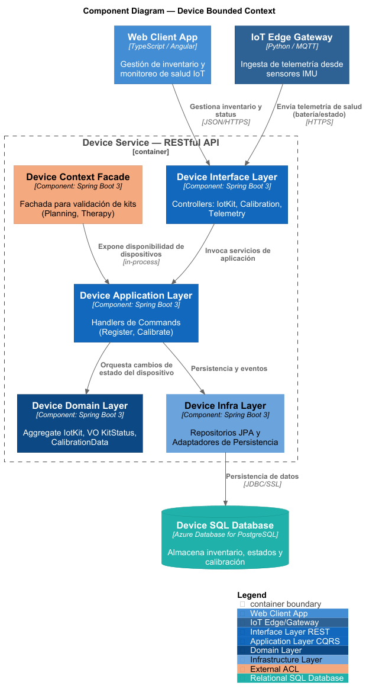

*Figura 4.2.4.5. Diagrama de componentes (C4 Nivel 3) del Bounded Context Device.*

### 4.2.5. Bounded Context: Planning

#### 4.2.5.1. Domain Layer

En esta sección se describen los elementos del Domain Layer del contexto de Planning, los cuales modelan la prescripción clínica y el ciclo de vida del tratamiento. Este lenguaje técnico permite al Fisioterapeuta definir metas biomecánicas y asegurar que el equipamiento IoT esté correctamente asignado al paciente.

**1. TreatmentPlan (Aggregate Root)**

Es el núcleo del proceso de rehabilitación. Define qué ejercicios debe realizar el paciente, bajo qué límites angulares y con qué equipo físico. Controla la invariante de negocio de que un paciente no puede tener dos planes activos simultáneamente para la misma lesión.

**Atributos principales:**

| Atributo | Tipo | Visibilidad | Descripción |
|---|---|---|---|
| `id` | `TreatmentPlanId` | private | Identificador único del plan de tratamiento. |
| `patientId` | `PatientId` | private | Referencia lógica al paciente (del BC IAM). |
| `physiotherapistId` | `PhysiotherapistId` | private | Referencia al especialista responsable. |
| `jointType` | `JointType` | private | Articulación a tratar (`ELBOW`, `WRIST`). |
| `targetROM` | `TargetROM` | private | Rangos de movimiento objetivo (metas angulares). |
| `status` | `PlanStatus` | private | Estado del plan (`CREATED`, `ACTIVE`, `FINALIZED`, `REMOVED`). |
| `deviceId` | `DeviceId` | private | Identificador del kit IoT vinculado al plan. |
| `createdAt` | `LocalDateTime` | private | Fecha de creación del plan. |

**Métodos principales:**

| Método | Tipo Retorno | Visibilidad | Descripción |
|---|---|---|---|
| `TreatmentPlan()` | Constructor | public | Constructor requerido para persistencia. |
| `create(PatientId, JointType, TargetROM)` | `TreatmentPlan` | public | Crea un nuevo plan en estado `CREATED`. |
| `linkDevice(DeviceId)` | `void` | public | Vincula un kit IoT al plan, cambia estado a `ACTIVE` y publica `IoTKitLinkedToPatient`. |
| `updatePlan(TargetROM)` | `void` | public | Actualiza las metas angulares y publica `TreatmentPlanUpdated`. |
| `remove()` | `void` | public | Ejecuta eliminación lógica del plan y publica `TreatmentPlanRemoved`. |
| `finalize(ClinicalReport)` | `void` | public | Cierra el plan tras el alta médica y publica `TreatmentPlanFinalized`. |

**2. TargetROM (Value Object)**

Define los límites cinemáticos que el paciente debe alcanzar o no exceder durante su terapia.

| Atributo | Tipo | Visibilidad | Descripción |
|---|---|---|---|
| `minAngle` | `Double` | private | Angulo minimo permitido (por ejemplo, extension total). |
| `maxAngle` | `Double` | private | Angulo maximo objetivo (por ejemplo, flexion deseada). |
| `unit` | `String` | private | Unidad de medida, siempre `degrees`. |

**3. PlanStatus (Value Object)**

Estado de ciclo de vida del plan terapéutico.

| Atributo | Tipo | Visibilidad | Descripción |
|---|---|---|---|
| `CREATED` | Enum | public | Plan diseñado pero sin equipo vinculado. |
| `ACTIVE` | Enum | public | Plan en ejecución con equipo IoT vinculado. |
| `FINALIZED` | Enum | public | Tratamiento concluido exitosamente (alta). |
| `REMOVED` | Enum | public | Plan cancelado o descartado. |

**4. JointType (Value Object)**

Clasifica la articulación objetivo del tratamiento.

| Atributo | Tipo | Visibilidad | Descripción |
|---|---|---|---|
| `ELBOW` | Enum | public | Tratamiento enfocado en la articulación del codo. |
| `WRIST` | Enum | public | Tratamiento enfocado en la articulación de la muñeca. |

**5. DeviceId (Value Object)**

Referencia al kit de sensores asignado. Asegura que el código del hardware sea válido antes de la vinculación.

| Atributo | Tipo | Visibilidad | Descripción |
|---|---|---|---|
| `serialNumber` | `String` | private | Código único del kit IoT (por ejemplo, `KT-2026-001`). |

**6. ClinicalReport (Entity)**

Documento generado al finalizar el tratamiento que resume el desempeño biomecánico del paciente.

**Atributos principales:**

| Atributo | Tipo | Visibilidad | Descripción |
|---|---|---|---|
| `id` | `Long` | private | Identificador del reporte clínico. |
| `summary` | `String` | private | Observaciones finales del fisioterapeuta. |
| `completionRate` | `Double` | private | Porcentaje de cumplimiento de las sesiones prescritas. |

**10. PlanningCommandService (Domain Service)**

Coordina las operaciones complejas que involucran el estado de los planes de tratamiento.

| Método | Tipo Retorno | Visibilidad | Descripción |
|---|---|---|---|
| `handle(CreateTreatmentPlanCommand)` | `UUID` | public | Registra un nuevo plan y valida que el paciente sea apto. |
| `handle(LinkIoTKitCommand)` | `boolean` | public | Verifica disponibilidad del kit y lo vincula al paciente. |
| `handle(DischargePatientCommand)` | `void` | public | Ejecuta el alta, genera el reporte y libera el kit IoT (`Unlink`). |

**11. PlanningQueryService (Domain Service)**

Maneja las consultas de información sobre planes activos e históricos.

| Método | Tipo Retorno | Visibilidad | Descripción |
|---|---|---|---|
| `handle(GetActivePlanByPatientIdQuery)` | `Optional<TreatmentPlan>` | public | Obtiene el plan activo que el paciente debe ejecutar en su app. |
| `handle(GetClinicalHistoryQuery)` | `List<TreatmentPlan>` | public | Lista todos los planes (activos y finalizados) de un paciente. |

#### 4.2.5.2. Interface Layer

En esta sección se describen los elementos del Interface Layer del contexto de Planning. Esta capa expone las capacidades de prescripción clínica, asignación de dispositivos IoT y cierre terapéutico mediante contratos REST claros para la aplicación web clínica y los consumidores internos.

**1. TreatmentPlanController (REST Controller)**

Este controlador expone las capacidades de prescripción clínica y gestión de planes. Permite que el Fisioterapeuta defina la ruta de recuperación del paciente y que el Administrador supervise la asignación de recursos.

**Endpoints principales:**

| Método | Ruta base | HTTP | Descripción |
|---|---|---|---|
| `createTreatmentPlan` | `/api/v1/plans` | POST | Registra un nuevo plan de tratamiento para un paciente específico. |
| `updateTreatmentPlan` | `/api/v1/plans/{id}` | PUT | Actualiza las metas angulares (`TargetROM`) o detalles del plan existente. |
| `getPlanById` | `/api/v1/plans/{id}` | GET | Recupera la información detallada de un plan de tratamiento. |
| `getActivePlanByPatient` | `/api/v1/plans/active/{patientId}` | GET | Obtiene el plan vigente que el paciente debe ejecutar en su aplicación móvil. |
| `removeTreatmentPlan` | `/api/v1/plans/{id}` | DELETE | Realiza la eliminación lógica de un plan que no ha sido iniciado. |

**2. ClinicalDischargeController (REST Controller)**

Controlador especializado en el cierre del ciclo terapéutico y la liberación de recursos de hardware.

**Endpoints principales:**

| Método | Ruta base | HTTP | Descripción |
|---|---|---|---|
| `dischargePatient` | `/api/v1/plans/{id}/discharge` | POST | Ejecuta el alta médica, genera el reporte final y cambia el estado del plan a `FINALIZED`. |
| `linkIoTKit` | `/api/v1/plans/{id}/link-device` | PATCH | Vincula un kit de sensores (`DeviceId`) a un plan de tratamiento activo. |
| `getClinicalHistory` | `/api/v1/plans/history/{patientId}` | GET | Lista todos los planes previos y reportes clínicos del paciente. |

**3. Resources (DTOs)**

Representaciones de datos optimizadas para la comunicación externa, implementadas como Java Records.

| Resource | Atributos principales | Descripción |
|---|---|---|
| `CreateTreatmentPlanResource` | `patientId: UUID`, `physiotherapistId: UUID`, `jointType: String`, `minAngle: Double`, `maxAngle: Double` | Datos necesarios para la creación inicial del plan. |
| `TreatmentPlanResource` | `id: UUID`, `patientId: UUID`, `jointType: String`, `status: String`, `minAngle: Double`, `maxAngle: Double`, `deviceId: String` | Representación completa del plan para consulta. |
| `UpdateTreatmentPlanResource` | `minAngle: Double`, `maxAngle: Double` | Datos permitidos para la actualización de metas terapéuticas. |
| `LinkDeviceResource` | `serialNumber: String` | Contiene el identificador del hardware a vincular. |
| `DischargeResource` | `summary: String`, `completionRate: Double` | Información necesaria para cerrar el caso clínico. |
| `ClinicalReportResource` | `planId: UUID`, `summary: String`, `finalizedAt: Date` | Resumen ejecutivo del alta médica. |

**4. Transform (Assemblers)**

Componentes encargados de la traducción entre el modelo de dominio y la representación externa.

| Assembler | Entrada | Salida | Descripción |
|---|---|---|---|
| `TreatmentPlanFromResourceAssembler` | `CreateTreatmentPlanResource` | `CreateTreatmentPlanCommand` | Transforma el JSON de creación en un command de dominio. |
| `UpdatePlanCommandFromResourceAssembler` | `UpdateTreatmentPlanResource` | `UpdateTreatmentPlanCommand` | Mapea la actualización de metas angulares. |
| `TreatmentPlanResourceFromEntityAssembler` | `TreatmentPlan` | `TreatmentPlanResource` | Convierte el aggregate root en un recurso de lectura. |
| `LinkDeviceCommandFromResourceAssembler` | `LinkDeviceResource` | `LinkDeviceCommand` | Crea el command para asociar el hardware al paciente. |
| `DischargeCommandFromResourceAssembler` | `DischargeResource` | `DischargePatientCommand` | Prepara los datos para el proceso de alta y liberación de equipo. |
| `ClinicalReportResourceFromEntityAssembler` | `ClinicalReport` | `ClinicalReportResource` | Mapea la entidad de reporte a su representación REST. |

#### 4.2.5.3. Application Layer

**1. PlanningContextFacadeImpl (ACL Facade)**

Proporciona un punto de entrada simplificado para que otros bounded contexts consulten el estado de los planes de tratamiento sin exponer la complejidad interna del aggregate.

| Atributo | Tipo | Visibilidad | Descripción |
|---|---|---|---|
| `planningQueryService` | `PlanningQueryService` | private | Servicio de consultas del dominio Planning. |

**Métodos principales:**

| Método | Tipo Retorno | Visibilidad | Descripción |
|---|---|---|---|
| `fetchActivePlanByPatientId(UUID patientId)` | `Optional<ActivePlanDto>` | public | Retorna información básica del plan activo (metas y dispositivo) para la ejecución de la terapia. |
| `isPatientUnderActiveTreatment(UUID patientId)` | `boolean` | public | Verifica si el paciente tiene un plan en estado `ACTIVE`. |

**2. TreatmentPlanCommandServiceImpl (Command Service Implementation)**

Orquesta la lógica de creación, actualización y cierre de planes. Coordina la publicación de eventos para notificar al BC de Inventario cuando un equipo es vinculado o liberado.

| Atributo | Tipo | Visibilidad | Descripción |
|---|---|---|---|
| `treatmentPlanRepository` | `TreatmentPlanRepository` | private | Acceso a la persistencia de planes. |
| `externalInventoryService` | `InventoryService` | private | ACL para validar la existencia de dispositivos físicos. |
| `eventPublisher` | `ApplicationEventPublisher` | private | Publicador de eventos de dominio. |

**Métodos principales:**

| Método | Tipo Retorno | Visibilidad | Descripción |
|---|---|---|---|
| `handle(CreateTreatmentPlanCommand)` | `UUID` | public | Crea el plan en estado `CREATED` y valida que no existan planes activos duplicados. |
| `handle(LinkIoTKitCommand)` | `void` | public | Valida el `serialNumber` con el BC de Inventario, vincula el equipo y publica `IoTKitLinkedToPatient`. |
| `handle(UpdateTreatmentPlanCommand)` | `void` | public | Actualiza los `TargetROM` y publica `TreatmentPlanUpdated`. |
| `handle(DischargePatientCommand)` | `void` | public | Genera el reporte clínico, finaliza el plan y publica `TreatmentPlanFinalized`. |

**3. PlanningQueryServiceImpl (Query Service Implementation)**

| Atributo | Tipo | Visibilidad | Descripción |
|---|---|---|---|
| `treatmentPlanRepository` | `TreatmentPlanRepository` | private | Acceso al read model de planes de tratamiento. |

**Métodos principales:**

| Método | Tipo Retorno | Visibilidad | Descripción |
|---|---|---|---|
| `handle(GetActivePlanByPatientIdQuery)` | `Optional<TreatmentPlan>` | public | Recupera el plan vigente para el paciente. |
| `handle(GetClinicalHistoryQuery)` | `List<TreatmentPlan>` | public | Lista todos los planes históricos asociados a un `PatientId`. |

#### 4.2.5.4. Infrastructure Layer

**1. TreatmentPlanRepository (Repository Interface)**

Interfaz de acceso a datos para los planes de tratamiento, utilizando Spring Data JPA sobre PostgreSQL.

| Método | Tipo Retorno | Visibilidad | Descripción |
|---|---|---|---|
| `findById(TreatmentPlanId id)` | `Optional<TreatmentPlan>` | public | Recupera un plan por su identificador único. |
| `save(TreatmentPlan plan)` | `TreatmentPlan` | public | Persiste o actualiza el estado del aggregate. |
| `findByPatientIdAndStatus(PatientId pId, PlanStatus s)` | `Optional<TreatmentPlan>` | public | Busca un plan específico de un paciente por su estado (por ejemplo, `ACTIVE`). |
| `findAllByPatientId(PatientId patientId)` | `List<TreatmentPlan>` | public | Obtiene el historial completo de tratamientos del paciente. |
| `existsByPatientIdAndStatus(PatientId pId, PlanStatus s)` | `boolean` | public | Invariante: verifica si ya hay un plan activo para evitar duplicidad. |

#### 4.2.5.5. Bounded Context Software Architecture Component Level Diagrams

El diagrama de componentes (C4 Nivel 3) muestra cómo se organiza internamente el contenedor Planning Service (Java/Spring Boot). Se distinguen seis componentes principales: el TreatmentPlanController y el ClinicalDischargeController como puntos de entrada REST, los application services TreatmentPlanCommandServiceImpl y PlanningQueryServiceImpl que materializan el patrón CQRS, el TreatmentPlanRepository (JPA) como abstracción de persistencia y el ExternalInventoryServiceAdapter como ACL para validar la disponibilidad de kits IoT. Todos los componentes viven dentro del Container Boundary del Planning Service; el API Gateway queda fuera (delega tráfico) y la Planning DB también (Azure Database for PostgreSQL, consumida por JDBC/SSL).

  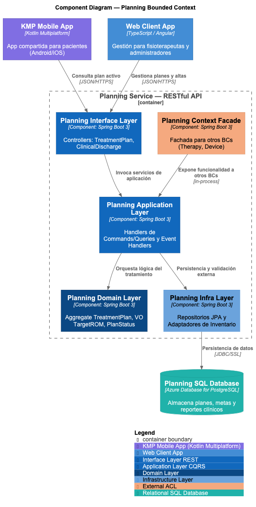

*Figura 4.2.5.5. Diagrama de componentes (C4 Nivel 3) del Bounded Context Planning.*

#### 4.2.5.6. Bounded Context Software Architecture Code Level Diagrams

##### 4.2.5.6.1. Bounded Context Domain Layer Class Diagrams

El diagrama de clases del Domain Layer del BC Planning modela exclusivamente los conceptos centrales del dominio, sin incluir las capas de application ni infrastructure. El paquete `domain.model.aggregates` contiene al Aggregate Root `TreatmentPlan`; `domain.model.entities` incluye la Entity `ClinicalReport`; `domain.model.valueobjects` agrupa los Value Objects (`TreatmentPlanId`, `PatientId`, `PhysiotherapistId`, `TargetROM`, `DeviceId`) y los enumerados (`PlanStatus`, `JointType`); `domain.model.events` encapsula los Domain Events publicados por el aggregate (`IoTKitLinkedToPatient`, `TreatmentPlanUpdated`, `TreatmentPlanRemoved`, `TreatmentPlanFinalized`); y `domain.exceptions` reúne las excepciones de negocio que protegen las invariantes del dominio (por ejemplo, evitar más de un plan activo por paciente/lesión). Las flechas con línea continua marcan composición (el `TreatmentPlan` contiene sus Value Objects), las flechas con línea punteada marcan dependencias semánticas (eventos publicados y excepciones lanzadas) y los rombos vacíos indican agregación con cardinalidad opcional o múltiple (relación del plan con `DeviceId` y con `ClinicalReport` al cierre terapéutico).

  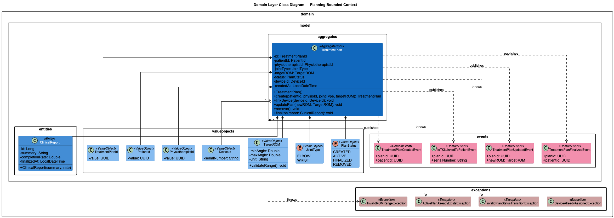

*Figura 4.2.5.6.1. Diagrama de clases del dominio del Bounded Context Planning.*

##### 4.2.5.6.2. Bounded Context Database Design Diagram

El esquema físico del BC Planning en Azure Database for PostgreSQL consta de una tabla principal `treatment_plans` que almacena el estado clínico-operativo del tratamiento (identificador del plan, `patient_id`, `physiotherapist_id`, articulación objetivo, rangos `min_angle`/`max_angle`, estado del plan, `device_id` y timestamps de auditoría), una tabla `clinical_reports` para registrar el resultado de alta asociado al plan (resumen y porcentaje de cumplimiento), y una tabla de catálogo `plan_statuses` para normalizar los estados permitidos del ciclo de vida (`CREATED`, `ACTIVE`, `FINALIZED`, `REMOVED`). Los índices incluyen búsquedas por `(patient_id, status)` para obtener rápidamente el plan activo, por `patient_id` para el historial clínico, y por `device_id` para trazabilidad del kit IoT asignado. Se optó deliberadamente por **no** declarar foreign keys duras hacia tablas de otros bounded contexts (`patient_id` del BC IAM y `device_id` del BC Device/Inventory): las referencias son lógicas para mantener la autonomía entre contextos.

  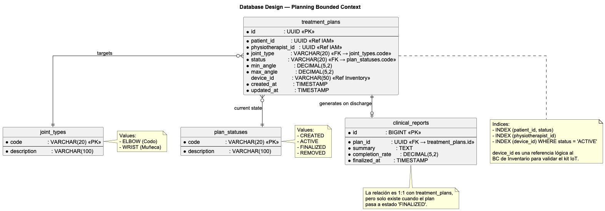

*Figura 4.2.5.6.2. Diagrama entidad-relación del Bounded Context Planning.*

### 4.2.6. Bounded Context: Therapy

# Conclusiones

## Conclusiones y recomendaciones

# Bibliografía

1. Andina. (2023). *Cenate brindó más de 3,200 sesiones de telerehabilitación física en lo que va del 2023*. https://andina.pe/agencia/noticia-cenate-brindo-mas-3200-sesiones-telerehabilitacion-fisica-lo-va-del-2023-938058.aspx

2. Arias Tolentino, E. (2022). *Fracturas expuestas en pacientes atendidos en el Hospital Carlos Lanfranco La Hoz en el 2021* [Proyecto de investigación de segunda especialidad, Universidad Privada San Juan Bautista]. Repositorio Institucional UPSJB. https://repositorio.upsjb.edu.pe/backend/api/core/bitstreams/e7625b29-4ecd-4401-b26e-a9e7dfcc23e9/content

3. Carbajal Galarza, M. M., Chinchihualpa Paredes, N. O., & Abanto Perez, S. A. (2021). *Eficacia de las intervenciones tecnológicas para mejorar la función motora del miembro superior de personas que han sufrido un accidente cerebrovascular en países de bajos y medianos ingresos: revisión sistemática y metaanálisis* [Trabajo de investigación para optar por el título profesional de Médico Cirujano, Universidad Peruana Cayetano Heredia]. Repositorio Institucional UPCH. https://hdl.handle.net/20.500.12866/9440

4. Castro Villanueva, D. (2023). *Diseño mecatrónico de un dispositivo para la rehabilitación pasiva de la rodilla* [Tesis de título profesional, Pontificia Universidad Católica del Perú]. Repositorio Institucional PUCP. http://hdl.handle.net/20.500.12404/26882

5. Fernandez Agurto, P. E., Yenque Zavalaga, K. M. J., & Yucra Castro, K. F. (2025). *Programas de telerehabilitación en atención domiciliaria en adultos y adultos mayores con EPOC: Un scoping review* [Tesis de licenciatura, Universidad Peruana Cayetano Heredia]. Repositorio Institucional UPCH. https://repositorio.upch.edu.pe/bitstream/handle/20.500.12866/17596/Programas_FernandezAgurto_Paola.pdf?sequence=1&isAllowed=y

6. Fisiofix. (2025). *¿Cuánto cuesta una sesión de fisioterapia en Lima?* https://fisiofix.pe/cuanto-cuesta-una-sesion-de-fisioterapia-en-lima/

7. Instituto Nacional de Estadística e Informática. (2022). *En el Perú 1 millón 575 mil personas presentan algún tipo de discapacidad*. https://m.inei.gob.pe/prensa/noticias/en-el-peru-1-millon-575-mil-personas-presentan-alg/

8. Instituto Nacional de Estadística e Informática. (2025). *Uso de Internet y teléfonos celulares en Perú, tercer trimestre de 2025*. https://www.gob.pe/institucion/inei/noticias/1342293-en-el-tercer-trimestre-de-2025-el-91-3-de-la-poblacion-de-6-y-mas-anos-de-e

9. Instituto Nacional de Rehabilitación. (2025). *Efecto del uso de la férula de neopreno "Madey" sobre la capacidad funcional de los miembros superiores en las actividades de vida diaria de los pacientes adultos con artritis reumatoide del Instituto Nacional de Rehabilitación*. https://app.inr.gob.pe/investigacion/media/BancoInvestigacion/BI_Institucional/extrainstitucional_25.pdf

10. León, M. (2023). *Diseño de un dispositivo de habilitación portátil de codo para personas con epicondilitis lateral* [Tesis título profesional, Pontificia Universidad Católica del Perú]. Repositorio Institucional PUCP. http://hdl.handle.net/20.500.12404/26570

11. Ministerio de Salud. (2019). *Prevención y manejo de condiciones secundarias de salud en personas con discapacidad*. https://www.minsa.gob.pe/presupuestales/doc2019/pp/anexo/ANEXO2_8.pdf

12. Ministerio de Salud. (2025a). *Más de 3,4 millones de atenciones por telemedicina en Perú (enero 2024 – marzo 2025)*. Ministerio de Salud del Perú. https://www.gob.pe/institucion/minsa/noticias/1132597-mas-de-3-4-millones-de-atenciones-por-telemedicina-un-hito-en-la-atencion-

13. Ministerio de Salud. (2025b). *Instituto Nacional de Rehabilitación brindó 276 893 atenciones en consulta, procedimientos médicos y terapias durante el 2024*. https://www.gob.pe/institucion/minsa/noticias/1093672-instituto-nacional-de-rehabilitacion-brindo-276-893-atenciones-en-consulta-procedimientos-medicos-y-terapias-durante-el-2024

14. Ministerio de Vivienda, Construcción y Saneamiento. (2022). *Más del 30% de peruanos con discapacidad tiene problemas para su desarrollo profesional debido a barreras en sus ciudades*. https://www.gob.pe/institucion/vivienda/noticias/658298-mas-del-30-de-peruanos-con-discapacidad-tiene-problemas-para-su-desarrollo-profesional-debido-a-barreras-en-sus-ciudades

15. OSIPTEL. (2024). *Encuesta Residencial de Servicios de Telecomunicaciones (ERESTEL) – 94,8% de hogares peruanos cuenta con un smartphone*. Organismo Supervisor de Inversión Privada en Telecomunicaciones. https://www.osiptel.gob.pe/portal-del-usuario/noticias/erestel-el-94-8-de-hogares-peruanos-cuenta-con-un-smartphone/

16. Pelvicare. (2022). *Telerehabilitación*. https://pelvicare.pe/tratamientos/telerehabilitacion/

17. Rosales, F., Gutiérrez, D., y Valencia, J. (2023). Características laborales y uso de la práctica digital de fisioterapeutas en Lima Metropolitana y el Callao-Perú durante la pandemia de la COVID-19. *Revista Peruana de Rehabilitación y Salud Humana, 5*(1), 1-12. https://revistas.upch.edu.pe/index.php/RHR/article/view/5034

